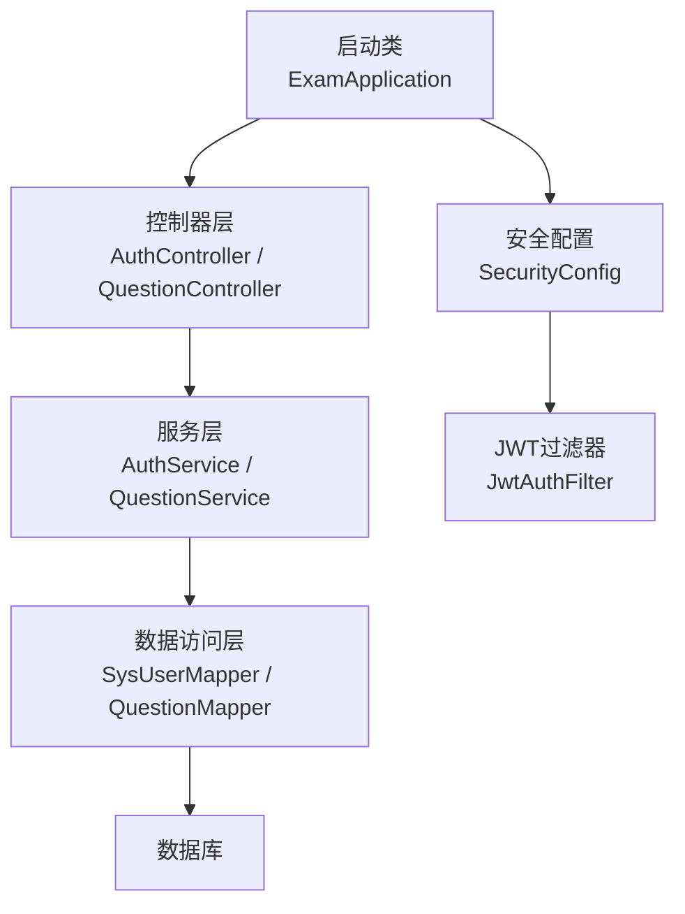
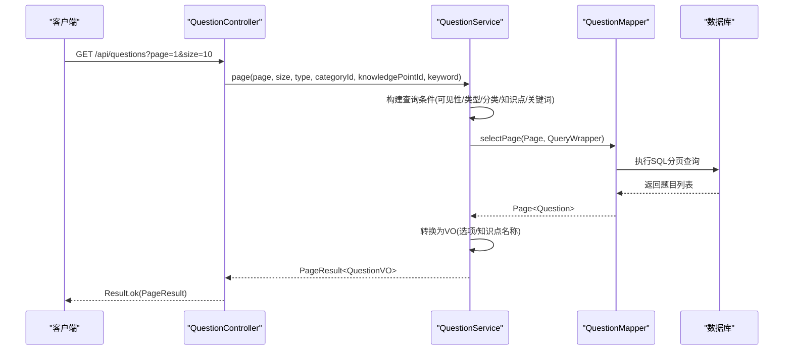
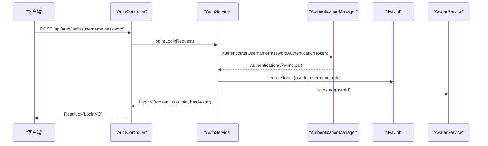
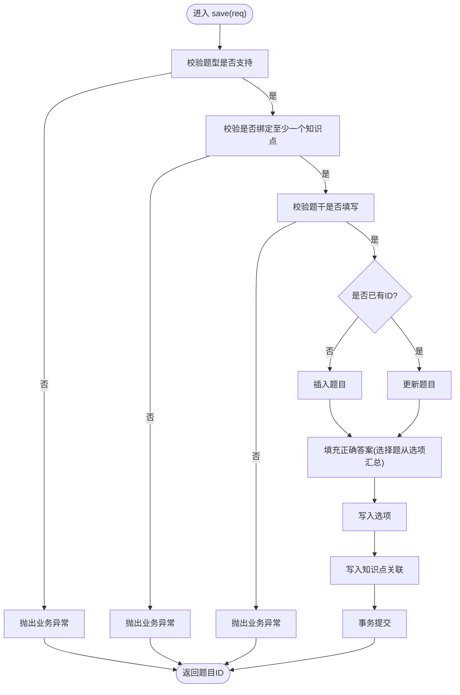
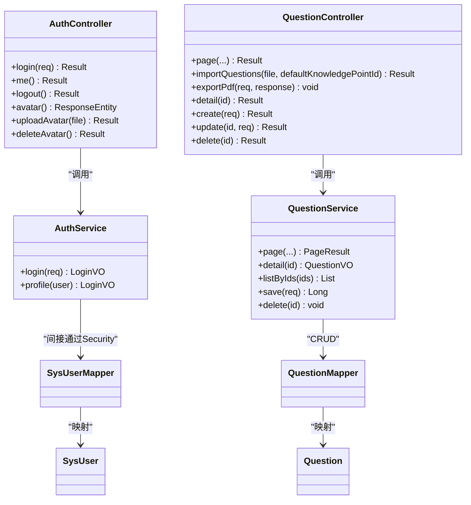
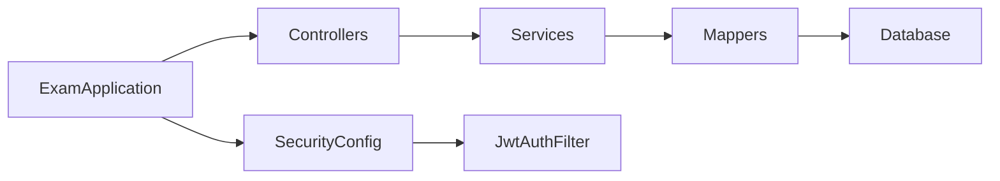

# 分层架构设计

<cite>
**本文引用的文件**
- [ExamApplication.java](file://exam-server/src/main/java/com/exam/ExamApplication.java)
- [SecurityConfig.java](file://exam-server/src/main/java/com/exam/config/SecurityConfig.java)
- [AuthController.java](file://exam-server/src/main/java/com/exam/controller/AuthController.java)
- [QuestionController.java](file://exam-server/src/main/java/com/exam/controller/QuestionController.java)
- [AuthService.java](file://exam-server/src/main/java/com/exam/service/AuthService.java)
- [QuestionService.java](file://exam-server/src/main/java/com/exam/service/QuestionService.java)
- [SysUserMapper.java](file://exam-server/src/main/java/com/exam/mapper/SysUserMapper.java)
- [QuestionMapper.java](file://exam-server/src/main/java/com/exam/mapper/QuestionMapper.java)
- [SysUser.java](file://exam-server/src/main/java/com/exam/entity/SysUser.java)
- [Question.java](file://exam-server/src/main/java/com/exam/entity/Question.java)
- [Result.java](file://exam-server/src/main/java/com/exam/common/Result.java)
- [BizException.java](file://exam-server/src/main/java/com/exam/common/BizException.java)
- [LoginRequest.java](file://exam-server/src/main/java/com/exam/dto/LoginRequest.java)
- [LoginVO.java](file://exam-server/src/main/java/com/exam/dto/LoginVO.java)
- [UserDetailsServiceImpl.java](file://exam-server/src/main/java/com/exam/security/UserDetailsServiceImpl.java)
</cite>

## 目录
1. [简介](#简介)
2. [项目结构](#项目结构)
3. [核心组件](#核心组件)
4. [架构总览](#架构总览)
5. [详细组件分析](#详细组件分析)
6. [依赖关系分析](#依赖关系分析)
7. [性能考虑](#性能考虑)
8. [故障排查指南](#故障排查指南)
9. [结论](#结论)
10. [附录](#附录)

## 简介
本文件面向Spring Boot考试系统，系统化阐述MVC分层模式在Controller、Service、Mapper三层的职责划分与协作方式。重点说明：
- Controller层负责HTTP请求解析、参数校验、统一返回封装；
- Service层承载业务规则、事务边界、跨表聚合与领域计算；
- Mapper层基于MyBatis-Plus进行数据访问，屏蔽SQL细节；
- 通过接口抽象与依赖注入降低耦合，提升可测试性与可维护性；
- 提供分层架构图与典型请求处理时序图，并给出各层最佳实践与代码片段路径指引。

## 项目结构
后端采用典型的三层+安全配置结构：
- 启动与扫描：应用入口启用自动装配与Mapper扫描；
- 配置层：安全策略、CORS、序列化等横切关注点集中管理；
- 控制器层：按业务域拆分（认证、题库、试卷、学生考试等），仅做入参出参转换与调用编排；
- 服务层：实现业务逻辑、事务控制、权限相关的数据过滤；
- 数据访问层：MyBatis-Plus的Mapper接口，配合实体类完成CRUD；
- 通用能力：统一响应体、全局异常、分页结果等。

图表来源
- [ExamApplication.java:10-14](file://exam-server/src/main/java/com/exam/ExamApplication.java#L10-L14)
- [SecurityConfig.java:37-65](file://exam-server/src/main/java/com/exam/config/SecurityConfig.java#L37-L65)

章节来源
- [ExamApplication.java:10-14](file://exam-server/src/main/java/com/exam/ExamApplication.java#L10-L14)

## 核心组件
- 统一响应体 Result：所有接口以code/message/data形式返回，便于前端统一处理。
- 业务异常 BizException：在Service层抛出，由全局异常处理器转为Result，避免在各接口中分散try-catch。
- DTO/VO：登录请求 LoginRequest 与登录返回 LoginVO 用于解耦外部契约与内部模型。
- 安全配置 SecurityConfig：无状态会话、角色授权、CORS、异常处理。
- 用户详情加载 UserDetailsServiceImpl：从SysUserMapper查询用户，必要时关联Student信息，构造Security上下文。

章节来源
- [Result.java:1-38](file://exam-server/src/main/java/com/exam/common/Result.java#L1-L38)
- [BizException.java:1-22](file://exam-server/src/main/java/com/exam/common/BizException.java#L1-L22)
- [LoginRequest.java:1-15](file://exam-server/src/main/java/com/exam/dto/LoginRequest.java#L1-L15)
- [LoginVO.java:1-16](file://exam-server/src/main/java/com/exam/dto/LoginVO.java#L1-L16)
- [SecurityConfig.java:37-65](file://exam-server/src/main/java/com/exam/config/SecurityConfig.java#L37-L65)
- [UserDetailsServiceImpl.java:22-39](file://exam-server/src/main/java/com/exam/security/UserDetailsServiceImpl.java#L22-L39)

## 架构总览
下图展示一次“题目分页查询”的典型请求链路，体现Controller→Service→Mapper的调用顺序与数据流转。

图表来源
- [QuestionController.java:42-49](file://exam-server/src/main/java/com/exam/controller/QuestionController.java#L42-L49)
- [QuestionService.java:42-69](file://exam-server/src/main/java/com/exam/service/QuestionService.java#L42-L69)
- [QuestionMapper.java:7-9](file://exam-server/src/main/java/com/exam/mapper/QuestionMapper.java#L7-L9)

章节来源
- [QuestionController.java:42-49](file://exam-server/src/main/java/com/exam/controller/QuestionController.java#L42-L49)
- [QuestionService.java:42-69](file://exam-server/src/main/java/com/exam/service/QuestionService.java#L42-L69)
- [QuestionMapper.java:7-9](file://exam-server/src/main/java/com/exam/mapper/QuestionMapper.java#L7-L9)

## 详细组件分析

### 认证流程（登录）时序
- Controller接收登录请求，委托Service进行认证；
- Service使用AuthenticationManager进行用户名密码校验，成功后签发JWT并组装返回VO；
- 安全配置将JWT过滤器加入链，后续请求携带Token进行鉴权。

图表来源
- [AuthController.java:32-35](file://exam-server/src/main/java/com/exam/controller/AuthController.java#L32-L35)
- [AuthService.java:22-38](file://exam-server/src/main/java/com/exam/service/AuthService.java#L22-L38)
- [SecurityConfig.java:37-65](file://exam-server/src/main/java/com/exam/config/SecurityConfig.java#L37-L65)

章节来源
- [AuthController.java:32-35](file://exam-server/src/main/java/com/exam/controller/AuthController.java#L32-L35)
- [AuthService.java:22-38](file://exam-server/src/main/java/com/exam/service/AuthService.java#L22-L38)
- [SecurityConfig.java:37-65](file://exam-server/src/main/java/com/exam/config/SecurityConfig.java#L37-L65)

### 题目保存（写操作）流程图
- Controller接收保存请求，设置ID为空表示新增；
- Service进行业务校验（题型合法性、题干必填、至少绑定一个知识点），根据是否存在ID决定插入或更新；
- 选择题正确答案从选项isCorrect汇总；
- 写入选项与知识点关联，整体事务提交。

图表来源
- [QuestionService.java:95-150](file://exam-server/src/main/java/com/exam/service/QuestionService.java#L95-L150)
- [QuestionService.java:161-178](file://exam-server/src/main/java/com/exam/service/QuestionService.java#L161-L178)

章节来源
- [QuestionService.java:95-150](file://exam-server/src/main/java/com/exam/service/QuestionService.java#L95-L150)
- [QuestionService.java:161-178](file://exam-server/src/main/java/com/exam/service/QuestionService.java#L161-L178)

### 类与依赖关系（面向对象视角）
- Controller依赖Service，Service依赖多个Mapper与工具；
- 安全相关：UserDetailsServiceImpl依赖SysUserMapper/StudentMapper，构造Security上下文；
- 实体与Mapper一一对应，遵循单一职责。

图表来源
- [AuthController.java:24-63](file://exam-server/src/main/java/com/exam/controller/AuthController.java#L24-L63)
- [QuestionController.java:32-109](file://exam-server/src/main/java/com/exam/controller/QuestionController.java#L32-L109)
- [AuthService.java:14-49](file://exam-server/src/main/java/com/exam/service/AuthService.java#L14-L49)
- [QuestionService.java:33-224](file://exam-server/src/main/java/com/exam/service/QuestionService.java#L33-L224)
- [SysUserMapper.java:7-9](file://exam-server/src/main/java/com/exam/mapper/SysUserMapper.java#L7-L9)
- [QuestionMapper.java:7-9](file://exam-server/src/main/java/com/exam/mapper/QuestionMapper.java#L7-L9)
- [SysUser.java:10-23](file://exam-server/src/main/java/com/exam/entity/SysUser.java#L10-L23)
- [Question.java:11-29](file://exam-server/src/main/java/com/exam/entity/Question.java#L11-L29)

章节来源
- [AuthController.java:24-63](file://exam-server/src/main/java/com/exam/controller/AuthController.java#L24-L63)
- [QuestionController.java:32-109](file://exam-server/src/main/java/com/exam/controller/QuestionController.java#L32-L109)
- [AuthService.java:14-49](file://exam-server/src/main/java/com/exam/service/AuthService.java#L14-L49)
- [QuestionService.java:33-224](file://exam-server/src/main/java/com/exam/service/QuestionService.java#L33-L224)
- [SysUserMapper.java:7-9](file://exam-server/src/main/java/com/exam/mapper/SysUserMapper.java#L7-L9)
- [QuestionMapper.java:7-9](file://exam-server/src/main/java/com/exam/mapper/QuestionMapper.java#L7-L9)
- [SysUser.java:10-23](file://exam-server/src/main/java/com/exam/entity/SysUser.java#L10-L23)
- [Question.java:11-29](file://exam-server/src/main/java/com/exam/entity/Question.java#L11-L29)

### 接口抽象与依赖注入原则
- 接口抽象：每个Mapper对应一张表，方法来自BaseMapper扩展，保持最小化接口定义；Service对Mapper的依赖通过构造器注入，便于替换与测试。
- 依赖注入：Controller通过构造器注入Service；Service通过构造器注入Mapper与其他服务；安全组件通过Spring容器装配。
- 松耦合：Controller不直接访问数据库，Service不暴露HTTP细节，Mapper只关心数据存取。

章节来源
- [SysUserMapper.java:7-9](file://exam-server/src/main/java/com/exam/mapper/SysUserMapper.java#L7-L9)
- [QuestionMapper.java:7-9](file://exam-server/src/main/java/com/exam/mapper/QuestionMapper.java#L7-L9)
- [AuthService.java:14-20](file://exam-server/src/main/java/com/exam/service/AuthService.java#L14-L20)
- [QuestionService.java:33-40](file://exam-server/src/main/java/com/exam/service/QuestionService.java#L33-L40)
- [AuthController.java:24-29](file://exam-server/src/main/java/com/exam/controller/AuthController.java#L24-L29)

## 依赖关系分析
- 启动阶段：ExamApplication启用自动装配并扫描Mapper；
- 安全阶段：SecurityConfig注册JWT过滤器，配置角色访问策略；
- 请求阶段：Controller→Service→Mapper→DB，返回统一Result；
- 横向能力：全局异常、分页、序列化等通过配置与通用组件提供。

图表来源
- [ExamApplication.java:10-14](file://exam-server/src/main/java/com/exam/ExamApplication.java#L10-L14)
- [SecurityConfig.java:37-65](file://exam-server/src/main/java/com/exam/config/SecurityConfig.java#L37-L65)

章节来源
- [ExamApplication.java:10-14](file://exam-server/src/main/java/com/exam/ExamApplication.java#L10-L14)
- [SecurityConfig.java:37-65](file://exam-server/src/main/java/com/exam/config/SecurityConfig.java#L37-L65)

## 性能考虑
- 分页查询：Service层使用Page对象进行分页，减少数据传输量；
- 批量导入限制：Controller层对Excel导入行数进行上限控制，避免大文件拖垮解析与事务；
- 事务边界：写操作集中在Service层加事务注解，保证一致性；
- 缓存建议：热点数据（如知识点名称、题目选项）可在Service层引入缓存以减少重复IO；
- 连接池与索引：确保数据库索引覆盖常用查询字段（如visibility、status、categoryId、knowledgePointId）。

[本节为通用指导，不直接分析具体文件]

## 故障排查指南
- 未登录/过期：SecurityConfig自定义未认证处理器返回401；检查JWT过滤器与Token传递；
- 无权限：SecurityConfig自定义拒绝处理器返回403；检查角色配置与URL匹配；
- 业务异常：Service层抛出BizException，由全局异常处理器转为Result；查看异常信息与日志；
- 参数校验失败：DTO上使用JSR-303注解，校验失败时返回错误信息；
- 数据不存在：Service层对关键实体进行存在性检查并抛出明确异常。

章节来源
- [SecurityConfig.java:52-65](file://exam-server/src/main/java/com/exam/config/SecurityConfig.java#L52-L65)
- [BizException.java:1-22](file://exam-server/src/main/java/com/exam/common/BizException.java#L1-L22)
- [LoginRequest.java:7-14](file://exam-server/src/main/java/com/exam/dto/LoginRequest.java#L7-L14)
- [QuestionService.java:71-77](file://exam-server/src/main/java/com/exam/service/QuestionService.java#L71-L77)

## 结论
本系统严格遵循MVC分层模式：
- Controller专注HTTP契约与编排；
- Service承载业务规则与事务；
- Mapper聚焦数据访问；
通过接口抽象与依赖注入实现低耦合、高内聚，结合统一响应与全局异常提升可维护性。建议在后续迭代中继续强化Service层领域建模、完善缓存策略与监控指标，进一步提升性能与可观测性。

[本节为总结性内容，不直接分析具体文件]

## 附录
- 典型请求路径参考：
  - 登录：POST /api/auth/login
  - 获取当前用户：GET /api/auth/me
  - 题目分页：GET /api/questions
  - 题目保存：POST /api/questions
  - 题目更新：PUT /api/questions/{id}
  - 题目删除：DELETE /api/questions/{id}
- 代码片段路径（不含具体代码内容）：
  - 统一响应体：[Result.java:1-38](file://exam-server/src/main/java/com/exam/common/Result.java#L1-L38)
  - 业务异常：[BizException.java:1-22](file://exam-server/src/main/java/com/exam/common/BizException.java#L1-L22)
  - 登录请求/返回：[LoginRequest.java:1-15](file://exam-server/src/main/java/com/exam/dto/LoginRequest.java#L1-L15)、[LoginVO.java:1-16](file://exam-server/src/main/java/com/exam/dto/LoginVO.java#L1-L16)
  - 安全配置：[SecurityConfig.java:37-65](file://exam-server/src/main/java/com/exam/config/SecurityConfig.java#L37-L65)
  - 用户详情加载：[UserDetailsServiceImpl.java:22-39](file://exam-server/src/main/java/com/exam/security/UserDetailsServiceImpl.java#L22-L39)
  - 认证控制器：[AuthController.java:32-35](file://exam-server/src/main/java/com/exam/controller/AuthController.java#L32-L35)
  - 认证服务：[AuthService.java:22-38](file://exam-server/src/main/java/com/exam/service/AuthService.java#L22-L38)
  - 题目控制器：[QuestionController.java:42-49](file://exam-server/src/main/java/com/exam/controller/QuestionController.java#L42-L49)
  - 题目服务：[QuestionService.java:42-69](file://exam-server/src/main/java/com/exam/service/QuestionService.java#L42-L69)
  - 题目保存事务：[QuestionService.java:95-150](file://exam-server/src/main/java/com/exam/service/QuestionService.java#L95-L150)
  - 题目实体/映射：[Question.java:11-29](file://exam-server/src/main/java/com/exam/entity/Question.java#L11-L29)、[QuestionMapper.java:7-9](file://exam-server/src/main/java/com/exam/mapper/QuestionMapper.java#L7-L9)
  - 用户实体/映射：[SysUser.java:10-23](file://exam-server/src/main/java/com/exam/entity/SysUser.java#L10-L23)、[SysUserMapper.java:7-9](file://exam-server/src/main/java/com/exam/mapper/SysUserMapper.java#L7-L9)