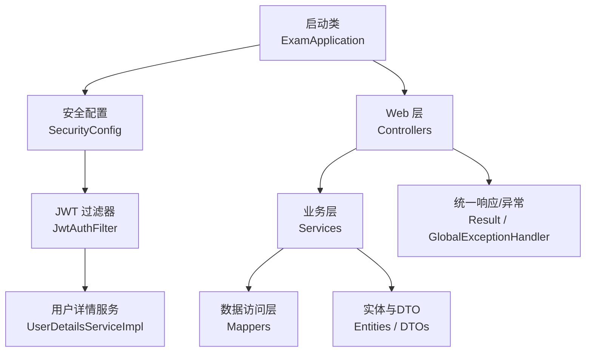
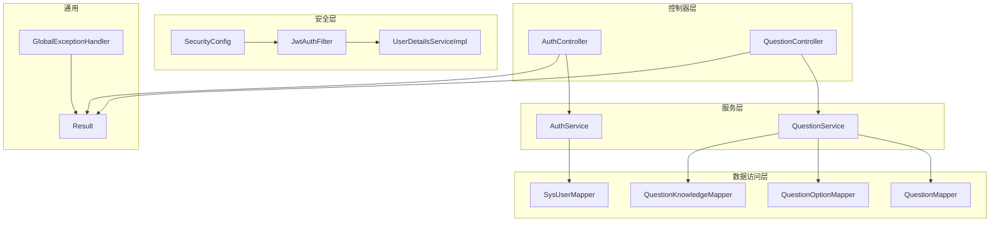
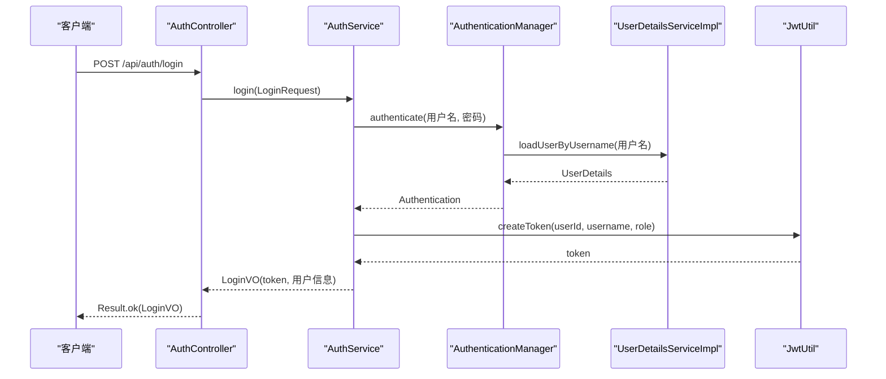
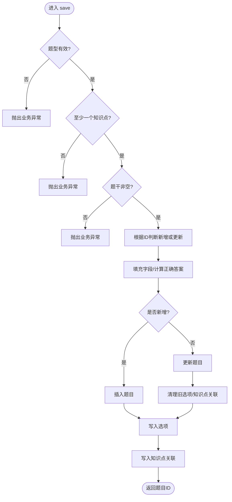
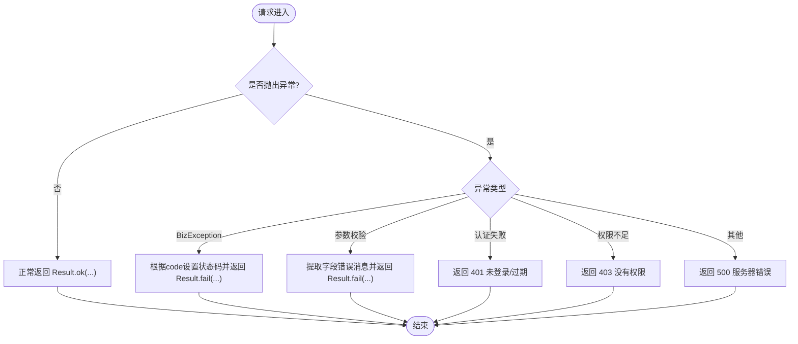
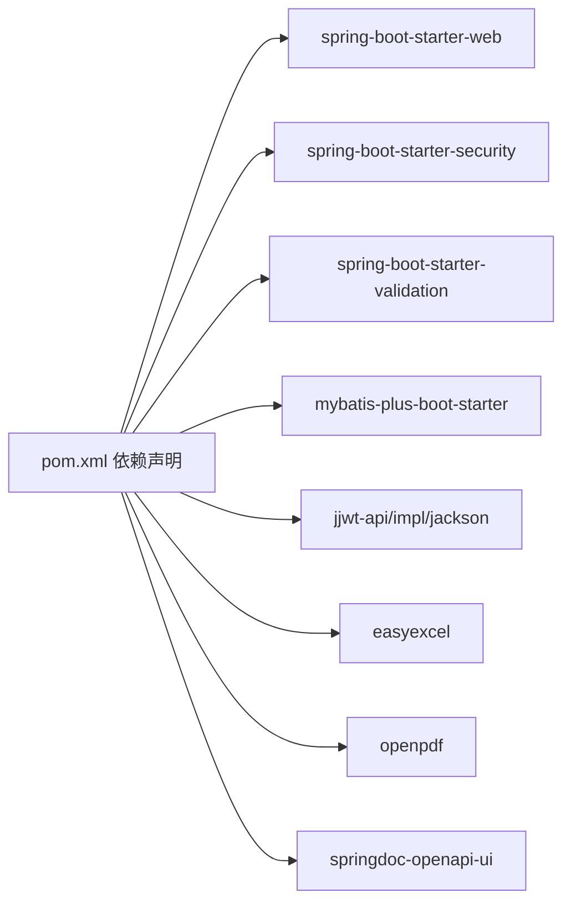

# 后端架构

<cite>
**本文引用的文件**
- [ExamApplication.java](file://exam-server/src/main/java/com/exam/ExamApplication.java)
- [pom.xml](file://exam-server/pom.xml)
- [SecurityConfig.java](file://exam-server/src/main/java/com/exam/config/SecurityConfig.java)
- [JwtAuthFilter.java](file://exam-server/src/main/java/com/exam/security/JwtAuthFilter.java)
- [UserDetailsServiceImpl.java](file://exam-server/src/main/java/com/exam/security/UserDetailsServiceImpl.java)
- [AuthService.java](file://exam-server/src/main/java/com/exam/service/AuthService.java)
- [AuthController.java](file://exam-server/src/main/java/com/exam/controller/AuthController.java)
- [QuestionController.java](file://exam-server/src/main/java/com/exam/controller/QuestionController.java)
- [QuestionService.java](file://exam-server/src/main/java/com/exam/service/QuestionService.java)
- [SysUser.java](file://exam-server/src/main/java/com/exam/entity/SysUser.java)
- [SysUserMapper.java](file://exam-server/src/main/java/com/exam/mapper/SysUserMapper.java)
- [Result.java](file://exam-server/src/main/java/com/exam/common/Result.java)
- [GlobalExceptionHandler.java](file://exam-server/src/main/java/com/exam/common/GlobalExceptionHandler.java)
- [BizException.java](file://exam-server/src/main/java/com/exam/common/BizException.java)
</cite>

## 目录
1. [简介](#简介)
2. [项目结构](#项目结构)
3. [核心组件](#核心组件)
4. [架构总览](#架构总览)
5. [详细组件分析](#详细组件分析)
6. [依赖关系分析](#依赖关系分析)
7. [性能考虑](#性能考虑)
8. [故障排查指南](#故障排查指南)
9. [结论](#结论)
10. [附录](#附录)

## 简介
本文件面向考试系统后端（Spring Boot）的层次化架构设计，围绕 MVC 分层模式与模块化边界展开，重点说明 Controller、Service、Mapper 的职责划分与交互流程；阐述认证授权、题库管理、考试管理、答题服务等核心模块的边界定义；介绍基于 Spring Security + JWT 的无状态鉴权、依赖注入与接口抽象原则；统一异常处理机制与统一响应格式；并提供后端模块依赖图与关键调用时序图，帮助读者快速理解系统结构与数据流转。

## 项目结构
后端采用典型的 Spring Boot 分层组织：
- 启动与配置：应用入口、安全配置、MyBatis-Plus 配置等
- 控制器层：对外暴露 REST 接口，负责参数校验与结果封装
- 服务层：业务编排与事务控制，协调多个 Mapper 完成复杂逻辑
- 数据访问层：基于 MyBatis-Plus 的 Mapper 接口，映射数据库表
- 安全模块：JWT 过滤器、用户详情加载、工具类
- 通用能力：统一响应体、全局异常处理、分页结果等

图表来源
- [ExamApplication.java:1-17](file://exam-server/src/main/java/com/exam/ExamApplication.java#L1-L17)
- [SecurityConfig.java:25-66](file://exam-server/src/main/java/com/exam/config/SecurityConfig.java#L25-L66)
- [JwtAuthFilter.java:21-52](file://exam-server/src/main/java/com/exam/security/JwtAuthFilter.java#L21-L52)
- [UserDetailsServiceImpl.java:14-41](file://exam-server/src/main/java/com/exam/security/UserDetailsServiceImpl.java#L14-L41)

章节来源
- [ExamApplication.java:1-17](file://exam-server/src/main/java/com/exam/ExamApplication.java#L1-L17)
- [pom.xml:42-112](file://exam-server/pom.xml#L42-L112)

## 核心组件
- 统一响应 Result：所有接口返回统一结构 code/message/data，便于前端统一处理成功与失败分支。
- 全局异常处理 GlobalExceptionHandler：将业务异常、参数校验异常、认证/授权异常统一转换为 Result 并设置合适的 HTTP 状态码。
- 业务异常 BizException：在 Service 层抛出携带错误码的业务异常，避免在各接口中分散 try-catch。
- 安全配置 SecurityConfig：基于 Spring Security 关闭 Session，启用无状态 JWT 鉴权，按角色控制路径访问。
- JWT 过滤器 JwtAuthFilter：从请求头解析 Token，填充 SecurityContext，供后续方法级权限注解使用。
- 用户详情 UserDetailsServiceImpl：根据用户名加载用户信息，学生角色额外关联学生主键。

章节来源
- [Result.java:1-38](file://exam-server/src/main/java/com/exam/common/Result.java#L1-L38)
- [GlobalExceptionHandler.java:17-61](file://exam-server/src/main/java/com/exam/common/GlobalExceptionHandler.java#L17-L61)
- [BizException.java:1-22](file://exam-server/src/main/java/com/exam/common/BizException.java#L1-L22)
- [SecurityConfig.java:25-66](file://exam-server/src/main/java/com/exam/config/SecurityConfig.java#L25-L66)
- [JwtAuthFilter.java:21-52](file://exam-server/src/main/java/com/exam/security/JwtAuthFilter.java#L21-L52)
- [UserDetailsServiceImpl.java:14-41](file://exam-server/src/main/java/com/exam/security/UserDetailsServiceImpl.java#L14-L41)

## 架构总览
系统遵循“控制器-服务-数据访问”三层架构，结合 Spring Security + JWT 实现无状态鉴权，通过统一响应与全局异常保证接口一致性。

图表来源
- [AuthController.java:24-65](file://exam-server/src/main/java/com/exam/controller/AuthController.java#L24-L65)
- [AuthService.java:14-51](file://exam-server/src/main/java/com/exam/service/AuthService.java#L14-L51)
- [QuestionController.java:31-118](file://exam-server/src/main/java/com/exam/controller/QuestionController.java#L31-L118)
- [QuestionService.java:33-225](file://exam-server/src/main/java/com/exam/service/QuestionService.java#L33-L225)
- [SysUserMapper.java:7-11](file://exam-server/src/main/java/com/exam/mapper/SysUserMapper.java#L7-L11)
- [SecurityConfig.java:25-66](file://exam-server/src/main/java/com/exam/config/SecurityConfig.java#L25-L66)
- [JwtAuthFilter.java:21-52](file://exam-server/src/main/java/com/exam/security/JwtAuthFilter.java#L21-L52)
- [UserDetailsServiceImpl.java:14-41](file://exam-server/src/main/java/com/exam/security/UserDetailsServiceImpl.java#L14-L41)
- [Result.java:1-38](file://exam-server/src/main/java/com/exam/common/Result.java#L1-L38)
- [GlobalExceptionHandler.java:17-61](file://exam-server/src/main/java/com/exam/common/GlobalExceptionHandler.java#L17-L61)

## 详细组件分析

### 认证授权模块（登录、鉴权、资源访问）
- 职责边界
  - AuthController：提供登录、获取当前用户、头像上传/删除等接口，仅做参数接收与结果封装。
  - AuthService：调用认证管理器进行密码校验，签发 JWT，组装登录视图对象。
  - SecurityConfig：定义匿名/受保护路径、跨域策略、异常处理回调。
  - JwtAuthFilter：解析 Authorization 头中的 Token，填充 SecurityContext。
  - UserDetailsServiceImpl：按用户名加载用户，学生角色补充 studentId。
- 交互流程（登录）

图表来源
- [AuthController.java:31-46](file://exam-server/src/main/java/com/exam/controller/AuthController.java#L31-L46)
- [AuthService.java:22-38](file://exam-server/src/main/java/com/exam/service/AuthService.java#L22-L38)
- [UserDetailsServiceImpl.java:22-39](file://exam-server/src/main/java/com/exam/security/UserDetailsServiceImpl.java#L22-L39)
- [SecurityConfig.java:36-66](file://exam-server/src/main/java/com/exam/config/SecurityConfig.java#L36-L66)

章节来源
- [AuthController.java:24-65](file://exam-server/src/main/java/com/exam/controller/AuthController.java#L24-L65)
- [AuthService.java:14-51](file://exam-server/src/main/java/com/exam/service/AuthService.java#L14-L51)
- [SecurityConfig.java:25-66](file://exam-server/src/main/java/com/exam/config/SecurityConfig.java#L25-L66)
- [JwtAuthFilter.java:21-52](file://exam-server/src/main/java/com/exam/security/JwtAuthFilter.java#L21-L52)
- [UserDetailsServiceImpl.java:14-41](file://exam-server/src/main/java/com/exam/security/UserDetailsServiceImpl.java#L14-L41)

### 题库管理模块（题目增删改查、导入导出）
- 职责边界
  - QuestionController：题目分页查询、详情、创建、更新、删除；Excel 批量导入；PDF 练习卷导出。
  - QuestionService：题目保存时校验题型、知识点绑定、选项与正确答案汇总；分页查询按可见性与创建者过滤；软删除。
  - Mapper：QuestionMapper、QuestionOptionMapper、QuestionKnowledgeMapper、KnowledgePointMapper 等。
- 保存题目流程图（含校验与多表写入）

图表来源
- [QuestionService.java:95-151](file://exam-server/src/main/java/com/exam/service/QuestionService.java#L95-L151)
- [QuestionService.java:161-178](file://exam-server/src/main/java/com/exam/service/QuestionService.java#L161-L178)

章节来源
- [QuestionController.java:31-118](file://exam-server/src/main/java/com/exam/controller/QuestionController.java#L31-L118)
- [QuestionService.java:33-225](file://exam-server/src/main/java/com/exam/service/QuestionService.java#L33-L225)
- [SysUser.java:10-24](file://exam-server/src/main/java/com/exam/entity/SysUser.java#L10-L24)
- [SysUserMapper.java:7-11](file://exam-server/src/main/java/com/exam/mapper/SysUserMapper.java#L7-L11)

### 考试管理与答题服务（边界说明）
- 考试管理：由 ExamManageController 与 ExamManageService 负责考试的创建、编辑、发布与归档；与 PaperService/PaperController 协作生成试卷；与 StudentExamService/StudentExamController 协作安排学生参考。
- 答题服务：StudentExamController 暴露答题相关接口，StudentExamService 负责答题记录、提交、自动评分与成绩统计；与 MarkingService/MarkingAnalysisController 配合人工阅卷与分析。
- 边界约定
  - Controller 仅负责路由与参数封装，不承载复杂业务。
  - Service 聚合多个 Mapper 完成事务性操作，对外暴露领域语义方法。
  - Mapper 只关注数据访问，不包含业务规则。

章节来源
- [ExamManageController.java](file://exam-server/src/main/java/com/exam/controller/ExamManageController.java)
- [ExamManageService.java](file://exam-server/src/main/java/com/exam/service/ExamManageService.java)
- [PaperController.java](file://exam-server/src/main/java/com/exam/controller/PaperController.java)
- [PaperService.java](file://exam-server/src/main/java/com/exam/service/PaperService.java)
- [StudentExamController.java](file://exam-server/src/main/java/com/exam/controller/StudentExamController.java)
- [StudentExamService.java](file://exam-server/src/main/java/com/exam/service/StudentExamService.java)
- [MarkingService.java](file://exam-server/src/main/java/com/exam/service/MarkingService.java)
- [MarkingAnalysisController.java](file://exam-server/src/main/java/com/exam/controller/MarkingAnalysisController.java)

### 依赖注入与接口抽象
- 依赖注入：通过构造器注入（@RequiredArgsConstructor）注入 Controller/Service/Filter 所需依赖，提高可测试性与内聚性。
- 接口抽象：Mapper 以接口形式暴露数据访问能力；Service 以方法签名抽象业务领域操作；Security 通过 UserDetailsService 抽象用户加载策略。
- 好处：松耦合、易替换实现、便于单元测试与扩展。

章节来源
- [AuthController.java:24-30](file://exam-server/src/main/java/com/exam/controller/AuthController.java#L24-L30)
- [AuthService.java:14-21](file://exam-server/src/main/java/com/exam/service/AuthService.java#L14-L21)
- [JwtAuthFilter.java:21-28](file://exam-server/src/main/java/com/exam/security/JwtAuthFilter.java#L21-L28)
- [SysUserMapper.java:7-11](file://exam-server/src/main/java/com/exam/mapper/SysUserMapper.java#L7-L11)

### 异常处理机制与统一响应
- 统一响应 Result：code=0 表示成功，data 为业务数据；fail 方法用于构造失败响应。
- 全局异常处理：捕获业务异常、参数校验异常、认证失败、权限不足与未知异常，统一转为 Result 并设置对应 HTTP 状态码。
- 业务异常：Service 层抛出 BizException，集中处理，避免散落的 try-catch。

图表来源
- [GlobalExceptionHandler.java:20-61](file://exam-server/src/main/java/com/exam/common/GlobalExceptionHandler.java#L20-L61)
- [Result.java:15-36](file://exam-server/src/main/java/com/exam/common/Result.java#L15-L36)
- [BizException.java:9-21](file://exam-server/src/main/java/com/exam/common/BizException.java#L9-L21)

章节来源
- [GlobalExceptionHandler.java:17-61](file://exam-server/src/main/java/com/exam/common/GlobalExceptionHandler.java#L17-L61)
- [Result.java:1-38](file://exam-server/src/main/java/com/exam/common/Result.java#L1-L38)
- [BizException.java:1-22](file://exam-server/src/main/java/com/exam/common/BizException.java#L1-L22)

## 依赖关系分析
- 外部依赖
  - Spring Boot Web、Security、Validation：提供 Web 容器、安全框架与参数校验。
  - MyBatis-Plus：简化 CRUD、分页与条件构造。
  - JWT（jjwt）：无状态令牌签发与解析。
  - EasyExcel/OpenPDF：导入导出能力。
  - SpringDoc：API 文档。
- 内部依赖
  - Controller 依赖 Service；Service 依赖多个 Mapper；安全过滤器依赖用户详情服务与 JWT 工具；通用组件被各层复用。

图表来源
- [pom.xml:42-112](file://exam-server/pom.xml#L42-L112)

章节来源
- [pom.xml:1-131](file://exam-server/pom.xml#L1-L131)

## 性能考虑
- 分页查询：题库分页使用 Page 对象，减少全量数据传输与内存占用。
- 批量导入限制：单次导入行数上限，避免大文件拖垮解析与事务。
- 软删除：通过 status 字段标记删除，避免物理删除带来的级联开销与数据丢失风险。
- 无状态鉴权：JWT 避免服务端会话存储，利于水平扩展。
- 缓存建议：热点数据（如知识点名称、题目选项）可按需引入缓存层以降低数据库压力。

[本节为通用指导，不直接分析具体文件]

## 故障排查指南
- 401 未登录/过期：检查请求头是否携带正确的 Authorization: Bearer <token>；确认 Token 未过期且未被篡改。
- 403 没有权限：检查用户角色与路径权限配置是否匹配；确认方法级权限注解生效。
- 参数校验失败：查看全局异常处理器提取的字段错误消息，修正前端传参。
- 业务异常：定位 Service 抛出的 BizException 原因（如题型不支持、未绑定知识点、题干为空等）。
- 数据库问题：核对 Mapper SQL 与实体映射；检查连接配置与表结构。

章节来源
- [GlobalExceptionHandler.java:20-61](file://exam-server/src/main/java/com/exam/common/GlobalExceptionHandler.java#L20-L61)
- [SecurityConfig.java:52-66](file://exam-server/src/main/java/com/exam/config/SecurityConfig.java#L52-L66)
- [QuestionService.java:95-151](file://exam-server/src/main/java/com/exam/service/QuestionService.java#L95-L151)

## 结论
本后端采用清晰的 MVC 分层与模块化边界，结合 Spring Security + JWT 实现无状态鉴权，通过统一响应与全局异常提升接口一致性与可维护性。题库管理模块展示了典型的多表事务与复杂校验流程；考试管理与答题服务模块按职责拆分，便于独立演进。整体架构具备良好的扩展性与可测试性，适合持续迭代与团队协作。

[本节为总结性内容，不直接分析具体文件]

## 附录
- 关键实体与表
  - 用户：SysUser（登录账号、角色、状态）
  - 题目：Question（题型、内容、答案、难度、默认分值、可见性、状态）
- 关键接口
  - 认证：/api/auth/login、/api/auth/me、/api/auth/logout
  - 题库：/api/questions（分页、详情、创建、更新、删除）、导入模板、批量导入、PDF 导出

[本节为补充信息，不直接分析具体文件]