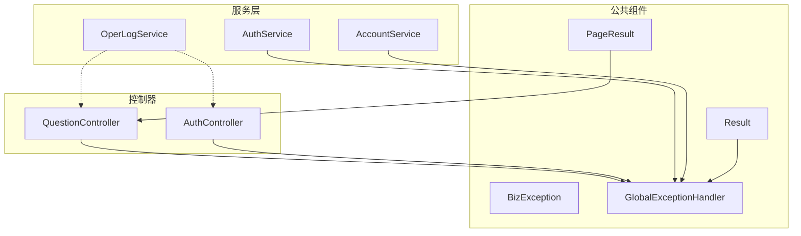
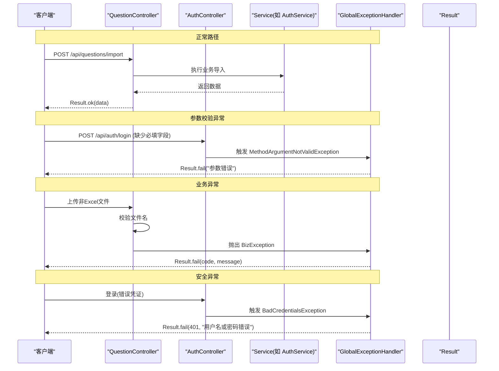
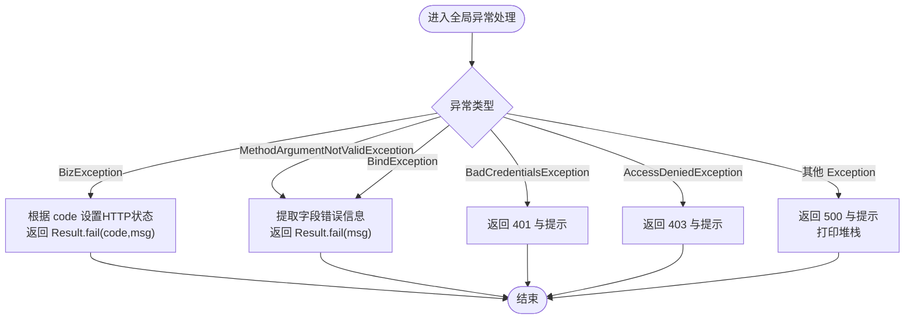
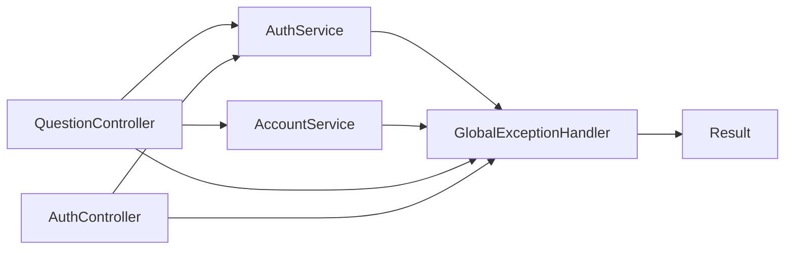

# 异常处理机制

<cite>
**本文引用的文件**
- [BizException.java](file://exam-server/src/main/java/com/exam/common/BizException.java)
- [GlobalExceptionHandler.java](file://exam-server/src/main/java/com/exam/common/GlobalExceptionHandler.java)
- [Result.java](file://exam-server/src/main/java/com/exam/common/Result.java)
- [PageResult.java](file://exam-server/src/main/java/com/exam/common/PageResult.java)
- [LoginRequest.java](file://exam-server/src/main/java/com/exam/dto/LoginRequest.java)
- [QuestionController.java](file://exam-server/src/main/java/com/exam/controller/QuestionController.java)
- [AuthController.java](file://exam-server/src/main/java/com/exam/controller/AuthController.java)
- [AuthService.java](file://exam-server/src/main/java/com/exam/service/AuthService.java)
- [AccountService.java](file://exam-server/src/main/java/com/exam/service/AccountService.java)
- [OperLogService.java](file://exam-server/src/main/java/com/exam/service/OperLogService.java)
</cite>

## 目录
1. [简介](#简介)
2. [项目结构](#项目结构)
3. [核心组件](#核心组件)
4. [架构总览](#架构总览)
5. [详细组件分析](#详细组件分析)
6. [依赖关系分析](#依赖关系分析)
7. [性能考虑](#性能考虑)
8. [故障排查指南](#故障排查指南)
9. [结论](#结论)
10. [附录：错误码规范与最佳实践](#附录错误码规范与最佳实践)

## 简介
本文件系统化说明考试系统后端的异常处理机制，包括全局异常处理器设计、业务成功响应的统一封装、异常分类体系（参数校验异常、业务逻辑异常、系统异常等）、日志记录与错误追踪方式，以及扩展自定义异常类型和处理逻辑的方法。文档同时提供常见场景的调用流程与时序图，帮助读者快速理解并正确应用该机制。

## 项目结构
异常处理相关代码集中在 exam-server 模块的 common 包中，并通过控制器与服务层进行使用：
- 统一返回体 Result 与分页结果 PageResult
- 业务异常 BizException
- 全局异常处理器 GlobalExceptionHandler
- 控制器与服务层通过抛出 BizException 或触发框架异常（如参数校验）来驱动统一处理
- 操作日志服务 OperLogService 用于记录关键操作（可结合异常上下文扩展）

图表来源
- [GlobalExceptionHandler.java:17-60](file://exam-server/src/main/java/com/exam/common/GlobalExceptionHandler.java#L17-L60)
- [Result.java:9-37](file://exam-server/src/main/java/com/exam/common/Result.java#L9-L37)
- [BizException.java:9-20](file://exam-server/src/main/java/com/exam/common/BizException.java#L9-L20)
- [QuestionController.java:31-118](file://exam-server/src/main/java/com/exam/controller/QuestionController.java#L31-L118)
- [AuthController.java:24-64](file://exam-server/src/main/java/com/exam/controller/AuthController.java#L24-L64)
- [AuthService.java:14-51](file://exam-server/src/main/java/com/exam/service/AuthService.java#L14-L51)
- [AccountService.java:23-186](file://exam-server/src/main/java/com/exam/service/AccountService.java#L23-L186)
- [OperLogService.java:12-30](file://exam-server/src/main/java/com/exam/service/OperLogService.java#L12-L30)

章节来源
- [GlobalExceptionHandler.java:17-60](file://exam-server/src/main/java/com/exam/common/GlobalExceptionHandler.java#L17-L60)
- [Result.java:9-37](file://exam-server/src/main/java/com/exam/common/Result.java#L9-L37)
- [BizException.java:9-20](file://exam-server/src/main/java/com/exam/common/BizException.java#L9-L20)

## 核心组件
- 统一返回体 Result：所有接口以 code/message/data 形式返回；code=0 表示成功，非 0 表示失败。前端依据 code 判断是否展示错误。
- 业务异常 BizException：业务失败时抛出，携带 code 与 message，由全局处理器转换为 Result。
- 全局异常处理器 GlobalExceptionHandler：集中捕获并转换各类异常为统一 JSON，避免堆栈泄露给前端。
- 分页结果 PageResult：用于分页查询的统一数据结构。

章节来源
- [Result.java:9-37](file://exam-server/src/main/java/com/exam/common/Result.java#L9-L37)
- [BizException.java:9-20](file://exam-server/src/main/java/com/exam/common/BizException.java#L9-L20)
- [GlobalExceptionHandler.java:17-60](file://exam-server/src/main/java/com/exam/common/GlobalExceptionHandler.java#L17-L60)
- [PageResult.java:7-19](file://exam-server/src/main/java/com/exam/common/PageResult.java#L7-L19)

## 架构总览
下图展示了从请求进入控制器到异常被统一处理的完整链路，涵盖参数校验异常、业务异常与安全异常三类典型场景。

图表来源
- [QuestionController.java:61-75](file://exam-server/src/main/java/com/exam/controller/QuestionController.java#L61-L75)
- [AuthController.java:31-35](file://exam-server/src/main/java/com/exam/controller/AuthController.java#L31-L35)
- [GlobalExceptionHandler.java:20-59](file://exam-server/src/main/java/com/exam/common/GlobalExceptionHandler.java#L20-L59)

## 详细组件分析

### 统一返回体 Result
- 作用：对外暴露统一的响应结构，便于前端按 code 分支处理成功与失败。
- 关键点：
  - ok()/ok(data)：成功响应，code=0，message="ok"。
  - fail(message)/fail(code,message)：失败响应，默认 400。
- 使用位置：控制器直接返回 Result，异常处理器也返回 Result。

章节来源
- [Result.java:9-37](file://exam-server/src/main/java/com/exam/common/Result.java#L9-L37)

### 业务异常 BizException
- 作用：表达“业务规则不满足”的错误，携带业务级 code 和消息。
- 关键点：
  - 支持无参构造（默认 400）与带 code 构造。
  - 由全局处理器根据 code 映射 HTTP 状态码（如 401/403）。
- 使用示例：
  - 账号停用、学号重复、文件类型不支持等。

章节来源
- [BizException.java:9-20](file://exam-server/src/main/java/com/exam/common/BizException.java#L9-L20)
- [AuthService.java:22-38](file://exam-server/src/main/java/com/exam/service/AuthService.java#L22-L38)
- [AccountService.java:46-76](file://exam-server/src/main/java/com/exam/service/AccountService.java#L46-L76)
- [QuestionController.java:61-75](file://exam-server/src/main/java/com/exam/controller/QuestionController.java#L61-L75)

### 全局异常处理器 GlobalExceptionHandler
- 职责：将不同来源的异常统一转换为 Result，屏蔽内部细节，保证前端一致性体验。
- 处理策略：
  - 业务异常 BizException：按 code 设置 HTTP 状态码（401/403），返回 Result.fail。
  - 参数校验异常：MethodArgumentNotValidException/BindException，提取字段错误信息，返回 Result.fail。
  - 认证失败：BadCredentialsException，返回 401。
  - 权限不足：AccessDeniedException，返回 403。
  - 其他异常：兜底捕获，返回 500，并打印堆栈。
- 注意：当前未集成结构化日志记录，仅使用 printStackTrace。

图表来源
- [GlobalExceptionHandler.java:20-59](file://exam-server/src/main/java/com/exam/common/GlobalExceptionHandler.java#L20-L59)

章节来源
- [GlobalExceptionHandler.java:20-59](file://exam-server/src/main/java/com/exam/common/GlobalExceptionHandler.java#L20-L59)

### 参数校验与 DTO
- 使用 JSR-303/JSR-380 注解在 DTO 上声明校验规则，配合 @Valid 触发校验。
- 当校验失败时，Spring 抛出 MethodArgumentNotValidException，由全局处理器统一转为 Result.fail。
- 示例：登录请求 LoginRequest 对 username/password 进行非空校验。

章节来源
- [LoginRequest.java:7-14](file://exam-server/src/main/java/com/exam/dto/LoginRequest.java#L7-L14)
- [GlobalExceptionHandler.java:30-40](file://exam-server/src/main/java/com/exam/common/GlobalExceptionHandler.java#L30-L40)

### 控制器中的异常使用模式
- 控制器通常只做入参与路由转发，业务校验与规则检查下沉至 Service。
- 当需要立即终止流程并返回明确错误时，抛出 BizException，由全局处理器统一包装。
- 示例：
  - QuestionController 对导入文件格式与行数进行校验，不合法则抛 BizException。
  - AuthController 调用 AuthService 完成登录，若认证失败会触发安全异常。

章节来源
- [QuestionController.java:61-75](file://exam-server/src/main/java/com/exam/controller/QuestionController.java#L61-L75)
- [AuthController.java:31-35](file://exam-server/src/main/java/com/exam/controller/AuthController.java#L31-L35)

### 服务层的异常使用模式
- 业务规则校验失败时抛出 BizException，例如：
  - 账号已停用、用户不存在、学号重复、学生不存在等。
- 这些异常会被全局处理器统一转换为 Result，保持接口一致。

章节来源
- [AuthService.java:22-38](file://exam-server/src/main/java/com/exam/service/AuthService.java#L22-L38)
- [AccountService.java:46-76](file://exam-server/src/main/java/com/exam/service/AccountService.java#L46-L76)

### 操作日志与错误追踪
- 当前 OperLogService 记录常规操作日志（操作人、操作内容、时间戳），可用于审计。
- 异常侧：
  - 全局处理器对未知异常使用 printStackTrace，未持久化到数据库或外部日志系统。
  - 建议：在异常处理器中接入结构化日志（如 SLF4J + Logback/ELK），记录请求上下文、异常堆栈、用户信息等，便于定位问题。

章节来源
- [OperLogService.java:12-30](file://exam-server/src/main/java/com/exam/service/OperLogService.java#L12-L30)
- [GlobalExceptionHandler.java:54-59](file://exam-server/src/main/java/com/exam/common/GlobalExceptionHandler.java#L54-L59)

## 依赖关系分析
- 控制器依赖服务层，服务层可能抛出 BizException。
- 全局异常处理器依赖 Spring 安全异常与参数校验异常类型。
- Result 作为统一返回体被控制器与异常处理器共同使用。

图表来源
- [QuestionController.java:31-118](file://exam-server/src/main/java/com/exam/controller/QuestionController.java#L31-L118)
- [AuthController.java:24-64](file://exam-server/src/main/java/com/exam/controller/AuthController.java#L24-L64)
- [AuthService.java:14-51](file://exam-server/src/main/java/com/exam/service/AuthService.java#L14-L51)
- [AccountService.java:23-186](file://exam-server/src/main/java/com/exam/service/AccountService.java#L23-L186)
- [GlobalExceptionHandler.java:17-60](file://exam-server/src/main/java/com/exam/common/GlobalExceptionHandler.java#L17-L60)
- [Result.java:9-37](file://exam-server/src/main/java/com/exam/common/Result.java#L9-L37)

章节来源
- [GlobalExceptionHandler.java:17-60](file://exam-server/src/main/java/com/exam/common/GlobalExceptionHandler.java#L17-L60)
- [Result.java:9-37](file://exam-server/src/main/java/com/exam/common/Result.java#L9-L37)

## 性能考虑
- 参数校验异常由框架统一处理，开销较低。
- 业务异常抛出与捕获属于轻量级控制流，但应避免在热路径中频繁抛出异常作为正常控制手段。
- 全局异常处理器应避免复杂计算，确保快速返回统一响应。
- 建议将耗时操作（如大文件解析、PDF 导出）放在独立线程或异步任务中，并在异常时记录上下文以便追踪。

[本节为通用指导，不直接分析具体文件]

## 故障排查指南
- 参数校验失败：检查 DTO 上的校验注解及提示信息是否正确，确认 Controller 方法是否使用 @Valid。
- 业务异常：查看 Service 中抛出的 BizException 的 message，定位业务规则冲突点。
- 认证/授权异常：检查认证流程与角色权限配置，确认 BadCredentialsException 与 AccessDeniedException 的来源。
- 未知异常：当前仅打印堆栈，建议在异常处理器中接入结构化日志，记录请求 URL、参数、用户信息与堆栈。

章节来源
- [GlobalExceptionHandler.java:30-59](file://exam-server/src/main/java/com/exam/common/GlobalExceptionHandler.java#L30-L59)
- [OperLogService.java:18-29](file://exam-server/src/main/java/com/exam/service/OperLogService.java#L18-L29)

## 结论
本项目通过 BizException 与 GlobalExceptionHandler 实现了异常的统一分类与处理，结合 Result 统一返回体，保证了前后端交互的一致性。参数校验、业务规则、安全异常均能转化为友好的错误响应。后续可进一步增强日志记录与错误追踪能力，提升可观测性与排障效率。

[本节为总结性内容，不直接分析具体文件]

## 附录：错误码规范与最佳实践

### 错误码规范（基于现有实现）
- 0：成功（Result.ok）
- 400：参数错误或默认业务失败（Result.fail(message)、BizException 默认）
- 401：未认证（BadCredentialsException、BizException 指定 401）
- 403：无权限（AccessDeniedException、BizException 指定 403）
- 500：服务器内部错误（兜底异常）

章节来源
- [Result.java:15-36](file://exam-server/src/main/java/com/exam/common/Result.java#L15-L36)
- [GlobalExceptionHandler.java:20-59](file://exam-server/src/main/java/com/exam/common/GlobalExceptionHandler.java#L20-L59)

### 最佳实践
- 在 Service 层集中进行业务校验，遇到规则不满足时抛出 BizException，并附带清晰 message。
- 在 DTO 上使用校验注解，减少手动参数检查。
- 控制器尽量薄，只负责参数绑定与调用服务，不承载复杂业务逻辑。
- 在全局异常处理器中保持轻量，不做复杂业务处理。
- 逐步引入结构化日志与错误追踪，记录请求上下文与异常堆栈。

[本节为通用指导，不直接分析具体文件]

### 调试方法
- 本地开发：观察控制台堆栈输出，结合请求参数与业务输入定位问题。
- 线上环境：接入日志系统（如 ELK），在异常处理器中记录必要上下文。
- 单元测试：针对 Service 的边界条件编写测试，覆盖异常分支。

[本节为通用指导，不直接分析具体文件]

### 扩展自定义异常类型与处理逻辑
- 新增业务异常类：继承 BizException 或创建新的异常类型，定义专属 code。
- 在全局异常处理器中添加对应 @ExceptionHandler，返回 Result.fail。
- 在 Service 中抛出新异常，保持调用方无需感知具体异常类型。
- 如需区分更多 HTTP 状态码，可在 BizException 中传入相应 code，或在处理器中映射。

[本节为通用指导，不直接分析具体文件]