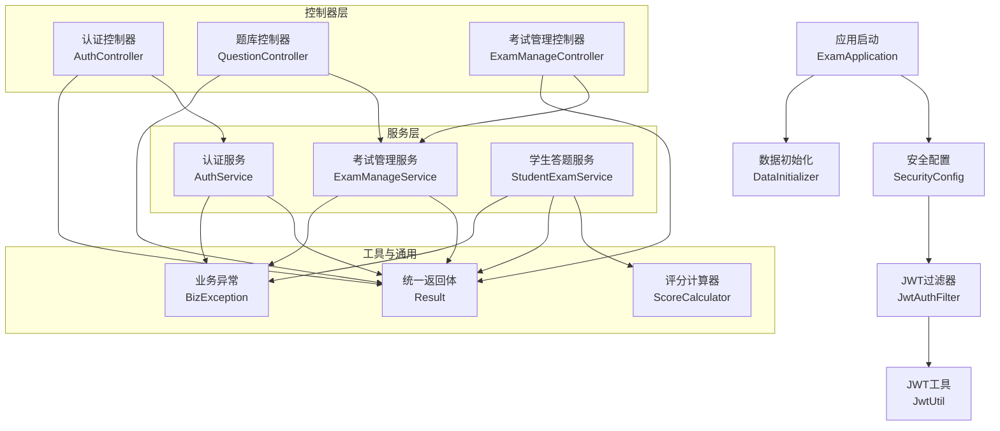
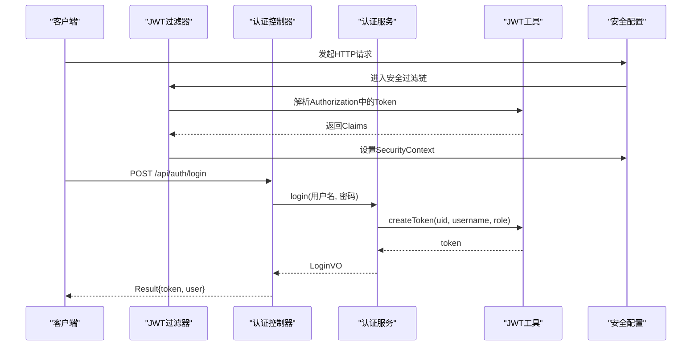
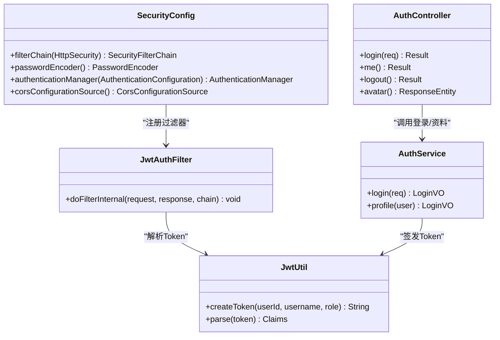
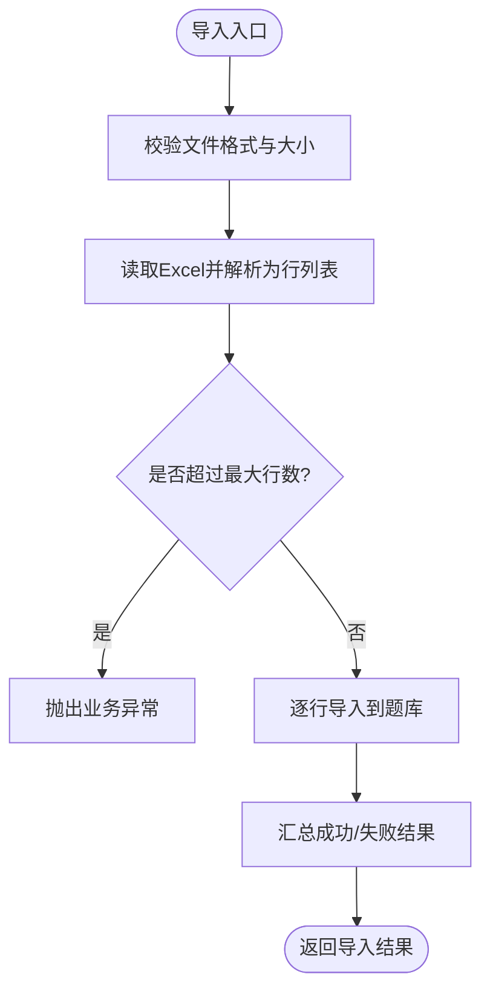
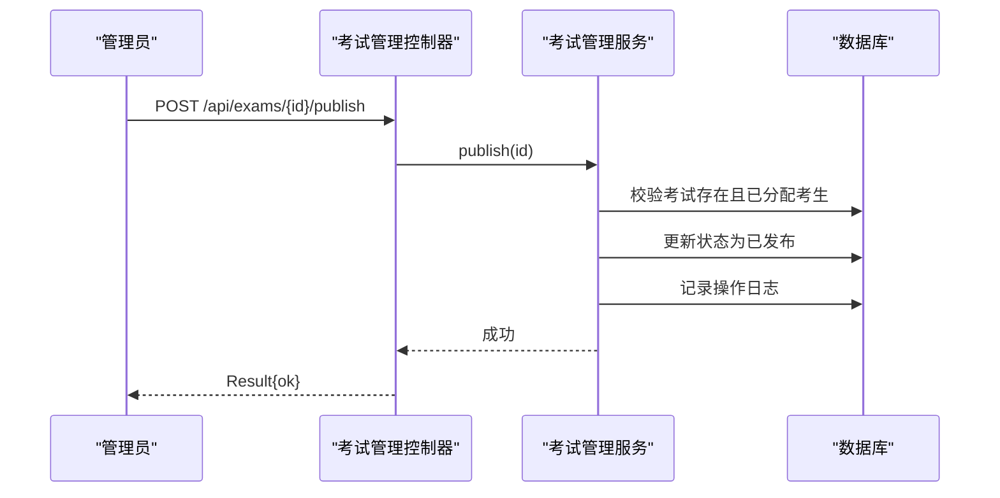
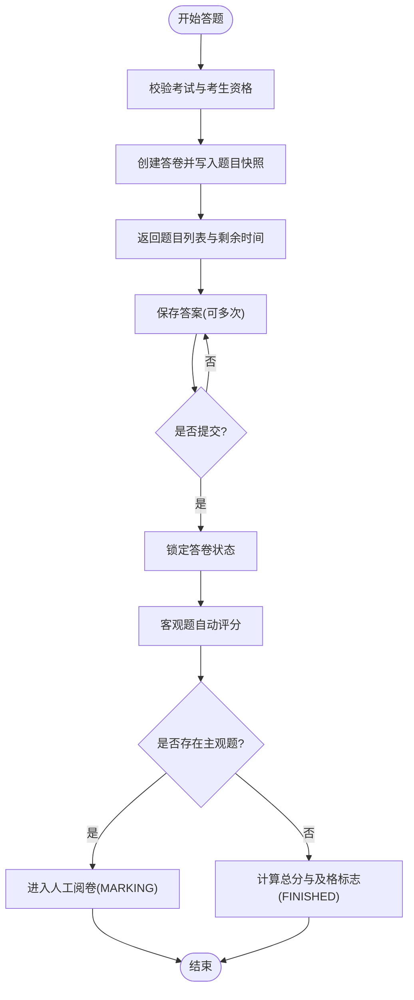
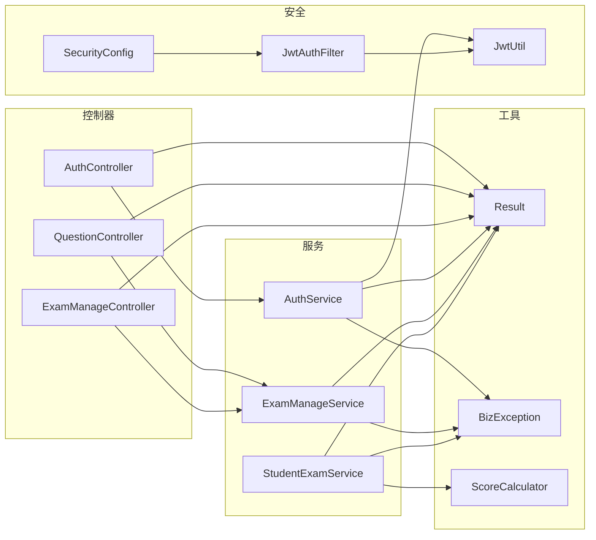

# 模块化设计

<cite>
**本文引用的文件**
- [ExamApplication.java](file://exam-server/src/main/java/com/exam/ExamApplication.java)
- [SecurityConfig.java](file://exam-server/src/main/java/com/exam/config/SecurityConfig.java)
- [JwtAuthFilter.java](file://exam-server/src/main/java/com/exam/security/JwtAuthFilter.java)
- [JwtUtil.java](file://exam-server/src/main/java/com/exam/security/JwtUtil.java)
- [AuthService.java](file://exam-server/src/main/java/com/exam/service/AuthService.java)
- [AuthController.java](file://exam-server/src/main/java/com/exam/controller/AuthController.java)
- [QuestionController.java](file://exam-server/src/main/java/com/exam/controller/QuestionController.java)
- [ExamManageController.java](file://exam-server/src/main/java/com/exam/controller/ExamManageController.java)
- [ExamManageService.java](file://exam-server/src/main/java/com/exam/service/ExamManageService.java)
- [StudentExamService.java](file://exam-server/src/main/java/com/exam/service/StudentExamService.java)
- [ScoreCalculator.java](file://exam-server/src/main/java/com/exam/util/ScoreCalculator.java)
- [Result.java](file://exam-server/src/main/java/com/exam/common/Result.java)
- [BizException.java](file://exam-server/src/main/java/com/exam/common/BizException.java)
- [DataInitializer.java](file://exam-server/src/main/java/com/exam/config/DataInitializer.java)
- [application.yml](file://exam-server/src/main/resources/application.yml)
</cite>

## 目录
1. [引言](#引言)
2. [项目结构](#项目结构)
3. [核心模块](#核心模块)
4. [架构总览](#架构总览)
5. [详细组件分析](#详细组件分析)
6. [依赖关系分析](#依赖关系分析)
7. [性能与可扩展性](#性能与可扩展性)
8. [故障排查指南](#故障排查指南)
9. [结论](#结论)
10. [附录：接口契约与扩展指南](#附录接口契约与扩展指南)

## 引言
本设计文档面向考试系统的模块化架构，明确各模块边界、职责划分与协作方式。系统采用前后端分离的 Spring Boot 后端，按“认证授权、题库管理、考试管理、答题服务、配置与安全、通用工具”等维度进行解耦，并通过统一的 HTTP API 和领域 Service 层进行通信。文档同时提供模块依赖图、调用时序图、流程图以及插件化扩展建议，帮助开发者快速理解并安全地扩展系统能力。

## 项目结构
后端基于 Spring Boot 分层组织：
- 启动与装配：应用入口扫描 Mapper，加载配置与环境。
- 配置与安全：统一安全策略、跨域、JWT 过滤器、初始化演示数据。
- 控制器层：对外暴露 RESTful 接口，负责参数校验与响应封装。
- 服务层：承载业务编排、事务控制与领域规则。
- 数据访问层：MyBatis-Plus Mapper 映射实体与数据库。
- 工具与通用：评分计算、统一返回体、异常定义。
- 资源与配置：多环境配置、PDF 字体、Swagger 等。

图表来源
- [ExamApplication.java:1-17](file://exam-server/src/main/java/com/exam/ExamApplication.java#L1-L17)
- [SecurityConfig.java:25-90](file://exam-server/src/main/java/com/exam/config/SecurityConfig.java#L25-L90)
- [JwtAuthFilter.java:21-52](file://exam-server/src/main/java/com/exam/security/JwtAuthFilter.java#L21-L52)
- [JwtUtil.java:14-44](file://exam-server/src/main/java/com/exam/security/JwtUtil.java#L14-L44)
- [AuthController.java:23-65](file://exam-server/src/main/java/com/exam/controller/AuthController.java#L23-L65)
- [QuestionController.java:31-118](file://exam-server/src/main/java/com/exam/controller/QuestionController.java#L31-L118)
- [ExamManageController.java:19-67](file://exam-server/src/main/java/com/exam/controller/ExamManageController.java#L19-L67)
- [AuthService.java:14-51](file://exam-server/src/main/java/com/exam/service/AuthService.java#L14-L51)
- [ExamManageService.java:36-277](file://exam-server/src/main/java/com/exam/service/ExamManageService.java#L36-L277)
- [StudentExamService.java:38-458](file://exam-server/src/main/java/com/exam/service/StudentExamService.java#L38-L458)
- [ScoreCalculator.java:11-55](file://exam-server/src/main/java/com/exam/util/ScoreCalculator.java#L11-L55)
- [Result.java:9-38](file://exam-server/src/main/java/com/exam/common/Result.java#L9-L38)
- [BizException.java:9-22](file://exam-server/src/main/java/com/exam/common/BizException.java#L9-L22)

章节来源
- [ExamApplication.java:1-17](file://exam-server/src/main/java/com/exam/ExamApplication.java#L1-L17)
- [application.yml:1-42](file://exam-server/src/main/resources/application.yml#L1-L42)

## 核心模块
- 认证授权模块
  - 职责：登录鉴权、角色权限控制、JWT 签发与解析、跨域与异常处理。
  - 关键类：SecurityConfig、JwtAuthFilter、JwtUtil、AuthService、AuthController。
  - 边界：仅暴露 /api/auth/** 相关接口；通过 SecurityConfig 对路径级权限进行拦截。
- 题库管理模块
  - 职责：题目增删改查、分类与知识点关联、Excel 导入导出、PDF 练习卷导出。
  - 关键类：QuestionController、QuestionService（由控制器注入）、QuestionImportService、QuestionPdfService。
  - 边界：以 /api/questions/** 为入口；导入行数限制与模板下载作为辅助能力。
- 考试管理模块
  - 职责：考试任务创建、发布/停止、指定考生、运行时状态计算、工作台统计。
  - 关键类：ExamManageController、ExamManageService。
  - 边界：以 /api/exams/** 与 /api/dashboard 为入口；状态机包含草稿、已发布、进行中、已结束。
- 答题服务模块
  - 职责：学生开始答题、保存答案、交卷评分、成绩复核、剩余时间计算、知识点掌握度重算。
  - 关键类：StudentExamService、ScoreCalculator、KnowledgeStatService（由服务注入）。
  - 边界：以 /api/student/** 为入口；答卷快照与客观题自动评分为核心流程。
- 配置与安全模块
  - 职责：全局安全策略、CORS、密码加密、JWT 配置、演示数据初始化。
  - 关键类：SecurityConfig、JwtUtil、DataInitializer、application.yml。
- 通用工具模块
  - 职责：统一返回体 Result、业务异常 BizException、评分算法 ScoreCalculator。
  - 边界：无外部状态，纯函数或轻量工具，被各模块复用。

章节来源
- [SecurityConfig.java:25-90](file://exam-server/src/main/java/com/exam/config/SecurityConfig.java#L25-L90)
- [JwtAuthFilter.java:21-52](file://exam-server/src/main/java/com/exam/security/JwtAuthFilter.java#L21-L52)
- [JwtUtil.java:14-44](file://exam-server/src/main/java/com/exam/security/JwtUtil.java#L14-L44)
- [AuthService.java:14-51](file://exam-server/src/main/java/com/exam/service/AuthService.java#L14-L51)
- [AuthController.java:23-65](file://exam-server/src/main/java/com/exam/controller/AuthController.java#L23-L65)
- [QuestionController.java:31-118](file://exam-server/src/main/java/com/exam/controller/QuestionController.java#L31-L118)
- [ExamManageController.java:19-67](file://exam-server/src/main/java/com/exam/controller/ExamManageController.java#L19-L67)
- [ExamManageService.java:36-277](file://exam-server/src/main/java/com/exam/service/ExamManageService.java#L36-L277)
- [StudentExamService.java:38-458](file://exam-server/src/main/java/com/exam/service/StudentExamService.java#L38-L458)
- [ScoreCalculator.java:11-55](file://exam-server/src/main/java/com/exam/util/ScoreCalculator.java#L11-L55)
- [Result.java:9-38](file://exam-server/src/main/java/com/exam/common/Result.java#L9-L38)
- [BizException.java:9-22](file://exam-server/src/main/java/com/exam/common/BizException.java#L9-L22)
- [DataInitializer.java:36-268](file://exam-server/src/main/java/com/exam/config/DataInitializer.java#L36-L268)
- [application.yml:1-42](file://exam-server/src/main/resources/application.yml#L1-L42)

## 架构总览
系统采用“控制器-服务-数据访问”的分层架构，安全过滤器在请求进入控制器前完成身份解析与鉴权。认证模块通过 JWT 实现无状态会话；题库与考试管理模块通过 Service 编排业务；答题服务在考试中维护答卷快照与评分流程。

图表来源
- [SecurityConfig.java:25-90](file://exam-server/src/main/java/com/exam/config/SecurityConfig.java#L25-L90)
- [JwtAuthFilter.java:21-52](file://exam-server/src/main/java/com/exam/security/JwtAuthFilter.java#L21-L52)
- [JwtUtil.java:14-44](file://exam-server/src/main/java/com/exam/security/JwtUtil.java#L14-L44)
- [AuthController.java:23-65](file://exam-server/src/main/java/com/exam/controller/AuthController.java#L23-L65)
- [AuthService.java:14-51](file://exam-server/src/main/java/com/exam/service/AuthService.java#L14-L51)

## 详细组件分析

### 认证授权模块
- 设计要点
  - 无状态认证：使用 JWT 存储用户标识与角色，避免服务端 Session。
  - 路径级权限：通过 SecurityConfig 对不同路径设置角色要求（学生、教师、管理员）。
  - 过滤器链：JwtAuthFilter 在每个请求中解析 Token 并填充 SecurityContext。
  - 统一错误：未认证返回 401，无权限返回 403，前端据此提示。
- 关键交互
  - 登录：AuthController -> AuthService -> AuthenticationManager -> JwtUtil.createToken。
  - 鉴权：JwtAuthFilter -> JwtUtil.parse -> UserDetailsServiceImpl -> SecurityContext。
- 扩展点
  - 新增角色或路径权限：修改 SecurityConfig 的 antMatchers。
  - 自定义令牌策略：扩展 JwtUtil 的载荷字段或签名算法。

图表来源
- [SecurityConfig.java:25-90](file://exam-server/src/main/java/com/exam/config/SecurityConfig.java#L25-L90)
- [JwtAuthFilter.java:21-52](file://exam-server/src/main/java/com/exam/security/JwtAuthFilter.java#L21-L52)
- [JwtUtil.java:14-44](file://exam-server/src/main/java/com/exam/security/JwtUtil.java#L14-L44)
- [AuthService.java:14-51](file://exam-server/src/main/java/com/exam/service/AuthService.java#L14-L51)
- [AuthController.java:23-65](file://exam-server/src/main/java/com/exam/controller/AuthController.java#L23-L65)

章节来源
- [SecurityConfig.java:25-90](file://exam-server/src/main/java/com/exam/config/SecurityConfig.java#L25-L90)
- [JwtAuthFilter.java:21-52](file://exam-server/src/main/java/com/exam/security/JwtAuthFilter.java#L21-L52)
- [JwtUtil.java:14-44](file://exam-server/src/main/java/com/exam/security/JwtUtil.java#L14-L44)
- [AuthService.java:14-51](file://exam-server/src/main/java/com/exam/service/AuthService.java#L14-L51)
- [AuthController.java:23-65](file://exam-server/src/main/java/com/exam/controller/AuthController.java#L23-L65)

### 题库管理模块
- 设计要点
  - 统一分页与查询：支持类型、分类、知识点、关键词筛选。
  - 批量导入：限制最大行数，逐行失败原因反馈。
  - PDF 导出：根据选中题目生成练习卷。
- 关键交互
  - 导入：QuestionController -> QuestionImportService -> EasyExcel 解析 -> 入库。
  - 导出：QuestionController -> QuestionPdfService -> 生成字节流 -> 响应输出。
- 扩展点
  - 新增题型：在 QuestionTypes 中声明，并在导入/导出逻辑中适配。
  - 扩展导入字段：调整 QuestionImportRow 与导入服务。

图表来源
- [QuestionController.java:31-118](file://exam-server/src/main/java/com/exam/controller/QuestionController.java#L31-L118)

章节来源
- [QuestionController.java:31-118](file://exam-server/src/main/java/com/exam/controller/QuestionController.java#L31-L118)

### 考试管理模块
- 设计要点
  - 状态机：草稿、已发布、进行中、已结束；运行时状态基于时间与状态综合判断。
  - 事务控制：发布、停止、保存考试信息时保证数据一致性。
  - 工作台统计：聚合学生、班级、考试、记录等指标。
- 关键交互
  - 发布：ExamManageController -> ExamManageService.publish -> 更新状态并记录操作日志。
  - 停止：ExamManageService.stop -> 结束时间写入、状态变更。
- 扩展点
  - 新增考试规则：在 save/publish/stop 中增加校验与动作。
  - 扩展统计维度：在 dashboard 中追加指标。

图表来源
- [ExamManageController.java:19-67](file://exam-server/src/main/java/com/exam/controller/ExamManageController.java#L19-L67)
- [ExamManageService.java:36-277](file://exam-server/src/main/java/com/exam/service/ExamManageService.java#L36-L277)

章节来源
- [ExamManageController.java:19-67](file://exam-server/src/main/java/com/exam/controller/ExamManageController.java#L19-L67)
- [ExamManageService.java:36-277](file://exam-server/src/main/java/com/exam/service/ExamManageService.java#L36-L277)

### 答题服务模块
- 设计要点
  - 答卷快照：开始答题时冻结题目内容、正确答案、题型与分值，确保历史一致性。
  - 自动评分：客观题即时匹配，主观题进入人工阅卷流程。
  - 剩余时间：取“开始时间+时长”与“考试截止时间”的较小值。
- 关键交互
  - 开始：StudentExamService.start -> 创建记录与快照 -> 返回题目与剩余时间。
  - 保存答案：StudentExamService.saveAnswers -> 更新答案与标记。
  - 提交：StudentExamService.submit -> 锁定状态 -> 客观题评分 -> 主观题标记或结束。
- 扩展点
  - 新增评分规则：扩展 ScoreCalculator.match 与 isSubjective。
  - 扩展复核展示：在 review 中按需显示更多元数据。

图表来源
- [StudentExamService.java:38-458](file://exam-server/src/main/java/com/exam/service/StudentExamService.java#L38-L458)
- [ScoreCalculator.java:11-55](file://exam-server/src/main/java/com/exam/util/ScoreCalculator.java#L11-L55)

章节来源
- [StudentExamService.java:38-458](file://exam-server/src/main/java/com/exam/service/StudentExamService.java#L38-L458)
- [ScoreCalculator.java:11-55](file://exam-server/src/main/java/com/exam/util/ScoreCalculator.java#L11-L55)

### 配置与安全模块
- 设计要点
  - 安全策略：关闭 CSRF，启用 CORS，无状态 Session，路径级权限控制。
  - JWT 配置：密钥与过期时间从 application.yml 注入。
  - 演示数据：首次启动时写入默认用户、知识点、题目、试卷与考试。
- 关键交互
  - 启动：ExamApplication -> DataInitializer -> 写入演示数据。
  - 安全：SecurityConfig -> JwtAuthFilter -> 每个请求鉴权。
- 扩展点
  - 切换数据库：通过 profiles 激活不同配置。
  - 调整字体：pdf-font-path 指向本地或系统字体。

章节来源
- [SecurityConfig.java:25-90](file://exam-server/src/main/java/com/exam/config/SecurityConfig.java#L25-L90)
- [application.yml:1-42](file://exam-server/src/main/resources/application.yml#L1-L42)
- [DataInitializer.java:36-268](file://exam-server/src/main/java/com/exam/config/DataInitializer.java#L36-L268)
- [ExamApplication.java:1-17](file://exam-server/src/main/java/com/exam/ExamApplication.java#L1-L17)

### 通用工具模块
- 设计要点
  - 统一返回体：Result 提供 ok/fail 便捷方法，前端按 code 判断。
  - 业务异常：BizException 携带错误码，由全局处理器转换为 Result。
  - 评分算法：ScoreCalculator 提供客观题匹配与主观题判定。
- 关键交互
  - 控制器与服务通过 Result 包装返回值。
  - 业务逻辑抛出 BizException，统一捕获并返回。

章节来源
- [Result.java:9-38](file://exam-server/src/main/java/com/exam/common/Result.java#L9-L38)
- [BizException.java:9-22](file://exam-server/src/main/java/com/exam/common/BizException.java#L9-L22)
- [ScoreCalculator.java:11-55](file://exam-server/src/main/java/com/exam/util/ScoreCalculator.java#L11-L55)

## 依赖关系分析
模块间耦合关系清晰，控制器仅依赖服务，服务依赖数据访问与工具，安全模块贯穿所有请求。

图表来源
- [AuthController.java:23-65](file://exam-server/src/main/java/com/exam/controller/AuthController.java#L23-L65)
- [QuestionController.java:31-118](file://exam-server/src/main/java/com/exam/controller/QuestionController.java#L31-L118)
- [ExamManageController.java:19-67](file://exam-server/src/main/java/com/exam/controller/ExamManageController.java#L19-L67)
- [AuthService.java:14-51](file://exam-server/src/main/java/com/exam/service/AuthService.java#L14-L51)
- [ExamManageService.java:36-277](file://exam-server/src/main/java/com/exam/service/ExamManageService.java#L36-L277)
- [StudentExamService.java:38-458](file://exam-server/src/main/java/com/exam/service/StudentExamService.java#L38-L458)
- [SecurityConfig.java:25-90](file://exam-server/src/main/java/com/exam/config/SecurityConfig.java#L25-L90)
- [JwtAuthFilter.java:21-52](file://exam-server/src/main/java/com/exam/security/JwtAuthFilter.java#L21-L52)
- [JwtUtil.java:14-44](file://exam-server/src/main/java/com/exam/security/JwtUtil.java#L14-L44)
- [Result.java:9-38](file://exam-server/src/main/java/com/exam/common/Result.java#L9-L38)
- [BizException.java:9-22](file://exam-server/src/main/java/com/exam/common/BizException.java#L9-L22)
- [ScoreCalculator.java:11-55](file://exam-server/src/main/java/com/exam/util/ScoreCalculator.java#L11-L55)

章节来源
- [AuthController.java:23-65](file://exam-server/src/main/java/com/exam/controller/AuthController.java#L23-L65)
- [QuestionController.java:31-118](file://exam-server/src/main/java/com/exam/controller/QuestionController.java#L31-L118)
- [ExamManageController.java:19-67](file://exam-server/src/main/java/com/exam/controller/ExamManageController.java#L19-L67)
- [AuthService.java:14-51](file://exam-server/src/main/java/com/exam/service/AuthService.java#L14-L51)
- [ExamManageService.java:36-277](file://exam-server/src/main/java/com/exam/service/ExamManageService.java#L36-L277)
- [StudentExamService.java:38-458](file://exam-server/src/main/java/com/exam/service/StudentExamService.java#L38-L458)
- [SecurityConfig.java:25-90](file://exam-server/src/main/java/com/exam/config/SecurityConfig.java#L25-L90)
- [JwtAuthFilter.java:21-52](file://exam-server/src/main/java/com/exam/security/JwtAuthFilter.java#L21-L52)
- [JwtUtil.java:14-44](file://exam-server/src/main/java/com/exam/security/JwtUtil.java#L14-L44)
- [Result.java:9-38](file://exam-server/src/main/java/com/exam/common/Result.java#L9-L38)
- [BizException.java:9-22](file://exam-server/src/main/java/com/exam/common/BizException.java#L9-L22)
- [ScoreCalculator.java:11-55](file://exam-server/src/main/java/com/exam/util/ScoreCalculator.java#L11-L55)

## 性能与可扩展性
- 性能考虑
  - 导入限制：题库导入限制最大行数，避免大文件拖垮解析与事务。
  - 无状态鉴权：JWT 减少服务端会话开销，提升水平扩展能力。
  - 快照机制：答题开始时冻结题目快照，降低并发下题目变更带来的不一致风险。
  - 自动评分：客观题即时评分，减少后续批处理压力。
- 可扩展性
  - 插件化题型：通过 QuestionTypes 与 ScoreCalculator 扩展新题型与评分规则。
  - 插件化导出：QuestionPdfService 可按需扩展导出格式与布局。
  - 插件化权限：SecurityConfig 支持新增路径与角色策略。
  - 插件化统计：ExamManageService.dashboard 可扩展统计维度。

[本节为通用指导，不直接分析具体文件]

## 故障排查指南
- 常见错误
  - 未登录或登录过期：SecurityConfig 的 authenticationEntryPoint 返回 401。
  - 没有权限：accessDeniedHandler 返回 403。
  - 业务异常：BizException 携带错误码与消息，统一转为 Result。
- 定位步骤
  - 检查 Authorization 头是否正确携带 Bearer Token。
  - 确认 SecurityConfig 的路径权限是否符合预期。
  - 查看业务异常抛出位置（如考试状态、重复交卷等）。
  - 核对 application.yml 的 JWT 配置与过期时间。
- 恢复建议
  - 刷新 Token 或重新登录。
  - 调整权限策略或角色分配。
  - 修正业务输入（如考试时间、题目快照等）。

章节来源
- [SecurityConfig.java:25-90](file://exam-server/src/main/java/com/exam/config/SecurityConfig.java#L25-L90)
- [BizException.java:9-22](file://exam-server/src/main/java/com/exam/common/BizException.java#L9-L22)
- [application.yml:1-42](file://exam-server/src/main/resources/application.yml#L1-L42)

## 结论
本模块化设计通过清晰的边界与职责划分，实现了认证授权、题库管理、考试管理与答题服务的解耦与协作。统一的安全策略与工具模块提升了系统的稳定性与可维护性。通过插件化扩展点，系统能够灵活适应新题型、新导出格式与新权限策略，满足持续演进的需求。

[本节为总结，不直接分析具体文件]

## 附录：接口契约与扩展指南
- 接口契约
  - 认证：/api/auth/login、/api/auth/me、/api/auth/logout、头像上传/删除。
  - 题库：/api/questions（分页、详情、创建、更新、删除）、导入模板、导入、导出 PDF。
  - 考试管理：/api/exams（分页、详情、创建、更新、发布、停止）、/api/dashboard。
  - 学生答题：/api/student/**（开始答题、保存答案、提交、复习）。
- 扩展指南
  - 新增题型：在 QuestionTypes 中声明，并在 ScoreCalculator 中实现匹配逻辑。
  - 新增导出格式：扩展 QuestionPdfService 或新增导出服务，控制器暴露新接口。
  - 新增权限：在 SecurityConfig 中添加 antMatchers 与角色要求。
  - 新增统计维度：在 ExamManageService.dashboard 中追加指标计算。

[本节为概念性说明，不直接分析具体文件]