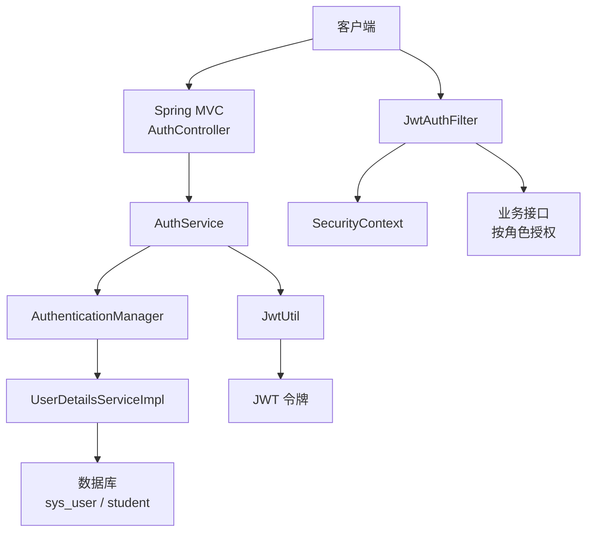
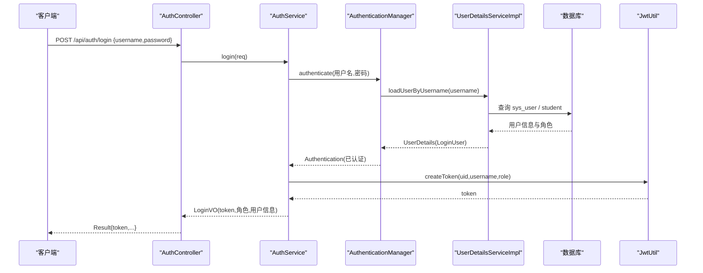
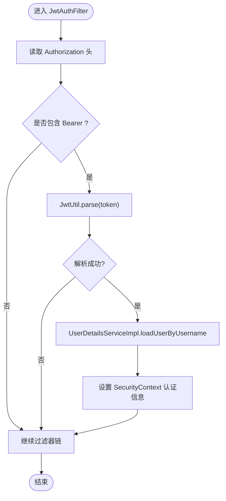
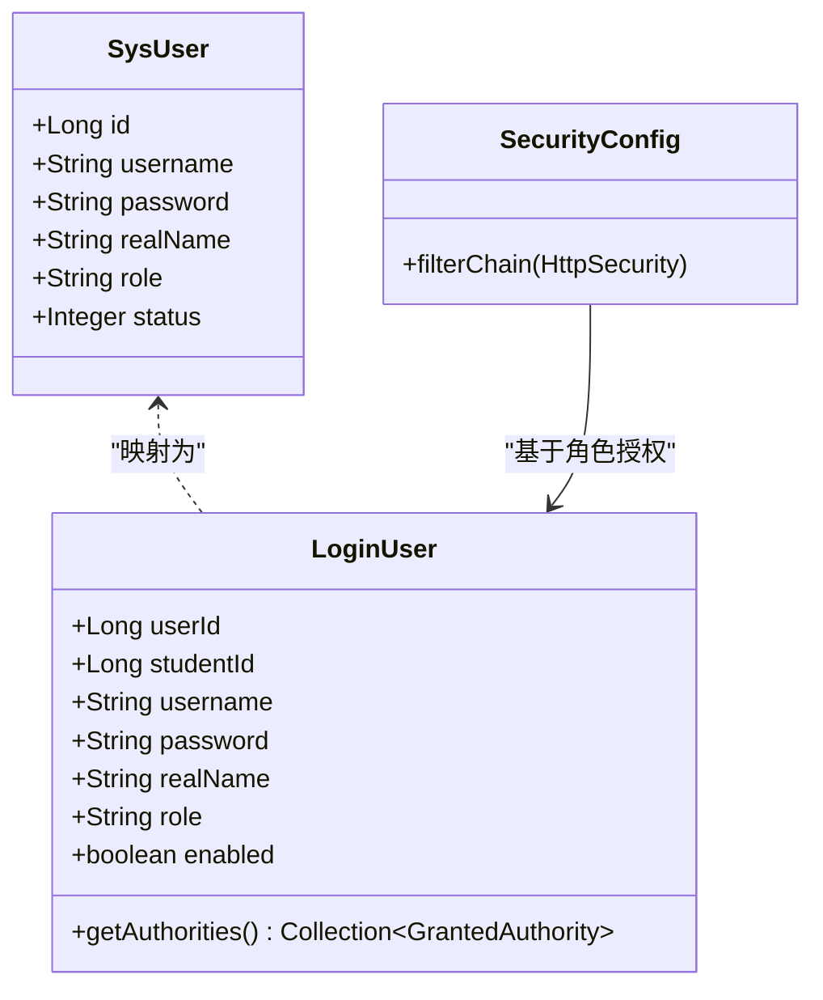
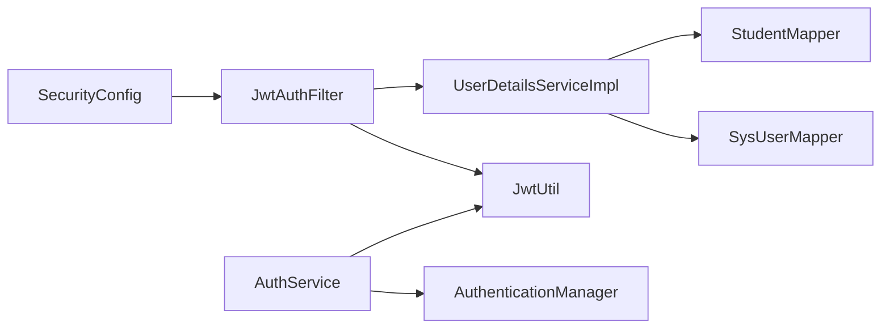
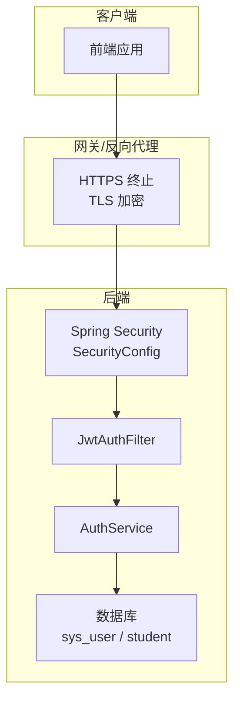
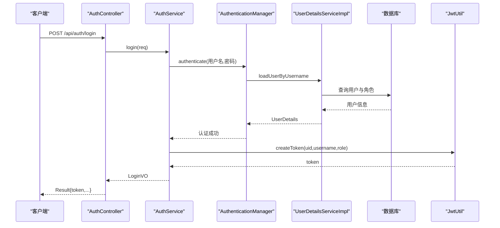
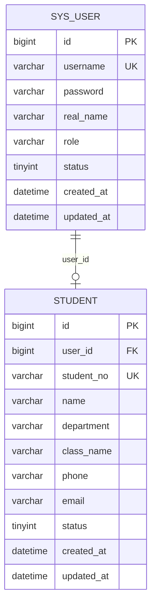

# 安全架构

<cite>
**本文引用的文件**
- [SecurityConfig.java](file://exam-server/src/main/java/com/exam/config/SecurityConfig.java)
- [JwtAuthFilter.java](file://exam-server/src/main/java/com/exam/security/JwtAuthFilter.java)
- [JwtUtil.java](file://exam-server/src/main/java/com/exam/security/JwtUtil.java)
- [UserDetailsServiceImpl.java](file://exam-server/src/main/java/com/exam/security/UserDetailsServiceImpl.java)
- [LoginUser.java](file://exam-server/src/main/java/com/exam/security/LoginUser.java)
- [AuthService.java](file://exam-server/src/main/java/com/exam/service/AuthService.java)
- [AuthController.java](file://exam-server/src/main/java/com/exam/controller/AuthController.java)
- [SysUser.java](file://exam-server/src/main/java/com/exam/entity/SysUser.java)
- [application.yml](file://exam-server/src/main/resources/application.yml)
- [GlobalExceptionHandler.java](file://exam-server/src/main/java/com/exam/common/GlobalExceptionHandler.java)
- [schema.sql](file://sql/schema.sql)
</cite>

## 目录
1. [简介](#简介)
2. [项目结构](#项目结构)
3. [核心组件](#核心组件)
4. [架构总览](#架构总览)
5. [详细组件分析](#详细组件分析)
6. [依赖关系分析](#依赖关系分析)
7. [性能与安全权衡](#性能与安全权衡)
8. [故障排查指南](#故障排查指南)
9. [结论](#结论)
10. [附录](#附录)

## 简介
本安全架构文档围绕考试系统的安全设计与防护措施展开，重点说明：
- JWT 认证机制的令牌生成、验证与刷新策略
- 基于角色的访问控制（RBAC）模型与接口级权限策略
- 接口安全防护：CSRF、SQL 注入、XSS 防护现状与建议
- 数据安全保护：密码加密、敏感信息脱敏、传输加密建议
- 提供安全架构图与认证流程图，帮助读者快速理解整体安全流程

## 项目结构
后端采用 Spring Security + JWT 的无状态认证方案。关键路径包括：
- 安全配置：SecurityConfig 定义全局安全策略、角色权限、异常处理、CORS
- 认证过滤器：JwtAuthFilter 解析请求头中的 Bearer Token，完成鉴权并设置上下文
- 令牌工具：JwtUtil 负责签发和校验 JWT，载荷包含用户标识与角色
- 用户详情服务：UserDetailsServiceImpl 根据用户名加载用户及角色，构建登录主体
- 认证服务：AuthService 调用认证管理器进行密码校验，成功后签发 JWT
- 控制器：AuthController 暴露登录、当前用户信息、头像等接口
- 实体与配置：SysUser 存储账号与角色；application.yml 配置 JWT 密钥与过期时间

图表来源
- [SecurityConfig.java:36-65](file://exam-server/src/main/java/com/exam/config/SecurityConfig.java#L36-L65)
- [JwtAuthFilter.java:29-50](file://exam-server/src/main/java/com/exam/security/JwtAuthFilter.java#L29-L50)
- [JwtUtil.java:27-42](file://exam-server/src/main/java/com/exam/security/JwtUtil.java#L27-L42)
- [UserDetailsServiceImpl.java:22-39](file://exam-server/src/main/java/com/exam/security/UserDetailsServiceImpl.java#L22-L39)
- [AuthService.java:22-38](file://exam-server/src/main/java/com/exam/service/AuthService.java#L22-L38)
- [AuthController.java:31-41](file://exam-server/src/main/java/com/exam/controller/AuthController.java#L31-L41)

章节来源
- [SecurityConfig.java:25-89](file://exam-server/src/main/java/com/exam/config/SecurityConfig.java#L25-L89)
- [application.yml:31-33](file://exam-server/src/main/resources/application.yml#L31-L33)

## 核心组件
- 安全过滤链与权限策略：通过 SecurityFilterChain 关闭 Session，启用无状态模式；对 /api/auth/login 放行，其他 API 按角色限制访问；统一异常处理返回 401/403 JSON。
- JWT 过滤器：从 Authorization 头提取 Bearer Token，解析后加载用户并写入 SecurityContext，供后续方法使用。
- 令牌签发与解析：JwtUtil 使用 HS256 签名，载荷包含 uid、username、role，支持过期时间控制。
- 用户详情与角色：UserDetailsServiceImpl 根据用户名查询 sys_user，若为学生则关联 student 表主键；将角色转换为 ROLE_XXX 形式。
- 认证服务：AuthService 使用 AuthenticationManager 校验用户名密码，成功后签发 JWT 并返回用户基本信息。
- 控制器：AuthController 提供登录、获取当前用户、退出等接口；退出为无状态设计，主要由前端清理本地 token。

章节来源
- [SecurityConfig.java:36-65](file://exam-server/src/main/java/com/exam/config/SecurityConfig.java#L36-L65)
- [JwtAuthFilter.java:29-50](file://exam-server/src/main/java/com/exam/security/JwtAuthFilter.java#L29-L50)
- [JwtUtil.java:27-42](file://exam-server/src/main/java/com/exam/security/JwtUtil.java#L27-L42)
- [UserDetailsServiceImpl.java:22-39](file://exam-server/src/main/java/com/exam/security/UserDetailsServiceImpl.java#L22-L39)
- [AuthService.java:22-38](file://exam-server/src/main/java/com/exam/service/AuthService.java#L22-L38)
- [AuthController.java:31-41](file://exam-server/src/main/java/com/exam/controller/AuthController.java#L31-L41)

## 架构总览
系统采用前后端分离架构，后端以 Spring Security 为核心，结合自定义 JWT 过滤器实现无状态认证。所有受保护接口均需在请求头携带 Bearer Token；服务端在过滤器中解析并设置认证上下文，随后由 Spring Security 基于角色进行资源访问控制。

图表来源
- [AuthController.java:31-35](file://exam-server/src/main/java/com/exam/controller/AuthController.java#L31-L35)
- [AuthService.java:22-38](file://exam-server/src/main/java/com/exam/service/AuthService.java#L22-L38)
- [UserDetailsServiceImpl.java:22-39](file://exam-server/src/main/java/com/exam/security/UserDetailsServiceImpl.java#L22-L39)
- [JwtUtil.java:27-37](file://exam-server/src/main/java/com/exam/security/JwtUtil.java#L27-L37)

## 详细组件分析

### JWT 认证机制
- 令牌生成：AuthService 在认证成功之后调用 JwtUtil.createToken，将 uid、username、role 写入载荷，并设置签发时间与过期时间，使用 HS256 签名生成 compact 字符串。
- 令牌验证：JwtAuthFilter 在每个请求中读取 Authorization 头，提取 Bearer Token 后调用 JwtUtil.parse 解析并校验签名与有效期；若成功，则加载用户详情并设置到 SecurityContext。
- 刷新策略：当前实现为无状态单令牌，未内置刷新逻辑。生产环境可引入“短时效访问令牌 + 长时效刷新令牌”的双令牌机制，并提供刷新接口。

图表来源
- [JwtAuthFilter.java:29-50](file://exam-server/src/main/java/com/exam/security/JwtAuthFilter.java#L29-L50)
- [JwtUtil.java:39-42](file://exam-server/src/main/java/com/exam/security/JwtUtil.java#L39-L42)
- [UserDetailsServiceImpl.java:22-39](file://exam-server/src/main/java/com/exam/security/UserDetailsServiceImpl.java#L22-L39)

章节来源
- [JwtUtil.java:27-42](file://exam-server/src/main/java/com/exam/security/JwtUtil.java#L27-L42)
- [JwtAuthFilter.java:29-50](file://exam-server/src/main/java/com/exam/security/JwtAuthFilter.java#L29-L50)
- [AuthService.java:22-38](file://exam-server/src/main/java/com/exam/service/AuthService.java#L22-L38)

### 角色权限控制模型（RBAC）
- 角色定义：SysUser.role 支持 ADMIN、TEACHER、STUDENT；UserDetailsServiceImpl 将 role 转换为 ROLE_XXX 形式的 GrantedAuthority。
- 接口级授权：SecurityConfig 中针对不同路径设置角色要求：
  - /api/student/** 仅学生
  - /api/users/** 仅管理员
  - /api/auth/** 需认证
  - /api/** 教师或管理员
  - 其他请求默认需认证
- 访问控制策略：通过 antMatchers 精确匹配路径，结合 hasRole/hasAnyRole 实现细粒度控制；未通过时返回 403。

图表来源
- [SysUser.java:10-23](file://exam-server/src/main/java/com/exam/entity/SysUser.java#L10-L23)
- [LoginUser.java:11-36](file://exam-server/src/main/java/com/exam/security/LoginUser.java#L11-L36)
- [SecurityConfig.java:42-50](file://exam-server/src/main/java/com/exam/config/SecurityConfig.java#L42-L50)

章节来源
- [SecurityConfig.java:42-50](file://exam-server/src/main/java/com/exam/config/SecurityConfig.java#L42-L50)
- [LoginUser.java:33-36](file://exam-server/src/main/java/com/exam/security/LoginUser.java#L33-L36)
- [SysUser.java:10-23](file://exam-server/src/main/java/com/exam/entity/SysUser.java#L10-L23)

### 接口安全防护措施
- CSRF 防护：当前 SecurityConfig 显式禁用 CSRF（适用于前后端分离与无状态 JWT）。对于纯 API 场景这是常见做法；若存在表单提交且使用 Cookie 认证，应重新评估并启用 CSRF。
- SQL 注入防护：数据访问层使用 MyBatis-Plus，通过 LambdaQueryWrapper 构造参数化查询，避免拼接 SQL，有效防止 SQL 注入。
- XSS 攻击防护：当前未发现专门的 XSS 过滤或输出编码配置。建议在输入校验与输出渲染阶段增加白名单过滤或转义；对富文本内容尤其需要谨慎处理。

章节来源
- [SecurityConfig.java:38-41](file://exam-server/src/main/java/com/exam/config/SecurityConfig.java#L38-L41)
- [MybatisPlusConfig.java:12-17](file://exam-server/src/main/java/com/exam/config/MybatisPlusConfig.java#L12-L17)

### 数据安全保护机制
- 密码加密：使用 BCryptPasswordEncoder 进行密码哈希存储；SysUser.password 字段注释明确为 BCrypt，非明文。
- 敏感信息脱敏：SysUser 实体包含 password 字段，但对外返回通常通过 VO 或序列化控制避免泄露；当前登录响应不包含密码，符合最小披露原则。
- 数据传输加密：应用层未强制 HTTPS；生产环境应在网关或反向代理层启用 TLS，确保端到端加密传输。

章节来源
- [SecurityConfig.java:68-71](file://exam-server/src/main/java/com/exam/config/SecurityConfig.java#L68-L71)
- [SysUser.java:10-23](file://exam-server/src/main/java/com/exam/entity/SysUser.java#L10-L23)
- [application.yml:31-33](file://exam-server/src/main/resources/application.yml#L31-L33)

## 依赖关系分析
- 组件耦合：
  - SecurityConfig 依赖 JwtAuthFilter，并在过滤器链中插入该过滤器
  - JwtAuthFilter 依赖 JwtUtil 与 UserDetailsServiceImpl
  - AuthService 依赖 AuthenticationManager 与 JwtUtil
  - UserDetailsServiceImpl 依赖 SysUserMapper 与 StudentMapper
- 外部依赖：
  - Spring Security 提供认证与授权框架
  - JWT 库用于令牌签发与校验
  - MyBatis-Plus 提供参数化查询能力

图表来源
- [SecurityConfig.java:34-65](file://exam-server/src/main/java/com/exam/config/SecurityConfig.java#L34-L65)
- [JwtAuthFilter.java:26-28](file://exam-server/src/main/java/com/exam/security/JwtAuthFilter.java#L26-L28)
- [AuthService.java:18-20](file://exam-server/src/main/java/com/exam/service/AuthService.java#L18-L20)
- [UserDetailsServiceImpl.java:19-21](file://exam-server/src/main/java/com/exam/security/UserDetailsServiceImpl.java#L19-L21)

章节来源
- [SecurityConfig.java:34-65](file://exam-server/src/main/java/com/exam/config/SecurityConfig.java#L34-L65)
- [JwtAuthFilter.java:26-28](file://exam-server/src/main/java/com/exam/security/JwtAuthFilter.java#L26-L28)
- [AuthService.java:18-20](file://exam-server/src/main/java/com/exam/service/AuthService.java#L18-L20)
- [UserDetailsServiceImpl.java:19-21](file://exam-server/src/main/java/com/exam/security/UserDetailsServiceImpl.java#L19-L21)

## 性能与安全权衡
- 无状态认证：JWT 无 Session 开销，适合水平扩展；但令牌一旦签发无法在服务端主动失效，需配合黑名单或短期令牌策略。
- 令牌大小：载荷包含 uid、username、role，体积较小；如需更多上下文（如租户、设备指纹），需权衡带宽与安全性。
- 权限检查：基于路径的角色匹配简单高效；复杂场景可引入注解式权限控制（如 @PreAuthorize）提升灵活性。
- CORS 配置：当前允许所有来源并允许凭据，生产环境应限制可信域名，降低跨站风险。

[本节为通用指导，不直接分析具体文件]

## 故障排查指南
- 401 未登录或登录已过期：
  - 检查请求头是否携带正确的 Authorization: Bearer <token>
  - 确认 JWT 未过期（application.yml 中 jwt-expire-hours）
  - 查看 JwtAuthFilter 是否成功解析并设置认证上下文
- 403 没有权限：
  - 检查用户角色是否正确（ROLE_ADMIN、ROLE_TEACHER、ROLE_STUDENT）
  - 核对 SecurityConfig 中对应路径的 hasRole/hasAnyRole 配置
- 参数错误：
  - GlobalExceptionHandler 会捕获校验异常并返回统一消息，检查前端传入参数是否符合 DTO 约束
- 服务器错误：
  - 全局异常处理器会捕获未知异常并返回通用提示；建议在生产环境隐藏堆栈，记录日志以便定位

章节来源
- [GlobalExceptionHandler.java:20-59](file://exam-server/src/main/java/com/exam/common/GlobalExceptionHandler.java#L20-L59)
- [SecurityConfig.java:52-62](file://exam-server/src/main/java/com/exam/config/SecurityConfig.java#L52-L62)
- [application.yml:31-33](file://exam-server/src/main/resources/application.yml#L31-L33)

## 结论
该系统采用 Spring Security + JWT 的无状态认证方案，具备清晰的 RBAC 权限模型与统一的异常处理。密码使用 BCrypt 加密，数据访问通过 MyBatis-Plus 参数化查询防范 SQL 注入。当前实现满足基本安全需求，但在以下方面仍有改进空间：
- 引入双令牌机制以提升安全性与用户体验
- 限制 CORS 来源，增强跨域安全
- 增加 XSS 防护与输入校验策略
- 生产环境启用 HTTPS 与更严格的密钥管理

[本节为总结性内容，不直接分析具体文件]

## 附录

### 安全架构图

图表来源
- [SecurityConfig.java:36-65](file://exam-server/src/main/java/com/exam/config/SecurityConfig.java#L36-L65)
- [JwtAuthFilter.java:29-50](file://exam-server/src/main/java/com/exam/security/JwtAuthFilter.java#L29-L50)
- [AuthService.java:22-38](file://exam-server/src/main/java/com/exam/service/AuthService.java#L22-L38)
- [application.yml:31-33](file://exam-server/src/main/resources/application.yml#L31-L33)

### 认证流程图

图表来源
- [AuthController.java:31-35](file://exam-server/src/main/java/com/exam/controller/AuthController.java#L31-L35)
- [AuthService.java:22-38](file://exam-server/src/main/java/com/exam/service/AuthService.java#L22-L38)
- [UserDetailsServiceImpl.java:22-39](file://exam-server/src/main/java/com/exam/security/UserDetailsServiceImpl.java#L22-L39)
- [JwtUtil.java:27-37](file://exam-server/src/main/java/com/exam/security/JwtUtil.java#L27-L37)

### 数据模型图（与安全相关）

图表来源
- [schema.sql:2-28](file://sql/schema.sql#L2-L28)