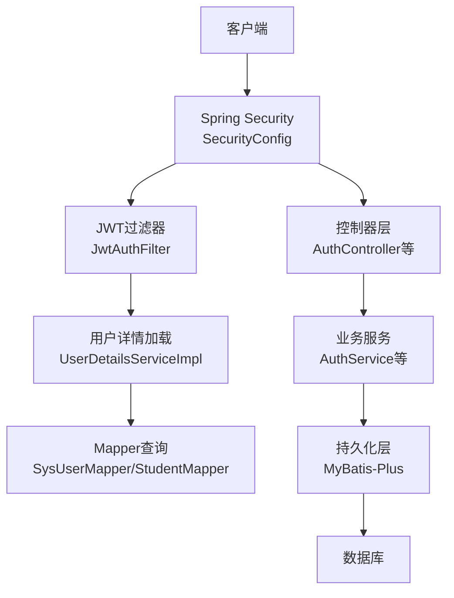
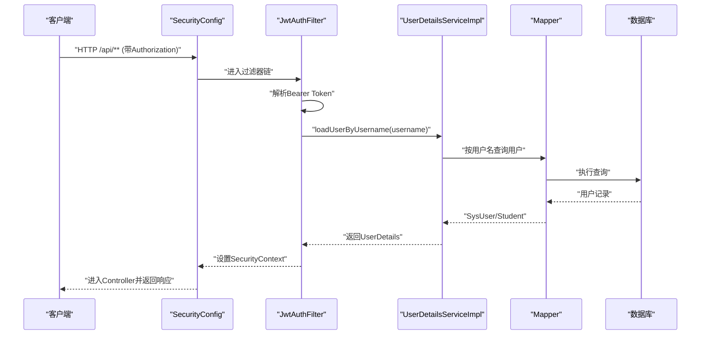
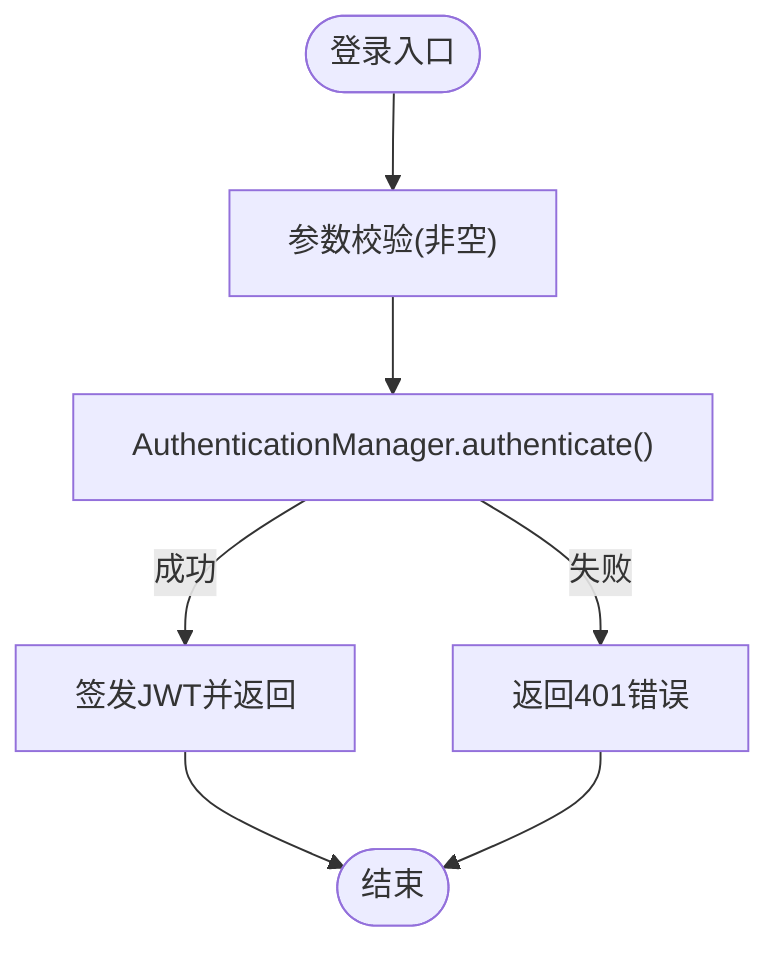
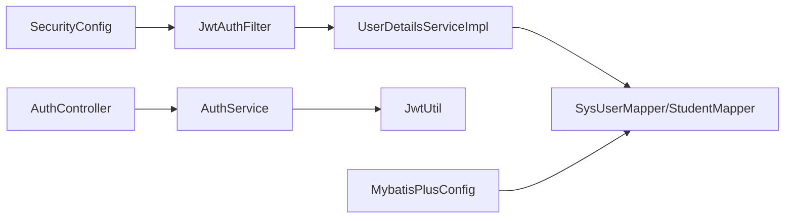

# 数据安全保护

<cite>
**本文引用的文件**
- [SecurityConfig.java](file://exam-server/src/main/java/com/exam/config/SecurityConfig.java)
- [JwtAuthFilter.java](file://exam-server/src/main/java/com/exam/security/JwtAuthFilter.java)
- [JwtUtil.java](file://exam-server/src/main/java/com/exam/security/JwtUtil.java)
- [GlobalExceptionHandler.java](file://exam-server/src/main/java/com/exam/common/GlobalExceptionHandler.java)
- [application.yml](file://exam-server/src/main/resources/application.yml)
- [AuthService.java](file://exam-server/src/main/java/com/exam/service/AuthService.java)
- [AuthController.java](file://exam-server/src/main/java/com/exam/controller/AuthController.java)
- [UserDetailsServiceImpl.java](file://exam-server/src/main/java/com/exam/security/UserDetailsServiceImpl.java)
- [SysUser.java](file://exam-server/src/main/java/com/exam/entity/SysUser.java)
- [MybatisPlusConfig.java](file://exam-server/src/main/java/com/exam/config/MybatisPlusConfig.java)
- [LoginRequest.java](file://exam-server/src/main/java/com/exam/dto/LoginRequest.java)
- [Student.java](file://exam-server/src/main/java/com/exam/entity/Student.java)
- [DataInitializer.java](file://exam-server/src/main/java/com/exam/config/DataInitializer.java)
- [考试系统-方案.md](file://考试系统-方案.md)
</cite>

## 目录
1. [简介](#简介)
2. [项目结构](#项目结构)
3. [核心组件](#核心组件)
4. [架构总览](#架构总览)
5. [详细组件分析](#详细组件分析)
6. [依赖关系分析](#依赖关系分析)
7. [性能与安全权衡](#性能与安全权衡)
8. [故障排查指南](#故障排查指南)
9. [结论](#结论)
10. [附录：安全配置最佳实践与漏洞防范清单](#附录安全配置最佳实践与漏洞防范清单)

## 简介
本文件面向考试系统的数据安全保护，围绕密码加密存储、敏感数据脱敏、数据传输安全、SQL注入防护、XSS防护以及全局异常处理的安全策略进行系统化说明。文档基于仓库中实际实现进行分析，并给出可操作的改进建议与排障指引。

## 项目结构
后端服务位于 exam-server，安全相关能力集中在 config、security、common、service、controller 等包；数据库访问通过 MyBatis-Plus；认证鉴权采用 Spring Security + JWT；CORS 在安全配置中启用；Jackson 用于序列化输出。

图表来源
- [SecurityConfig.java:36-65](file://exam-server/src/main/java/com/exam/config/SecurityConfig.java#L36-L65)
- [JwtAuthFilter.java:29-50](file://exam-server/src/main/java/com/exam/security/JwtAuthFilter.java#L29-L50)
- [UserDetailsServiceImpl.java:22-39](file://exam-server/src/main/java/com/exam/security/UserDetailsServiceImpl.java#L22-L39)
- [MybatisPlusConfig.java:12-17](file://exam-server/src/main/java/com/exam/config/MybatisPlusConfig.java#L12-L17)

章节来源
- [SecurityConfig.java:25-88](file://exam-server/src/main/java/com/exam/config/SecurityConfig.java#L25-L88)
- [application.yml:1-42](file://exam-server/src/main/resources/application.yml#L1-L42)

## 核心组件
- 密码加密与认证：使用 BCryptPasswordEncoder 作为密码编码器；登录流程通过 AuthenticationManager 校验用户名与密码，成功后签发 JWT。
- 无状态会话：关闭 Session，使用 JWT 承载用户身份与角色信息。
- 跨域与请求头：启用 CORS，允许预检请求 OPTIONS；对安全资源进行角色授权。
- 全局异常：统一返回 JSON，避免堆栈泄露；对认证失败、权限不足等安全异常进行专门处理。
- 数据访问：MyBatis-Plus 参数绑定（LambdaQueryWrapper）避免拼接 SQL；分页插件已启用。

章节来源
- [SecurityConfig.java:68-71](file://exam-server/src/main/java/com/exam/config/SecurityConfig.java#L68-L71)
- [AuthService.java:22-37](file://exam-server/src/main/java/com/exam/service/AuthService.java#L22-L37)
- [JwtUtil.java:27-42](file://exam-server/src/main/java/com/exam/security/JwtUtil.java#L27-L42)
- [GlobalExceptionHandler.java:20-59](file://exam-server/src/main/java/com/exam/common/GlobalExceptionHandler.java#L20-L59)
- [MybatisPlusConfig.java:12-17](file://exam-server/src/main/java/com/exam/config/MybatisPlusConfig.java#L12-L17)

## 架构总览
下图展示一次受保护 API 的调用链：前端携带 Authorization: Bearer <token> 发起请求，Spring Security 先放行匿名接口，其余由 JwtAuthFilter 解析 token 并设置上下文，随后进入 Controller -> Service -> Mapper -> DB。

图表来源
- [SecurityConfig.java:36-65](file://exam-server/src/main/java/com/exam/config/SecurityConfig.java#L36-L65)
- [JwtAuthFilter.java:29-50](file://exam-server/src/main/java/com/exam/security/JwtAuthFilter.java#L29-L50)
- [UserDetailsServiceImpl.java:22-39](file://exam-server/src/main/java/com/exam/security/UserDetailsServiceImpl.java#L22-L39)

## 详细组件分析

### 密码加密存储与强度验证
- 加密算法：使用 BCryptPasswordEncoder，确保密码以不可逆哈希形式存储，避免明文落库。
- 登录校验：AuthenticationManager 内部使用 PasswordEncoder 比对密码；若失败则抛出 BadCredentialsException，由全局异常处理器统一返回 401。
- 演示账号初始化：启动时写入演示账号，密码同样通过 PasswordEncoder 处理。
- 密码强度验证：当前未在服务端实现自定义密码复杂度规则（如长度、字符集限制）。建议在注册/修改密码处增加校验规则，并在 DTO 上配合 Bean Validation。

图表来源
- [AuthService.java:22-37](file://exam-server/src/main/java/com/exam/service/AuthService.java#L22-L37)
- [GlobalExceptionHandler.java:42-46](file://exam-server/src/main/java/com/exam/common/GlobalExceptionHandler.java#L42-L46)
- [SecurityConfig.java:68-71](file://exam-server/src/main/java/com/exam/config/SecurityConfig.java#L68-L71)

章节来源
- [SecurityConfig.java:68-71](file://exam-server/src/main/java/com/exam/config/SecurityConfig.java#L68-L71)
- [AuthService.java:22-37](file://exam-server/src/main/java/com/exam/service/AuthService.java#L22-L37)
- [GlobalExceptionHandler.java:42-46](file://exam-server/src/main/java/com/exam/common/GlobalExceptionHandler.java#L42-L46)
- [DataInitializer.java:56-64](file://exam-server/src/main/java/com/exam/config/DataInitializer.java#L56-L64)
- [SysUser.java:10-23](file://exam-server/src/main/java/com/exam/entity/SysUser.java#L10-L23)

### 敏感数据脱敏处理
- 现状：实体 SysUser 包含 password 字段，但注释明确为 BCrypt 存储；同时存在风险点——该字段未默认忽略序列化，可能在某些接口暴露。
- 建议：
  - 在 SysUser.password 上添加忽略序列化的注解或使用 VO 对象对外输出，避免任何场景下返回密码。
  - 对用户手机号、邮箱等敏感字段，在输出层进行掩码处理（例如保留前3后4）。
  - 考试成绩、答题明细等敏感结果在导出或列表页按需脱敏，仅对授权角色开放完整视图。
- 参考位置：
  - 实体定义：[SysUser.java:10-23](file://exam-server/src/main/java/com/exam/entity/SysUser.java#L10-L23)
  - 学生档案含电话邮箱等：[Student.java:10-26](file://exam-server/src/main/java/com/exam/entity/Student.java#L10-L26)
  - 方案文档指出 password 需加 @JsonIgnore 或使用 VO：[考试系统-方案.md:686-698](file://考试系统-方案.md#L686-L698)

章节来源
- [SysUser.java:10-23](file://exam-server/src/main/java/com/exam/entity/SysUser.java#L10-L23)
- [Student.java:10-26](file://exam-server/src/main/java/com/exam/entity/Student.java#L10-L26)
- [考试系统-方案.md:686-698](file://考试系统-方案.md#L686-L698)

### 数据传输安全（HTTPS、CORS、请求签名）
- HTTPS：当前应用监听 0.0.0.0:8080，未内置 HTTPS 配置。生产环境建议在前置 Nginx/Tomcat 启用 TLS，并强制跳转 HTTPS。
- CORS：已启用跨域，允许所有来源与方法，并允许携带凭证。生产应限制允许的 Origin 白名单，避免任意站点携带 Cookie/Token 访问。
- 请求签名：当前未实现请求签名机制。对于高敏感操作（如改密、导出成绩），建议在后端增加时间戳+随机数+HMAC签名校验，防止重放攻击。

章节来源
- [application.yml:1-8](file://exam-server/src/main/resources/application.yml#L1-L8)
- [SecurityConfig.java:78-88](file://exam-server/src/main/java/com/exam/config/SecurityConfig.java#L78-L88)
- [考试系统-方案.md:686-698](file://考试系统-方案.md#L686-L698)

### SQL注入防护
- 参数绑定：代码中使用 LambdaQueryWrapper 进行条件构造，底层由 MyBatis-Plus 生成参数化 SQL，有效避免字符串拼接导致的注入风险。
- 分页插件：已启用 PaginationInnerInterceptor，提升查询性能的同时不影响安全性。
- 建议：
  - 严格遵循“只读入参类型、不拼接 SQL”的原则。
  - 对复杂查询尽量使用 MyBatis XML 的 #{} 参数绑定，避免 ${} 直接拼接。
  - 对输入做最小权限与范围校验（如枚举、ID 白名单）。

章节来源
- [UserDetailsServiceImpl.java:22-39](file://exam-server/src/main/java/com/exam/security/UserDetailsServiceImpl.java#L22-L39)
- [MybatisPlusConfig.java:12-17](file://exam-server/src/main/java/com/exam/config/MybatisPlusConfig.java#L12-L17)

### XSS 攻击防护
- 现状：未发现专门的 XSS 过滤或输出编码组件；Jackson 负责 JSON 序列化，通常不会触发脚本执行，但若返回 HTML 片段需格外注意。
- 建议：
  - 对所有用户输入进行服务端校验与清洗（长度、格式、白名单）。
  - 对输出到页面的内容做转义编码；JSON 接口保持纯数据，避免直接渲染 HTML。
  - 在网关或前端引入 Content-Security-Policy 策略，限制脚本来源与内联脚本执行。
  - 对富文本场景使用安全的白名单 sanitizer。

章节来源
- [GlobalExceptionHandler.java:54-59](file://exam-server/src/main/java/com/exam/common/GlobalExceptionHandler.java#L54-L59)
- [application.yml:12-14](file://exam-server/src/main/resources/application.yml#L12-L14)

### 全局异常处理器的安全策略
- 认证失败：BadCredentialsException 统一返回 401，不泄露具体原因细节。
- 权限不足：AccessDeniedException 统一返回 403。
- 业务异常：BizException 根据 code 映射到对应 HTTP 状态码。
- 兜底异常：捕获 Exception 返回通用 500 提示，避免堆栈泄露；建议改为记录日志并返回固定消息。

章节来源
- [GlobalExceptionHandler.java:20-59](file://exam-server/src/main/java/com/exam/common/GlobalExceptionHandler.java#L20-L59)

## 依赖关系分析
- 安全链路：SecurityConfig 注册 Cors、Session 策略、授权规则与异常处理；JwtAuthFilter 在认证过滤器之前解析 JWT；UserDetailsServiceImpl 从数据库加载用户；AuthService 完成认证与令牌签发。
- 数据访问：MyBatis-Plus 拦截器提供分页；查询通过 Lambda 表达式构建，减少注入风险。
- 配置项：JWT 密钥与过期时间来自 application.yml；端口与编码等基础配置也在其中。

图表来源
- [SecurityConfig.java:36-65](file://exam-server/src/main/java/com/exam/config/SecurityConfig.java#L36-L65)
- [JwtAuthFilter.java:29-50](file://exam-server/src/main/java/com/exam/security/JwtAuthFilter.java#L29-L50)
- [UserDetailsServiceImpl.java:22-39](file://exam-server/src/main/java/com/exam/security/UserDetailsServiceImpl.java#L22-L39)
- [AuthService.java:22-37](file://exam-server/src/main/java/com/exam/service/AuthService.java#L22-L37)
- [JwtUtil.java:27-42](file://exam-server/src/main/java/com/exam/security/JwtUtil.java#L27-L42)
- [MybatisPlusConfig.java:12-17](file://exam-server/src/main/java/com/exam/config/MybatisPlusConfig.java#L12-L17)

章节来源
- [SecurityConfig.java:36-65](file://exam-server/src/main/java/com/exam/config/SecurityConfig.java#L36-L65)
- [JwtAuthFilter.java:29-50](file://exam-server/src/main/java/com/exam/security/JwtAuthFilter.java#L29-L50)
- [AuthService.java:22-37](file://exam-server/src/main/java/com/exam/service/AuthService.java#L22-L37)
- [JwtUtil.java:27-42](file://exam-server/src/main/java/com/exam/security/JwtUtil.java#L27-L42)
- [MybatisPlusConfig.java:12-17](file://exam-server/src/main/java/com/exam/config/MybatisPlusConfig.java#L12-L17)

## 性能与安全权衡
- 无状态 JWT：减少服务器内存占用，便于水平扩展；但需妥善管理密钥与过期时间。
- CORS 宽松策略：开发便利但生产存在风险，应收紧来源白名单。
- 全局异常打印堆栈：调试友好但生产必须关闭，避免信息泄露。
- 参数化查询：牺牲少量灵活性换取更高安全性与稳定性。

## 故障排查指南
- 登录 401：检查 Authorization 头是否携带正确 Bearer Token；确认 JWT 未过期且密钥一致。
- 登录 403：检查用户角色与接口授权是否匹配。
- 跨域失败：确认浏览器请求的 Origin 是否在允许列表中；生产务必限制来源。
- 数据库连接失败：核对 profile 与数据库配置；确保端口与网络可达。
- 页面刷新 404：前端路由需支持 history 模式；Nginx 需配置 try_files。

章节来源
- [GlobalExceptionHandler.java:20-59](file://exam-server/src/main/java/com/exam/common/GlobalExceptionHandler.java#L20-L59)
- [SecurityConfig.java:36-65](file://exam-server/src/main/java/com/exam/config/SecurityConfig.java#L36-L65)
- [application.yml:1-24](file://exam-server/src/main/resources/application.yml#L1-L24)

## 结论
系统在密码加密、认证鉴权、跨域与异常处理方面具备良好基础。为达到生产级安全要求，建议补齐以下关键点：严格限制 CORS、隐藏敏感字段输出、增强密码强度校验、引入 HTTPS、考虑请求签名与 CSP 策略，并将异常兜底逻辑调整为“仅返回通用提示+后台日志”。

## 附录：安全配置最佳实践与漏洞防范清单
- 密码与认证
  - 使用强密码策略（长度、复杂度、历史重复限制）。
  - 登录失败次数限制与验证码，防暴力破解。
  - 定期轮换 JWT 密钥，合理设置过期时间。
- 传输安全
  - 全站 HTTPS，禁用弱协议与套件。
  - CORS 白名单精确控制，禁止 allowCredentials 与 * 同时出现。
  - 关键接口增加请求签名与时间戳校验，防重放。
- 数据与输出
  - 所有敏感字段输出脱敏；实体默认忽略敏感字段。
  - 输入校验（长度、格式、白名单）；输出编码（HTML/JS 上下文）。
  - 启用 CSP，限制脚本来源与内联脚本。
- 数据库与查询
  - 一律使用参数化查询；禁止字符串拼接 SQL。
  - 最小权限账户访问数据库；开启审计日志。
- 异常与日志
  - 统一异常返回，不暴露堆栈与内部细节。
  - 敏感日志脱敏；集中收集与分析告警。

章节来源
- [考试系统-方案.md:686-698](file://考试系统-方案.md#L686-L698)
- [SecurityConfig.java:78-88](file://exam-server/src/main/java/com/exam/config/SecurityConfig.java#L78-L88)
- [GlobalExceptionHandler.java:54-59](file://exam-server/src/main/java/com/exam/common/GlobalExceptionHandler.java#L54-L59)
- [application.yml:31-35](file://exam-server/src/main/resources/application.yml#L31-L35)