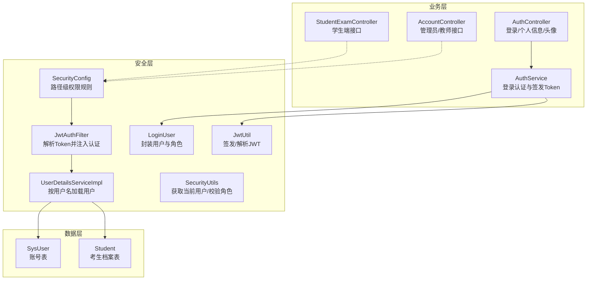
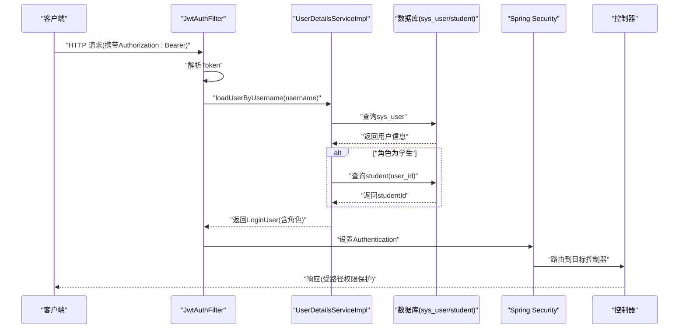
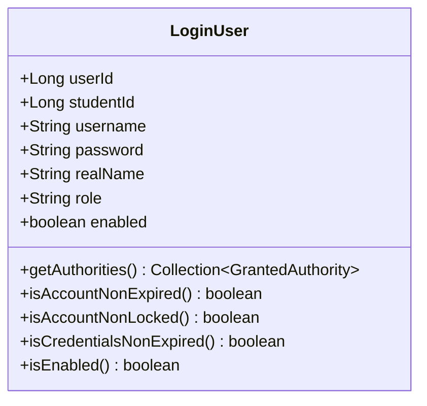
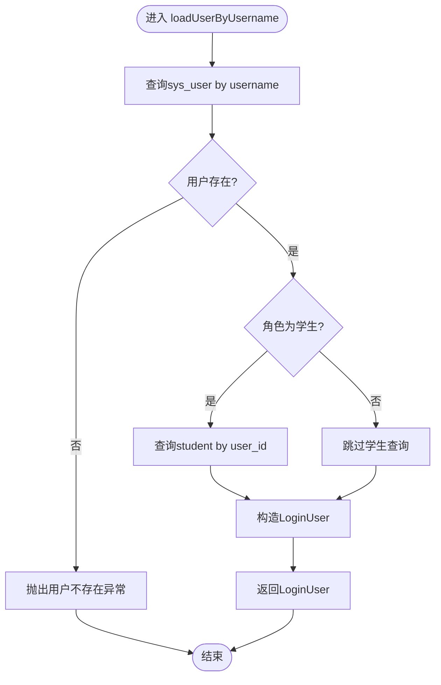
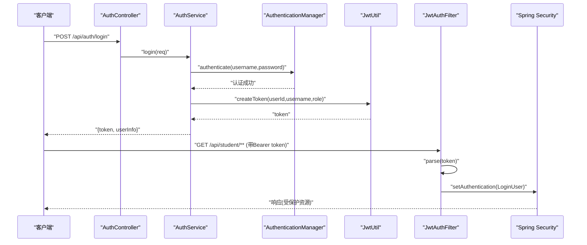
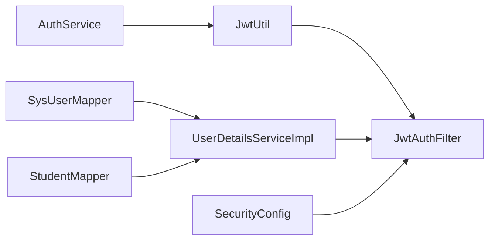

# 角色权限控制

<cite>
**本文引用的文件**
- [SecurityConfig.java](file://exam-server/src/main/java/com/exam/config/SecurityConfig.java)
- [JwtAuthFilter.java](file://exam-server/src/main/java/com/exam/security/JwtAuthFilter.java)
- [JwtUtil.java](file://exam-server/src/main/java/com/exam/security/JwtUtil.java)
- [UserDetailsServiceImpl.java](file://exam-server/src/main/java/com/exam/security/UserDetailsServiceImpl.java)
- [LoginUser.java](file://exam-server/src/main/java/com/exam/security/LoginUser.java)
- [SecurityUtils.java](file://exam-server/src/main/java/com/exam/security/SecurityUtils.java)
- [AuthService.java](file://exam-server/src/main/java/com/exam/service/AuthService.java)
- [AuthController.java](file://exam-server/src/main/java/com/exam/controller/AuthController.java)
- [SysUser.java](file://exam-server/src/main/java/com/exam/entity/SysUser.java)
- [Student.java](file://exam-server/src/main/java/com/exam/entity/Student.java)
- [schema.sql](file://sql/schema.sql)
</cite>

## 目录
1. [简介](#简介)
2. [项目结构](#项目结构)
3. [核心组件](#核心组件)
4. [架构总览](#架构总览)
5. [详细组件分析](#详细组件分析)
6. [依赖关系分析](#依赖关系分析)
7. [性能考虑](#性能考虑)
8. [故障排查指南](#故障排查指南)
9. [结论](#结论)
10. [附录](#附录)

## 简介
本章节面向考试系统的角色与权限控制，围绕 RBAC（基于角色的访问控制）模型，说明管理员、教师、学生三类角色的权限边界与实现方式。重点覆盖：
- 角色模型设计与权限映射
- 登录用户封装与权限集合管理
- 用户详情加载逻辑与缓存策略
- 接口级权限控制与注解使用建议
- 权限继承、动态权限控制与最佳实践

## 项目结构
后端采用 Spring Security + JWT 的无状态认证方案，通过过滤器链完成鉴权，结合路径级权限规则进行访问控制。关键目录与职责如下：
- config：安全配置与全局设置
- security：JWT 工具、过滤器、用户详情服务、当前用户工具类
- entity：系统用户、学生等实体
- service：业务服务（含认证流程）
- controller：REST 控制器（按路径划分角色域）

图表来源
- [SecurityConfig.java:25-66](file://exam-server/src/main/java/com/exam/config/SecurityConfig.java#L25-L66)
- [JwtAuthFilter.java:21-50](file://exam-server/src/main/java/com/exam/security/JwtAuthFilter.java#L21-L50)
- [UserDetailsServiceImpl.java:14-39](file://exam-server/src/main/java/com/exam/security/UserDetailsServiceImpl.java#L14-L39)
- [LoginUser.java:11-36](file://exam-server/src/main/java/com/exam/security/LoginUser.java#L11-L36)
- [SecurityUtils.java:11-38](file://exam-server/src/main/java/com/exam/security/SecurityUtils.java#L11-L38)
- [JwtUtil.java:14-42](file://exam-server/src/main/java/com/exam/security/JwtUtil.java#L14-L42)
- [AuthService.java:14-49](file://exam-server/src/main/java/com/exam/service/AuthService.java#L14-L49)
- [AuthController.java:24-63](file://exam-server/src/main/java/com/exam/controller/AuthController.java#L24-L63)
- [SysUser.java:10-23](file://exam-server/src/main/java/com/exam/entity/SysUser.java#L10-L23)
- [Student.java:10-26](file://exam-server/src/main/java/com/exam/entity/Student.java#L10-L26)

章节来源
- [SecurityConfig.java:25-66](file://exam-server/src/main/java/com/exam/config/SecurityConfig.java#L25-L66)
- [schema.sql:1-29](file://sql/schema.sql#L1-L29)

## 核心组件
- 角色模型与权限映射
  - 角色来源于 sys_user.role，支持 ADMIN、TEACHER、STUDENT。
  - 路径级权限在 SecurityConfig 中定义，不同 URL 前缀对应不同角色要求。
- 登录用户封装
  - LoginUser 实现 UserDetails，将角色转换为 GrantedAuthority（ROLE_前缀），并提供 studentId 以区分学生身份。
- 用户详情加载
  - UserDetailsServiceImpl 根据用户名查询 SysUser；若为学生则额外查询 Student 表获取 studentId。
- JWT 认证
  - JwtUtil 负责签发与解析 Token；JwtAuthFilter 在每个请求中解析 Token 并注入 SecurityContext。
- 当前用户工具
  - SecurityUtils 提供 current、requireUser、isAdmin、requireStudentId 等方法，便于控制器快速判断身份。

章节来源
- [SysUser.java:10-23](file://exam-server/src/main/java/com/exam/entity/SysUser.java#L10-L23)
- [SecurityConfig.java:42-50](file://exam-server/src/main/java/com/exam/config/SecurityConfig.java#L42-L50)
- [LoginUser.java:11-36](file://exam-server/src/main/java/com/exam/security/LoginUser.java#L11-L36)
- [UserDetailsServiceImpl.java:22-39](file://exam-server/src/main/java/com/exam/security/UserDetailsServiceImpl.java#L22-L39)
- [JwtUtil.java:27-42](file://exam-server/src/main/java/com/exam/security/JwtUtil.java#L27-L42)
- [JwtAuthFilter.java:29-49](file://exam-server/src/main/java/com/exam/security/JwtAuthFilter.java#L29-L49)
- [SecurityUtils.java:11-38](file://exam-server/src/main/java/com/exam/security/SecurityUtils.java#L11-L38)

## 架构总览
下图展示了从客户端发起请求到最终鉴权的完整链路，包括 JWT 解析、用户详情加载、角色权限匹配以及异常处理。

图表来源
- [JwtAuthFilter.java:29-49](file://exam-server/src/main/java/com/exam/security/JwtAuthFilter.java#L29-L49)
- [UserDetailsServiceImpl.java:22-39](file://exam-server/src/main/java/com/exam/security/UserDetailsServiceImpl.java#L22-L39)
- [SecurityConfig.java:42-50](file://exam-server/src/main/java/com/exam/config/SecurityConfig.java#L42-L50)

## 详细组件分析

### 角色模型与权限映射（RBAC）
- 角色来源
  - 系统用户表 sys_user 的 role 字段存储角色，支持 ADMIN、TEACHER、STUDENT。
- 权限映射
  - 通过 SecurityConfig 的路径匹配规则，将 URL 前缀与角色绑定：
    - /api/student/** 仅学生可访问
    - /api/users/** 仅管理员可访问
    - /api/auth/** 需已认证
    - /api/** 教师或管理员可访问
- 角色继承
  - 当前实现为“路径级”隔离，未显式实现角色继承（如 ADMIN 继承 TEACHER）。如需继承，可在 SecurityConfig 中扩展 hasAnyRole 或使用自定义表达式。

章节来源
- [SysUser.java:10-23](file://exam-server/src/main/java/com/exam/entity/SysUser.java#L10-L23)
- [SecurityConfig.java:42-50](file://exam-server/src/main/java/com/exam/config/SecurityConfig.java#L42-L50)

### LoginUser 设计（用户信息封装与权限集合）
- 字段说明
  - userId：系统用户主键
  - studentId：学生档案主键（非学生为空）
  - username/password/realName：登录信息与姓名
  - role：角色（ADMIN/TEACHER/STUDENT）
  - enabled：账户是否启用
- 权限集合
  - getAuthorities() 返回 ROLE_ + role 的 GrantedAuthority，供 Spring Security 进行权限判定。
- 生命周期
  - 由 UserDetailsServiceImpl 构造后注入到 SecurityContext，后续通过 SecurityUtils 获取。

图表来源
- [LoginUser.java:11-56](file://exam-server/src/main/java/com/exam/security/LoginUser.java#L11-L56)

章节来源
- [LoginUser.java:11-56](file://exam-server/src/main/java/com/exam/security/LoginUser.java#L11-L56)

### UserDetailsServiceImpl 用户详情加载逻辑
- 加载流程
  - 根据用户名查询 sys_user，不存在则抛出未找到异常。
  - 若角色为学生，再查询 student 表获取 studentId。
  - 构造 LoginUser 并返回，其中 enabled 由 status 决定。
- 缓存机制
  - 当前实现每次请求都会重新查询数据库，未引入内存缓存。
  - 如需提升性能，可在 Service 层增加本地缓存（如 Caffeine）或在过滤器层缓存短期结果。

图表来源
- [UserDetailsServiceImpl.java:22-39](file://exam-server/src/main/java/com/exam/security/UserDetailsServiceImpl.java#L22-L39)

章节来源
- [UserDetailsServiceImpl.java:22-39](file://exam-server/src/main/java/com/exam/security/UserDetailsServiceImpl.java#L22-L39)
- [Student.java:10-26](file://exam-server/src/main/java/com/exam/entity/Student.java#L10-L26)

### JWT 认证与过滤器链
- 登录流程
  - AuthController 调用 AuthService.login，内部通过 AuthenticationManager 校验用户名密码，成功后使用 JwtUtil 签发 Token。
- 请求鉴权
  - JwtAuthFilter 解析 Authorization 头中的 Token，提取 username 并通过 UserDetailsServiceImpl 加载用户，设置到 SecurityContext。
- 路径权限
  - SecurityConfig 对 /api/student/**、/api/users/**、/api/** 等进行角色限制，未通过则返回 401/403。

图表来源
- [AuthController.java:31-41](file://exam-server/src/main/java/com/exam/controller/AuthController.java#L31-L41)
- [AuthService.java:22-37](file://exam-server/src/main/java/com/exam/service/AuthService.java#L22-L37)
- [JwtUtil.java:27-42](file://exam-server/src/main/java/com/exam/security/JwtUtil.java#L27-L42)
- [JwtAuthFilter.java:29-49](file://exam-server/src/main/java/com/exam/security/JwtAuthFilter.java#L29-L49)
- [SecurityConfig.java:42-62](file://exam-server/src/main/java/com/exam/config/SecurityConfig.java#L42-L62)

章节来源
- [AuthController.java:31-41](file://exam-server/src/main/java/com/exam/controller/AuthController.java#L31-L41)
- [AuthService.java:22-37](file://exam-server/src/main/java/com/exam/service/AuthService.java#L22-L37)
- [JwtUtil.java:27-42](file://exam-server/src/main/java/com/exam/security/JwtUtil.java#L27-L42)
- [JwtAuthFilter.java:29-49](file://exam-server/src/main/java/com/exam/security/JwtAuthFilter.java#L29-L49)
- [SecurityConfig.java:42-62](file://exam-server/src/main/java/com/exam/config/SecurityConfig.java#L42-L62)

### 权限注解使用示例与建议
- 当前实现主要采用路径级权限（hasRole/hasAnyRole），未直接在控制器方法上使用 @PreAuthorize/@PostAuthorize。
- 建议在需要细粒度控制的场景使用：
  - @PreAuthorize("hasRole('ADMIN')") 用于管理员专属操作
  - @PreAuthorize("hasAnyRole('ADMIN','TEACHER')") 用于教师与管理员共享操作
  - @PreAuthorize("hasRole('STUDENT') and #id == authentication.principal.studentId") 用于学生只能访问自己的资源
- 注意：启用注解需在 SecurityConfig 中开启方法级安全（已启用 prePostEnabled=true）。

章节来源
- [SecurityConfig.java:25-27](file://exam-server/src/main/java/com/exam/config/SecurityConfig.java#L25-L27)
- [SecurityConfig.java:42-50](file://exam-server/src/main/java/com/exam/config/SecurityConfig.java#L42-L50)

### 权限继承、动态权限控制与最佳实践
- 权限继承
  - 当前为扁平角色模型，未实现继承。可通过 SecurityConfig 的 hasAnyRole 组合角色，或引入角色层级表并在 UserDetailsServiceImpl 中加载父角色。
- 动态权限控制
  - 可将权限从静态路径规则迁移至数据库（如 per-resource 权限），在 UserDetailsServiceImpl 中动态组装 GrantedAuthority 列表。
  - 结合 Redis 缓存用户权限，减少频繁查询。
- 最佳实践
  - 统一错误码：401 未登录/过期，403 无权限，已在 SecurityConfig 中配置。
  - 最小权限原则：每个接口只暴露必要能力，避免宽泛放行。
  - 审计与日志：记录敏感操作的主体与资源，便于追踪。
  - 前端配合：根据角色渲染菜单与按钮，降低误操作风险。

章节来源
- [SecurityConfig.java:52-62](file://exam-server/src/main/java/com/exam/config/SecurityConfig.java#L52-L62)

## 依赖关系分析
- 组件耦合
  - JwtAuthFilter 依赖 JwtUtil 与 UserDetailsServiceImpl
  - UserDetailsServiceImpl 依赖 SysUserMapper 与 StudentMapper
  - SecurityConfig 依赖 JwtAuthFilter 并定义路径级权限
  - AuthService 依赖 AuthenticationManager 与 JwtUtil
- 外部依赖
  - Spring Security 提供认证与授权框架
  - JJWT 用于 JWT 签发与解析
  - MyBatis Plus 用于数据访问

图表来源
- [JwtUtil.java:14-42](file://exam-server/src/main/java/com/exam/security/JwtUtil.java#L14-L42)
- [JwtAuthFilter.java:21-50](file://exam-server/src/main/java/com/exam/security/JwtAuthFilter.java#L21-L50)
- [UserDetailsServiceImpl.java:14-39](file://exam-server/src/main/java/com/exam/security/UserDetailsServiceImpl.java#L14-L39)
- [SecurityConfig.java:25-66](file://exam-server/src/main/java/com/exam/config/SecurityConfig.java#L25-L66)
- [AuthService.java:14-49](file://exam-server/src/main/java/com/exam/service/AuthService.java#L14-L49)

章节来源
- [JwtUtil.java:14-42](file://exam-server/src/main/java/com/exam/security/JwtUtil.java#L14-L42)
- [JwtAuthFilter.java:21-50](file://exam-server/src/main/java/com/exam/security/JwtAuthFilter.java#L21-L50)
- [UserDetailsServiceImpl.java:14-39](file://exam-server/src/main/java/com/exam/security/UserDetailsServiceImpl.java#L14-L39)
- [SecurityConfig.java:25-66](file://exam-server/src/main/java/com/exam/config/SecurityConfig.java#L25-L66)
- [AuthService.java:14-49](file://exam-server/src/main/java/com/exam/service/AuthService.java#L14-L49)

## 性能考虑
- 用户详情加载
  - 当前每次请求均查询数据库，高并发下可能成为瓶颈。建议：
    - 在 UserDetailsServiceImpl 或过滤器层引入本地缓存（Caffeine）或分布式缓存（Redis）
    - 缓存键包含 username 与角色版本，避免脏读
- JWT 解析
  - 解析轻量，但需确保签名密钥安全与过期时间合理
- 路径匹配
  - antMatchers 顺序影响匹配效率，建议将高频路径放在前面

[本节为通用指导，不直接分析具体文件]

## 故障排查指南
- 401 未登录或登录已过期
  - 检查请求是否携带有效的 Authorization: Bearer <token>
  - 确认 JwtAuthFilter 是否正确解析并设置 Authentication
  - 参考异常处理器配置
- 403 没有权限
  - 检查当前用户角色与目标路径的权限要求是否匹配
  - 确认 SecurityConfig 中路径规则是否正确
- 用户不存在
  - 检查用户名是否存在于 sys_user 表
  - 确认 UserDetailsServiceImpl 查询逻辑

章节来源
- [SecurityConfig.java:52-62](file://exam-server/src/main/java/com/exam/config/SecurityConfig.java#L52-L62)
- [JwtAuthFilter.java:29-49](file://exam-server/src/main/java/com/exam/security/JwtAuthFilter.java#L29-L49)
- [UserDetailsServiceImpl.java:22-39](file://exam-server/src/main/java/com/exam/security/UserDetailsServiceImpl.java#L22-L39)

## 结论
本系统采用 Spring Security + JWT 的无状态认证方案，通过路径级权限规则实现管理员、教师、学生的角色隔离。LoginUser 封装了用户信息与角色，UserDetailsServiceImpl 负责加载用户详情并关联学生档案。当前实现简洁清晰，适合教学考试场景。未来可扩展方向包括：
- 引入角色继承与细粒度权限（资源级）
- 增加权限缓存以提升性能
- 完善方法级注解使用，增强可读性与维护性

[本节为总结性内容，不直接分析具体文件]

## 附录
- 数据库表结构与索引
  - sys_user：账号表，包含 username、password、real_name、role、status 等字段
  - student：考生档案表，通过 user_id 关联账号
- 演示账号
  - 管理员、教师、学生账号已在 README 中提供，便于快速体验

章节来源
- [schema.sql:1-29](file://sql/schema.sql#L1-L29)
- [README.md:13-22](file://README.md#L13-L22)