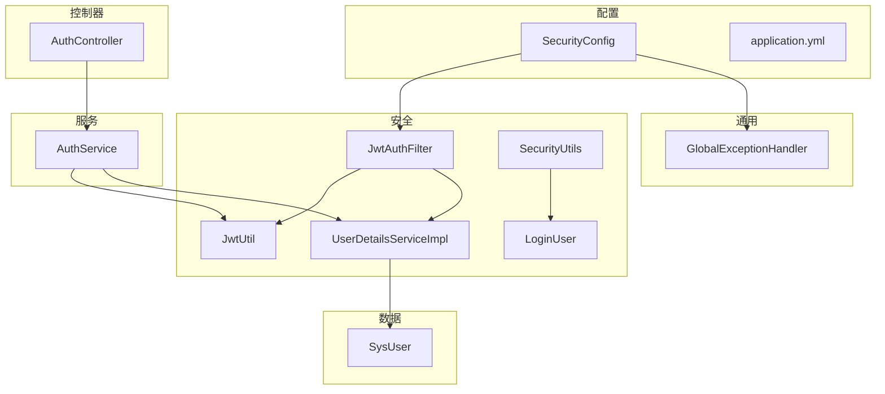
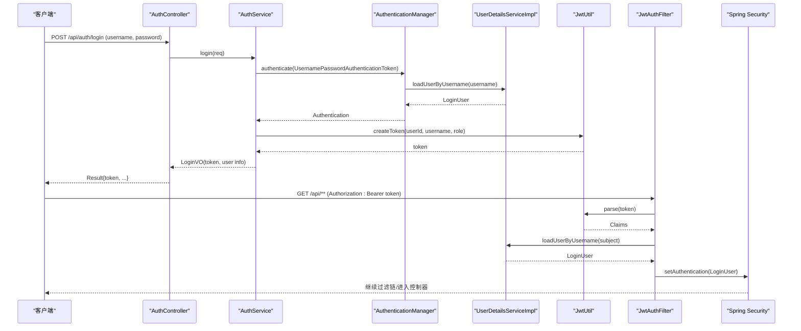
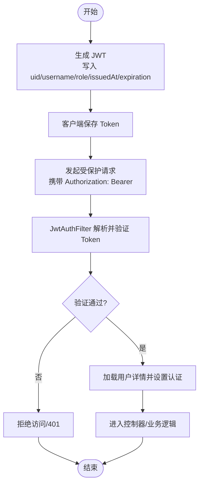
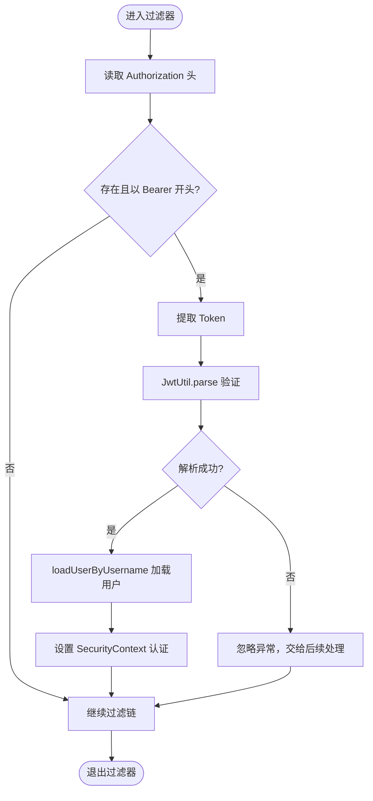
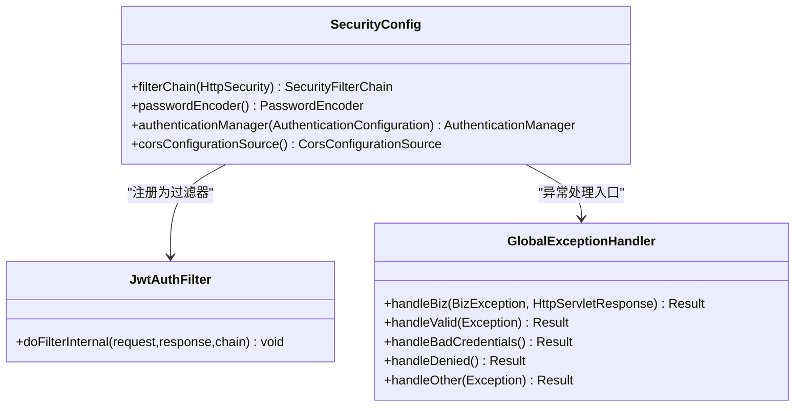
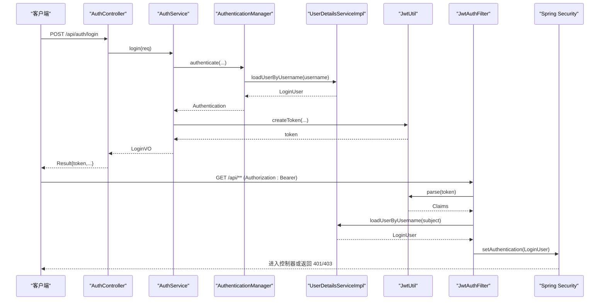
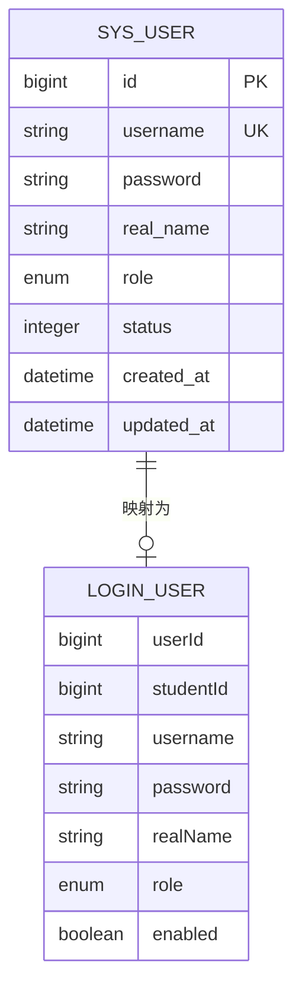
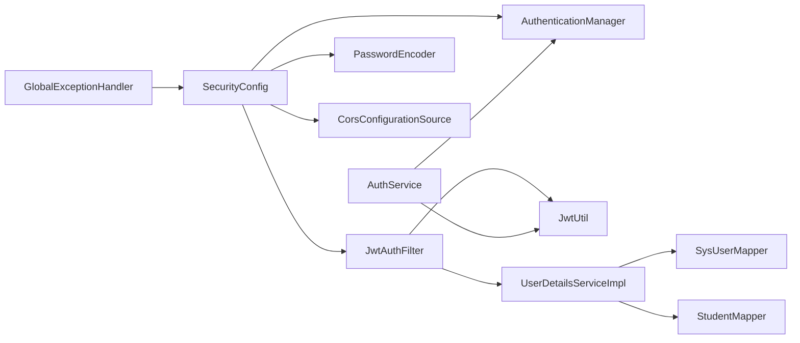

# 认证授权机制

<cite>
**本文引用的文件**
- [SecurityConfig.java](file://exam-server/src/main/java/com/exam/config/SecurityConfig.java)
- [JwtAuthFilter.java](file://exam-server/src/main/java/com/exam/security/JwtAuthFilter.java)
- [JwtUtil.java](file://exam-server/src/main/java/com/exam/security/JwtUtil.java)
- [UserDetailsServiceImpl.java](file://exam-server/src/main/java/com/exam/security/UserDetailsServiceImpl.java)
- [LoginUser.java](file://exam-server/src/main/java/com/exam/security/LoginUser.java)
- [AuthService.java](file://exam-server/src/main/java/com/exam/service/AuthService.java)
- [AuthController.java](file://exam-server/src/main/java/com/exam/controller/AuthController.java)
- [GlobalExceptionHandler.java](file://exam-server/src/main/java/com/exam/common/GlobalExceptionHandler.java)
- [application.yml](file://exam-server/src/main/resources/application.yml)
- [SysUser.java](file://exam-server/src/main/java/com/exam/entity/SysUser.java)
</cite>

## 目录
1. [简介](#简介)
2. [项目结构](#项目结构)
3. [核心组件](#核心组件)
4. [架构总览](#架构总览)
5. [详细组件分析](#详细组件分析)
6. [依赖关系分析](#依赖关系分析)
7. [性能与扩展性](#性能与扩展性)
8. [故障排查指南](#故障排查指南)
9. [结论](#结论)
10. [附录：配置与接口说明](#附录：配置与接口说明)

## 简介
本章节概述考试系统的认证与授权机制。系统采用无状态 JWT（JSON Web Token）方案，结合 Spring Security 实现基于角色的访问控制。登录成功后返回 JWT；后续请求通过请求头携带 Bearer Token 进行身份校验与权限控制。安全过滤器链在每次请求中解析并验证令牌，将当前用户信息注入到安全上下文中，供控制器与服务层使用。

## 项目结构
认证相关代码主要分布在以下包：
- config：安全配置与安全过滤器链、CORS、密码编码器、认证管理器
- security：JWT 工具、自定义过滤器、用户详情加载、当前用户工具类
- controller：登录、获取当前用户、退出等认证相关接口
- service：认证业务逻辑（鉴权、签发令牌、查询用户资料）
- common：全局异常处理与统一响应封装
- entity：用户实体模型

图表来源
- [SecurityConfig.java:37-65](file://exam-server/src/main/java/com/exam/config/SecurityConfig.java#L37-L65)
- [JwtAuthFilter.java:29-50](file://exam-server/src/main/java/com/exam/security/JwtAuthFilter.java#L29-L50)
- [JwtUtil.java:27-42](file://exam-server/src/main/java/com/exam/security/JwtUtil.java#L27-L42)
- [UserDetailsServiceImpl.java:22-39](file://exam-server/src/main/java/com/exam/security/UserDetailsServiceImpl.java#L22-L39)
- [AuthService.java:22-48](file://exam-server/src/main/java/com/exam/service/AuthService.java#L22-L48)
- [AuthController.java:31-46](file://exam-server/src/main/java/com/exam/controller/AuthController.java#L31-L46)
- [GlobalExceptionHandler.java:20-58](file://exam-server/src/main/java/com/exam/common/GlobalExceptionHandler.java#L20-L58)
- [application.yml:31-33](file://exam-server/src/main/resources/application.yml#L31-L33)
- [SysUser.java:10-23](file://exam-server/src/main/java/com/exam/entity/SysUser.java#L10-L23)

章节来源
- [SecurityConfig.java:25-90](file://exam-server/src/main/java/com/exam/config/SecurityConfig.java#L25-L90)
- [application.yml:1-42](file://exam-server/src/main/resources/application.yml#L1-L42)

## 核心组件
- 安全配置 SecurityConfig：关闭 Session，启用 CORS，定义 URL 访问策略，注册 JWT 过滤器，配置异常处理器入口。
- JWT 工具 JwtUtil：根据配置生成和解析 JWT，载荷包含用户 ID、用户名、角色、签发时间与过期时间。
- 过滤器 JwtAuthFilter：从请求头 Authorization 提取 Bearer Token，解析后加载用户详情并设置到 SecurityContext。
- 用户详情 UserDetailsServiceImpl：按用户名加载用户，构造 LoginUser，学生角色时补充 studentId。
- 当前用户 LoginUser：实现 UserDetails，提供角色与账户状态等信息。
- 认证服务 AuthService：调用 AuthenticationManager 完成用户名密码校验，成功后签发 JWT 并组装返回对象。
- 认证控制器 AuthController：暴露登录、获取当前用户、退出等接口。
- 全局异常 GlobalExceptionHandler：统一处理认证与授权异常，返回标准错误格式。

章节来源
- [SecurityConfig.java:37-88](file://exam-server/src/main/java/com/exam/config/SecurityConfig.java#L37-L88)
- [JwtUtil.java:14-42](file://exam-server/src/main/java/com/exam/security/JwtUtil.java#L14-L42)
- [JwtAuthFilter.java:21-50](file://exam-server/src/main/java/com/exam/security/JwtAuthFilter.java#L21-L50)
- [UserDetailsServiceImpl.java:14-39](file://exam-server/src/main/java/com/exam/security/UserDetailsServiceImpl.java#L14-L39)
- [LoginUser.java:11-56](file://exam-server/src/main/java/com/exam/security/LoginUser.java#L11-L56)
- [AuthService.java:14-48](file://exam-server/src/main/java/com/exam/service/AuthService.java#L14-L48)
- [AuthController.java:23-63](file://exam-server/src/main/java/com/exam/controller/AuthController.java#L23-L63)
- [GlobalExceptionHandler.java:14-58](file://exam-server/src/main/java/com/exam/common/GlobalExceptionHandler.java#L14-L58)

## 架构总览
下图展示了从登录到受保护资源访问的完整流程，包括 JWT 的生成、传递、解析与权限校验。

图表来源
- [AuthController.java:31-46](file://exam-server/src/main/java/com/exam/controller/AuthController.java#L31-L46)
- [AuthService.java:22-48](file://exam-server/src/main/java/com/exam/service/AuthService.java#L22-L48)
- [UserDetailsServiceImpl.java:22-39](file://exam-server/src/main/java/com/exam/security/UserDetailsServiceImpl.java#L22-L39)
- [JwtUtil.java:27-42](file://exam-server/src/main/java/com/exam/security/JwtUtil.java#L27-L42)
- [JwtAuthFilter.java:29-50](file://exam-server/src/main/java/com/exam/security/JwtAuthFilter.java#L29-L50)

## 详细组件分析

### JWT 令牌生命周期管理
- 生成：登录成功后由 AuthService 调用 JwtUtil.createToken，写入 subject（用户名）、uid（用户 ID）、role（角色），设置签发时间与过期时间，并使用 HS256 签名。
- 传递：前端在后续请求的 Authorization 请求头中以 Bearer 方式携带令牌。
- 解析与验证：JwtAuthFilter 在每个请求中读取 Authorization，提取 Token 并通过 JwtUtil.parse 验证签名与有效期；若成功则加载用户详情并设置到 SecurityContext。
- 刷新：当前实现未提供独立的刷新接口。可通过重新登录或扩展刷新接口实现。
- 撤销：当前为无状态设计，未维护黑名单。如需支持撤销，可在数据库或缓存中维护已撤销令牌列表，并在 JwtAuthFilter 中增加黑名单校验。

图表来源
- [JwtUtil.java:27-42](file://exam-server/src/main/java/com/exam/security/JwtUtil.java#L27-L42)
- [JwtAuthFilter.java:29-50](file://exam-server/src/main/java/com/exam/security/JwtAuthFilter.java#L29-L50)
- [AuthService.java:22-48](file://exam-server/src/main/java/com/exam/service/AuthService.java#L22-L48)

章节来源
- [JwtUtil.java:14-42](file://exam-server/src/main/java/com/exam/security/JwtUtil.java#L14-L42)
- [JwtAuthFilter.java:21-50](file://exam-server/src/main/java/com/exam/security/JwtAuthFilter.java#L21-L50)
- [AuthService.java:22-48](file://exam-server/src/main/java/com/exam/service/AuthService.java#L22-L48)

### JwtAuthFilter 工作原理
- 读取请求头 Authorization，判断是否以 Bearer 开头。
- 提取 Token 后调用 JwtUtil.parse 解析并验证签名与有效期。
- 若解析成功且当前上下文无认证信息，则通过 UserDetailsServiceImpl 加载用户详情，构建 UsernamePasswordAuthenticationToken 并设置到 SecurityContextHolder。
- 若解析失败（如令牌无效或过期），忽略异常，交由后续安全处理返回 401。

图表来源
- [JwtAuthFilter.java:29-50](file://exam-server/src/main/java/com/exam/security/JwtAuthFilter.java#L29-L50)
- [UserDetailsServiceImpl.java:22-39](file://exam-server/src/main/java/com/exam/security/UserDetailsServiceImpl.java#L22-L39)

章节来源
- [JwtAuthFilter.java:21-50](file://exam-server/src/main/java/com/exam/security/JwtAuthFilter.java#L21-L50)

### SecurityConfig 安全配置策略
- 会话策略：STATELESS，禁用 Cookie Session，完全依赖 JWT。
- 跨域：允许所有来源与方法，允许携带凭证。
- URL 访问控制：
  - /api/auth/login 匿名访问
  - /h2-console/**、/swagger-ui/**、/v3/api-docs/** 匿名访问
  - OPTIONS 预检请求放行
  - /api/student/** 仅学生角色
  - /api/users/** 仅管理员角色
  - /api/auth/** 需认证
  - /api/** 教师或管理员
  - 其他请求均需认证
- 异常处理：未认证返回 401，无权限返回 403，统一 JSON 格式。
- 过滤器链：在 UsernamePasswordAuthenticationFilter 之前插入 JwtAuthFilter。

图表来源
- [SecurityConfig.java:37-88](file://exam-server/src/main/java/com/exam/config/SecurityConfig.java#L37-L88)
- [JwtAuthFilter.java:29-50](file://exam-server/src/main/java/com/exam/security/JwtAuthFilter.java#L29-L50)
- [GlobalExceptionHandler.java:20-58](file://exam-server/src/main/java/com/exam/common/GlobalExceptionHandler.java#L20-L58)

章节来源
- [SecurityConfig.java:25-90](file://exam-server/src/main/java/com/exam/config/SecurityConfig.java#L25-L90)

### 用户认证流程（登录到权限验证）
- 登录：
  - 客户端调用 /api/auth/login，提交用户名与密码。
  - 控制器委托 AuthService.login。
  - AuthService 使用 AuthenticationManager 进行认证，内部通过 UserDetailsService 加载用户。
  - 认证成功后，检查账号状态，签发 JWT 并返回登录结果。
- 权限验证：
  - 后续请求携带 Bearer Token。
  - JwtAuthFilter 解析并验证令牌，加载用户并设置认证。
  - SecurityConfig 中的 URL 规则决定是否需要特定角色。
  - 若未通过，返回 401 或 403。

图表来源
- [AuthController.java:31-46](file://exam-server/src/main/java/com/exam/controller/AuthController.java#L31-L46)
- [AuthService.java:22-48](file://exam-server/src/main/java/com/exam/service/AuthService.java#L22-L48)
- [UserDetailsServiceImpl.java:22-39](file://exam-server/src/main/java/com/exam/security/UserDetailsServiceImpl.java#L22-L39)
- [JwtUtil.java:27-42](file://exam-server/src/main/java/com/exam/security/JwtUtil.java#L27-L42)
- [JwtAuthFilter.java:29-50](file://exam-server/src/main/java/com/exam/security/JwtAuthFilter.java#L29-L50)
- [SecurityConfig.java:37-65](file://exam-server/src/main/java/com/exam/config/SecurityConfig.java#L37-L65)

章节来源
- [AuthController.java:23-63](file://exam-server/src/main/java/com/exam/controller/AuthController.java#L23-L63)
- [AuthService.java:14-48](file://exam-server/src/main/java/com/exam/service/AuthService.java#L14-L48)
- [UserDetailsServiceImpl.java:14-39](file://exam-server/src/main/java/com/exam/security/UserDetailsServiceImpl.java#L14-L39)
- [JwtUtil.java:14-42](file://exam-server/src/main/java/com/exam/security/JwtUtil.java#L14-L42)
- [JwtAuthFilter.java:21-50](file://exam-server/src/main/java/com/exam/security/JwtAuthFilter.java#L21-L50)
- [SecurityConfig.java:25-90](file://exam-server/src/main/java/com/exam/config/SecurityConfig.java#L25-L90)

### 数据模型与角色
- SysUser：存储用户名、密码（BCrypt）、真实姓名、角色（ADMIN/TEACHER/STUDENT）、状态等。
- LoginUser：实现 UserDetails，封装用户 ID、学生 ID、用户名、密码、真实姓名、角色、账户启用状态，并提供角色权限集合。
- 角色映射：SimpleGrantedAuthority("ROLE_" + role)，用于 Spring Security 的 hasRole 匹配。

图表来源
- [SysUser.java:10-23](file://exam-server/src/main/java/com/exam/entity/SysUser.java#L10-L23)
- [LoginUser.java:11-56](file://exam-server/src/main/java/com/exam/security/LoginUser.java#L11-L56)

章节来源
- [SysUser.java:10-23](file://exam-server/src/main/java/com/exam/entity/SysUser.java#L10-L23)
- [LoginUser.java:11-56](file://exam-server/src/main/java/com/exam/security/LoginUser.java#L11-L56)

## 依赖关系分析
- SecurityConfig 依赖 JwtAuthFilter、PasswordEncoder、AuthenticationManager、CorsConfigurationSource。
- JwtAuthFilter 依赖 JwtUtil、UserDetailsServiceImpl。
- AuthService 依赖 AuthenticationManager、JwtUtil、AvatarService。
- UserDetailsServiceImpl 依赖 SysUserMapper、StudentMapper。
- GlobalExceptionHandler 捕获 BizException、BadCredentialsException、AccessDeniedException 等，统一返回 Result。

图表来源
- [SecurityConfig.java:37-88](file://exam-server/src/main/java/com/exam/config/SecurityConfig.java#L37-L88)
- [JwtAuthFilter.java:21-50](file://exam-server/src/main/java/com/exam/security/JwtAuthFilter.java#L21-L50)
- [AuthService.java:14-48](file://exam-server/src/main/java/com/exam/service/AuthService.java#L14-L48)
- [UserDetailsServiceImpl.java:14-39](file://exam-server/src/main/java/com/exam/security/UserDetailsServiceImpl.java#L14-L39)
- [GlobalExceptionHandler.java:20-58](file://exam-server/src/main/java/com/exam/common/GlobalExceptionHandler.java#L20-L58)

章节来源
- [SecurityConfig.java:25-90](file://exam-server/src/main/java/com/exam/config/SecurityConfig.java#L25-L90)
- [JwtAuthFilter.java:21-50](file://exam-server/src/main/java/com/exam/security/JwtAuthFilter.java#L21-L50)
- [AuthService.java:14-48](file://exam-server/src/main/java/com/exam/service/AuthService.java#L14-L48)
- [UserDetailsServiceImpl.java:14-39](file://exam-server/src/main/java/com/exam/security/UserDetailsServiceImpl.java#L14-L39)
- [GlobalExceptionHandler.java:14-58](file://exam-server/src/main/java/com/exam/common/GlobalExceptionHandler.java#L14-L58)

## 性能与扩展性
- 无状态设计：不依赖服务器端 Session，便于水平扩展。
- JWT 解析开销：每次请求都会解析与验证签名，建议合理设置过期时间以减少频繁刷新。
- 可扩展点：
  - 刷新令牌：新增刷新接口，支持短时效访问令牌与长时效刷新令牌。
  - 令牌撤销：引入黑名单或白名单机制，在过滤器中校验。
  - 多租户/设备限制：在 Claims 中增加额外字段，或在服务层校验。
  - 审计日志：记录登录与关键操作，便于追踪。

[本节为通用指导，无需具体文件引用]

## 故障排查指南
- 401 未登录或登录已过期：
  - 检查请求头 Authorization 是否正确携带 Bearer Token。
  - 检查 Token 是否过期或被篡改。
  - 确认 SecurityConfig 中对应 URL 是否需要认证。
- 403 没有权限：
  - 检查用户角色是否与 URL 要求匹配（例如 /api/student/** 需要 STUDENT）。
  - 检查 LoginUser 的 getAuthorities 是否正确返回 ROLE_前缀。
- 参数校验失败：
  - 检查 LoginRequest 的必填字段是否传入。
  - 查看全局异常处理器返回的错误消息。
- 账号停用：
  - 登录流程会检查账号状态，停用账号将抛出业务异常。

章节来源
- [GlobalExceptionHandler.java:20-58](file://exam-server/src/main/java/com/exam/common/GlobalExceptionHandler.java#L20-L58)
- [AuthService.java:22-37](file://exam-server/src/main/java/com/exam/service/AuthService.java#L22-L37)
- [SecurityConfig.java:52-65](file://exam-server/src/main/java/com/exam/config/SecurityConfig.java#L52-L65)

## 结论
该认证授权机制基于 Spring Security 与 JWT 实现了无状态的身份认证与基于角色的访问控制。通过统一的过滤器链与异常处理，保证了接口安全与一致的响应格式。当前实现简洁高效，适合横向扩展；可根据业务需求扩展刷新令牌、令牌撤销、审计日志等功能。

[本节为总结，无需具体文件引用]

## 附录：配置与接口说明

### 配置参数
- exam.jwt-secret：JWT 签名密钥，建议使用足够长度的随机字符串。
- exam.jwt-expire-hours：JWT 过期时长（小时）。
- spring.security 相关：通过 SecurityConfig 配置 URL 访问策略、CORS、异常处理。

章节来源
- [application.yml:31-33](file://exam-server/src/main/resources/application.yml#L31-L33)
- [SecurityConfig.java:37-88](file://exam-server/src/main/java/com/exam/config/SecurityConfig.java#L37-L88)

### 接口说明
- POST /api/auth/login
  - 请求体：用户名、密码
  - 返回：token、用户基本信息、角色、头像是否存在
- GET /api/auth/me
  - 需认证
  - 返回：当前用户信息
- POST /api/auth/logout
  - 无状态退出，主要由前端删除本地 Token

章节来源
- [AuthController.java:31-46](file://exam-server/src/main/java/com/exam/controller/AuthController.java#L31-L46)
- [AuthService.java:22-48](file://exam-server/src/main/java/com/exam/service/AuthService.java#L22-L48)