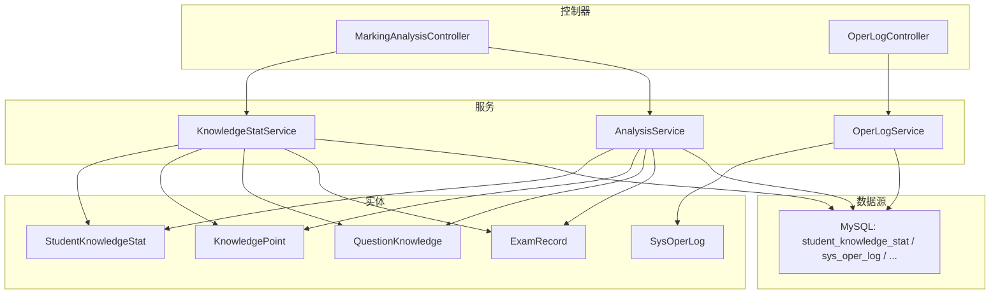
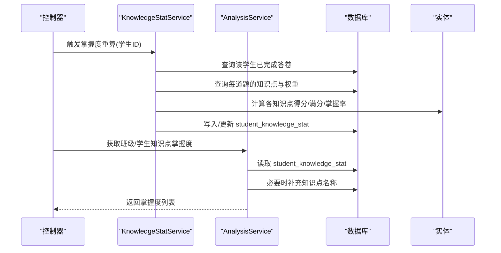
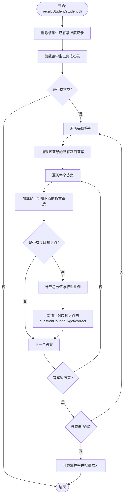
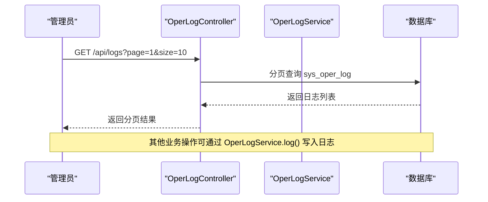
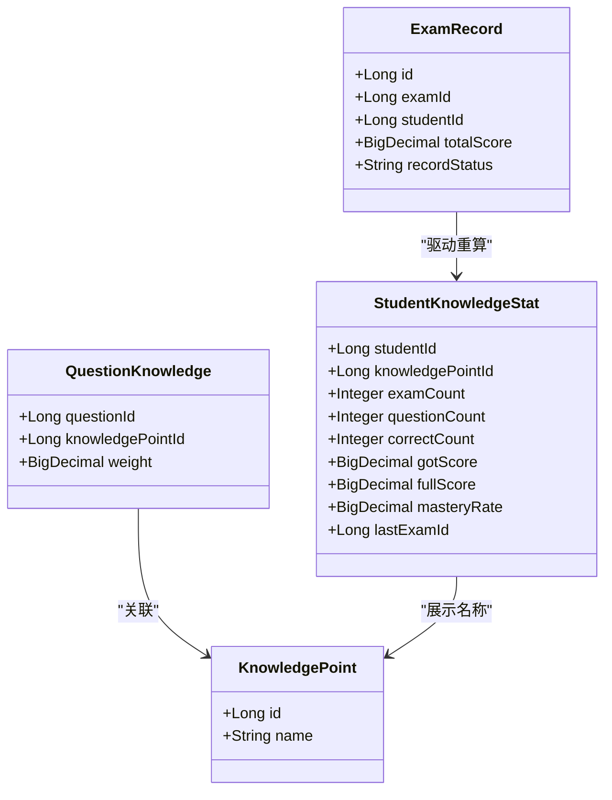
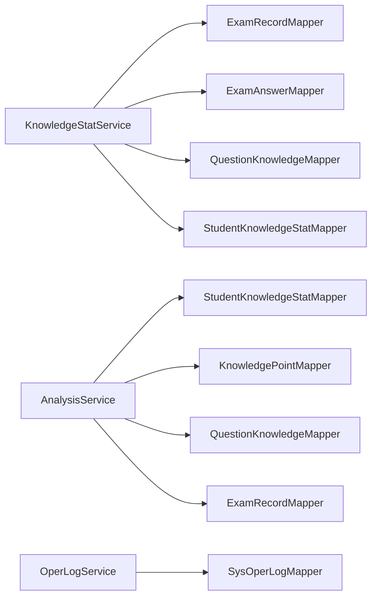

# 分析统计实体模型

<cite>
**本文引用的文件**
- [StudentKnowledgeStat.java](file://exam-server/src/main/java/com/exam/entity/StudentKnowledgeStat.java)
- [SysOperLog.java](file://exam-server/src/main/java/com/exam/entity/SysOperLog.java)
- [KnowledgePoint.java](file://exam-server/src/main/java/com/exam/entity/KnowledgePoint.java)
- [QuestionKnowledge.java](file://exam-server/src/main/java/com/exam/entity/QuestionKnowledge.java)
- [ExamRecord.java](file://exam-server/src/main/java/com/exam/entity/ExamRecord.java)
- [KnowledgeStatService.java](file://exam-server/src/main/java/com/exam/service/KnowledgeStatService.java)
- [AnalysisService.java](file://exam-server/src/main/java/com/exam/service/AnalysisService.java)
- [MarkingAnalysisController.java](file://exam-server/src/main/java/com/exam/controller/MarkingAnalysisController.java)
- [OperLogService.java](file://exam-server/src/main/java/com/exam/service/OperLogService.java)
- [OperLogController.java](file://exam-server/src/main/java/com/exam/controller/OperLogController.java)
- [schema-mysql.sql](file://sql/schema-mysql.sql)
</cite>

## 目录
1. [引言](#引言)
2. [项目结构](#项目结构)
3. [核心组件](#核心组件)
4. [架构总览](#架构总览)
5. [详细组件分析](#详细组件分析)
6. [依赖关系分析](#依赖关系分析)
7. [性能与查询优化](#性能与查询优化)
8. [故障排查指南](#故障排查指南)
9. [结论](#结论)
10. [附录：使用示例](#附录使用示例)

## 引言
本文件聚焦考试系统中的“统计分析”能力，围绕学生知识掌握度统计与系统操作日志两大主题展开。重点说明以下方面：
- 学生知识点掌握度统计实体的数据结构、计算逻辑与存储方式
- 操作日志实体的设计，用于审计与追踪
- 统计分析数据的聚合方式与查询优化策略
- 学情分析报表的数据模型支撑
- 统计分析功能的实体使用示例（接口调用路径与服务方法）

## 项目结构
统计分析相关代码主要分布在 entity、service、controller 三层，并通过 MyBatis-Plus Mapper 访问数据库表。关键文件包括：
- 实体层：StudentKnowledgeStat、SysOperLog、KnowledgePoint、QuestionKnowledge、ExamRecord
- 服务层：KnowledgeStatService（重算掌握度）、AnalysisService（学情分析聚合）、OperLogService（写日志）
- 控制层：MarkingAnalysisController（阅卷与统计接口）、OperLogController（日志分页查询）
- 数据层：MySQL 建表脚本 schema-mysql.sql

**图表来源**
- [MarkingAnalysisController.java:32-73](file://exam-server/src/main/java/com/exam/controller/MarkingAnalysisController.java#L32-L73)
- [OperLogController.java:16-26](file://exam-server/src/main/java/com/exam/controller/OperLogController.java#L16-L26)
- [KnowledgeStatService.java:25-100](file://exam-server/src/main/java/com/exam/service/KnowledgeStatService.java#L25-L100)
- [AnalysisService.java:33-212](file://exam-server/src/main/java/com/exam/service/AnalysisService.java#L33-L212)
- [OperLogService.java:15-29](file://exam-server/src/main/java/com/exam/service/OperLogService.java#L15-L29)

**章节来源**
- [schema-mysql.sql:176-199](file://sql/schema-mysql.sql#L176-L199)

## 核心组件
- 学生知识点掌握度统计实体 StudentKnowledgeStat：按“学生-知识点”维度汇总答题情况，记录题数、正确数、得分、满分、掌握率、最近一次考试ID及更新时间。
- 操作日志实体 SysOperLog：记录管理员或系统用户的关键操作，包含用户标识、操作名、详情与时间。
- 关联实体 KnowledgePoint、QuestionKnowledge：构建“题目-知识点”的多对多关系，并支持权重分摊。
- 成绩记录 ExamRecord：单场考试的答卷与成绩状态，作为统计的输入源之一。
- 服务层 KnowledgeStatService：基于已完成的答卷，按知识点权重重新计算并持久化掌握度。
- 服务层 AnalysisService：提供单场考试统计、班级/学生知识点掌握度聚合等能力。
- 服务层 OperLogService：统一写入操作日志。

**章节来源**
- [StudentKnowledgeStat.java:11-27](file://exam-server/src/main/java/com/exam/entity/StudentKnowledgeStat.java#L11-L27)
- [SysOperLog.java:10-21](file://exam-server/src/main/java/com/exam/entity/SysOperLog.java#L10-L21)
- [KnowledgePoint.java:10-24](file://exam-server/src/main/java/com/exam/entity/KnowledgePoint.java#L10-L24)
- [QuestionKnowledge.java:10-19](file://exam-server/src/main/java/com/exam/entity/QuestionKnowledge.java#L10-L19)
- [ExamRecord.java:11-28](file://exam-server/src/main/java/com/exam/entity/ExamRecord.java#L11-L28)
- [KnowledgeStatService.java:25-100](file://exam-server/src/main/java/com/exam/service/KnowledgeStatService.java#L25-L100)
- [AnalysisService.java:33-212](file://exam-server/src/main/java/com/exam/service/AnalysisService.java#L33-L212)
- [OperLogService.java:15-29](file://exam-server/src/main/java/com/exam/service/OperLogService.java#L15-L29)

## 架构总览
统计分析由“数据源（答卷、题目-知识点映射）→ 聚合计算 → 结果存储/返回”构成。掌握度重算在阅卷完成后触发；学情分析则直接读取已缓存的掌握度或实时聚合。

**图表来源**
- [KnowledgeStatService.java:34-100](file://exam-server/src/main/java/com/exam/service/KnowledgeStatService.java#L34-L100)
- [AnalysisService.java:99-145](file://exam-server/src/main/java/com/exam/service/AnalysisService.java#L99-L145)
- [schema-mysql.sql:176-199](file://sql/schema-mysql.sql#L176-L199)

## 详细组件分析

### 学生知识点掌握度统计实体 StudentKnowledgeStat
- 字段含义
  - id：主键
  - studentId：学生标识
  - knowledgePointId：知识点标识
  - examCount：参与统计的考试次数
  - questionCount：涉及该知识点的题目数量
  - correctCount：完全正确的题目数量
  - gotScore：该知识点累计实得分
  - fullScore：该知识点累计满分
  - masteryRate：掌握率 = 实得分 / 满分 × 100
  - lastExamId：最近一次涉及的考试ID
  - updatedAt：最后更新时间
- 计算与存储
  - 数据来源：ExamRecord（已完成答卷）、ExamAnswer（每题得分）、QuestionKnowledge（题目到知识点的权重）
  - 权重分摊：将一道题的得分按知识点权重比例分摊到各知识点
  - 掌握率：当满分大于0时，掌握率 = (实得分/满分)*100，否则为0
  - 存储：按“学生-知识点”唯一键插入或覆盖更新
- 复杂度
  - 单次重算的时间复杂度近似 O(R*A*W)，R为答卷数，A为平均每题答案数，W为每题关联知识点数
  - 空间复杂度主要为内存中的聚合Map，大小与知识点数线性相关

**图表来源**
- [KnowledgeStatService.java:34-100](file://exam-server/src/main/java/com/exam/service/KnowledgeStatService.java#L34-L100)

**章节来源**
- [StudentKnowledgeStat.java:11-27](file://exam-server/src/main/java/com/exam/entity/StudentKnowledgeStat.java#L11-L27)
- [KnowledgeStatService.java:34-100](file://exam-server/src/main/java/com/exam/service/KnowledgeStatService.java#L34-L100)
- [schema-mysql.sql:176-190](file://sql/schema-mysql.sql#L176-L190)

### 操作日志实体 SysOperLog
- 字段含义
  - id：主键
  - userId：操作用户ID
  - username：用户名
  - operation：操作名称
  - detail：操作详情
  - createdAt：创建时间
- 用途
  - 审计与追踪：记录发布考试、完成阅卷等关键操作
  - 管理端可分页查看
- 写入流程
  - 通过 OperLogService.log() 自动填充当前登录用户信息并落库
  - 管理端通过 OperLogController 分页查询

**图表来源**
- [OperLogController.java:19-26](file://exam-server/src/main/java/com/exam/controller/OperLogController.java#L19-L26)
- [OperLogService.java:18-29](file://exam-server/src/main/java/com/exam/service/OperLogService.java#L18-L29)
- [schema-mysql.sql:192-199](file://sql/schema-mysql.sql#L192-L199)

**章节来源**
- [SysOperLog.java:10-21](file://exam-server/src/main/java/com/exam/entity/SysOperLog.java#L10-L21)
- [OperLogService.java:15-29](file://exam-server/src/main/java/com/exam/service/OperLogService.java#L15-L29)
- [OperLogController.java:16-26](file://exam-server/src/main/java/com/exam/controller/OperLogController.java#L16-L26)
- [schema-mysql.sql:192-199](file://sql/schema-mysql.sql#L192-L199)

### 学情分析报表的数据模型支撑
- 单场考试统计
  - 统计项：应考人数、提交/完成/阅卷中/缺考人数、平均分、通过率
  - 数据来源：Exam、ExamStudent、ExamRecord
- 知识点掌握度
  - 学生维度：从 StudentKnowledgeStat 读取并按掌握率排序
  - 班级维度：聚合多个学生的掌握度，再计算班级层面的掌握率与等级
- 等级划分
  - 掌握率≥80%为“掌握”，60%-79%为“一般”，<60%为“薄弱”

**图表来源**
- [KnowledgePoint.java:10-24](file://exam-server/src/main/java/com/exam/entity/KnowledgePoint.java#L10-L24)
- [QuestionKnowledge.java:10-19](file://exam-server/src/main/java/com/exam/entity/QuestionKnowledge.java#L10-L19)
- [ExamRecord.java:11-28](file://exam-server/src/main/java/com/exam/entity/ExamRecord.java#L11-L28)
- [StudentKnowledgeStat.java:11-27](file://exam-server/src/main/java/com/exam/entity/StudentKnowledgeStat.java#L11-L27)
- [AnalysisService.java:99-145](file://exam-server/src/main/java/com/exam/service/AnalysisService.java#L99-L145)

**章节来源**
- [AnalysisService.java:46-97](file://exam-server/src/main/java/com/exam/service/AnalysisService.java#L46-L97)
- [AnalysisService.java:99-145](file://exam-server/src/main/java/com/exam/service/AnalysisService.java#L99-L145)
- [AnalysisService.java:214-239](file://exam-server/src/main/java/com/exam/service/AnalysisService.java#L214-L239)

## 依赖关系分析
- 低耦合高内聚
  - 掌握度重算逻辑集中在 KnowledgeStatService，避免散落在多处
  - 学情分析聚合逻辑集中在 AnalysisService，便于复用
  - 操作日志写入封装在 OperLogService，保证审计一致性
- 外部依赖
  - MyBatis-Plus Mapper：数据访问抽象
  - MySQL：持久化存储
- 可能的循环依赖
  - 当前实现未见循环引用，服务层仅依赖Mapper与实体

**图表来源**
- [KnowledgeStatService.java:25-32](file://exam-server/src/main/java/com/exam/service/KnowledgeStatService.java#L25-L32)
- [AnalysisService.java:33-44](file://exam-server/src/main/java/com/exam/service/AnalysisService.java#L33-L44)
- [OperLogService.java:15-16](file://exam-server/src/main/java/com/exam/service/OperLogService.java#L15-L16)

**章节来源**
- [KnowledgeStatService.java:25-32](file://exam-server/src/main/java/com/exam/service/KnowledgeStatService.java#L25-L32)
- [AnalysisService.java:33-44](file://exam-server/src/main/java/com/exam/service/AnalysisService.java#L33-L44)
- [OperLogService.java:15-16](file://exam-server/src/main/java/com/exam/service/OperLogService.java#L15-L16)

## 性能与查询优化
- 索引建议
  - student_knowledge_stat: 已定义 (student_id, knowledge_point_id) 唯一索引，以及 (knowledge_point_id, mastery_rate) 复合索引，利于按知识点聚合与按掌握率排序
  - exam_record: 已定义 (exam_id, total_score) 索引，利于按考试统计与分数排序
  - question_knowledge: 已定义 (question_id, knowledge_point_id) 唯一索引，以及 (knowledge_point_id) 索引，利于按题目查知识点与按知识点反查
- 计算优化
  - 掌握度重算采用内存聚合 Map，减少多次数据库往返
  - 权重分摊仅在题目关联多个知识点时生效，避免重复计算
- 查询优化
  - 班级掌握度聚合先拉取所有学生掌握度，再内存聚合，适合中小规模班级
  - 单场考试知识点统计仅处理 FINISHED 状态的答卷，减少无效计算

[本节为通用性能建议，不直接分析具体文件]

## 故障排查指南
- 掌握度未更新
  - 检查是否在阅卷完成后调用了 KnowledgeStatService.recalcStudent(studentId)
  - 确认答卷状态为 FINISHED，且题目存在 QuestionKnowledge 关联
  - 核对数据库 student_knowledge_stat 是否存在对应记录
- 掌握率异常
  - 若满分=0，掌握率强制为0，需检查题目分值与权重配置
  - 检查 QuestionKnowledge.weight 是否为空或为0，影响分摊比例
- 操作日志缺失
  - 确认业务入口是否调用了 OperLogService.log(operation, detail)
  - 检查当前登录上下文是否正确，userId/userName 是否能注入
- 查询性能问题
  - 关注大班级聚合时的内存占用
  - 检查是否命中索引，必要时调整查询条件与排序字段

**章节来源**
- [KnowledgeStatService.java:34-100](file://exam-server/src/main/java/com/exam/service/KnowledgeStatService.java#L34-L100)
- [OperLogService.java:18-29](file://exam-server/src/main/java/com/exam/service/OperLogService.java#L18-L29)
- [schema-mysql.sql:176-199](file://sql/schema-mysql.sql#L176-L199)

## 结论
- StudentKnowledgeStat 提供了稳定、可复用的“学生-知识点”掌握度视图，支撑个人与班级的学情分析
- SysOperLog 实现了统一的审计日志能力，便于追溯关键操作
- 通过合理的权重分摊与内存聚合，系统在准确性与性能之间取得平衡
- 建议在大规模场景下考虑异步重算与分片聚合，进一步提升吞吐

[本节为总结性内容，不直接分析具体文件]

## 附录：使用示例
- 触发掌握度重算
  - 在服务层调用 KnowledgeStatService.recalcStudent(studentId)
  - 典型触发点：简答题阅卷完成后
- 获取单场考试统计
  - 接口：GET /api/exams/{id}/statistics
  - 返回：考试名称、应考/提交/完成/阅卷中/缺考人数、平均分、通过率、学生明细、知识点掌握度
- 获取班级/学生知识点掌握度
  - 接口：GET /api/analysis/students/{studentId}/knowledge
  - 接口：GET /api/analysis/classes/{className}/knowledge
- 导出成绩
  - 接口：GET /api/scores/export?examId=...&className=...
  - 返回 Excel 文件，包含学号、姓名、班级、客观题/主观题/总分、是否及格

**章节来源**
- [MarkingAnalysisController.java:38-90](file://exam-server/src/main/java/com/exam/controller/MarkingAnalysisController.java#L38-L90)
- [AnalysisService.java:46-97](file://exam-server/src/main/java/com/exam/service/AnalysisService.java#L46-L97)
- [AnalysisService.java:99-145](file://exam-server/src/main/java/com/exam/service/AnalysisService.java#L99-L145)