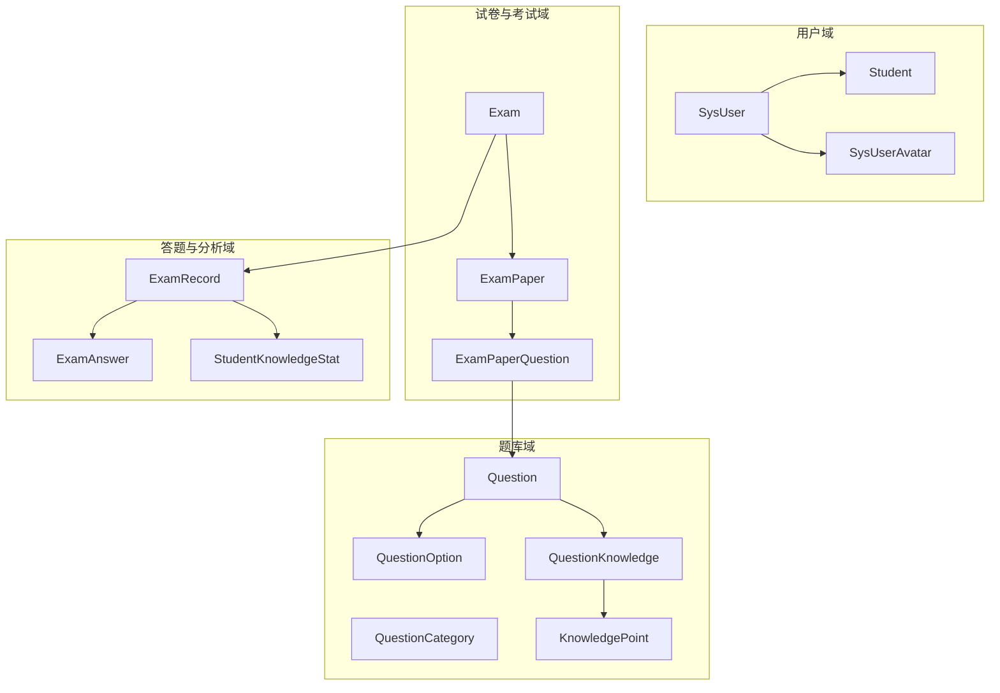
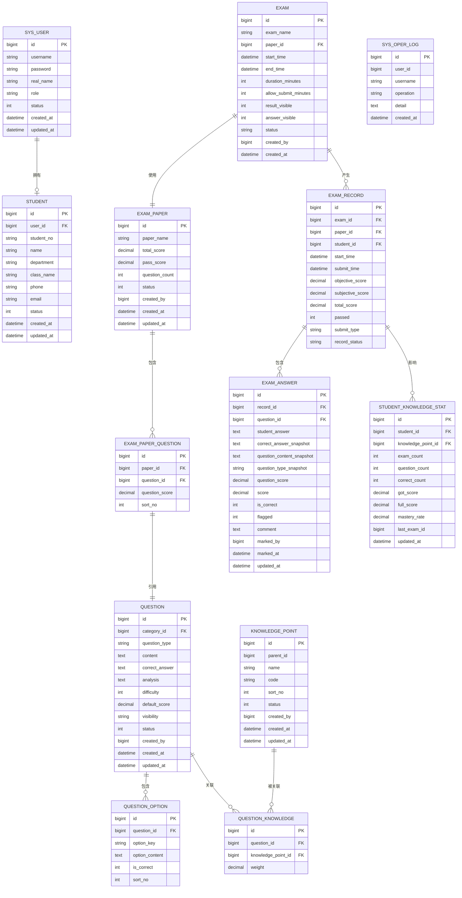
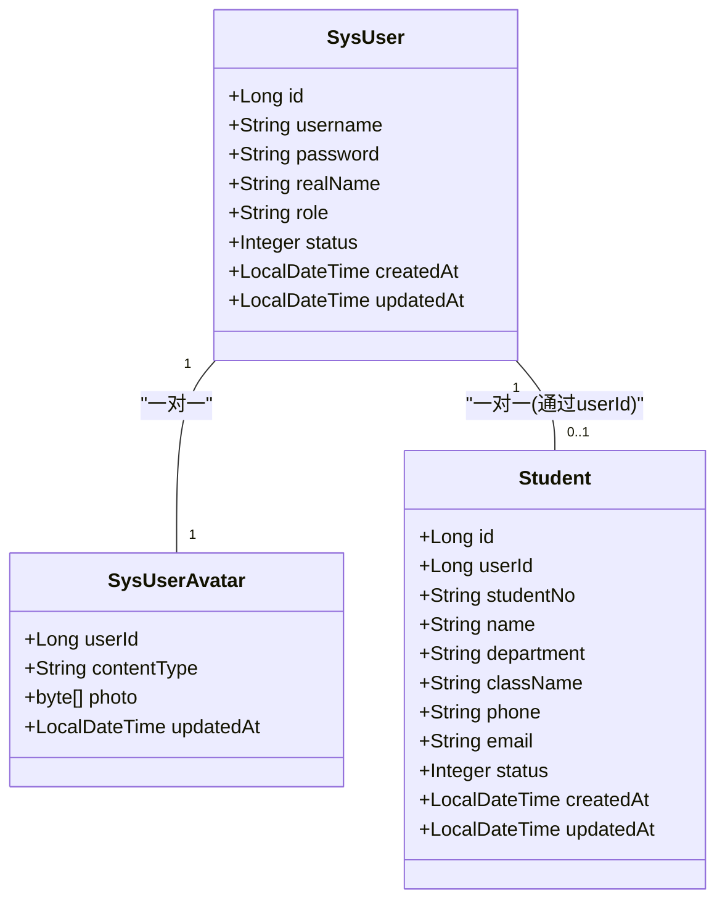
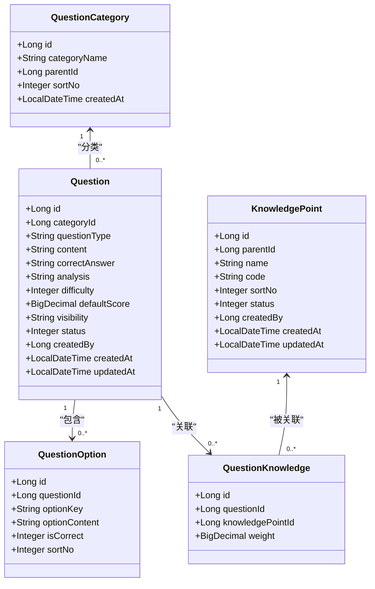
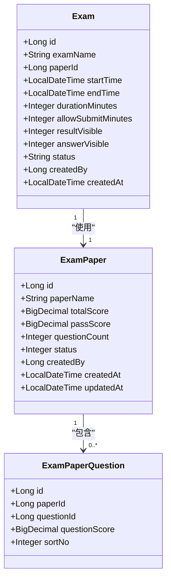
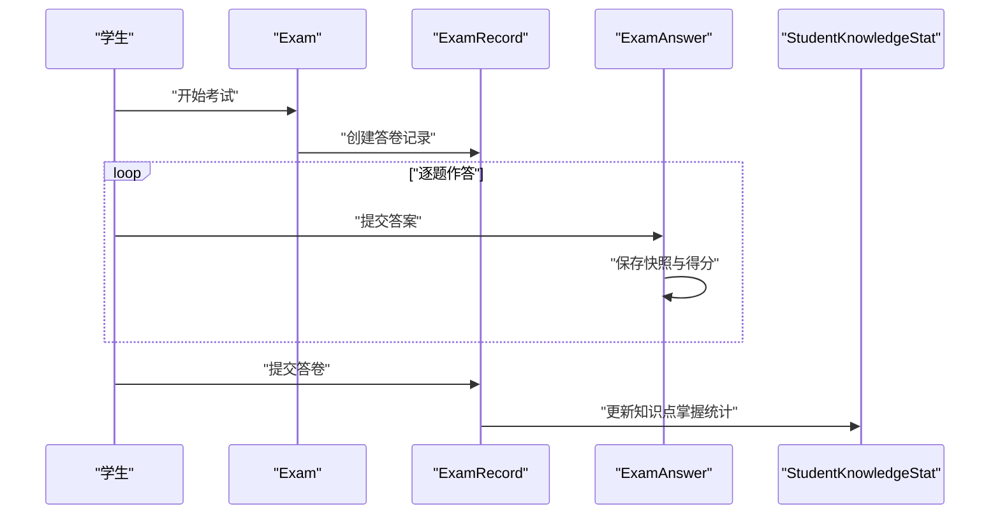
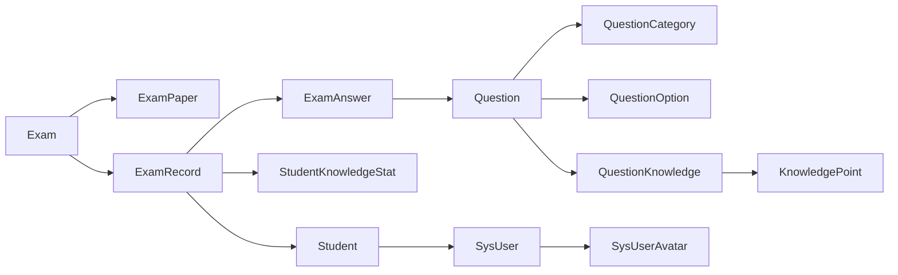

# 实体模型设计

<cite>
**本文引用的文件**
- [Exam.java](file://exam-server/src/main/java/com/exam/entity/Exam.java)
- [Question.java](file://exam-server/src/main/java/com/exam/entity/Question.java)
- [SysUser.java](file://exam-server/src/main/java/com/exam/entity/SysUser.java)
- [Student.java](file://exam-server/src/main/java/com/exam/entity/Student.java)
- [ExamPaper.java](file://exam-server/src/main/java/com/exam/entity/ExamPaper.java)
- [ExamAnswer.java](file://exam-server/src/main/java/com/exam/entity/ExamAnswer.java)
- [QuestionOption.java](file://exam-server/src/main/java/com/exam/entity/QuestionOption.java)
- [KnowledgePoint.java](file://exam-server/src/main/java/com/exam/entity/KnowledgePoint.java)
- [ExamRecord.java](file://exam-server/src/main/java/com/exam/entity/ExamRecord.java)
- [QuestionCategory.java](file://exam-server/src/main/java/com/exam/entity/QuestionCategory.java)
- [QuestionKnowledge.java](file://exam-server/src/main/java/com/exam/entity/QuestionKnowledge.java)
- [ExamPaperQuestion.java](file://exam-server/src/main/java/com/exam/entity/ExamPaperQuestion.java)
- [StudentKnowledgeStat.java](file://exam-server/src/main/java/com/exam/entity/StudentKnowledgeStat.java)
- [SysOperLog.java](file://exam-server/src/main/java/com/exam/entity/SysOperLog.java)
- [SysUserAvatar.java](file://exam-server/src/main/java/com/exam/entity/SysUserAvatar.java)
</cite>

## 目录
1. [简介](#简介)
2. [项目结构](#项目结构)
3. [核心组件](#核心组件)
4. [架构总览](#架构总览)
5. [详细组件分析](#详细组件分析)
6. [依赖关系分析](#依赖关系分析)
7. [性能考虑](#性能考虑)
8. [故障排查指南](#故障排查指南)
9. [结论](#结论)
10. [附录](#附录)

## 简介
本设计文档聚焦于考试系统的Java实体模型与数据库表的映射关系，系统采用MyBatis Plus进行ORM映射。文档重点说明：
- 表与实体的字段映射策略及注解使用（如 @TableName、@TableId、@TableField）
- 实体间的继承与关联关系设计
- 实体类的验证规则与业务约束
- 核心实体字段说明与使用示例
- 实体间依赖关系与数据流向

## 项目结构
实体类集中于 exam-server 模块的 entity 包中，每个实体对应一张数据库表，并通过 MyBatis Plus 注解完成映射。整体结构以“领域对象”为中心，围绕“用户-题目-试卷-考试-答卷-知识点”等核心概念组织。

图表来源
- [SysUser.java:1-24](file://exam-server/src/main/java/com/exam/entity/SysUser.java#L1-L24)
- [SysUserAvatar.java:1-20](file://exam-server/src/main/java/com/exam/entity/SysUserAvatar.java#L1-L20)
- [Student.java:1-27](file://exam-server/src/main/java/com/exam/entity/Student.java#L1-L27)
- [Question.java:1-30](file://exam-server/src/main/java/com/exam/entity/Question.java#L1-L30)
- [QuestionCategory.java:1-21](file://exam-server/src/main/java/com/exam/entity/QuestionCategory.java#L1-L21)
- [QuestionOption.java:1-20](file://exam-server/src/main/java/com/exam/entity/QuestionOption.java#L1-L20)
- [KnowledgePoint.java:1-25](file://exam-server/src/main/java/com/exam/entity/KnowledgePoint.java#L1-L25)
- [QuestionKnowledge.java:1-20](file://exam-server/src/main/java/com/exam/entity/QuestionKnowledge.java#L1-L20)
- [ExamPaper.java:1-26](file://exam-server/src/main/java/com/exam/entity/ExamPaper.java#L1-L26)
- [ExamPaperQuestion.java:1-21](file://exam-server/src/main/java/com/exam/entity/ExamPaperQuestion.java#L1-L21)
- [Exam.java:1-28](file://exam-server/src/main/java/com/exam/entity/Exam.java#L1-L28)
- [ExamRecord.java:1-29](file://exam-server/src/main/java/com/exam/entity/ExamRecord.java#L1-L29)
- [ExamAnswer.java:1-32](file://exam-server/src/main/java/com/exam/entity/ExamAnswer.java#L1-L32)
- [StudentKnowledgeStat.java:1-28](file://exam-server/src/main/java/com/exam/entity/StudentKnowledgeStat.java#L1-L28)

章节来源
- [Exam.java:1-28](file://exam-server/src/main/java/com/exam/entity/Exam.java#L1-L28)
- [Question.java:1-30](file://exam-server/src/main/java/com/exam/entity/Question.java#L1-L30)
- [SysUser.java:1-24](file://exam-server/src/main/java/com/exam/entity/SysUser.java#L1-L28)
- [Student.java:1-27](file://exam-server/src/main/java/com/exam/entity/Student.java#L1-L27)
- [ExamPaper.java:1-26](file://exam-server/src/main/java/com/exam/entity/ExamPaper.java#L1-L26)
- [ExamAnswer.java:1-32](file://exam-server/src/main/java/com/exam/entity/ExamAnswer.java#L1-L32)
- [QuestionOption.java:1-20](file://exam-server/src/main/java/com/exam/entity/QuestionOption.java#L1-L20)
- [KnowledgePoint.java:1-25](file://exam-server/src/main/java/com/exam/entity/KnowledgePoint.java#L1-L25)
- [ExamRecord.java:1-29](file://exam-server/src/main/java/com/exam/entity/ExamRecord.java#L1-L29)
- [QuestionCategory.java:1-21](file://exam-server/src/main/java/com/exam/entity/QuestionCategory.java#L1-L21)
- [QuestionKnowledge.java:1-20](file://exam-server/src/main/java/com/exam/entity/QuestionKnowledge.java#L1-L20)
- [ExamPaperQuestion.java:1-21](file://exam-server/src/main/java/com/exam/entity/ExamPaperQuestion.java#L1-L21)
- [StudentKnowledgeStat.java:1-28](file://exam-server/src/main/java/com/exam/entity/StudentKnowledgeStat.java#L1-L28)
- [SysOperLog.java:1-22](file://exam-server/src/main/java/com/exam/entity/SysOperLog.java#L1-L22)
- [SysUserAvatar.java:1-20](file://exam-server/src/main/java/com/exam/entity/SysUserAvatar.java#L1-L20)

## 核心组件
- 用户与权限
  - SysUser：登录账号，角色包含管理员、教师、学生；密码为加密存储。
  - SysUserAvatar：用户头像二进制存储，与用户一对一。
  - Student：考生档案，通过 userId 与 SysUser 关联。
- 题库与知识点
  - Question：题目主表，含题型、内容、正确答案、难度、默认分值、可见性等。
  - QuestionCategory：题目分类树。
  - QuestionOption：选择题选项，标记正确项与排序。
  - KnowledgePoint：知识点树，parentId=0 表示根节点。
  - QuestionKnowledge：题目与知识点的多对多关系，支持权重分摊。
- 试卷与考试
  - ExamPaper：试卷定义，包含总分、及格分、题数等。
  - ExamPaperQuestion：试卷内题目明细及分值、顺序。
  - Exam：一场真实考试，绑定试卷、时间窗口、是否公布成绩/答案等。
- 答题与分析
  - ExamRecord：一份答卷/成绩，记录状态机（作答中/已提交/阅卷中/已完成）。
  - ExamAnswer：每题作答明细，快照题干与正确答案，记录得分、是否正确、批注等。
  - StudentKnowledgeStat：学生知识点掌握汇总，由阅卷完成后回写。
- 审计日志
  - SysOperLog：操作日志，记录操作人、动作与详情。

章节来源
- [SysUser.java:1-24](file://exam-server/src/main/java/com/exam/entity/SysUser.java#L1-L24)
- [SysUserAvatar.java:1-20](file://exam-server/src/main/java/com/exam/entity/SysUserAvatar.java#L1-L20)
- [Student.java:1-27](file://exam-server/src/main/java/com/exam/entity/Student.java#L1-L27)
- [Question.java:1-30](file://exam-server/src/main/java/com/exam/entity/Question.java#L1-L30)
- [QuestionCategory.java:1-21](file://exam-server/src/main/java/com/exam/entity/QuestionCategory.java#L1-L21)
- [QuestionOption.java:1-20](file://exam-server/src/main/java/com/exam/entity/QuestionOption.java#L1-L20)
- [KnowledgePoint.java:1-25](file://exam-server/src/main/java/com/exam/entity/KnowledgePoint.java#L1-L25)
- [QuestionKnowledge.java:1-20](file://exam-server/src/main/java/com/exam/entity/QuestionKnowledge.java#L1-L20)
- [ExamPaper.java:1-26](file://exam-server/src/main/java/com/exam/entity/ExamPaper.java#L1-L26)
- [ExamPaperQuestion.java:1-21](file://exam-server/src/main/java/com/exam/entity/ExamPaperQuestion.java#L1-L21)
- [Exam.java:1-28](file://exam-server/src/main/java/com/exam/entity/Exam.java#L1-L28)
- [ExamRecord.java:1-29](file://exam-server/src/main/java/com/exam/entity/ExamRecord.java#L1-L29)
- [ExamAnswer.java:1-32](file://exam-server/src/main/java/com/exam/entity/ExamAnswer.java#L1-L32)
- [StudentKnowledgeStat.java:1-28](file://exam-server/src/main/java/com/exam/entity/StudentKnowledgeStat.java#L1-L28)
- [SysOperLog.java:1-22](file://exam-server/src/main/java/com/exam/entity/SysOperLog.java#L1-L22)

## 架构总览
下图展示实体间的主要关联关系，体现“用户-题目-试卷-考试-答卷-知识点”的数据流与依赖方向。

图表来源
- [SysUser.java:1-24](file://exam-server/src/main/java/com/exam/entity/SysUser.java#L1-L24)
- [Student.java:1-27](file://exam-server/src/main/java/com/exam/entity/Student.java#L1-L27)
- [Question.java:1-30](file://exam-server/src/main/java/com/exam/entity/Question.java#L1-L30)
- [QuestionOption.java:1-20](file://exam-server/src/main/java/com/exam/entity/QuestionOption.java#L1-L20)
- [KnowledgePoint.java:1-25](file://exam-server/src/main/java/com/exam/entity/KnowledgePoint.java#L1-L25)
- [QuestionKnowledge.java:1-20](file://exam-server/src/main/java/com/exam/entity/QuestionKnowledge.java#L1-L20)
- [ExamPaper.java:1-26](file://exam-server/src/main/java/com/exam/entity/ExamPaper.java#L1-L26)
- [ExamPaperQuestion.java:1-21](file://exam-server/src/main/java/com/exam/entity/ExamPaperQuestion.java#L1-L21)
- [Exam.java:1-28](file://exam-server/src/main/java/com/exam/entity/Exam.java#L1-L28)
- [ExamRecord.java:1-29](file://exam-server/src/main/java/com/exam/entity/ExamRecord.java#L1-L29)
- [ExamAnswer.java:1-32](file://exam-server/src/main/java/com/exam/entity/ExamAnswer.java#L1-L32)
- [StudentKnowledgeStat.java:1-28](file://exam-server/src/main/java/com/exam/entity/StudentKnowledgeStat.java#L1-L28)
- [SysOperLog.java:1-22](file://exam-server/src/main/java/com/exam/entity/SysOperLog.java#L1-L22)

## 详细组件分析

### 用户与权限实体
- SysUser
  - 主键自增，角色用于权限控制，密码加密存储。
  - 建议校验：用户名唯一、密码强度、状态枚举。
- SysUserAvatar
  - 主键为 userId，与用户一对一；头像以二进制存储。
  - 建议校验：文件大小限制、MIME类型校验。
- Student
  - 通过 userId 与 SysUser 关联，维护学号、班级等信息。
  - 建议校验：学号唯一、手机号格式、邮箱格式。

图表来源
- [SysUser.java:1-24](file://exam-server/src/main/java/com/exam/entity/SysUser.java#L1-L24)
- [SysUserAvatar.java:1-20](file://exam-server/src/main/java/com/exam/entity/SysUserAvatar.java#L1-L20)
- [Student.java:1-27](file://exam-server/src/main/java/com/exam/entity/Student.java#L1-L27)

章节来源
- [SysUser.java:1-24](file://exam-server/src/main/java/com/exam/entity/SysUser.java#L1-L24)
- [SysUserAvatar.java:1-20](file://exam-server/src/main/java/com/exam/entity/SysUserAvatar.java#L1-L20)
- [Student.java:1-27](file://exam-server/src/main/java/com/exam/entity/Student.java#L1-L27)

### 题库与知识点实体
- Question
  - 题型、内容、正确答案、解析、难度、默认分值、可见性、逻辑删除位。
  - 建议校验：题型枚举、必填字段非空、分数非负。
- QuestionCategory
  - 分类树，支持父子层级与排序。
- QuestionOption
  - 选项键值、内容、是否正确标记、排序。
  - 建议校验：选项键唯一于题目下、至少一个正确项。
- KnowledgePoint
  - 知识点树，parentId=0 为根。
- QuestionKnowledge
  - 题目与知识点多对多，weight 用于统计分摊。

图表来源
- [Question.java:1-30](file://exam-server/src/main/java/com/exam/entity/Question.java#L1-L30)
- [QuestionCategory.java:1-21](file://exam-server/src/main/java/com/exam/entity/QuestionCategory.java#L1-L21)
- [QuestionOption.java:1-20](file://exam-server/src/main/java/com/exam/entity/QuestionOption.java#L1-L20)
- [KnowledgePoint.java:1-25](file://exam-server/src/main/java/com/exam/entity/KnowledgePoint.java#L1-L25)
- [QuestionKnowledge.java:1-20](file://exam-server/src/main/java/com/exam/entity/QuestionKnowledge.java#L1-L20)

章节来源
- [Question.java:1-30](file://exam-server/src/main/java/com/exam/entity/Question.java#L1-L30)
- [QuestionCategory.java:1-21](file://exam-server/src/main/java/com/exam/entity/QuestionCategory.java#L1-L21)
- [QuestionOption.java:1-20](file://exam-server/src/main/java/com/exam/entity/QuestionOption.java#L1-L20)
- [KnowledgePoint.java:1-25](file://exam-server/src/main/java/com/exam/entity/KnowledgePoint.java#L1-L25)
- [QuestionKnowledge.java:1-20](file://exam-server/src/main/java/com/exam/entity/QuestionKnowledge.java#L1-L20)

### 试卷与考试实体
- ExamPaper
  - 试卷元信息：名称、总分、及格分、题数、状态。
- ExamPaperQuestion
  - 试卷内题目明细：题目ID、分值、排序。
- Exam
  - 一场考试：绑定试卷、起止时间、时长、允许补交分钟、是否公布成绩/答案、状态。

图表来源
- [ExamPaper.java:1-26](file://exam-server/src/main/java/com/exam/entity/ExamPaper.java#L1-L26)
- [ExamPaperQuestion.java:1-21](file://exam-server/src/main/java/com/exam/entity/ExamPaperQuestion.java#L1-L21)
- [Exam.java:1-28](file://exam-server/src/main/java/com/exam/entity/Exam.java#L1-L28)

章节来源
- [ExamPaper.java:1-26](file://exam-server/src/main/java/com/exam/entity/ExamPaper.java#L1-L26)
- [ExamPaperQuestion.java:1-21](file://exam-server/src/main/java/com/exam/entity/ExamPaperQuestion.java#L1-L21)
- [Exam.java:1-28](file://exam-server/src/main/java/com/exam/entity/Exam.java#L1-L28)

### 答题与分析实体
- ExamRecord
  - 答卷/成绩：关联考试、试卷、学生；客观/主观/总分；是否通过；提交方式；状态机。
- ExamAnswer
  - 每题作答明细：快照题干与正确答案、题型快照、得分、是否正确、标记、批注、阅卷人与时间。
- StudentKnowledgeStat
  - 学生知识点掌握汇总：考试次数、题数、正确数、得分、满分、掌握率、最近考试ID、更新时间。

图表来源
- [Exam.java:1-28](file://exam-server/src/main/java/com/exam/entity/Exam.java#L1-L28)
- [ExamRecord.java:1-29](file://exam-server/src/main/java/com/exam/entity/ExamRecord.java#L1-L29)
- [ExamAnswer.java:1-32](file://exam-server/src/main/java/com/exam/entity/ExamAnswer.java#L1-L32)
- [StudentKnowledgeStat.java:1-28](file://exam-server/src/main/java/com/exam/entity/StudentKnowledgeStat.java#L1-L28)

章节来源
- [ExamRecord.java:1-29](file://exam-server/src/main/java/com/exam/entity/ExamRecord.java#L1-L29)
- [ExamAnswer.java:1-32](file://exam-server/src/main/java/com/exam/entity/ExamAnswer.java#L1-L32)
- [StudentKnowledgeStat.java:1-28](file://exam-server/src/main/java/com/exam/entity/StudentKnowledgeStat.java#L1-L28)

### 审计日志实体
- SysOperLog
  - 记录操作人、操作名、详情、时间，便于审计与问题追溯。

章节来源
- [SysOperLog.java:1-22](file://exam-server/src/main/java/com/exam/entity/SysOperLog.java#L1-L22)

## 依赖关系分析
- 直接依赖
  - Exam 依赖 ExamPaper（paperId），并生成 ExamRecord。
  - ExamRecord 依赖 Exam、ExamPaper、Student，并产出 ExamAnswer。
  - ExamAnswer 依赖 ExamRecord、Question（通过questionId）。
  - Question 依赖 QuestionCategory、QuestionOption、QuestionKnowledge。
  - QuestionKnowledge 依赖 KnowledgePoint。
  - Student 依赖 SysUser（通过userId）。
  - SysUserAvatar 依赖 SysUser（一对一）。
- 间接依赖
  - StudentKnowledgeStat 通过 ExamRecord 与 ExamAnswer 聚合计算知识点掌握率。
- 循环依赖
  - 实体层无循环引用，均为单向外键关系。

图表来源
- [Exam.java:1-28](file://exam-server/src/main/java/com/exam/entity/Exam.java#L1-L28)
- [ExamPaper.java:1-26](file://exam-server/src/main/java/com/exam/entity/ExamPaper.java#L1-L26)
- [ExamRecord.java:1-29](file://exam-server/src/main/java/com/exam/entity/ExamRecord.java#L1-L29)
- [ExamAnswer.java:1-32](file://exam-server/src/main/java/com/exam/entity/ExamAnswer.java#L1-L32)
- [Question.java:1-30](file://exam-server/src/main/java/com/exam/entity/Question.java#L1-L30)
- [QuestionCategory.java:1-21](file://exam-server/src/main/java/com/exam/entity/QuestionCategory.java#L1-L21)
- [QuestionOption.java:1-20](file://exam-server/src/main/java/com/exam/entity/QuestionOption.java#L1-L20)
- [QuestionKnowledge.java:1-20](file://exam-server/src/main/java/com/exam/entity/QuestionKnowledge.java#L1-L20)
- [KnowledgePoint.java:1-25](file://exam-server/src/main/java/com/exam/entity/KnowledgePoint.java#L1-L25)
- [Student.java:1-27](file://exam-server/src/main/java/com/exam/entity/Student.java#L1-L27)
- [SysUser.java:1-24](file://exam-server/src/main/java/com/exam/entity/SysUser.java#L1-L24)
- [SysUserAvatar.java:1-20](file://exam-server/src/main/java/com/exam/entity/SysUserAvatar.java#L1-L20)
- [StudentKnowledgeStat.java:1-28](file://exam-server/src/main/java/com/exam/entity/StudentKnowledgeStat.java#L1-L28)

章节来源
- [Exam.java:1-28](file://exam-server/src/main/java/com/exam/entity/Exam.java#L1-L28)
- [ExamRecord.java:1-29](file://exam-server/src/main/java/com/exam/entity/ExamRecord.java#L1-L29)
- [ExamAnswer.java:1-32](file://exam-server/src/main/java/com/exam/entity/ExamAnswer.java#L1-L32)
- [Question.java:1-30](file://exam-server/src/main/java/com/exam/entity/Question.java#L1-L30)
- [Student.java:1-27](file://exam-server/src/main/java/com/exam/entity/Student.java#L1-L27)
- [SysUser.java:1-24](file://exam-server/src/main/java/com/exam/entity/SysUser.java#L1-L24)
- [SysUserAvatar.java:1-20](file://exam-server/src/main/java/com/exam/entity/SysUserAvatar.java#L1-L20)
- [StudentKnowledgeStat.java:1-28](file://exam-server/src/main/java/com/exam/entity/StudentKnowledgeStat.java#L1-L28)

## 性能考虑
- 快照机制
  - ExamAnswer 对题干、正确答案、题型进行快照，避免题库变更影响历史答卷，提升一致性。
- 统计回写
  - StudentKnowledgeStat 在阅卷完成后批量回写，减少实时计算开销。
- 索引建议
  - 高频查询字段建议加索引：exam.paper_id、exam_record.exam_id、exam_answer.record_id、question.category_id、knowledge_point.parent_id。
- 事务边界
  - 提交答卷与生成答案明细应在同一事务中，保证数据一致性。
- 分页与懒加载
  - 列表查询使用分页；大对象（如头像）按需加载。

[本节为通用性能指导，不直接分析具体文件]

## 故障排查指南
- 常见错误定位
  - 主键冲突：检查 @TableId 配置与数据库自增策略是否一致。
  - 字段映射异常：核对 @TableName 与 @TableField 是否与数据库列名一致。
  - 逻辑删除未生效：确认 status 字段与框架配置是否匹配。
  - 快照不一致：核查 ExamAnswer 写入时机与题库更新流程。
- 日志与审计
  - 通过 SysOperLog 追踪关键操作路径，结合业务日志定位问题。
- 数据一致性
  - 答卷提交与答案写入需原子性；失败时回滚并记录错误日志。

章节来源
- [SysOperLog.java:1-22](file://exam-server/src/main/java/com/exam/entity/SysOperLog.java#L1-L22)
- [ExamAnswer.java:1-32](file://exam-server/src/main/java/com/exam/entity/ExamAnswer.java#L1-L32)
- [ExamRecord.java:1-29](file://exam-server/src/main/java/com/exam/entity/ExamRecord.java#L1-L29)

## 结论
本实体模型以清晰的分层与明确的关联关系支撑了考试系统的核心业务流程：从题库管理、组卷、考试到答卷与统计分析。通过 MyBatis Plus 注解实现简洁的表映射，利用快照与统计回写保障数据一致性与性能。建议在后续迭代中完善字段级校验、索引设计与事务边界，进一步提升系统的健壮性与可维护性。

## 附录

### MyBatis Plus 注解使用要点
- @TableName：指定实体对应的表名。
- @TableId(type = IdType.AUTO)：主键自增策略。
- @TableId(type = IdType.INPUT)：主键由输入决定（如头像表的主键为用户ID）。
- @TableField：当字段名与列名不一致时使用（当前实体未显式使用，可通过驼峰自动映射）。
- 逻辑删除：通过 status 字段配合框架配置实现软删除。

章节来源
- [Exam.java:1-28](file://exam-server/src/main/java/com/exam/entity/Exam.java#L1-L28)
- [Question.java:1-30](file://exam-server/src/main/java/com/exam/entity/Question.java#L1-L30)
- [SysUser.java:1-24](file://exam-server/src/main/java/com/exam/entity/SysUser.java#L1-L24)
- [Student.java:1-27](file://exam-server/src/main/java/com/exam/entity/Student.java#L1-L27)
- [ExamPaper.java:1-26](file://exam-server/src/main/java/com/exam/entity/ExamPaper.java#L1-L26)
- [ExamAnswer.java:1-32](file://exam-server/src/main/java/com/exam/entity/ExamAnswer.java#L1-L32)
- [QuestionOption.java:1-20](file://exam-server/src/main/java/com/exam/entity/QuestionOption.java#L1-L20)
- [KnowledgePoint.java:1-25](file://exam-server/src/main/java/com/exam/entity/KnowledgePoint.java#L1-L25)
- [ExamRecord.java:1-29](file://exam-server/src/main/java/com/exam/entity/ExamRecord.java#L1-L29)
- [QuestionCategory.java:1-21](file://exam-server/src/main/java/com/exam/entity/QuestionCategory.java#L1-L21)
- [QuestionKnowledge.java:1-20](file://exam-server/src/main/java/com/exam/entity/QuestionKnowledge.java#L1-L20)
- [ExamPaperQuestion.java:1-21](file://exam-server/src/main/java/com/exam/entity/ExamPaperQuestion.java#L1-L21)
- [StudentKnowledgeStat.java:1-28](file://exam-server/src/main/java/com/exam/entity/StudentKnowledgeStat.java#L1-L28)
- [SysOperLog.java:1-22](file://exam-server/src/main/java/com/exam/entity/SysOperLog.java#L1-L22)
- [SysUserAvatar.java:1-20](file://exam-server/src/main/java/com/exam/entity/SysUserAvatar.java#L1-L20)

### 核心实体字段说明与使用示例（路径指引）
- 用户与权限
  - 用户账号：[SysUser.java:1-24](file://exam-server/src/main/java/com/exam/entity/SysUser.java#L1-L24)
  - 用户头像：[SysUserAvatar.java:1-20](file://exam-server/src/main/java/com/exam/entity/SysUserAvatar.java#L1-L20)
  - 考生档案：[Student.java:1-27](file://exam-server/src/main/java/com/exam/entity/Student.java#L1-L27)
- 题库与知识点
  - 题目：[Question.java:1-30](file://exam-server/src/main/java/com/exam/entity/Question.java#L1-L30)
  - 题目分类：[QuestionCategory.java:1-21](file://exam-server/src/main/java/com/exam/entity/QuestionCategory.java#L1-L21)
  - 选项：[QuestionOption.java:1-20](file://exam-server/src/main/java/com/exam/entity/QuestionOption.java#L1-L20)
  - 知识点：[KnowledgePoint.java:1-25](file://exam-server/src/main/java/com/exam/entity/KnowledgePoint.java#L1-L25)
  - 题目-知识点关联：[QuestionKnowledge.java:1-20](file://exam-server/src/main/java/com/exam/entity/QuestionKnowledge.java#L1-L20)
- 试卷与考试
  - 试卷：[ExamPaper.java:1-26](file://exam-server/src/main/java/com/exam/entity/ExamPaper.java#L1-L26)
  - 试卷-题目明细：[ExamPaperQuestion.java:1-21](file://exam-server/src/main/java/com/exam/entity/ExamPaperQuestion.java#L1-L21)
  - 考试：[Exam.java:1-28](file://exam-server/src/main/java/com/exam/entity/Exam.java#L1-L28)
- 答题与分析
  - 答卷记录：[ExamRecord.java:1-29](file://exam-server/src/main/java/com/exam/entity/ExamRecord.java#L1-L29)
  - 作答明细：[ExamAnswer.java:1-32](file://exam-server/src/main/java/com/exam/entity/ExamAnswer.java#L1-L32)
  - 知识点掌握统计：[StudentKnowledgeStat.java:1-28](file://exam-server/src/main/java/com/exam/entity/StudentKnowledgeStat.java#L1-L28)
- 审计日志
  - 操作日志：[SysOperLog.java:1-22](file://exam-server/src/main/java/com/exam/entity/SysOperLog.java#L1-L22)