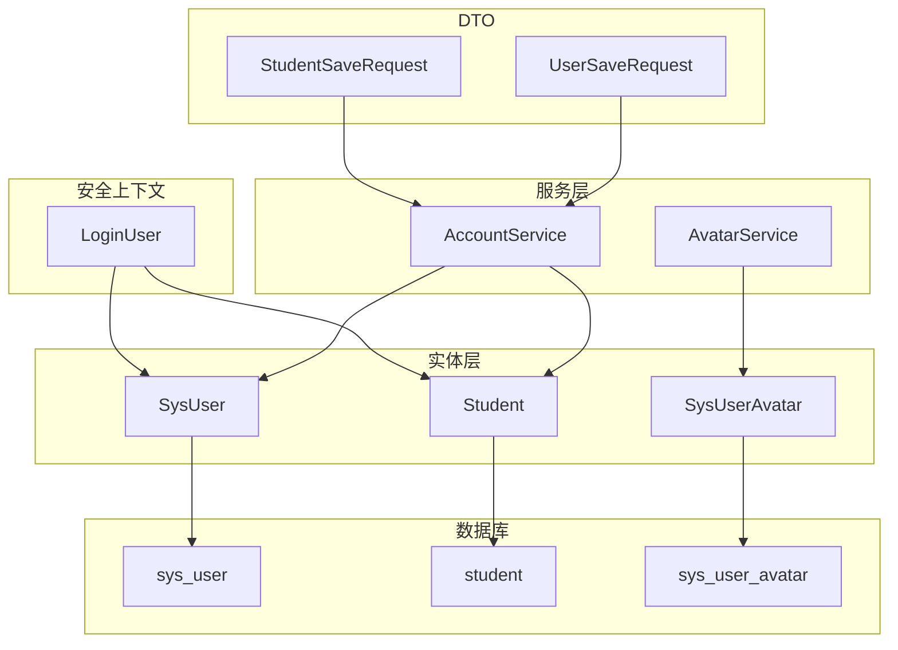
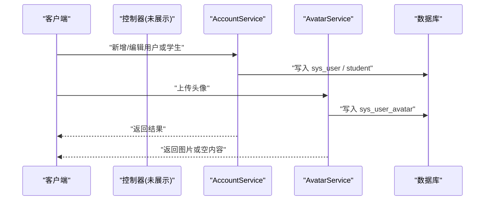
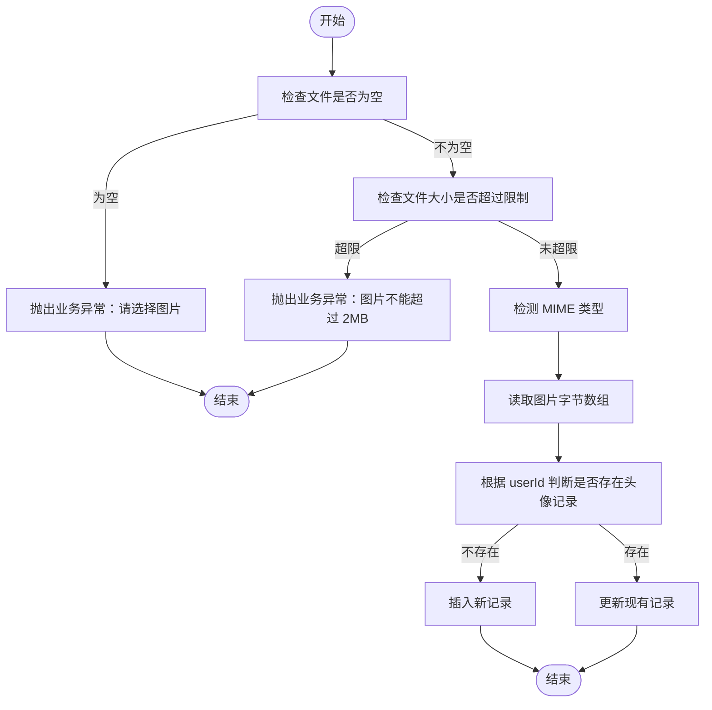
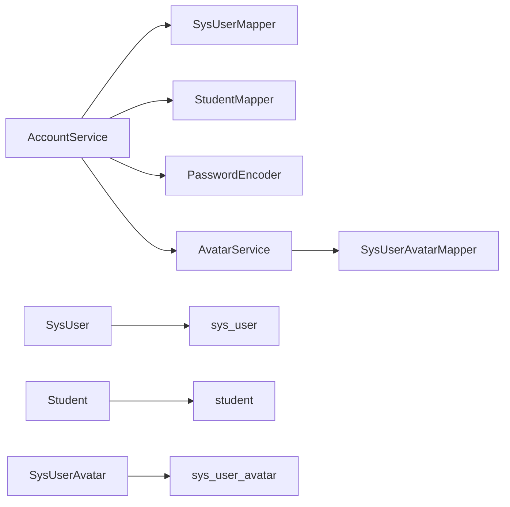

# 用户实体模型

<cite>
**本文引用的文件**
- [SysUser.java](file://exam-server/src/main/java/com/exam/entity/SysUser.java)
- [Student.java](file://exam-server/src/main/java/com/exam/entity/Student.java)
- [SysUserAvatar.java](file://exam-server/src/main/java/com/exam/entity/SysUserAvatar.java)
- [LoginUser.java](file://exam-server/src/main/java/com/exam/security/LoginUser.java)
- [AccountService.java](file://exam-server/src/main/java/com/exam/service/AccountService.java)
- [AvatarService.java](file://exam-server/src/main/java/com/exam/service/AvatarService.java)
- [UserSaveRequest.java](file://exam-server/src/main/java/com/exam/dto/UserSaveRequest.java)
- [StudentSaveRequest.java](file://exam-server/src/main/java/com/exam/dto/StudentSaveRequest.java)
- [schema.sql](file://sql/schema.sql)
</cite>

## 目录
1. [简介](#简介)
2. [项目结构](#项目结构)
3. [核心组件](#核心组件)
4. [架构总览](#架构总览)
5. [详细组件分析](#详细组件分析)
6. [依赖关系分析](#依赖关系分析)
7. [性能考虑](#性能考虑)
8. [故障排查指南](#故障排查指南)
9. [结论](#结论)
10. [附录](#附录)

## 简介
本文件聚焦于用户相关实体模型的设计与实现，覆盖以下要点：
- 用户登录账号 SysUser、学生档案 Student、头像 SysUserAvatar 的字段定义、数据类型与业务含义。
- MyBatis Plus 注解的使用说明（如 @TableName、@TableId）。
- 用户角色体系 ADMIN / TEACHER / STUDENT 的设计与落地。
- 用户与学生的一对一关联关系及数据映射策略。
- 常见操作模式与使用示例（以流程与调用链为主，不直接展示代码内容）。

## 项目结构
围绕用户实体，后端采用“实体 + Mapper + Service”的分层组织方式：
- 实体层：SysUser、Student、SysUserAvatar 描述数据库表结构与字段。
- 安全上下文：LoginUser 承载当前登录用户信息，包含角色与可选的学生标识。
- 服务层：AccountService 负责用户与学生账户的增删改查；AvatarService 负责头像存取。
- DTO：UserSaveRequest、StudentSaveRequest 用于接收前端请求参数。
- 数据库脚本：schema.sql 定义三张核心表的建表语句与索引。

图表来源
- [SysUser.java:1-24](file://exam-server/src/main/java/com/exam/entity/SysUser.java#L1-L24)
- [Student.java:1-27](file://exam-server/src/main/java/com/exam/entity/Student.java#L1-L27)
- [SysUserAvatar.java:1-20](file://exam-server/src/main/java/com/exam/entity/SysUserAvatar.java#L1-L20)
- [LoginUser.java:1-58](file://exam-server/src/main/java/com/exam/security/LoginUser.java#L1-L58)
- [AccountService.java:1-186](file://exam-server/src/main/java/com/exam/service/AccountService.java#L1-L186)
- [AvatarService.java:1-101](file://exam-server/src/main/java/com/exam/service/AvatarService.java#L1-L101)
- [UserSaveRequest.java:1-15](file://exam-server/src/main/java/com/exam/dto/UserSaveRequest.java#L1-L15)
- [StudentSaveRequest.java:1-17](file://exam-server/src/main/java/com/exam/dto/StudentSaveRequest.java#L1-L17)
- [schema.sql:1-204](file://sql/schema.sql#L1-L204)

章节来源
- [SysUser.java:1-24](file://exam-server/src/main/java/com/exam/entity/SysUser.java#L1-L24)
- [Student.java:1-27](file://exam-server/src/main/java/com/exam/entity/Student.java#L1-L27)
- [SysUserAvatar.java:1-20](file://exam-server/src/main/java/com/exam/entity/SysUserAvatar.java#L1-L20)
- [LoginUser.java:1-58](file://exam-server/src/main/java/com/exam/security/LoginUser.java#L1-L58)
- [AccountService.java:1-186](file://exam-server/src/main/java/com/exam/service/AccountService.java#L1-L186)
- [AvatarService.java:1-101](file://exam-server/src/main/java/com/exam/service/AvatarService.java#L1-L101)
- [UserSaveRequest.java:1-15](file://exam-server/src/main/java/com/exam/dto/UserSaveRequest.java#L1-L15)
- [StudentSaveRequest.java:1-17](file://exam-server/src/main/java/com/exam/dto/StudentSaveRequest.java#L1-L17)
- [schema.sql:1-204](file://sql/schema.sql#L1-L204)

## 核心组件
- SysUser：登录账号主表，承载用户名、密码、真实姓名、角色、状态与时间戳。
- Student：学生档案表，通过 userId 与 SysUser 一对一关联，记录学号、班级、联系方式等。
- SysUserAvatar：头像表，以 user_id 为主键与 SysUser 一对一，存储图片二进制与 MIME 类型。
- LoginUser：Spring Security 当前用户对象，封装 userId、studentId、username、role、enabled 等，并生成权限字符串。
- AccountService：统一处理管理员/教师账号与学生档案的创建、更新、分页查询与删除，保证事务一致性。
- AvatarService：提供头像上传、读取、删除能力，限制大小与格式，返回响应体或状态码。

章节来源
- [SysUser.java:1-24](file://exam-server/src/main/java/com/exam/entity/SysUser.java#L1-L24)
- [Student.java:1-27](file://exam-server/src/main/java/com/exam/entity/Student.java#L1-L27)
- [SysUserAvatar.java:1-20](file://exam-server/src/main/java/com/exam/entity/SysUserAvatar.java#L1-L20)
- [LoginUser.java:1-58](file://exam-server/src/main/java/com/exam/security/LoginUser.java#L1-L58)
- [AccountService.java:1-186](file://exam-server/src/main/java/com/exam/service/AccountService.java#L1-L186)
- [AvatarService.java:1-101](file://exam-server/src/main/java/com/exam/service/AvatarService.java#L1-L101)

## 架构总览
下图展示了用户实体在系统中的交互关系：服务层通过 Mapper 访问数据库，安全上下文将实体信息转换为认证主体，DTO 作为输入边界。

图表来源
- [AccountService.java:46-139](file://exam-server/src/main/java/com/exam/service/AccountService.java#L46-L139)
- [AvatarService.java:46-81](file://exam-server/src/main/java/com/exam/service/AvatarService.java#L46-L81)
- [schema.sql:2-29](file://sql/schema.sql#L2-L29)
- [schema.sql:198-203](file://sql/schema.sql#L198-L203)

## 详细组件分析

### SysUser（登录账号）
- 表名映射：@TableName("sys_user")
- 主键策略：@TableId(type = IdType.AUTO)，自增主键 id
- 字段与业务含义
  - id：Long，自增主键
  - username：String，唯一登录名（数据库有唯一索引）
  - password：String，BCrypt 加密存储
  - realName：String，真实姓名
  - role：String，角色枚举值：ADMIN / TEACHER / STUDENT
  - status：Integer，状态（默认启用）
  - createdAt / updatedAt：LocalDateTime，审计时间
- 设计要点
  - 角色字段用于权限控制，配合 Spring Security 的 ROLE_ 前缀形成权限字符串
  - 密码在服务层进行 BCrypt 编码后落库，避免明文存储
  - 列表查询时隐藏密码字段，防止泄露

章节来源
- [SysUser.java:10-23](file://exam-server/src/main/java/com/exam/entity/SysUser.java#L10-L23)
- [schema.sql:2-12](file://sql/schema.sql#L2-L12)
- [AccountService.java:32-44](file://exam-server/src/main/java/com/exam/service/AccountService.java#L32-L44)

### Student（学生档案）
- 表名映射：@TableName("student")
- 主键策略：@TableId(type = IdType.AUTO)，自增主键 id
- 字段与业务含义
  - id：Long，自增主键
  - userId：Long，外键指向 sys_user.id，建立一对一关系
  - studentNo：String，学号，唯一且同时作为登录名
  - name：String，学生姓名
  - department：String，院系
  - className：String，班级
  - phone/email：String，联系方式
  - status：Integer，状态（默认启用）
  - createdAt / updatedAt：LocalDateTime，审计时间
- 设计要点
  - 通过 userId 与 SysUser 一对一绑定，确保一个账号仅对应一份学生档案
  - 学号具有唯一性约束，避免重复导入或注册
  - 支持按关键字和班级筛选分页查询

章节来源
- [Student.java:10-26](file://exam-server/src/main/java/com/exam/entity/Student.java#L10-L26)
- [schema.sql:14-29](file://sql/schema.sql#L14-L29)
- [AccountService.java:78-93](file://exam-server/src/main/java/com/exam/service/AccountService.java#L78-L93)

### SysUserAvatar（头像）
- 表名映射：@TableName("sys_user_avatar")
- 主键策略：@TableId(type = IdType.INPUT)，user_id 作为主键，由外部指定
- 字段与业务含义
  - userId：Long，与 sys_user.id 一对一
  - contentType：String，MIME 类型（image/jpeg/png/gif/webp）
  - photo：byte[]，二进制图片数据（MEDIUMBLOB）
  - updatedAt：LocalDateTime，更新时间
- 设计要点
  - 独立于账号主表，避免影响常规用户列表查询性能
  - 上传时校验大小与格式，失败抛业务异常
  - 读取时根据 content_type 设置响应头，无图时返回空内容

章节来源
- [SysUserAvatar.java:10-19](file://exam-server/src/main/java/com/exam/entity/SysUserAvatar.java#L10-L19)
- [AvatarService.java:29-44](file://exam-server/src/main/java/com/exam/service/AvatarService.java#L29-L44)
- [schema.sql:198-203](file://sql/schema.sql#L198-L203)

### LoginUser（安全上下文）
- 作用：封装当前登录用户信息，供 Spring Security 鉴权与业务侧获取身份
- 字段与业务含义
  - userId：Long，系统用户 ID
  - studentId：Long，学生档案 ID（非学生为 null）
  - username：String，登录名
  - password：String，密码（通常不参与后续逻辑）
  - realName：String，真实姓名
  - role：String，角色（ADMIN/TEACHER/STUDENT）
  - enabled：boolean，是否可用
- 权限生成：getAuthorities() 返回 "ROLE_" + role 的 GrantedAuthority
- 设计要点
  - 将领域角色与安全权限解耦，便于扩展
  - 非学生用户 studentId 为空，便于区分权限范围

章节来源
- [LoginUser.java:11-57](file://exam-server/src/main/java/com/exam/security/LoginUser.java#L11-L57)

### 用户角色体系（ADMIN / TEACHER / STUDENT）
- 角色来源：SysUser.role 字段
- 角色用途
  - 权限控制：LoginUser.getAuthorities() 将角色转换为 "ROLE_ADMIN"、"ROLE_TEACHER"、"ROLE_STUDENT"
  - 业务分流：不同角色进入不同页面与功能域（管理端、教师端、学生端）
- 角色创建规则
  - 管理员/教师账号由 AccountService.saveUser 创建，限制只能创建 ADMIN 或 TEACHER
  - 学生账号在保存学生时自动创建，角色固定为 STUDENT，默认密码由服务设定

章节来源
- [AccountService.java:46-76](file://exam-server/src/main/java/com/exam/service/AccountService.java#L46-L76)
- [AccountService.java:95-139](file://exam-server/src/main/java/com/exam/service/AccountService.java#L95-L139)
- [LoginUser.java:33-36](file://exam-server/src/main/java/com/exam/security/LoginUser.java#L33-L36)

### 用户与学生的关联关系与数据映射
- 关联方式：Student.userId -> SysUser.id，一对一关系
- 数据一致性
  - 新增学生时，先插入 sys_user，再插入 student 并回填 userId
  - 更新学生时，同步更新 sys_user.realName 与密码（若提供）
  - 删除学生时，级联删除头像与账号
- 查询优化
  - 列表查询按需过滤，避免加载无关字段（如密码）
  - 头像独立表，不在常规用户列表中加载

章节来源
- [AccountService.java:95-139](file://exam-server/src/main/java/com/exam/service/AccountService.java#L95-L139)
- [AccountService.java:164-175](file://exam-server/src/main/java/com/exam/service/AccountService.java#L164-L175)
- [schema.sql:14-29](file://sql/schema.sql#L14-L29)

### 头像服务流程

图表来源
- [AvatarService.java:46-76](file://exam-server/src/main/java/com/exam/service/AvatarService.java#L46-L76)
- [AvatarService.java:83-99](file://exam-server/src/main/java/com/exam/service/AvatarService.java#L83-L99)

## 依赖关系分析
- 实体依赖：无直接 Java 依赖，均通过 MyBatis Plus 注解映射到数据库表
- 服务依赖
  - AccountService 依赖 SysUserMapper、StudentMapper、PasswordEncoder、AvatarService
  - AvatarService 依赖 SysUserAvatarMapper
- 安全依赖
  - LoginUser 依赖 Spring Security 接口，生成 GrantedAuthority
- 数据库依赖
  - sys_user、student、sys_user_avatar 三张表构成用户体系核心

图表来源
- [AccountService.java:23-31](file://exam-server/src/main/java/com/exam/service/AccountService.java#L23-L31)
- [AvatarService.java:21-28](file://exam-server/src/main/java/com/exam/service/AvatarService.java#L21-L28)
- [schema.sql:2-29](file://sql/schema.sql#L2-L29)
- [schema.sql:198-203](file://sql/schema.sql#L198-L203)

章节来源
- [AccountService.java:23-31](file://exam-server/src/main/java/com/exam/service/AccountService.java#L23-L31)
- [AvatarService.java:21-28](file://exam-server/src/main/java/com/exam/service/AvatarService.java#L21-L28)
- [schema.sql:2-29](file://sql/schema.sql#L2-L29)
- [schema.sql:198-203](file://sql/schema.sql#L198-L203)

## 性能考虑
- 头像独立表：避免大字段影响常规用户列表查询性能
- 分页与过滤：使用 Page 与 LambdaQueryWrapper 构建高效查询条件
- 索引利用：student_no、user_id、department 等字段具备索引，提升检索效率
- 密码脱敏：列表返回时清空密码字段，减少敏感数据传输

[本节为通用性能建议，不直接分析具体文件]

## 故障排查指南
- 头像上传失败
  - 可能原因：文件为空、超过大小限制、不支持的 MIME 类型
  - 定位方法：检查 AvatarService 的校验逻辑与异常抛出位置
- 学生导入冲突
  - 可能原因：学号已存在、学号已被用作登录名
  - 定位方法：检查 AccountService.saveStudent 的唯一性校验分支
- 用户列表显示密码
  - 可能原因：未执行密码清空逻辑
  - 定位方法：检查 pageUsers 中对密码字段的处理

章节来源
- [AvatarService.java:46-76](file://exam-server/src/main/java/com/exam/service/AvatarService.java#L46-L76)
- [AvatarService.java:83-99](file://exam-server/src/main/java/com/exam/service/AvatarService.java#L83-L99)
- [AccountService.java:95-139](file://exam-server/src/main/java/com/exam/service/AccountService.java#L95-L139)
- [AccountService.java:32-44](file://exam-server/src/main/java/com/exam/service/AccountService.java#L32-L44)

## 结论
本用户实体模型通过清晰的职责划分与合理的数据库设计，实现了：
- 统一的登录账号管理与角色控制
- 学生档案与账号的一一对应，保障数据一致性与可维护性
- 独立的头像存储，兼顾性能与灵活性
- 基于 MyBatis Plus 的简洁映射与服务层事务保障
该设计易于扩展与维护，适合教学考试场景下的多角色、多模块协同。

[本节为总结性内容，不直接分析具体文件]

## 附录

### MyBatis Plus 注解使用说明
- @TableName：指定实体对应的数据库表名
- @TableId：指定主键字段及其生成策略（AUTO 自增、INPUT 外部指定）
- 结合 LambdaQueryWrapper 构建类型安全的查询条件
- 分页查询使用 Page 对象，提高大数据量下的查询性能

章节来源
- [SysUser.java:10-15](file://exam-server/src/main/java/com/exam/entity/SysUser.java#L10-L15)
- [Student.java:10-15](file://exam-server/src/main/java/com/exam/entity/Student.java#L10-L15)
- [SysUserAvatar.java:10-15](file://exam-server/src/main/java/com/exam/entity/SysUserAvatar.java#L10-L15)
- [AccountService.java:32-44](file://exam-server/src/main/java/com/exam/service/AccountService.java#L32-L44)

### 常见操作模式与示例（流程化）
- 新增管理员/教师账号
  - 输入：UserSaveRequest（用户名、真实姓名、角色、密码、状态）
  - 流程：校验角色 -> 检查用户名唯一 -> 密码编码 -> 插入 sys_user
  - 输出：成功或业务异常
- 新增学生
  - 输入：StudentSaveRequest（学号、姓名、班级、联系方式、密码）
  - 流程：校验学号唯一 -> 创建 sys_user（角色=STUDENT）-> 创建 student -> 回填 userId
  - 输出：成功或业务异常
- 更新学生
  - 输入：StudentSaveRequest（含 id）
  - 流程：更新 student -> 同步更新 sys_user.realName 与密码（若提供）
- 删除学生
  - 流程：删除 student -> 删除头像 -> 删除 sys_user
- 上传头像
  - 输入：userId + 图片文件
  - 流程：校验 -> 检测类型 -> 插入或更新 sys_user_avatar
  - 输出：成功或业务异常

章节来源
- [AccountService.java:46-76](file://exam-server/src/main/java/com/exam/service/AccountService.java#L46-L76)
- [AccountService.java:95-139](file://exam-server/src/main/java/com/exam/service/AccountService.java#L95-L139)
- [AccountService.java:164-175](file://exam-server/src/main/java/com/exam/service/AccountService.java#L164-L175)
- [AvatarService.java:46-76](file://exam-server/src/main/java/com/exam/service/AvatarService.java#L46-L76)
- [UserSaveRequest.java:5-14](file://exam-server/src/main/java/com/exam/dto/UserSaveRequest.java#L5-L14)
- [StudentSaveRequest.java:5-16](file://exam-server/src/main/java/com/exam/dto/StudentSaveRequest.java#L5-L16)