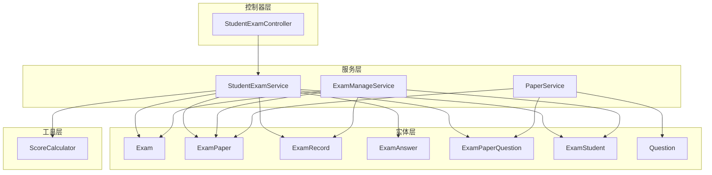
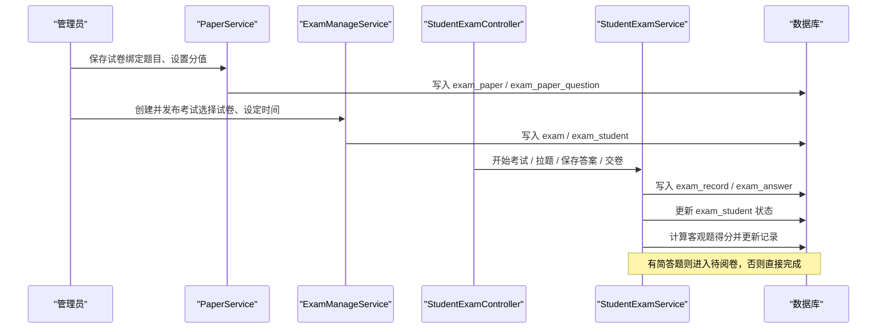
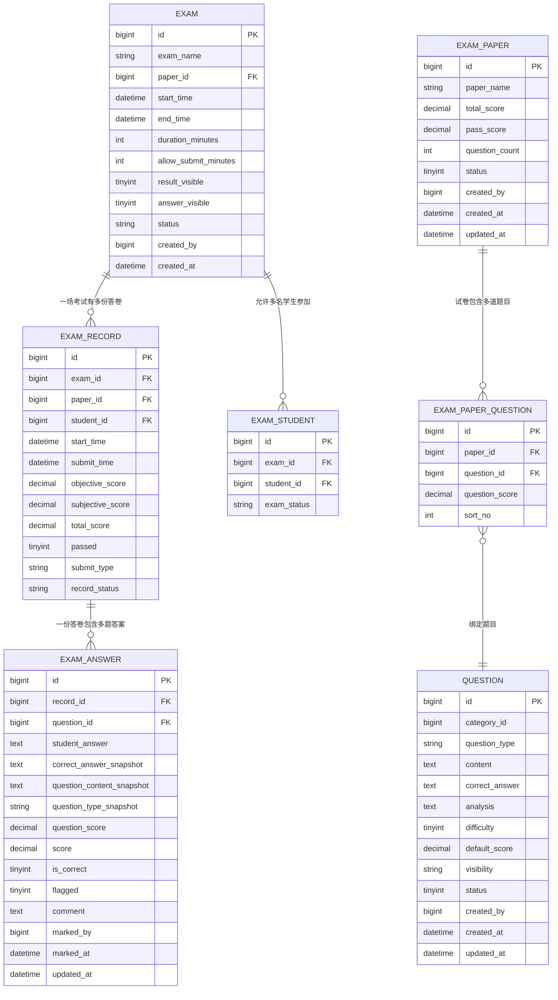
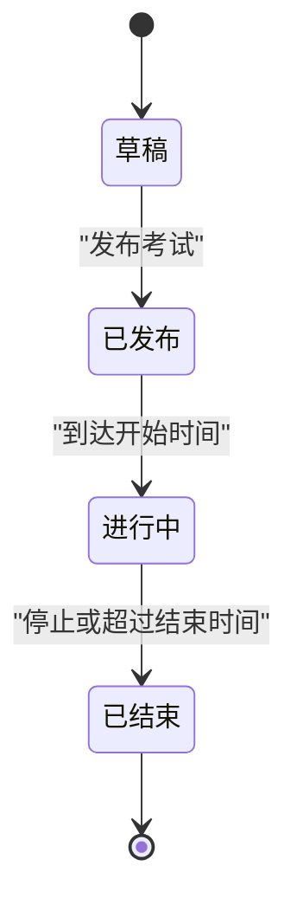
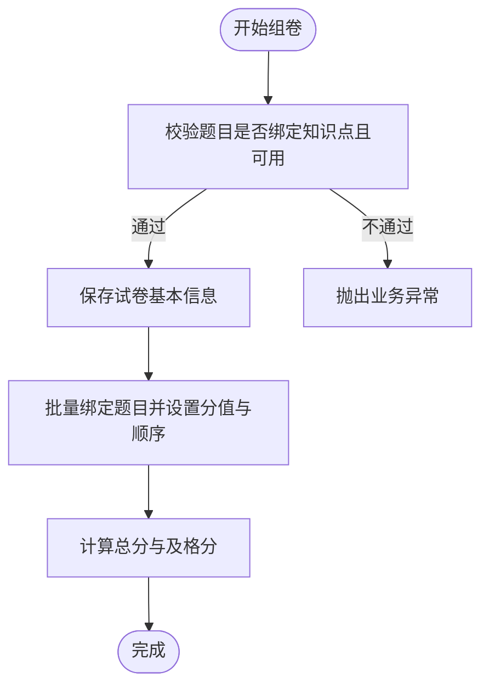
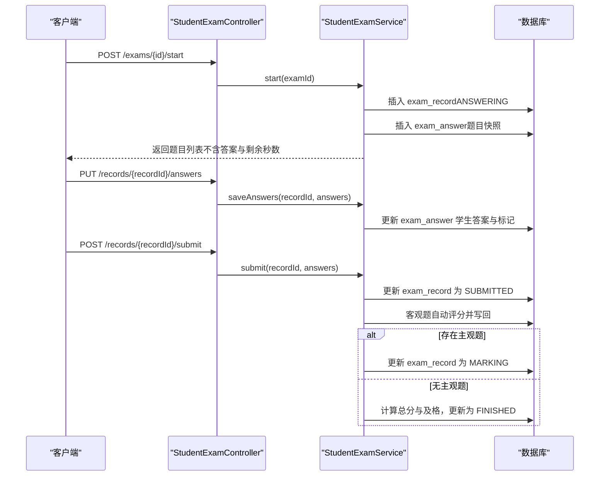
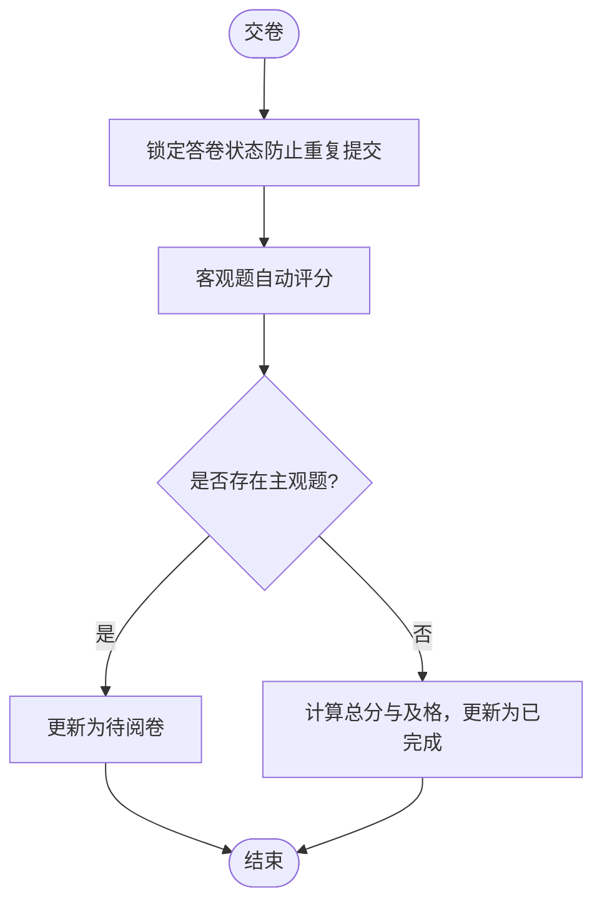
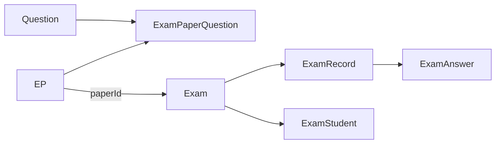

# 考试实体模型

<cite>
**本文引用的文件**
- [Exam.java](file://exam-server/src/main/java/com/exam/entity/Exam.java)
- [ExamPaper.java](file://exam-server/src/main/java/com/exam/entity/ExamPaper.java)
- [ExamRecord.java](file://exam-server/src/main/java/com/exam/entity/ExamRecord.java)
- [ExamAnswer.java](file://exam-server/src/main/java/com/exam/entity/ExamAnswer.java)
- [ExamPaperQuestion.java](file://exam-server/src/main/java/com/exam/entity/ExamPaperQuestion.java)
- [ExamStudent.java](file://exam-server/src/main/java/com/exam/entity/ExamStudent.java)
- [Question.java](file://exam-server/src/main/java/com/exam/entity/Question.java)
- [ScoreCalculator.java](file://exam-server/src/main/java/com/exam/util/ScoreCalculator.java)
- [schema.sql](file://sql/schema.sql)
- [ExamManageService.java](file://exam-server/src/main/java/com/exam/service/ExamManageService.java)
- [PaperService.java](file://exam-server/src/main/java/com/exam/service/PaperService.java)
- [StudentExamService.java](file://exam-server/src/main/java/com/exam/service/StudentExamService.java)
- [StudentExamController.java](file://exam-server/src/main/java/com/exam/controller/StudentExamController.java)
- [AnswerSaveRequest.java](file://exam-server/src/main/java/com/exam/dto/AnswerSaveRequest.java)
</cite>

## 目录
1. [简介](#简介)
2. [项目结构](#项目结构)
3. [核心组件](#核心组件)
4. [架构总览](#架构总览)
5. [详细组件分析](#详细组件分析)
6. [依赖关系分析](#依赖关系分析)
7. [性能考虑](#性能考虑)
8. [故障排查指南](#故障排查指南)
9. [结论](#结论)
10. [附录](#附录)

## 简介
本文件围绕考试系统的核心实体与流程，系统化说明考试、试卷、答题记录等数据模型的设计与使用方式。重点覆盖：
- 考试生命周期管理（草稿、发布、进行中、已结束）及状态流转
- 试卷组卷机制（试卷与题目的绑定、排序与分值）
- 学生答题记录的存储结构与答案快照策略
- 成绩计算与统计的数据模型（客观题自动评分、主观题人工阅卷、总分与及格判定）
- 考试流程中各实体的使用示例与状态变更模式

## 项目结构
本项目采用分层架构：
- 实体层：定义考试、试卷、题目、答卷、答案等核心数据模型
- 服务层：封装业务逻辑（组卷、考试管理、学生答题流程、评分与统计）
- 控制器层：暴露 REST API（学生端、管理端）
- 工具层：评分算法、类型判断等通用能力
- 数据库脚本：建表与索引定义

图表来源
- [Exam.java:1-28](file://exam-server/src/main/java/com/exam/entity/Exam.java#L1-L28)
- [ExamPaper.java:1-26](file://exam-server/src/main/java/com/exam/entity/ExamPaper.java#L1-L26)
- [ExamRecord.java:1-29](file://exam-server/src/main/java/com/exam/entity/ExamRecord.java#L1-L29)
- [ExamAnswer.java:1-32](file://exam-server/src/main/java/com/exam/entity/ExamAnswer.java#L1-L32)
- [ExamPaperQuestion.java:1-21](file://exam-server/src/main/java/com/exam/entity/ExamPaperQuestion.java#L1-L21)
- [ExamStudent.java:1-18](file://exam-server/src/main/java/com/exam/entity/ExamStudent.java#L1-L18)
- [Question.java:1-30](file://exam-server/src/main/java/com/exam/entity/Question.java#L1-L30)
- [ScoreCalculator.java:1-55](file://exam-server/src/main/java/com/exam/util/ScoreCalculator.java#L1-L55)
- [ExamManageService.java:1-277](file://exam-server/src/main/java/com/exam/service/ExamManageService.java#L1-L277)
- [PaperService.java:1-161](file://exam-server/src/main/java/com/exam/service/PaperService.java#L1-L161)
- [StudentExamService.java:1-458](file://exam-server/src/main/java/com/exam/service/StudentExamService.java#L1-L458)
- [StudentExamController.java:1-73](file://exam-server/src/main/java/com/exam/controller/StudentExamController.java#L1-L73)

章节来源
- [schema.sql:89-171](file://sql/schema.sql#L89-L171)

## 核心组件
- 考试 Exam：代表一场真实考试，关联一份试卷、考试时间窗口、是否公布成绩/答案、运行状态等
- 试卷 ExamPaper：可复用的题目集合，包含总分、及格分、题目数量与状态
- 试卷题目 ExamPaperQuestion：试卷与题目的绑定关系，含本题分值与顺序
- 答题记录 ExamRecord：一次考试的答卷，包含开始/提交时间、客观/主观分数、总分、是否通过、提交方式、记录状态
- 答题明细 ExamAnswer：每题作答详情，保存学生答案、正确答案快照、题目内容/类型快照、得分、是否正确、标记、批阅信息
- 考生关联 ExamStudent：本场考试允许参加的学生及其参考状态
- 题目 Question：题库中的题目，包含题型、内容、答案、解析、默认分值等
- 评分工具 ScoreCalculator：客观题自动评分匹配逻辑

章节来源
- [Exam.java:10-27](file://exam-server/src/main/java/com/exam/entity/Exam.java#L10-L27)
- [ExamPaper.java:11-25](file://exam-server/src/main/java/com/exam/entity/ExamPaper.java#L11-L25)
- [ExamPaperQuestion.java:10-20](file://exam-server/src/main/java/com/exam/entity/ExamPaperQuestion.java#L10-L20)
- [ExamRecord.java:11-28](file://exam-server/src/main/java/com/exam/entity/ExamRecord.java#L11-L28)
- [ExamAnswer.java:11-31](file://exam-server/src/main/java/com/exam/entity/ExamAnswer.java#L11-L31)
- [ExamStudent.java:8-17](file://exam-server/src/main/java/com/exam/entity/ExamStudent.java#L8-L17)
- [Question.java:11-29](file://exam-server/src/main/java/com/exam/entity/Question.java#L11-L29)
- [ScoreCalculator.java:6-55](file://exam-server/src/main/java/com/exam/util/ScoreCalculator.java#L6-L55)

## 架构总览
下图展示考试系统从“组卷”到“学生答题”再到“评分与统计”的整体流程与实体交互。

图表来源
- [PaperService.java:79-128](file://exam-server/src/main/java/com/exam/service/PaperService.java#L79-L128)
- [ExamManageService.java:77-134](file://exam-server/src/main/java/com/exam/service/ExamManageService.java#L77-L134)
- [StudentExamController.java:35-65](file://exam-server/src/main/java/com/exam/controller/StudentExamController.java#L35-L65)
- [StudentExamService.java:94-309](file://exam-server/src/main/java/com/exam/service/StudentExamService.java#L94-L309)

## 详细组件分析

### 实体关系与数据模型
- 考试与试卷：Exam.paperId 指向 ExamPaper.id；一场考试绑定一份试卷
- 试卷与题目：ExamPaperQuestion 将 ExamPaper 与 Question 关联，并记录本题分值与顺序
- 考试与考生：ExamStudent 表示某场考试允许参加的学生及其参考状态
- 答卷与答案：ExamRecord 对应一次考试的一次作答；ExamAnswer 为每道题的作答明细
- 题目快照：ExamAnswer 保存 question_content_snapshot、correct_answer_snapshot、question_type_snapshot，确保题库变更后不影响历史答卷

图表来源
- [schema.sql:89-171](file://sql/schema.sql#L89-L171)
- [Exam.java:10-27](file://exam-server/src/main/java/com/exam/entity/Exam.java#L10-L27)
- [ExamPaper.java:11-25](file://exam-server/src/main/java/com/exam/entity/ExamPaper.java#L11-L25)
- [ExamPaperQuestion.java:10-20](file://exam-server/src/main/java/com/exam/entity/ExamPaperQuestion.java#L10-L20)
- [ExamStudent.java:8-17](file://exam-server/src/main/java/com/exam/entity/ExamStudent.java#L8-L17)
- [ExamRecord.java:11-28](file://exam-server/src/main/java/com/exam/entity/ExamRecord.java#L11-L28)
- [ExamAnswer.java:11-31](file://exam-server/src/main/java/com/exam/entity/ExamAnswer.java#L11-L31)
- [Question.java:11-29](file://exam-server/src/main/java/com/exam/entity/Question.java#L11-L29)

章节来源
- [schema.sql:89-171](file://sql/schema.sql#L89-L171)

### 考试生命周期与状态流转
- 考试状态（Exam.status）：DRAFT（草稿）、PUBLISHED（已发布）、FINISHED（已结束）
- 运行时状态（runtimeStatus）：根据当前时间与起止时间计算，可能为 DRAFT、PUBLISHED、ONGOING、FINISHED
- 考生状态（ExamStudent.examStatus）：NOT_STARTED、ANSWERING、SUBMITTED
- 答卷状态（ExamRecord.recordStatus）：ANSWERING（答题中）、SUBMITTED（已提交）、MARKING（待阅卷）、FINISHED（已完成）

图表来源
- [ExamManageService.java:115-134](file://exam-server/src/main/java/com/exam/service/ExamManageService.java#L115-L134)
- [ExamManageService.java:175-190](file://exam-server/src/main/java/com/exam/service/ExamManageService.java#L175-L190)

章节来源
- [ExamManageService.java:77-134](file://exam-server/src/main/java/com/exam/service/ExamManageService.java#L77-L134)
- [ExamManageService.java:175-190](file://exam-server/src/main/java/com/exam/service/ExamManageService.java#L175-L190)

### 组卷与题目绑定机制
- 组卷要求：题目必须绑定知识点且处于可用状态
- 绑定关系：通过 ExamPaperQuestion 记录 paperId、questionId、questionScore、sortNo
- 总分与及格分：总分由题目分值累加；及格分可自定义或按默认规则计算
- 排序：sortNo 控制题目在试卷中的顺序

图表来源
- [PaperService.java:79-128](file://exam-server/src/main/java/com/exam/service/PaperService.java#L79-L128)

章节来源
- [PaperService.java:79-128](file://exam-server/src/main/java/com/exam/service/PaperService.java#L79-L128)

### 学生答题流程与答案保存策略
- 开始考试：创建答卷记录、写入题目快照（内容、正确答案、题型、分值），更新考生状态为答题中
- 保存答案：仅更新学生答案与标记，不改变答卷状态；支持切题或定时保存
- 交卷：锁定状态防重复提交；客观题自动评分；若存在主观题则进入待阅卷，否则直接完成
- 剩余时间：以「开始时间 + 时长」与考试截止时间取较小值作为截止点，超时自动交卷

图表来源
- [StudentExamController.java:35-65](file://exam-server/src/main/java/com/exam/controller/StudentExamController.java#L35-L65)
- [StudentExamService.java:94-309](file://exam-server/src/main/java/com/exam/service/StudentExamService.java#L94-L309)

章节来源
- [StudentExamService.java:94-309](file://exam-server/src/main/java/com/exam/service/StudentExamService.java#L94-L309)
- [AnswerSaveRequest.java:5-11](file://exam-server/src/main/java/com/exam/dto/AnswerSaveRequest.java#L5-L11)

### 成绩计算与统计的数据模型
- 客观题评分：依据题型进行匹配（单选/判断忽略大小写全等；多选排序后比较；填空按分隔符逐项比较）
- 主观题：不参与自动评分，需人工阅卷后更新主观分数
- 总分与及格：总分 = 客观题得分 + 主观题得分；是否通过基于试卷及格分判定
- 统计维度：班级人数、考试数量、待阅卷数量、答题中数量、已提交数量、平均分、通过率等

图表来源
- [StudentExamService.java:258-309](file://exam-server/src/main/java/com/exam/service/StudentExamService.java#L258-L309)
- [ScoreCalculator.java:15-55](file://exam-server/src/main/java/com/exam/util/ScoreCalculator.java#L15-L55)

章节来源
- [StudentExamService.java:258-309](file://exam-server/src/main/java/com/exam/service/StudentExamService.java#L258-L309)
- [ScoreCalculator.java:15-55](file://exam-server/src/main/java/com/exam/util/ScoreCalculator.java#L15-L55)

### 使用示例与状态变更模式
- 管理员组卷：
  - 调用组卷接口，绑定题目并设置分值与顺序
  - 校验通过后写入试卷与题目绑定关系
  - 参考路径：[PaperService.save:79-128](file://exam-server/src/main/java/com/exam/service/PaperService.java#L79-L128)
- 管理员发布考试：
  - 选择已发布的试卷，设置考试名称、起止时间、是否公布成绩/答案
  - 指定考生名单，发布后状态变为已发布
  - 参考路径：[ExamManageService.publish:115-134](file://exam-server/src/main/java/com/exam/service/ExamManageService.java#L115-L134)
- 学生答题：
  - 开始考试：创建答卷与题目快照，返回题目与剩余时间
  - 保存答案：仅更新学生答案与标记
  - 交卷：客观题自动评分，主观题进入待阅卷或完成
  - 参考路径：[StudentExamController.start/questions/save/submit:35-65](file://exam-server/src/main/java/com/exam/controller/StudentExamController.java#L35-L65)
- 查看成绩与回顾：
  - 根据考试结果可见性与答卷状态决定是否显示标准答案与解析
  - 参考路径：[StudentExamService.review:196-239](file://exam-server/src/main/java/com/exam/service/StudentExamService.java#L196-L239)

章节来源
- [PaperService.java:79-128](file://exam-server/src/main/java/com/exam/service/PaperService.java#L79-L128)
- [ExamManageService.java:115-134](file://exam-server/src/main/java/com/exam/service/ExamManageService.java#L115-L134)
- [StudentExamController.java:35-65](file://exam-server/src/main/java/com/exam/controller/StudentExamController.java#L35-L65)
- [StudentExamService.java:196-239](file://exam-server/src/main/java/com/exam/service/StudentExamService.java#L196-L239)

## 依赖关系分析
- 实体耦合：
  - Exam 依赖 ExamPaper（paperId）
  - ExamPaper 通过 ExamPaperQuestion 依赖 Question
  - ExamRecord 依赖 Exam（examId）与 ExamPaper（paperId）
  - ExamAnswer 依赖 ExamRecord（recordId）与 Question（questionId）
  - ExamStudent 依赖 Exam（examId）与 Student（studentId）
- 服务依赖：
  - StudentExamService 依赖多个 Mapper 与 ScoreCalculator，实现答题与评分
  - PaperService 依赖 QuestionKnowledgeMapper 校验知识点绑定
  - ExamManageService 负责考试生命周期与统计聚合

图表来源
- [ExamPaperQuestion.java:10-20](file://exam-server/src/main/java/com/exam/entity/ExamPaperQuestion.java#L10-L20)
- [Exam.java:10-27](file://exam-server/src/main/java/com/exam/entity/Exam.java#L10-L27)
- [ExamRecord.java:11-28](file://exam-server/src/main/java/com/exam/entity/ExamRecord.java#L11-L28)
- [ExamAnswer.java:11-31](file://exam-server/src/main/java/com/exam/entity/ExamAnswer.java#L11-L31)
- [ExamStudent.java:8-17](file://exam-server/src/main/java/com/exam/entity/ExamStudent.java#L8-L17)

章节来源
- [ExamPaperQuestion.java:10-20](file://exam-server/src/main/java/com/exam/entity/ExamPaperQuestion.java#L10-L20)
- [Exam.java:10-27](file://exam-server/src/main/java/com/exam/entity/Exam.java#L10-L27)
- [ExamRecord.java:11-28](file://exam-server/src/main/java/com/exam/entity/ExamRecord.java#L11-L28)
- [ExamAnswer.java:11-31](file://exam-server/src/main/java/com/exam/entity/ExamAnswer.java#L11-L31)
- [ExamStudent.java:8-17](file://exam-server/src/main/java/com/exam/entity/ExamStudent.java#L8-L17)

## 性能考虑
- 索引优化：
  - exam(start_time, end_time) 提升按时间范围查询效率
  - exam_record(exam_id, student_id) 唯一索引避免重复答卷
  - exam_answer(record_id) 加速按答卷查询答案
  - student_knowledge_stat(knowledge_point_id, mastery_rate) 支持按知识点掌握度排序
- 快照策略：
  - 答案表保存题目内容与正确答案快照，避免题库变更影响历史答卷一致性
- 并发控制：
  - 交卷时通过状态字段锁防止重复提交
- 自动交卷：
  - 基于服务端时间计算剩余秒数，超时自动提交，减少前端时钟漂移问题

章节来源
- [schema.sql:111-187](file://sql/schema.sql#L111-L187)
- [StudentExamService.java:377-382](file://exam-server/src/main/java/com/exam/service/StudentExamService.java#L377-L382)
- [StudentExamService.java:258-267](file://exam-server/src/main/java/com/exam/service/StudentExamService.java#L258-L267)

## 故障排查指南
- 常见异常与处理：
  - 考试不存在：检查 examId 与权限
  - 不在考试名单：确认 exam_student 是否包含该学生
  - 考试尚未开始/已结束：核对 exam 的起止时间与状态
  - 已交卷不能修改：检查 record_status 是否为 ANSWERING
  - 开考后规定时间内不能交卷：遵守 allow_submit_minutes 限制
  - 未绑定知识点的题目不能组卷：先为题目绑定知识点
- 定位建议：
  - 查看相关实体状态字段（exam.status、exam_student.exam_status、exam_record.record_status）
  - 检查答案快照与题目快照是否一致
  - 关注自动交卷与重复提交保护逻辑

章节来源
- [StudentExamService.java:94-194](file://exam-server/src/main/java/com/exam/service/StudentExamService.java#L94-L194)
- [PaperService.java:79-94](file://exam-server/src/main/java/com/exam/service/PaperService.java#L79-L94)

## 结论
本模型通过清晰的实体划分与严格的快照策略，实现了考试、试卷、答题记录的完整生命周期管理。组卷阶段保证题目质量与可复用性；答题阶段提供稳定的时间控制与答案保存；评分阶段兼顾客观题自动化与主观题人工干预；统计层面提供多维度的数据分析基础。整体设计兼顾了可扩展性与数据一致性，适合教学考试场景的实际需求。

## 附录
- 关键实体字段速览：
  - Exam：考试名称、试卷ID、起止时间、时长、允许提前交卷分钟数、结果/答案可见性、状态、创建者、创建时间
  - ExamPaper：试卷名称、总分、及格分、题目数量、状态、创建者、创建/更新时间
  - ExamRecord：考试ID、试卷ID、学生ID、开始/提交时间、客观/主观/总分、是否通过、提交方式、记录状态
  - ExamAnswer：答卷ID、题目ID、学生答案、正确答案快照、题目内容/类型快照、题目分值、得分、是否正确、标记、批阅信息
  - ExamPaperQuestion：试卷ID、题目ID、题目分值、顺序
  - ExamStudent：考试ID、学生ID、考试状态
- 相关接口路径：
  - 学生端：/api/student/exams、/api/student/exams/{id}/start、/api/student/records/{recordId}/questions、/api/student/records/{recordId}/answers、/api/student/records/{recordId}/submit、/api/student/records/{recordId}/review

章节来源
- [Exam.java:10-27](file://exam-server/src/main/java/com/exam/entity/Exam.java#L10-L27)
- [ExamPaper.java:11-25](file://exam-server/src/main/java/com/exam/entity/ExamPaper.java#L11-L25)
- [ExamRecord.java:11-28](file://exam-server/src/main/java/com/exam/entity/ExamRecord.java#L11-L28)
- [ExamAnswer.java:11-31](file://exam-server/src/main/java/com/exam/entity/ExamAnswer.java#L11-L31)
- [ExamPaperQuestion.java:10-20](file://exam-server/src/main/java/com/exam/entity/ExamPaperQuestion.java#L10-L20)
- [ExamStudent.java:8-17](file://exam-server/src/main/java/com/exam/entity/ExamStudent.java#L8-L17)
- [StudentExamController.java:29-65](file://exam-server/src/main/java/com/exam/controller/StudentExamController.java#L29-L65)