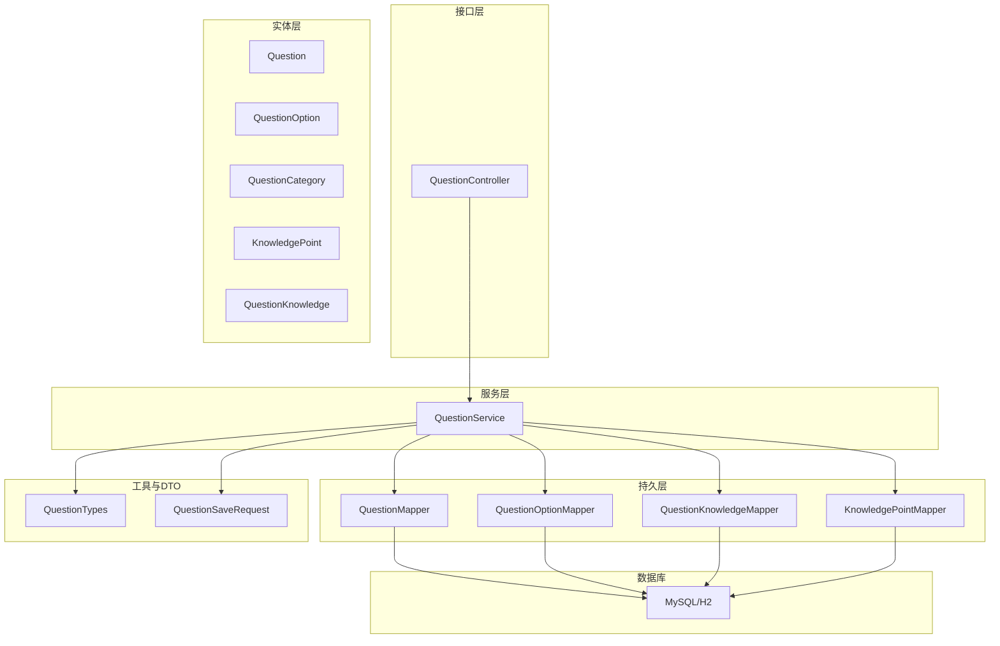
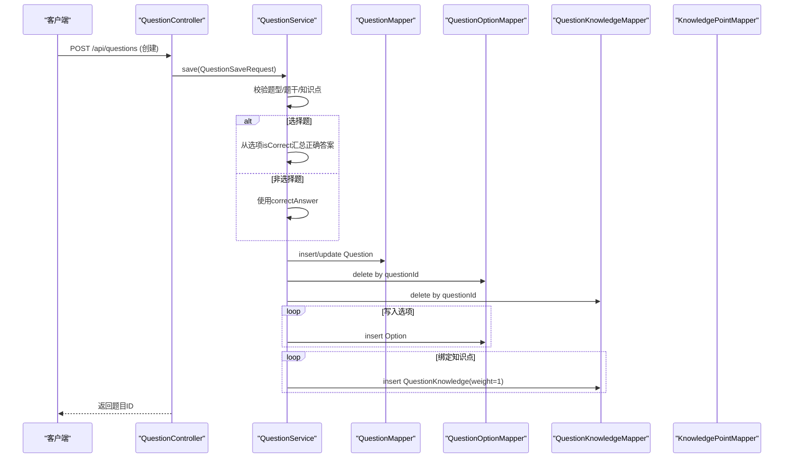
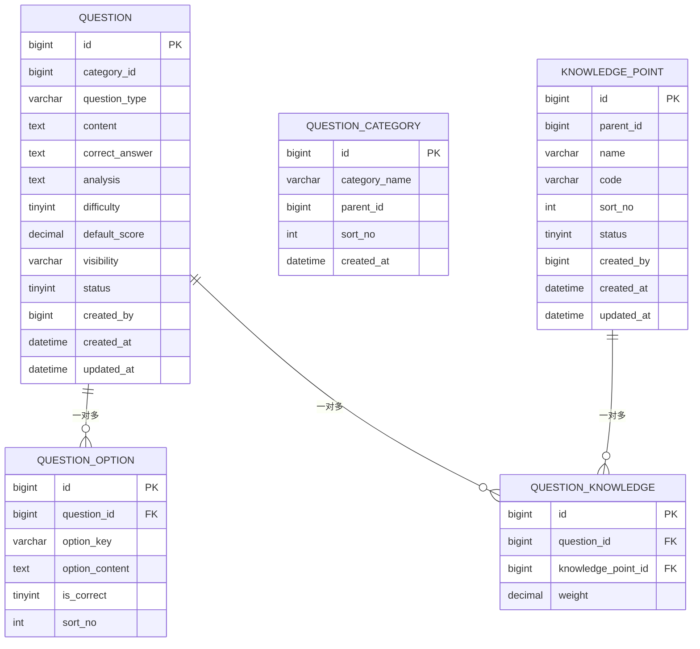
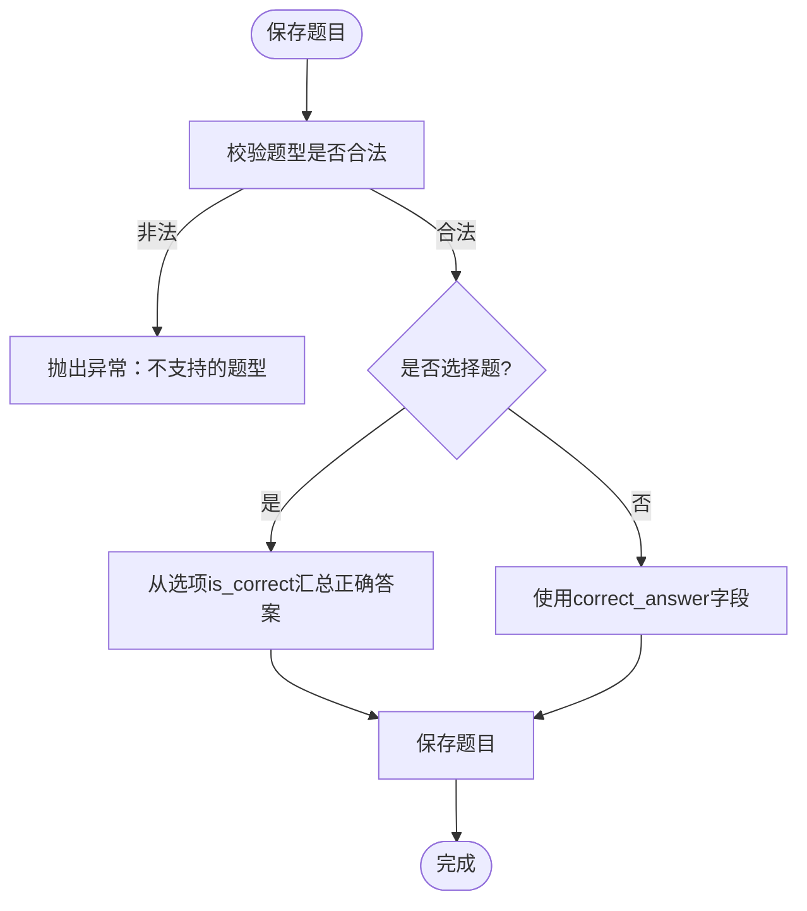
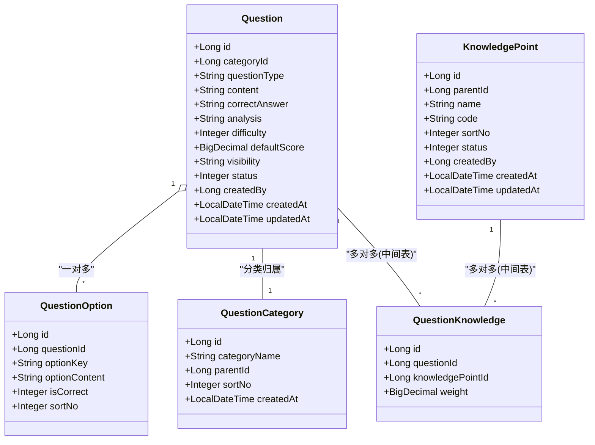
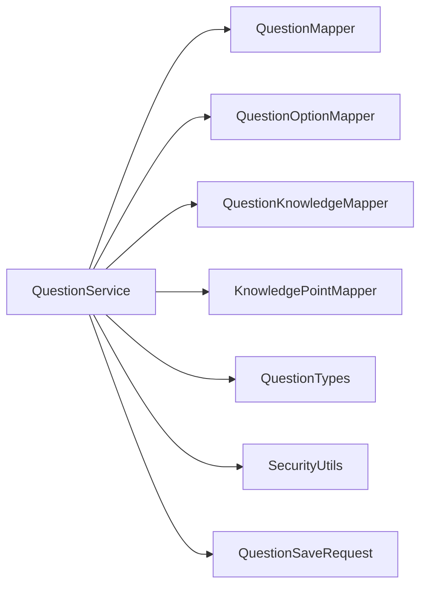

# 题库实体模型

<cite>
**本文引用的文件**
- [Question.java](file://exam-server/src/main/java/com/exam/entity/Question.java)
- [QuestionOption.java](file://exam-server/src/main/java/com/exam/entity/QuestionOption.java)
- [QuestionCategory.java](file://exam-server/src/main/java/com/exam/entity/QuestionCategory.java)
- [KnowledgePoint.java](file://exam-server/src/main/java/com/exam/entity/KnowledgePoint.java)
- [QuestionKnowledge.java](file://exam-server/src/main/java/com/exam/entity/QuestionKnowledge.java)
- [QuestionService.java](file://exam-server/src/main/java/com/exam/service/QuestionService.java)
- [QuestionController.java](file://exam-server/src/main/java/com/exam/controller/QuestionController.java)
- [QuestionSaveRequest.java](file://exam-server/src/main/java/com/exam/dto/QuestionSaveRequest.java)
- [QuestionTypes.java](file://exam-server/src/main/java/com/exam/util/QuestionTypes.java)
- [schema-mysql.sql](file://sql/schema-mysql.sql)
</cite>

## 目录
1. [简介](#简介)
2. [项目结构](#项目结构)
3. [核心组件](#核心组件)
4. [架构总览](#架构总览)
5. [详细组件分析](#详细组件分析)
6. [依赖关系分析](#依赖关系分析)
7. [性能考虑](#性能考虑)
8. [故障排查指南](#故障排查指南)
9. [结论](#结论)
10. [附录：题目CRUD使用示例](#附录题目crud使用示例)

## 简介
本文件聚焦题库相关实体模型与多题型支持设计，覆盖 Question、QuestionOption、QuestionCategory、KnowledgePoint、QuestionKnowledge 等核心表与实体。文档说明：
- 多题型数据结构（单选、多选、判断、填空、简答、关键词解释）
- 选项、分类、知识点与题目的关联关系
- 知识点标签的层次化结构设计
- 题目与知识点的多对多实现方式
- 题目增删改查的实体使用示例与服务流程

## 项目结构
题库模块位于后端 exam-server 中，采用典型的 Controller -> Service -> Mapper -> Entity 分层结构；数据持久化通过 MyBatis-Plus 完成，数据库脚本在 sql 目录下提供 MySQL/H2 兼容建表语句。

图表来源
- [QuestionController.java:31-118](file://exam-server/src/main/java/com/exam/controller/QuestionController.java#L31-L118)
- [QuestionService.java:33-225](file://exam-server/src/main/java/com/exam/service/QuestionService.java#L33-L225)
- [Question.java:11-29](file://exam-server/src/main/java/com/exam/entity/Question.java#L11-L29)
- [QuestionOption.java:8-19](file://exam-server/src/main/java/com/exam/entity/QuestionOption.java#L8-L19)
- [QuestionCategory.java:10-20](file://exam-server/src/main/java/com/exam/entity/QuestionCategory.java#L10-L20)
- [KnowledgePoint.java:10-24](file://exam-server/src/main/java/com/exam/entity/KnowledgePoint.java#L10-L24)
- [QuestionKnowledge.java:10-19](file://exam-server/src/main/java/com/exam/entity/QuestionKnowledge.java#L10-L19)
- [QuestionTypes.java:12-123](file://exam-server/src/main/java/com/exam/util/QuestionTypes.java#L12-L123)
- [QuestionSaveRequest.java:8-31](file://exam-server/src/main/java/com/exam/dto/QuestionSaveRequest.java#L8-L31)

章节来源
- [QuestionController.java:31-118](file://exam-server/src/main/java/com/exam/controller/QuestionController.java#L31-L118)
- [QuestionService.java:33-225](file://exam-server/src/main/java/com/exam/service/QuestionService.java#L33-L225)

## 核心组件
- Question：题目主实体，包含题型、题干、答案、解析、难度、默认分值、可见性、状态等字段。
- QuestionOption：选择题选项实体，记录选项键、内容、是否正确、排序。
- QuestionCategory：题目分类实体，支持父子层级（parentId）。
- KnowledgePoint：知识点实体，支持树形结构（parentId=0 为根节点）。
- QuestionKnowledge：题目与知识点的关联表，实现多对多，并携带权重 weight。

章节来源
- [Question.java:11-29](file://exam-server/src/main/java/com/exam/entity/Question.java#L11-L29)
- [QuestionOption.java:8-19](file://exam-server/src/main/java/com/exam/entity/QuestionOption.java#L8-L19)
- [QuestionCategory.java:10-20](file://exam-server/src/main/java/com/exam/entity/QuestionCategory.java#L10-L20)
- [KnowledgePoint.java:10-24](file://exam-server/src/main/java/com/exam/entity/KnowledgePoint.java#L10-L24)
- [QuestionKnowledge.java:10-19](file://exam-server/src/main/java/com/exam/entity/QuestionKnowledge.java#L10-L19)

## 架构总览
题库保存流程（以新增/编辑为例）：
- 控制器接收请求，校验并委托服务层处理。
- 服务层校验题型合法性、必填项（题干、至少一个知识点），根据题型填充正确答案（选择题从选项 isCorrect 汇总）。
- 更新或插入题目，删除旧选项与知识点关联后重建，最后写入新选项与新知识点关联。
- 查询时按权限过滤可见性，支持按题型、分类、知识点、关键字分页检索。

图表来源
- [QuestionController.java:93-103](file://exam-server/src/main/java/com/exam/controller/QuestionController.java#L93-L103)
- [QuestionService.java:95-151](file://exam-server/src/main/java/com/exam/service/QuestionService.java#L95-L151)
- [QuestionTypes.java:93-100](file://exam-server/src/main/java/com/exam/util/QuestionTypes.java#L93-L100)

章节来源
- [QuestionController.java:93-103](file://exam-server/src/main/java/com/exam/controller/QuestionController.java#L93-L103)
- [QuestionService.java:95-151](file://exam-server/src/main/java/com/exam/service/QuestionService.java#L95-L151)

## 详细组件分析

### 实体模型与表结构
- Question
  - 主键 id，分类 categoryId，题型 questionType，题干 content，正确答案 correct_answer，解析 analysis，难度 difficulty，默认分值 default_score，可见性 visibility，逻辑删除 status，创建人 createdBy，时间戳 createdAt/updatedAt。
  - 索引：category_id、question_type。
- QuestionOption
  - 主键 id，外键 question_id，选项键 option_key，内容 option_content，是否正确答案 is_correct，排序 sort_no。
  - 索引：question_id。
- QuestionCategory
  - 主键 id，分类名 category_name，父级 parentId，排序 sortNo，创建时间 createdAt。
- KnowledgePoint
  - 主键 id，父级 parentId，名称 name，编码 code，排序 sortNo，状态 status，创建人 createdBy，时间戳 createdAt/updatedAt。
  - 索引：parent_id。
- QuestionKnowledge
  - 主键 id，外键 question_id，外键 knowledge_point_id，权重 weight。
  - 唯一约束：(question_id, knowledge_point_id)，索引：knowledge_point_id。

图表来源
- [schema-mysql.sql:34-90](file://sql/schema-mysql.sql#L34-L90)
- [Question.java:11-29](file://exam-server/src/main/java/com/exam/entity/Question.java#L11-L29)
- [QuestionOption.java:8-19](file://exam-server/src/main/java/com/exam/entity/QuestionOption.java#L8-L19)
- [QuestionCategory.java:10-20](file://exam-server/src/main/java/com/exam/entity/QuestionCategory.java#L10-L20)
- [KnowledgePoint.java:10-24](file://exam-server/src/main/java/com/exam/entity/KnowledgePoint.java#L10-L24)
- [QuestionKnowledge.java:10-19](file://exam-server/src/main/java/com/exam/entity/QuestionKnowledge.java#L10-L19)

章节来源
- [schema-mysql.sql:34-90](file://sql/schema-mysql.sql#L34-L90)

### 多题型支持结构
- 支持的题型常量与中文标签映射由 QuestionTypes 统一管理，包括：SINGLE（单选题）、MULTIPLE（多选题）、JUDGE（判断题）、FILL（填空题）、ESSAY（简答题）、TERM（关键词解释题）。
- 选择题（SINGLE/MULTIPLE/JUDGE）的正确答案由选项的 is_correct 汇总生成；主观题（ESSAY/TERM）需人工阅卷。
- 各题型有默认分值策略，便于统一初始化。

图表来源
- [QuestionTypes.java:12-123](file://exam-server/src/main/java/com/exam/util/QuestionTypes.java#L12-L123)
- [QuestionService.java:161-178](file://exam-server/src/main/java/com/exam/service/QuestionService.java#L161-L178)

章节来源
- [QuestionTypes.java:12-123](file://exam-server/src/main/java/com/exam/util/QuestionTypes.java#L12-L123)
- [QuestionService.java:161-178](file://exam-server/src/main/java/com/exam/service/QuestionService.java#L161-L178)

### 选项、分类与知识点的关联关系
- 题目与选项：一对多，QuestionOption.question_id 指向 Question.id。
- 题目与分类：一对一，Question.category_id 指向 QuestionCategory.id。
- 题目与知识点：多对多，通过 QuestionKnowledge 中间表连接，weight 表示该知识点在该题中的贡献权重，用于学情统计分摊分数。
- 知识点树：KnowledgePoint.parent_id 形成层级结构，parentId=0 为根节点。

图表来源
- [Question.java:11-29](file://exam-server/src/main/java/com/exam/entity/Question.java#L11-L29)
- [QuestionOption.java:8-19](file://exam-server/src/main/java/com/exam/entity/QuestionOption.java#L8-L19)
- [QuestionCategory.java:10-20](file://exam-server/src/main/java/com/exam/entity/QuestionCategory.java#L10-L20)
- [KnowledgePoint.java:10-24](file://exam-server/src/main/java/com/exam/entity/KnowledgePoint.java#L10-L24)
- [QuestionKnowledge.java:10-19](file://exam-server/src/main/java/com/exam/entity/QuestionKnowledge.java#L10-L19)

章节来源
- [Question.java:11-29](file://exam-server/src/main/java/com/exam/entity/Question.java#L11-L29)
- [QuestionOption.java:8-19](file://exam-server/src/main/java/com/exam/entity/QuestionOption.java#L8-L19)
- [QuestionCategory.java:10-20](file://exam-server/src/main/java/com/exam/entity/QuestionCategory.java#L10-L20)
- [KnowledgePoint.java:10-24](file://exam-server/src/main/java/com/exam/entity/KnowledgePoint.java#L10-L24)
- [QuestionKnowledge.java:10-19](file://exam-server/src/main/java/com/exam/entity/QuestionKnowledge.java#L10-L19)

### 知识点标签体系的层次结构设计
- 通过 KnowledgePoint.parent_id 构建多级树形结构，根节点 parentId=0。
- 支持编码 code 与排序 sortNo，便于前端展示与组织。
- 题目与知识点通过 QuestionKnowledge 建立多对多，并可设置权重 weight，用于后续学情统计与掌握率计算。

章节来源
- [KnowledgePoint.java:10-24](file://exam-server/src/main/java/com/exam/entity/KnowledgePoint.java#L10-L24)
- [schema-mysql.sql:34-45](file://sql/schema-mysql.sql#L34-L45)
- [QuestionKnowledge.java:10-19](file://exam-server/src/main/java/com/exam/entity/QuestionKnowledge.java#L10-L19)

### 题目与知识点的多对多关系实现
- 通过 QuestionKnowledge 表维护题目与知识点的关联，包含权重 weight。
- 保存题目时，会先清空该题的旧关联，再批量插入新的关联，确保一致性。
- 查询题目详情时，会加载其关联的知识点 ID 列表及名称，便于前端展示。

章节来源
- [QuestionService.java:127-149](file://exam-server/src/main/java/com/exam/service/QuestionService.java#L127-L149)
- [QuestionService.java:196-203](file://exam-server/src/main/java/com/exam/service/QuestionService.java#L196-L203)
- [schema-mysql.sql:83-90](file://sql/schema-mysql.sql#L83-L90)

## 依赖关系分析
- QuestionService 依赖多个 Mapper：QuestionMapper、QuestionOptionMapper、QuestionKnowledgeMapper、KnowledgePointMapper。
- 依赖 QuestionTypes 进行题型校验与判断。
- 依赖 SecurityUtils 控制可见性与权限。
- 依赖 DTO QuestionSaveRequest 作为输入载体。

图表来源
- [QuestionService.java:33-41](file://exam-server/src/main/java/com/exam/service/QuestionService.java#L33-L41)
- [QuestionService.java:42-69](file://exam-server/src/main/java/com/exam/service/QuestionService.java#L42-L69)

章节来源
- [QuestionService.java:33-41](file://exam-server/src/main/java/com/exam/service/QuestionService.java#L33-L41)

## 性能考虑
- 分页查询：使用 Page 对象进行分页，减少数据传输量。
- 索引优化：question.category_id、question.question_type、option.question_id、knowledge_point.parent_id、question_knowledge.knowledge_point_id 等索引提升查询效率。
- 事务控制：save 方法使用 @Transactional，保证题目、选项、知识点关联的一致性。
- 导入限制：Excel 导入限制最大行数，避免超大文件拖垮解析与事务。

章节来源
- [QuestionService.java:42-69](file://exam-server/src/main/java/com/exam/service/QuestionService.java#L42-L69)
- [QuestionService.java:95-151](file://exam-server/src/main/java/com/exam/service/QuestionService.java#L95-L151)
- [QuestionController.java:60-75](file://exam-server/src/main/java/com/exam/controller/QuestionController.java#L60-L75)
- [schema-mysql.sql:67-90](file://sql/schema-mysql.sql#L67-L90)

## 故障排查指南
- 题型不合法：检查传入的 questionType 是否在 QuestionTypes.ORDER 中。
- 未绑定知识点：保存时必须至少绑定一个知识点，否则会抛出业务异常。
- 题干为空：保存时需填写题干 content。
- 选择题未设置正确答案：若为选择题，必须至少有一个选项标记为正确。
- 题目不存在：更新或删除时若题目不存在或已逻辑删除，会抛出异常。

章节来源
- [QuestionService.java:97-105](file://exam-server/src/main/java/com/exam/service/QuestionService.java#L97-L105)
- [QuestionService.java:161-178](file://exam-server/src/main/java/com/exam/service/QuestionService.java#L161-L178)
- [QuestionService.java:71-77](file://exam-server/src/main/java/com/exam/service/QuestionService.java#L71-L77)

## 结论
题库实体模型通过清晰的实体设计与中间表实现了多题型支持与灵活的知识点管理。Question 作为核心实体，结合 QuestionOption、QuestionCategory、KnowledgePoint 与 QuestionKnowledge，形成了可扩展、可维护的题目管理体系。服务层对题型、必填项、权限与可见性的校验保证了数据质量与安全性。

## 附录：题目CRUD使用示例
以下示例基于 QuestionController 暴露的 REST 接口与 QuestionService 的业务逻辑，描述如何使用实体与 DTO 完成题目增删改查。

- 创建题目
  - 请求路径：POST /api/questions
  - 请求体：QuestionSaveRequest，包含 categoryId、questionType、content、options（选择题）、knowledgePointIds（必填）等。
  - 行为：校验题型与必填项，选择题从 options 汇总正确答案，插入题目与选项、知识点关联。
  - 参考：[QuestionController.java:93-97](file://exam-server/src/main/java/com/exam/controller/QuestionController.java#L93-L97)、[QuestionService.java:95-151](file://exam-server/src/main/java/com/exam/service/QuestionService.java#L95-L151)

- 更新题目
  - 请求路径：PUT /api/questions/{id}
  - 请求体：同创建，但需携带 id。
  - 行为：更新题目基本信息，删除旧选项与知识点关联后重建。
  - 参考：[QuestionController.java:99-103](file://exam-server/src/main/java/com/exam/controller/QuestionController.java#L99-L103)、[QuestionService.java:127-149](file://exam-server/src/main/java/com/exam/service/QuestionService.java#L127-L149)

- 删除题目
  - 请求路径：DELETE /api/questions/{id}
  - 行为：逻辑删除，将 status 置为 0。
  - 参考：[QuestionController.java:105-109](file://exam-server/src/main/java/com/exam/controller/QuestionController.java#L105-L109)、[QuestionService.java:153-159](file://exam-server/src/main/java/com/exam/service/QuestionService.java#L153-L159)

- 查询题目详情
  - 请求路径：GET /api/questions/{id}
  - 行为：返回题目信息、选项列表、关联知识点 ID 与名称。
  - 参考：[QuestionController.java:88-91](file://exam-server/src/main/java/com/exam/controller/QuestionController.java#L88-L91)、[QuestionService.java:71-77](file://exam-server/src/main/java/com/exam/service/QuestionService.java#L71-L77)、[QuestionService.java:180-205](file://exam-server/src/main/java/com/exam/service/QuestionService.java#L180-L205)

- 分页查询题目
  - 请求路径：GET /api/questions?page=&size=&type=&categoryId=&knowledgePointId=&keyword=
  - 行为：按权限过滤可见性，支持按题型、分类、知识点、关键字筛选。
  - 参考：[QuestionController.java:42-50](file://exam-server/src/main/java/com/exam/controller/QuestionController.java#L42-L50)、[QuestionService.java:42-69](file://exam-server/src/main/java/com/exam/service/QuestionService.java#L42-L69)

- 导入模板与批量导入
  - 下载模板：GET /api/questions/import-template
  - 批量导入：POST /api/questions/import（上传 .xlsx/.xls，限制最大行数）
  - 参考：[QuestionController.java:52-75](file://exam-server/src/main/java/com/exam/controller/QuestionController.java#L52-L75)

章节来源
- [QuestionController.java:42-109](file://exam-server/src/main/java/com/exam/controller/QuestionController.java#L42-L109)
- [QuestionService.java:42-205](file://exam-server/src/main/java/com/exam/service/QuestionService.java#L42-L205)
- [QuestionSaveRequest.java:8-31](file://exam-server/src/main/java/com/exam/dto/QuestionSaveRequest.java#L8-L31)