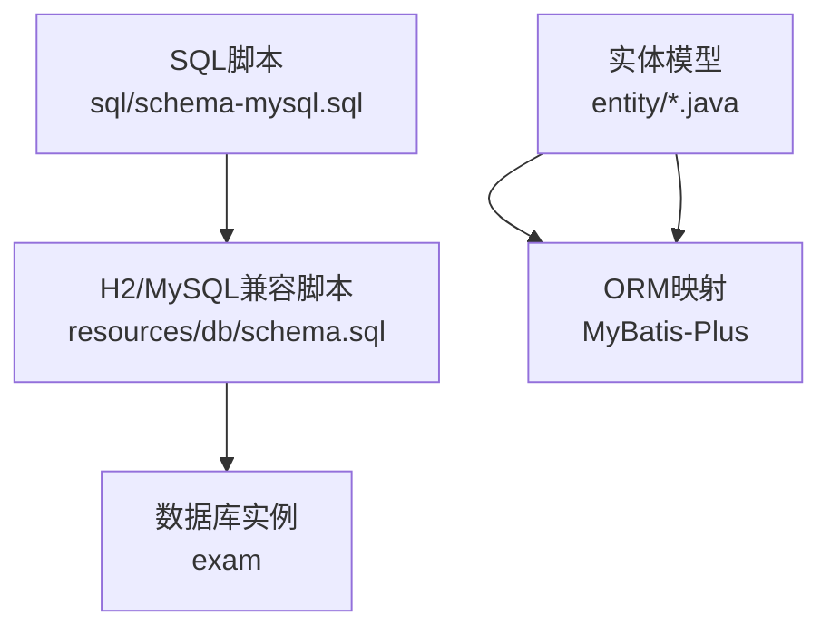
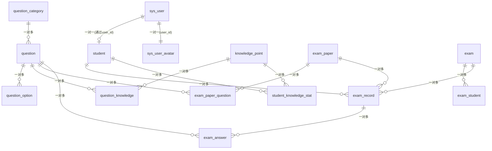
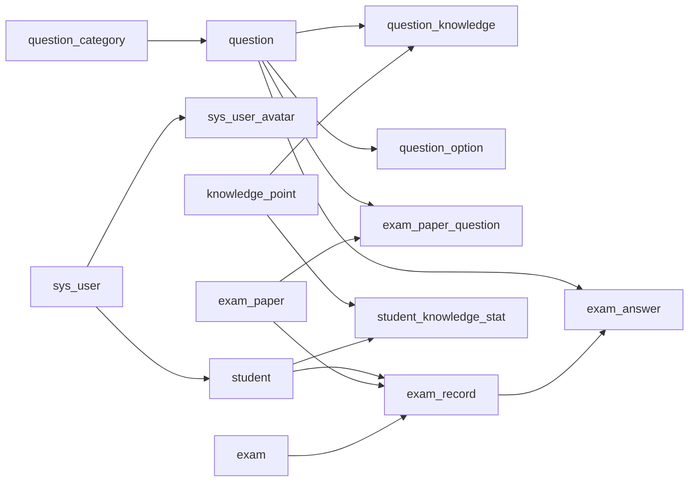

# 数据库表结构

<cite>
**本文引用的文件**
- [schema-mysql.sql](file://sql/schema-mysql.sql)
- [schema.sql](file://exam-server/src/main/resources/db/schema.sql)
- [SysUser.java](file://exam-server/src/main/java/com/exam/entity/SysUser.java)
- [Student.java](file://exam-server/src/main/java/com/exam/entity/Student.java)
- [Question.java](file://exam-server/src/main/java/com/exam/entity/Question.java)
- [QuestionOption.java](file://exam-server/src/main/java/com/exam/entity/QuestionOption.java)
- [KnowledgePoint.java](file://exam-server/src/main/java/com/exam/entity/KnowledgePoint.java)
- [QuestionCategory.java](file://exam-server/src/main/java/com/exam/entity/QuestionCategory.java)
- [ExamPaper.java](file://exam-server/src/main/java/com/exam/entity/ExamPaper.java)
- [Exam.java](file://exam-server/src/main/java/com/exam/entity/Exam.java)
- [ExamRecord.java](file://exam-server/src/main/java/com/exam/entity/ExamRecord.java)
- [ExamAnswer.java](file://exam-server/src/main/java/com/exam/entity/ExamAnswer.java)
- [StudentKnowledgeStat.java](file://exam-server/src/main/java/com/exam/entity/StudentKnowledgeStat.java)
- [SysOperLog.java](file://exam-server/src/main/java/com/exam/entity/SysOperLog.java)
- [SysUserAvatar.java](file://exam-server/src/main/java/com/exam/entity/SysUserAvatar.java)
</cite>

## 目录
1. [简介](#简介)
2. [项目结构](#项目结构)
3. [核心组件](#核心组件)
4. [架构总览](#架构总览)
5. [详细组件分析](#详细组件分析)
6. [依赖关系分析](#依赖关系分析)
7. [性能考虑](#性能考虑)
8. [故障排查指南](#故障排查指南)
9. [结论](#结论)
10. [附录](#附录)

## 简介
本文件为考试系统的数据库表结构文档，覆盖所有数据表的字段定义、数据类型、约束条件与索引策略；说明表间关系与关联规则（主键、唯一键、逻辑外键）；阐述核心业务表（用户、学生、题目、知识点、试卷、考试、答卷、答题明细、学情统计等）的设计思路与字段含义；提供ER关系图与建表脚本说明；并给出数据完整性保证机制与性能优化建议。

## 项目结构
- 数据库脚本位于 sql/schema-mysql.sql 与 exam-server/src/main/resources/db/schema.sql，两者内容一致，分别用于 MySQL 初始化与 H2/MySQL 兼容环境。
- 实体类位于 exam-server/src/main/java/com/exam/entity，对应各表结构，便于理解字段语义与业务含义。

图表来源
- [schema-mysql.sql:1-207](file://sql/schema-mysql.sql#L1-L207)
- [schema.sql:1-204](file://exam-server/src/main/resources/db/schema.sql#L1-L204)

章节来源
- [schema-mysql.sql:1-207](file://sql/schema-mysql.sql#L1-L207)
- [schema.sql:1-204](file://exam-server/src/main/resources/db/schema.sql#L1-L204)

## 核心组件
- 用户与权限：sys_user（登录账号）、sys_user_avatar（头像）、sys_oper_log（操作日志）
- 学生档案：student（与学生账号关联）
- 题库管理：question_category（分类）、question（题目）、question_option（选项）、knowledge_point（知识点树）、question_knowledge（题-知识点多对多）
- 试卷与考试：exam_paper（试卷模板）、exam_paper_question（试卷-题目明细）、exam（真实考试场次）
- 作答与成绩：exam_record（答卷/成绩）、exam_answer（每题答题明细）
- 学情统计：student_knowledge_stat（按知识点掌握度汇总）

章节来源
- [SysUser.java:10-23](file://exam-server/src/main/java/com/exam/entity/SysUser.java#L10-L23)
- [Student.java:10-26](file://exam-server/src/main/java/com/exam/entity/Student.java#L10-L26)
- [Question.java:11-29](file://exam-server/src/main/java/com/exam/entity/Question.java#L11-L29)
- [QuestionOption.java:8-19](file://exam-server/src/main/java/com/exam/entity/QuestionOption.java#L8-L19)
- [KnowledgePoint.java:10-24](file://exam-server/src/main/java/com/exam/entity/KnowledgePoint.java#L10-L24)
- [QuestionCategory.java:10-20](file://exam-server/src/main/java/com/exam/entity/QuestionCategory.java#L10-L20)
- [ExamPaper.java:11-25](file://exam-server/src/main/java/com/exam/entity/ExamPaper.java#L11-L25)
- [Exam.java:11-27](file://exam-server/src/main/java/com/exam/entity/Exam.java#L11-L27)
- [ExamRecord.java:11-28](file://exam-server/src/main/java/com/exam/entity/ExamRecord.java#L11-L28)
- [ExamAnswer.java:11-31](file://exam-server/src/main/java/com/exam/entity/ExamAnswer.java#L11-L31)
- [StudentKnowledgeStat.java:11-27](file://exam-server/src/main/java/com/exam/entity/StudentKnowledgeStat.java#L11-L27)
- [SysOperLog.java:10-21](file://exam-server/src/main/java/com/exam/entity/SysOperLog.java#L10-L21)
- [SysUserAvatar.java:10-19](file://exam-server/src/main/java/com/exam/entity/SysUserAvatar.java#L10-L19)

## 架构总览
系统采用“题库-试卷-考试-答卷”的解耦设计：
- 题库层：题目、选项、分类、知识点及其权重
- 组卷层：试卷模板由题目组合构成，可复用
- 考试层：绑定试卷与时间窗口，控制可见性与提交策略
- 作答层：记录每次考试的答题明细与快照，支持后续阅卷与回溯
- 统计层：基于答题明细与知识点权重，计算学生知识点掌握率

图表来源
- [schema-mysql.sql:5-206](file://sql/schema-mysql.sql#L5-L206)
- [schema.sql:2-203](file://exam-server/src/main/resources/db/schema.sql#L2-L203)

## 详细组件分析

### 用户与权限域
- sys_user：登录账号，包含用户名、密码、姓名、角色、状态、创建/更新时间；username 唯一索引。
- sys_user_avatar：头像二进制存储，content_type、photo、更新时间；主键 user_id 与 sys_user 一对一。
- sys_oper_log：操作日志，记录用户、操作类型、详情与时间。

字段要点
- 角色 role：ADMIN / TEACHER / STUDENT（见实体注释）
- 密码：BCrypt 加密（见实体注释）
- 头像：MEDIUMBLOB 存储图片

索引与约束
- username 唯一索引
- 无显式外键，通过应用层维护一致性

章节来源
- [schema-mysql.sql:5-15](file://sql/schema-mysql.sql#L5-L15)
- [schema-mysql.sql:192-199](file://sql/schema-mysql.sql#L192-L199)
- [schema-mysql.sql:201-206](file://sql/schema-mysql.sql#L201-L206)
- [SysUser.java:10-23](file://exam-server/src/main/java/com/exam/entity/SysUser.java#L10-L23)
- [SysUserAvatar.java:10-19](file://exam-server/src/main/java/com/exam/entity/SysUserAvatar.java#L10-L19)
- [SysOperLog.java:10-21](file://exam-server/src/main/java/com/exam/entity/SysOperLog.java#L10-L21)

### 学生档案域
- student：考生档案，关联 user_id，包含学号、姓名、院系、班级、联系方式、状态、时间戳；学号唯一，user_id 与 department 有索引。

字段要点
- user_id：关联登录账号
- status：启用/禁用标志

索引与约束
- 学号唯一索引
- user_id、department 查询索引

章节来源
- [schema-mysql.sql:17-32](file://sql/schema-mysql.sql#L17-L32)
- [Student.java:10-26](file://exam-server/src/main/java/com/exam/entity/Student.java#L10-L26)

### 题库域
- question_category：题目分类，支持父子层级（parent_id），排序字段 sort_no。
- question：题目主体，包含题型、题干、正确答案、解析、难度、默认分值、可见性、状态、创建人、时间戳；category_id、question_type 有索引。
- question_option：选择题选项，包含选项键、内容、是否正确答案、排序；question_id 有索引。
- knowledge_point：知识点树，parent_id=0 为根节点，支持编码、排序、状态、创建人与时间戳；parent_id 有索引。
- question_knowledge：题目与知识点的多对多关系，含权重 weight；联合唯一键 (question_id, knowledge_point_id)，knowledge_point_id 有索引。

字段要点
- 题型：SINGLE/MULTIPLE/JUDGE/FILL/ESSAY（见实体注释）
- 可见性 visibility：PUBLIC 等
- 权重 weight：用于学情统计分摊分数

索引与约束
- 分类、题型、选项、知识点维度均有索引
- 题-知识点联合唯一约束

章节来源
- [schema-mysql.sql:47-90](file://sql/schema-mysql.sql#L47-L90)
- [schema.sql:44-87](file://exam-server/src/main/resources/db/schema.sql#L44-L87)
- [QuestionCategory.java:10-20](file://exam-server/src/main/java/com/exam/entity/QuestionCategory.java#L10-L20)
- [Question.java:11-29](file://exam-server/src/main/java/com/exam/entity/Question.java#L11-L29)
- [QuestionOption.java:8-19](file://exam-server/src/main/java/com/exam/entity/QuestionOption.java#L8-L19)
- [KnowledgePoint.java:10-24](file://exam-server/src/main/java/com/exam/entity/KnowledgePoint.java#L10-L24)
- [QuestionKnowledge.java:10-19](file://exam-server/src/main/java/com/exam/entity/QuestionKnowledge.java#L10-L19)

### 试卷与考试域
- exam_paper：试卷模板，包含名称、总分、及格分、题数、状态、创建人与时间戳。
- exam_paper_question：试卷-题目明细，包含题目分值、排序；(paper_id, question_id) 联合唯一，paper_id 有索引。
- exam：真实考试场次，绑定 paper_id，包含起止时间、时长、允许补交分钟数、结果/答案可见性、状态、创建人与时间；start_time/end_time 复合索引。

字段要点
- 考试与试卷分离：试卷可被多场考试复用
- 结果/答案可见性：控制考后展示

索引与约束
- 试卷-题目联合唯一约束
- 考试时间范围复合索引

章节来源
- [schema-mysql.sql:92-128](file://sql/schema-mysql.sql#L92-L128)
- [schema.sql:89-125](file://exam-server/src/main/resources/db/schema.sql#L89-L125)
- [ExamPaper.java:11-25](file://exam-server/src/main/java/com/exam/entity/ExamPaper.java#L11-L25)
- [Exam.java:11-27](file://exam-server/src/main/java/com/exam/entity/Exam.java#L11-L27)

### 作答与成绩域
- exam_record：一份答卷/成绩，绑定 exam_id、paper_id、student_id，包含开始/提交时间、客观/主观/总分、是否通过、提交方式、记录状态；(exam_id, student_id) 联合唯一，student_id、(exam_id, total_score) 有索引。
- exam_answer：每题答题明细，绑定 record_id、question_id，包含学生答案、正确答案快照、题干与题型快照、题目分值、得分、是否正确、是否标记、评语、批改人与时间、更新时间；(record_id, question_id) 联合唯一，record_id 有索引。

字段要点
- 快照设计：保存答题时的题目与答案快照，避免题库变更影响历史
- 记录状态：ANSWERING / SUBMITTED / MARKING / FINISHED（见实体注释）

索引与约束
- 答卷-题目联合唯一约束
- 按学生与考试维度的查询索引

章节来源
- [schema-mysql.sql:138-174](file://sql/schema-mysql.sql#L138-L174)
- [schema.sql:135-171](file://exam-server/src/main/resources/db/schema.sql#L135-L171)
- [ExamRecord.java:11-28](file://exam-server/src/main/java/com/exam/entity/ExamRecord.java#L11-L28)
- [ExamAnswer.java:11-31](file://exam-server/src/main/java/com/exam/entity/ExamAnswer.java#L11-L31)

### 学情统计域
- student_knowledge_stat：学生知识点掌握汇总，包含考试次数、题目次数、正确次数、得分/满分、掌握率、最近一次考试ID、更新时间；(student_id, knowledge_point_id) 联合唯一，(knowledge_point_id, mastery_rate) 有索引。

字段要点
- 掌握率：基于答题明细与知识点权重回写计算
- 最近考试：last_exam_id 便于快速定位最新表现

索引与约束
- 学生-知识点联合唯一约束
- 按知识点与掌握率查询索引

章节来源
- [schema-mysql.sql:176-190](file://sql/schema-mysql.sql#L176-L190)
- [schema.sql:173-187](file://exam-server/src/main/resources/db/schema.sql#L173-L187)
- [StudentKnowledgeStat.java:11-27](file://exam-server/src/main/java/com/exam/entity/StudentKnowledgeStat.java#L11-L27)

## 依赖关系分析
- 逻辑外键关系（应用层维护）：
  - student.user_id → sys_user.id
  - question.category_id → question_category.id
  - question_knowledge.question_id → question.id
  - question_knowledge.knowledge_point_id → knowledge_point.id
  - exam_paper_question.paper_id → exam_paper.id
  - exam_paper_question.question_id → question.id
  - exam.paper_id → exam_paper.id
  - exam_record.exam_id → exam.id
  - exam_record.paper_id → exam_paper.id
  - exam_record.student_id → student.id
  - exam_answer.record_id → exam_record.id
  - exam_answer.question_id → question.id
  - student_knowledge_stat.student_id → student.id
  - student_knowledge_stat.knowledge_point_id → knowledge_point.id
  - sys_user_avatar.user_id → sys_user.id

- 唯一键与索引：
  - 账号唯一：sys_user.username
  - 学号唯一：student.student_no
  - 题-知识点唯一：question_knowledge(question_id, knowledge_point_id)
  - 试卷-题目唯一：exam_paper_question(paper_id, question_id)
  - 答卷-题目唯一：exam_answer(record_id, question_id)
  - 学生-知识点唯一：student_knowledge_stat(student_id, knowledge_point_id)
  - 常见查询索引：question(category_id, question_type)、exam(start_time, end_time)、exam_record(student_id, exam_id)、exam_answer(record_id) 等

图表来源
- [schema-mysql.sql:5-206](file://sql/schema-mysql.sql#L5-L206)
- [schema.sql:2-203](file://exam-server/src/main/resources/db/schema.sql#L2-L203)

章节来源
- [schema-mysql.sql:5-206](file://sql/schema-mysql.sql#L5-L206)
- [schema.sql:2-203](file://exam-server/src/main/resources/db/schema.sql#L2-L203)

## 性能考虑
- 索引策略
  - 高频查询列建立索引：如 exam(start_time, end_time)、exam_record(student_id, exam_id)、exam_answer(record_id)、question(category_id, question_type)
  - 复合唯一键保障数据唯一性同时提升去重与连接效率
- 快照与冗余
  - exam_answer 中保存正确答案与题干快照，避免热点题库更新导致历史数据抖动
  - exam_record 冗余 paper_id，减少跨表连接
- 大字段与存储
  - 头像使用 MEDIUMBLOB，注意备份与传输体积；必要时可拆分至对象存储
- 事务与一致性
  - 答卷提交、评分、统计回写建议在事务内完成，确保分数与掌握率一致
- 扩展性
  - 知识点权重与掌握率计算可异步化，降低在线路径压力
  - 日志表 sys_oper_log 可定期归档或分区

[本节为通用性能建议，不直接分析具体文件]

## 故障排查指南
- 重复插入
  - 检查唯一键冲突：如 uk_sys_user_username、uk_student_no、uk_paper_question、uk_record_question、uk_student_kp
- 成绩不一致
  - 核对 exam_answer 快照与 question 当前值差异，确认是否因题库变更导致
  - 检查 exam_record 总分与客观/主观分加和是否一致
- 访问异常
  - 确认 student.user_id 是否存在于 sys_user
  - 确认 exam_record 的 exam_id/paper_id/student_id 均有效
- 性能问题
  - 查看慢查询是否命中索引：exam(start_time, end_time)、exam_answer(record_id)、exam_record(student_id)
  - 评估大字段读取开销，必要时分页或延迟加载

章节来源
- [schema-mysql.sql:5-206](file://sql/schema-mysql.sql#L5-L206)
- [schema.sql:2-203](file://exam-server/src/main/resources/db/schema.sql#L2-L203)

## 结论
本数据库设计将题库、试卷、考试与作答解耦，通过快照与冗余字段保障历史数据稳定性与查询性能；利用唯一键与索引保证数据一致性与检索效率；以知识点权重驱动学情统计，形成闭环的数据分析与教学反馈。整体结构清晰、可扩展性强，适合大规模考试场景。

[本节为总结性内容，不直接分析具体文件]

## 附录

### ER 关系图（代码级映射）

```mermaid
erDiagram
sys_user {
bigint id PK
varchar username UK
varchar password
varchar real_name
varchar role
tinyint status
datetime created_at
datetime updated_at
}
student {
bigint id PK
bigint user_id FK
varchar student_no UK
varchar name
varchar department
varchar class_name
varchar phone
varchar email
tinyint status
datetime created_at
datetime updated_at
}
question_category {
bigint id PK
varchar category_name
bigint parent_id
int sort_no
datetime created_at
}
question {
bigint id PK
bigint category_id FK
varchar question_type
text content
text correct_answer
text analysis
tinyint difficulty
decimal default_score
varchar visibility
tinyint status
bigint created_by
datetime created_at
datetime updated_at
}
question_option {
bigint id PK
bigint question_id FK
varchar option_key
text option_content
tinyint is_correct
int sort_no
}
knowledge_point {
bigint id PK
bigint parent_id
varchar name
varchar code
int sort_no
tinyint status
bigint created_by
datetime created_at
datetime updated_at
}
question_knowledge {
bigint id PK
bigint question_id FK
bigint knowledge_point_id FK
decimal weight
}
exam_paper {
bigint id PK
varchar paper_name
decimal total_score
decimal pass_score
int question_count
tinyint status
bigint created_by
datetime created_at
datetime updated_at
}
exam_paper_question {
bigint id PK
bigint paper_id FK
bigint question_id FK
decimal question_score
int sort_no
}
exam {
bigint id PK
varchar exam_name
bigint paper_id FK
datetime start_time
datetime end_time
int duration_minutes
int allow_submit_minutes
tinyint result_visible
tinyint answer_visible
varchar status
bigint created_by
datetime created_at
}
exam_record {
bigint id PK
bigint exam_id FK
bigint paper_id FK
bigint student_id FK
datetime start_time
datetime submit_time
decimal objective_score
decimal subjective_score
decimal total_score
tinyint passed
varchar submit_type
varchar record_status
}
exam_answer {
bigint id PK
bigint record_id FK
bigint question_id FK
text student_answer
text correct_answer_snapshot
text question_content_snapshot
varchar question_type_snapshot
decimal question_score
decimal score
tinyint is_correct
tinyint flagged
text comment
bigint marked_by
datetime marked_at
datetime updated_at
}
student_knowledge_stat {
bigint id PK
bigint student_id FK
bigint knowledge_point_id FK
int exam_count
int question_count
int correct_count
decimal got_score
decimal full_score
decimal mastery_rate
bigint last_exam_id
datetime updated_at
}
sys_oper_log {
bigint id PK
bigint user_id
varchar username
varchar operation
text detail
datetime created_at
}
sys_user_avatar {
bigint user_id PK
varchar content_type
mediumblob photo
datetime updated_at
}
```

图表来源
- [schema-mysql.sql:5-206](file://sql/schema-mysql.sql#L5-L206)
- [schema.sql:2-203](file://exam-server/src/main/resources/db/schema.sql#L2-L203)

### 建表脚本说明
- 推荐使用 sql/schema-mysql.sql 进行 MySQL 初始化，该脚本会创建数据库 exam 并建表，字符集 utf8mb4，排序规则 utf8mb4_unicode_ci。
- resources/db/schema.sql 为 H2/MySQL 兼容脚本，适用于开发测试环境。
- 执行顺序：先创建数据库，再执行建表脚本；如需重置，请先删除库或清空表后再执行。

章节来源
- [schema-mysql.sql:1-3](file://sql/schema-mysql.sql#L1-L3)
- [schema.sql:1-2](file://exam-server/src/main/resources/db/schema.sql#L1-L2)