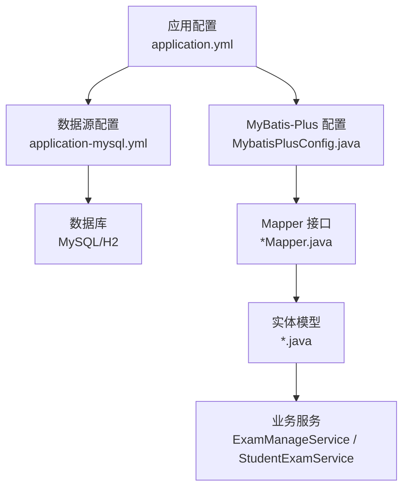
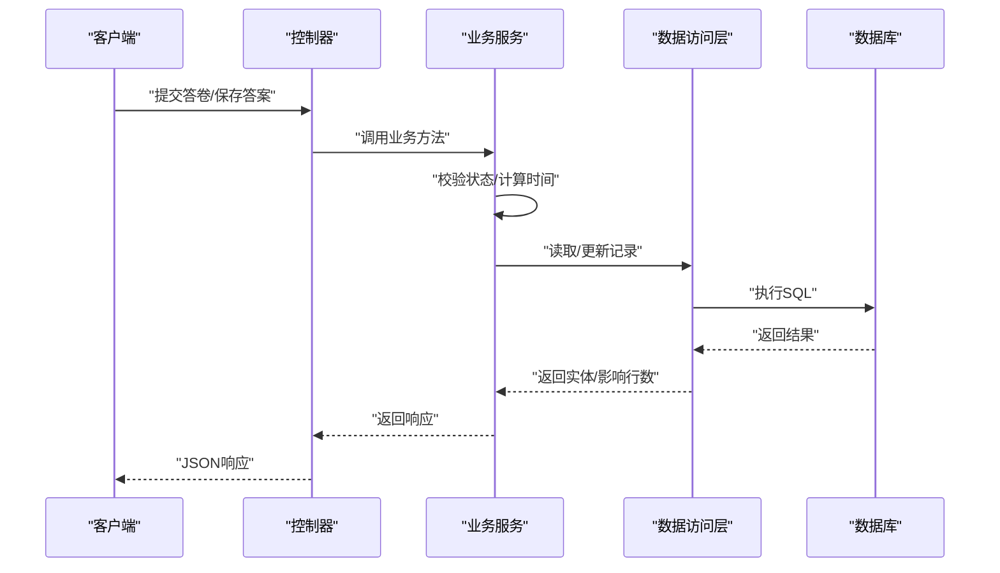
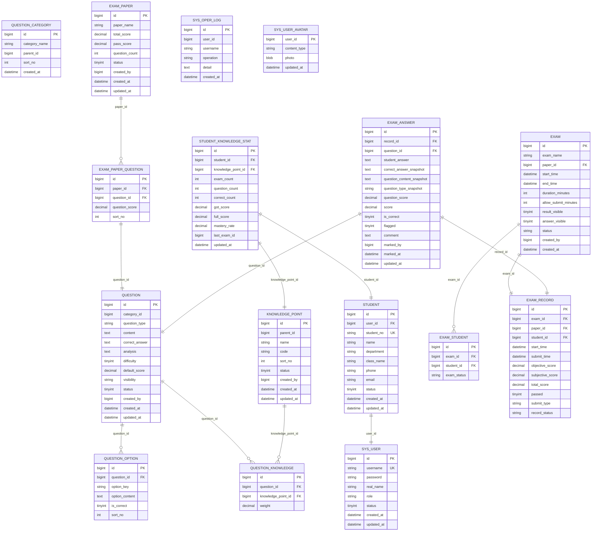
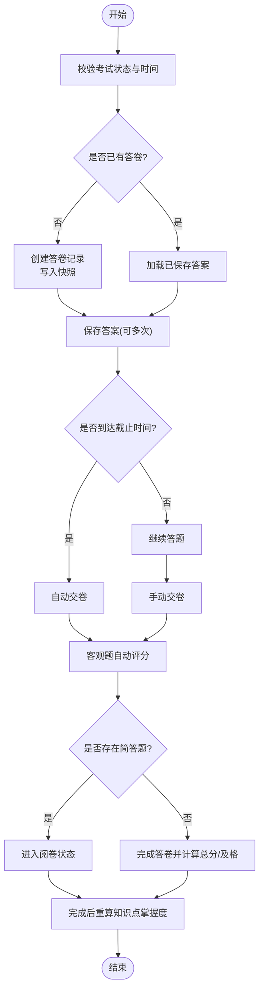
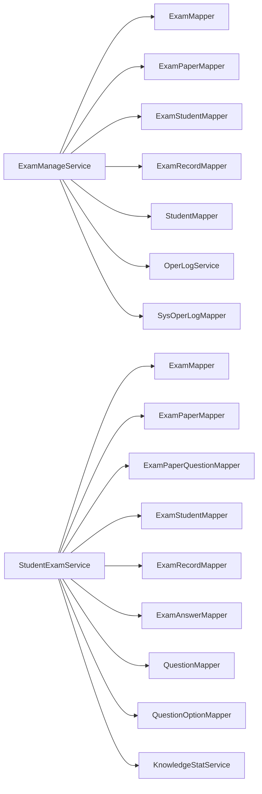

# 数据架构

<cite>
**本文引用的文件**
- [schema-mysql.sql](file://sql/schema-mysql.sql)
- [schema.sql](file://exam-server/src/main/resources/db/schema.sql)
- [application.yml](file://exam-server/src/main/resources/application.yml)
- [application-mysql.yml](file://exam-server/src/main/resources/application-mysql.yml)
- [MybatisPlusConfig.java](file://exam-server/src/main/java/com/exam/config/MybatisPlusConfig.java)
- [SysUser.java](file://exam-server/src/main/java/com/exam/entity/SysUser.java)
- [Exam.java](file://exam-server/src/main/java/com/exam/entity/Exam.java)
- [Question.java](file://exam-server/src/main/java/com/exam/entity/Question.java)
- [ExamRecord.java](file://exam-server/src/main/java/com/exam/entity/ExamRecord.java)
- [Student.java](file://exam-server/src/main/java/com/exam/entity/Student.java)
- [SysUserMapper.java](file://exam-server/src/main/java/com/exam/mapper/SysUserMapper.java)
- [ExamMapper.java](file://exam-server/src/main/java/com/exam/mapper/ExamMapper.java)
- [ExamManageService.java](file://exam-server/src/main/java/com/exam/service/ExamManageService.java)
- [StudentExamService.java](file://exam-server/src/main/java/com/exam/service/StudentExamService.java)
</cite>

## 目录
1. [简介](#简介)
2. [项目结构](#项目结构)
3. [核心组件](#核心组件)
4. [架构总览](#架构总览)
5. [详细组件分析](#详细组件分析)
6. [依赖关系分析](#依赖关系分析)
7. [性能考虑](#性能考虑)
8. [故障排查指南](#故障排查指南)
9. [结论](#结论)
10. [附录](#附录)

## 简介
本数据架构文档聚焦考试系统的数据存储与管理设计，覆盖数据库表结构与实体关系映射、外键与索引约束、ORM（MyBatis Plus）配置与使用模式、数据访问层设计与查询优化、数据一致性保障（事务与并发控制）、备份恢复方案与性能优化策略，并提供数据流向图与ER关系图，帮助读者全面理解系统的数据模型与运行机制。

## 项目结构
- 数据定义：MySQL/H2 兼容的建库建表脚本位于 resources/db/schema.sql；生产级 MySQL 脚本位于 sql/schema-mysql.sql。
- ORM 配置：application.yml 启用 SQL 初始化与 MyBatis-Plus 基础配置；application-mysql.yml 提供 MySQL 数据源；MybatisPlusConfig.java 开启分页插件。
- 实体与映射：entity 包下为领域模型类，mapper 包下为继承 BaseMapper 的接口，service 层通过 Mapper 进行数据访问并封装业务事务。
- 服务流程：学生考试主流程在 StudentExamService 中实现，包含开始答题、保存答案、交卷评分等关键步骤；考试管理在 ExamManageService 中实现，包含发布、停止、统计等。

图表来源
- [application.yml:9-29](file://exam-server/src/main/resources/application.yml#L9-L29)
- [application-mysql.yml:1-12](file://exam-server/src/main/resources/application-mysql.yml#L1-L12)
- [MybatisPlusConfig.java:9-18](file://exam-server/src/main/java/com/exam/config/MybatisPlusConfig.java#L9-L18)

章节来源
- [application.yml:9-29](file://exam-server/src/main/resources/application.yml#L9-L29)
- [application-mysql.yml:1-12](file://exam-server/src/main/resources/application-mysql.yml#L1-L12)
- [MybatisPlusConfig.java:9-18](file://exam-server/src/main/java/com/exam/config/MybatisPlusConfig.java#L9-L18)

## 核心组件
- 数据源与初始化：Spring Boot 自动初始化 schema，支持 H2 与 MySQL 双环境；SQL 初始化位置与编码由 application.yml 指定。
- ORM 框架：MyBatis-Plus 启用驼峰映射与分页插件；Mapper 接口继承 BaseMapper，提供通用 CRUD；实体类通过 @TableName/@TableId 映射表与主键。
- 数据访问层：各模块 Mapper 仅暴露接口，具体 SQL 由 MP 生成或 XML 扩展；复杂查询通过 LambdaQueryWrapper 构建条件。
- 业务服务：ExamManageService 负责考试任务生命周期管理；StudentExamService 负责学生答题、保存答案、交卷评分与知识掌握度重算。

章节来源
- [application.yml:9-29](file://exam-server/src/main/resources/application.yml#L9-L29)
- [MybatisPlusConfig.java:9-18](file://exam-server/src/main/java/com/exam/config/MybatisPlusConfig.java#L9-L18)
- [SysUserMapper.java:7-10](file://exam-server/src/main/java/com/exam/mapper/SysUserMapper.java#L7-L10)
- [ExamMapper.java:7-10](file://exam-server/src/main/java/com/exam/mapper/ExamMapper.java#L7-L10)
- [ExamManageService.java:36-46](file://exam-server/src/main/java/com/exam/service/ExamManageService.java#L36-L46)
- [StudentExamService.java:38-53](file://exam-server/src/main/java/com/exam/service/StudentExamService.java#L38-L53)

## 架构总览
系统采用分层架构：Controller → Service → Mapper → Database。数据流从前端请求进入 Controller，经 Service 编排业务逻辑与事务边界，调用 Mapper 完成持久化操作，最终落盘到数据库。

图表来源
- [StudentExamService.java:94-140](file://exam-server/src/main/java/com/exam/service/StudentExamService.java#L94-L140)
- [StudentExamService.java:149-194](file://exam-server/src/main/java/com/exam/service/StudentExamService.java#L149-L194)

## 详细组件分析

### 数据库表结构与实体关系映射
- 用户与角色：sys_user 存储登录账号与角色；student 通过 user_id 关联 sys_user，形成一对一档案关系。
- 题目与选项：question 为主表，question_option 通过 question_id 关联，表示多选题/单选题选项集合。
- 知识点与题目关联：knowledge_point 为知识点树；question_knowledge 将题目与知识点多对多关联，含权重字段。
- 试卷与题目：exam_paper 为模板；exam_paper_question 将题目加入试卷并设定分值与顺序。
- 考试与考生：exam 为一次真实考试实例；exam_student 将考生与考试绑定，记录考试状态。
- 答卷与答案：exam_record 为一份答卷；exam_answer 为每道题的答案快照，包含正确答案快照、题目内容快照、类型快照与得分。
- 统计与日志：student_knowledge_stat 维护学生知识点掌握度；sys_oper_log 记录操作日志；sys_user_avatar 存储头像。

图表来源
- [schema-mysql.sql:5-207](file://sql/schema-mysql.sql#L5-L207)
- [schema.sql:2-204](file://exam-server/src/main/resources/db/schema.sql#L2-L204)

章节来源
- [schema-mysql.sql:5-207](file://sql/schema-mysql.sql#L5-L207)
- [schema.sql:2-204](file://exam-server/src/main/resources/db/schema.sql#L2-L204)

### ORM 配置与使用模式
- 数据源与初始化：application.yml 设置 SQL 初始化模式与位置；application-mysql.yml 提供 MySQL 驱动与连接参数。
- MyBatis-Plus：启用 mapUnderscoreToCamelCase 与分页插件；Mapper 接口继承 BaseMapper，无需手写 SQL 即可使用通用 CRUD。
- 实体映射：实体类使用 @TableName 指定表名，@TableId(type = AUTO) 指定自增主键；时间字段使用 LocalDateTime。

章节来源
- [application.yml:9-29](file://exam-server/src/main/resources/application.yml#L9-L29)
- [application-mysql.yml:1-12](file://exam-server/src/main/resources/application-mysql.yml#L1-L12)
- [MybatisPlusConfig.java:9-18](file://exam-server/src/main/java/com/exam/config/MybatisPlusConfig.java#L9-L18)
- [SysUser.java:10-23](file://exam-server/src/main/java/com/exam/entity/SysUser.java#L10-L23)
- [Exam.java:10-27](file://exam-server/src/main/java/com/exam/entity/Exam.java#L10-L27)
- [Question.java:11-29](file://exam-server/src/main/java/com/exam/entity/Question.java#L11-L29)
- [ExamRecord.java:11-28](file://exam-server/src/main/java/com/exam/entity/ExamRecord.java#L11-L28)
- [Student.java:10-26](file://exam-server/src/main/java/com/exam/entity/Student.java#L10-L26)

### 数据访问层设计与查询优化策略
- Mapper 接口：所有 Mapper 继承 BaseMapper，提供 selectPage/selectList/selectById 等通用方法；复杂条件通过 LambdaQueryWrapper 构建。
- 分页查询：MybatisPlusConfig 启用 PaginationInnerInterceptor，配合 Page 对象实现高效分页。
- 索引优化：数据库脚本为高频查询列建立索引，如 exam(start_time,end_time)、exam_record(exam_id,total_score)、question(category_id,question_type) 等。
- 快照设计：exam_answer 保存题目内容与正确答案快照，避免后续题目变更影响历史答卷。

章节来源
- [MybatisPlusConfig.java:9-18](file://exam-server/src/main/java/com/exam/config/MybatisPlusConfig.java#L9-L18)
- [ExamManageService.java:48-63](file://exam-server/src/main/java/com/exam/service/ExamManageService.java#L48-L63)
- [schema-mysql.sql:114-174](file://sql/schema-mysql.sql#L114-L174)
- [schema.sql:111-172](file://exam-server/src/main/resources/db/schema.sql#L111-L172)

### 数据一致性保证机制
- 事务管理：关键写操作使用 @Transactional 标注，确保多表写入原子性，如保存考试任务、发布/停止考试、创建答卷与快照、交卷评分等。
- 并发控制：
  - 唯一约束：exam_student(exam_id,student_id)、exam_record(exam_id,student_id)、exam_answer(record_id,question_id) 防止重复绑定与重复答案。
  - 乐观锁式状态更新：交卷时通过 update where record_status='ANSWERING' 防止重复提交。
  - 业务校验：检查考试时间、允许提交窗口、答卷状态等，避免非法并发操作。
- 幂等性：多次保存答案会覆盖同题答案；交卷流程通过状态机与唯一约束保证幂等。

章节来源
- [ExamManageService.java:77-134](file://exam-server/src/main/java/com/exam/service/ExamManageService.java#L77-L134)
- [StudentExamService.java:94-140](file://exam-server/src/main/java/com/exam/service/StudentExamService.java#L94-L140)
- [StudentExamService.java:149-194](file://exam-server/src/main/java/com/exam/service/StudentExamService.java#L149-L194)
- [schema-mysql.sql:130-174](file://sql/schema-mysql.sql#L130-L174)
- [schema.sql:127-172](file://exam-server/src/main/resources/db/schema.sql#L127-L172)

### 数据流向图

图表来源
- [StudentExamService.java:94-140](file://exam-server/src/main/java/com/exam/service/StudentExamService.java#L94-L140)
- [StudentExamService.java:149-194](file://exam-server/src/main/java/com/exam/service/StudentExamService.java#L149-L194)
- [StudentExamService.java:258-309](file://exam-server/src/main/java/com/exam/service/StudentExamService.java#L258-L309)

### ER 关系图
见“数据库表结构与实体关系映射”中的 ER 图，展示主要实体间的一对一、一对多、多对多关系及约束。

图表来源
- [schema-mysql.sql:5-207](file://sql/schema-mysql.sql#L5-L207)
- [schema.sql:2-204](file://exam-server/src/main/resources/db/schema.sql#L2-L204)

## 依赖关系分析
- 服务层依赖：ExamManageService 依赖 ExamMapper、ExamPaperMapper、ExamStudentMapper、ExamRecordMapper、StudentMapper、OperLogService、SysOperLogMapper。
- 学生考试服务依赖：StudentExamService 依赖 ExamMapper、ExamPaperMapper、ExamPaperQuestionMapper、ExamStudentMapper、ExamRecordMapper、ExamAnswerMapper、QuestionMapper、QuestionOptionMapper、KnowledgeStatService。
- 实体与 Mapper：实体类通过注解与表映射；Mapper 接口继承 BaseMapper，无直接耦合于具体 SQL。
- 外部依赖：MySQL 驱动、MyBatis-Plus、Spring Security（JWT）等。

图表来源
- [ExamManageService.java:36-46](file://exam-server/src/main/java/com/exam/service/ExamManageService.java#L36-L46)
- [StudentExamService.java:38-53](file://exam-server/src/main/java/com/exam/service/StudentExamService.java#L38-L53)

章节来源
- [ExamManageService.java:36-46](file://exam-server/src/main/java/com/exam/service/ExamManageService.java#L36-L46)
- [StudentExamService.java:38-53](file://exam-server/src/main/java/com/exam/service/StudentExamService.java#L38-L53)

## 性能考虑
- 索引设计：为高频查询列建立复合索引，如 exam(start_time,end_time)、exam_record(exam_id,total_score)、question(category_id,question_type)、exam_answer(record_id)、student_knowledge_stat(knowledge_point_id,mastery_rate)。
- 分页查询：使用 MyBatis-Plus 分页插件，避免全表扫描；大数据量列表务必分页。
- 快照减少关联：exam_answer 保存题目与答案快照，降低交卷后题目变更带来的关联查询成本。
- 批量写入：保存答案循环更新，建议在高并发场景下评估批量插入/更新以提升吞吐。
- 统计聚合：dashboard 统计涉及多表聚合，建议在热点报表上引入物化视图或缓存层。

章节来源
- [schema-mysql.sql:114-190](file://sql/schema-mysql.sql#L114-L190)
- [schema.sql:111-187](file://exam-server/src/main/resources/db/schema.sql#L111-L187)
- [MybatisPlusConfig.java:9-18](file://exam-server/src/main/java/com/exam/config/MybatisPlusConfig.java#L9-L18)
- [ExamManageService.java:192-262](file://exam-server/src/main/java/com/exam/service/ExamManageService.java#L192-L262)

## 故障排查指南
- 常见错误：
  - “考试不存在/已结束/尚未开始”：检查 exam 状态与时间范围。
  - “请勿重复交卷”：检查 exam_record.record_status 是否为 ANSWERING；确认唯一约束与状态更新条件。
  - “本场考试已交卷”：检查 exam_record 是否存在且状态非 ANSWERING。
  - “请先指定考生”：检查 exam_student 是否已绑定考生。
- 定位方法：
  - 查看日志：SysOperLog 记录操作日志；结合异常信息定位问题。
  - 检查事务：确认 @Transactional 是否正确标注，避免部分写入导致不一致。
  - 验证约束：通过数据库唯一索引与业务校验双重保障，排查重复数据。

章节来源
- [ExamManageService.java:65-134](file://exam-server/src/main/java/com/exam/service/ExamManageService.java#L65-L134)
- [StudentExamService.java:94-194](file://exam-server/src/main/java/com/exam/service/StudentExamService.java#L94-L194)
- [schema-mysql.sql:130-174](file://sql/schema-mysql.sql#L130-L174)
- [schema.sql:127-172](file://exam-server/src/main/resources/db/schema.sql#L127-L172)

## 结论
本系统以清晰的表结构与合理的索引设计为基础，结合 MyBatis-Plus 的 ORM 能力与 Spring 事务管理，实现了高一致性的考试业务流程。通过快照机制与状态机控制，保障了答卷数据的完整性与可追溯性。未来可在批量写入、统计聚合与缓存方面进一步优化，提升整体性能与可扩展性。

## 附录
- 备份恢复建议：
  - 定期全量备份：mysqldump 或云厂商备份工具，保留最近 N 份备份。
  - 增量备份：开启 binlog，按时间点恢复。
  - 恢复演练：定期演练恢复流程，确保 RTO/RPO 达标。
- 安全与合规：
  - 密码加密：sys_user.password 使用 BCrypt 存储。
  - 敏感数据脱敏：导出报表时对个人信息进行脱敏处理。
  - 审计日志：SysOperLog 记录关键操作，便于审计与追责。