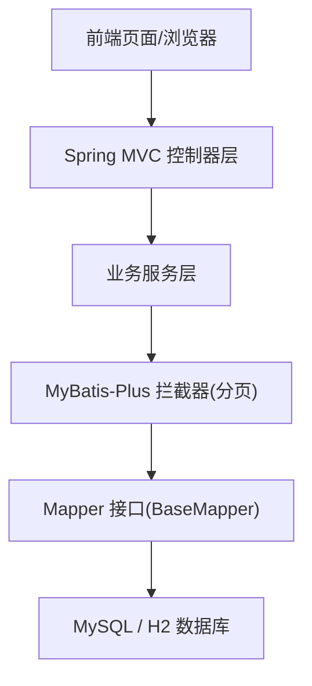
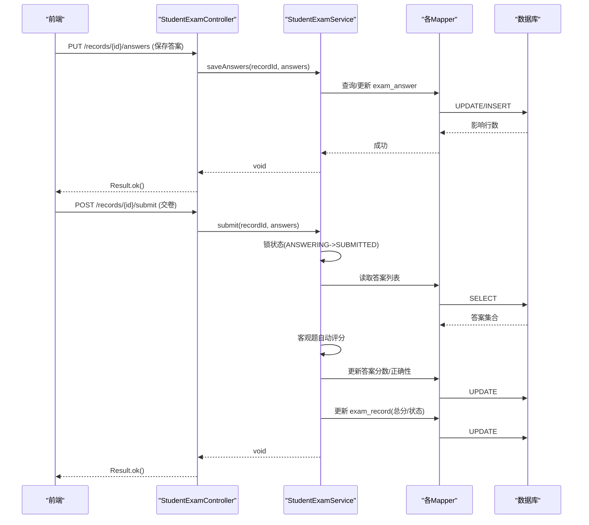
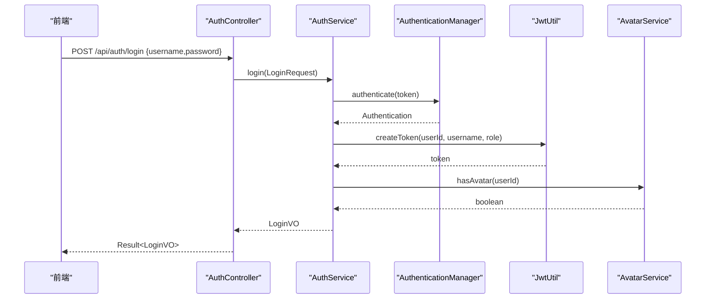
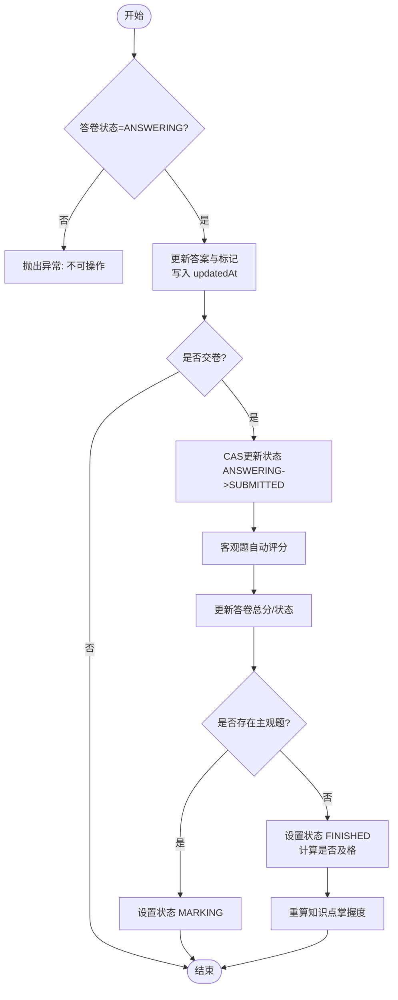
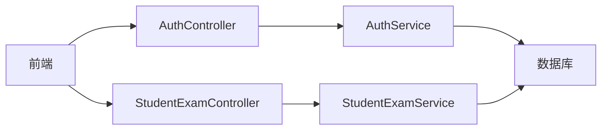
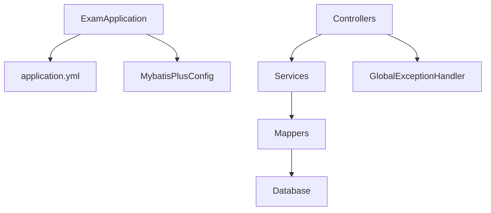

# 数据流设计

<cite>
**本文引用的文件**
- [ExamApplication.java](file://exam-server/src/main/java/com/exam/ExamApplication.java)
- [application.yml](file://exam-server/src/main/resources/application.yml)
- [MybatisPlusConfig.java](file://exam-server/src/main/java/com/exam/config/MybatisPlusConfig.java)
- [GlobalExceptionHandler.java](file://exam-server/src/main/java/com/exam/common/GlobalExceptionHandler.java)
- [AuthController.java](file://exam-server/src/main/java/com/exam/controller/AuthController.java)
- [AuthService.java](file://exam-server/src/main/java/com/exam/service/AuthService.java)
- [SysUser.java](file://exam-server/src/main/java/com/exam/entity/SysUser.java)
- [SysUserMapper.java](file://exam-server/src/main/java/com/exam/mapper/SysUserMapper.java)
- [LoginRequest.java](file://exam-server/src/main/java/com/exam/dto/LoginRequest.java)
- [StudentExamController.java](file://exam-server/src/main/java/com/exam/controller/StudentExamController.java)
- [StudentExamService.java](file://exam-server/src/main/java/com/exam/service/StudentExamService.java)
- [ExamRecord.java](file://exam-server/src/main/java/com/exam/entity/ExamRecord.java)
- [ExamAnswer.java](file://exam-server/src/main/java/com/exam/entity/ExamAnswer.java)
- [AnswerSaveRequest.java](file://exam-server/src/main/java/com/exam/dto/AnswerSaveRequest.java)
- [schema.sql](file://sql/schema.sql)
</cite>

## 目录
1. [简介](#简介)
2. [项目结构](#项目结构)
3. [核心组件](#核心组件)
4. [架构总览](#架构总览)
5. [详细组件分析](#详细组件分析)
6. [依赖关系分析](#依赖关系分析)
7. [性能与并发](#性能与并发)
8. [故障排查指南](#故障排查指南)
9. [结论](#结论)
10. [附录](#附录)

## 简介
本文件面向考试系统的数据流设计，聚焦从前端请求到数据库落库的完整链路，覆盖 Controller、Service、Mapper 三层的数据传递与转换；阐述数据一致性保障机制与并发控制策略；给出关键业务流程的数据流向图；并补充备份恢复方案与性能监控指标建议。

## 项目结构
后端采用 Spring Boot + MyBatis-Plus 的分层架构：
- 启动与配置：应用入口扫描 Mapper，统一配置数据库初始化、Jackson 序列化、分页插件等。
- 控制器层：对外暴露 REST API，负责参数校验、权限上下文获取、调用 Service。
- 服务层：封装业务规则、事务边界、状态机流转、评分计算、快照写入等。
- 持久层：通过 MyBatis-Plus 的 BaseMapper 与实体映射完成 SQL 执行。
- 数据模型：以 MySQL/H2 兼容建表脚本定义核心表结构与索引。

图表来源
- [ExamApplication.java:10-14](file://exam-server/src/main/java/com/exam/ExamApplication.java#L10-L14)
- [MybatisPlusConfig.java:11-17](file://exam-server/src/main/java/com/exam/config/MybatisPlusConfig.java#L11-L17)
- [application.yml:26-29](file://exam-server/src/main/resources/application.yml#L26-L29)

章节来源
- [ExamApplication.java:10-14](file://exam-server/src/main/java/com/exam/ExamApplication.java#L10-L14)
- [application.yml:1-42](file://exam-server/src/main/resources/application.yml#L1-L42)
- [MybatisPlusConfig.java:11-17](file://exam-server/src/main/java/com/exam/config/MybatisPlusConfig.java#L11-L17)

## 核心组件
- 认证与用户信息
  - 登录流程：Controller 接收 LoginRequest，Service 使用 AuthenticationManager 校验，签发 JWT，返回包含角色、头像等信息的 LoginVO。
  - 用户实体 SysUser 与 Mapper 提供基础账户能力。
- 学生考试主流程
  - 开始考试：创建答卷记录 ExamRecord，生成题目快照（题干、正确答案、题型、分值）写入 ExamAnswer，更新考试参与状态。
  - 保存答案：按题号更新作答内容，支持标记“待阅卷”。
  - 交卷：锁定状态防重复提交，客观题自动评分，主观题进入阅卷流程；完成后重算知识点掌握度。
  - 查看成绩/解析：根据考试配置决定是否展示标准答案与解析。
- 全局异常处理
  - 统一将业务异常、参数校验异常、安全异常转换为 Result JSON 响应。

章节来源
- [AuthController.java:31-56](file://exam-server/src/main/java/com/exam/controller/AuthController.java#L31-L56)
- [AuthService.java:22-49](file://exam-server/src/main/java/com/exam/service/AuthService.java#L22-L49)
- [SysUser.java:10-23](file://exam-server/src/main/java/com/exam/entity/SysUser.java#L10-L23)
- [SysUserMapper.java:7-10](file://exam-server/src/main/java/com/exam/mapper/SysUserMapper.java#L7-L10)
- [LoginRequest.java:7-14](file://exam-server/src/main/java/com/exam/dto/LoginRequest.java#L7-L14)
- [StudentExamController.java:29-70](file://exam-server/src/main/java/com/exam/controller/StudentExamController.java#L29-L70)
- [StudentExamService.java:94-309](file://exam-server/src/main/java/com/exam/service/StudentExamService.java#L94-L309)
- [GlobalExceptionHandler.java:20-59](file://exam-server/src/main/java/com/exam/common/GlobalExceptionHandler.java#L20-L59)

## 架构总览
下图展示一次“学生答题”的端到端数据流：前端发起保存答案或交卷请求，经 Controller 路由到 Service，Service 在事务中读取/更新答卷与答案，必要时触发评分与统计，最终由 Mapper 写入数据库。

图表来源
- [StudentExamController.java:47-58](file://exam-server/src/main/java/com/exam/controller/StudentExamController.java#L47-L58)
- [StudentExamService.java:149-298](file://exam-server/src/main/java/com/exam/service/StudentExamService.java#L149-L298)

## 详细组件分析

### 认证登录数据流
- 输入：LoginRequest（用户名、密码）。
- 处理：AuthenticationManager 校验凭证，构建 LoginUser，签发 JWT，填充头像存在标志。
- 输出：Result<LoginVO>（token、用户基本信息、角色、是否已有头像）。

图表来源
- [AuthController.java:31-35](file://exam-server/src/main/java/com/exam/controller/AuthController.java#L31-L35)
- [AuthService.java:22-37](file://exam-server/src/main/java/com/exam/service/AuthService.java#L22-L37)

章节来源
- [AuthController.java:31-56](file://exam-server/src/main/java/com/exam/controller/AuthController.java#L31-L56)
- [AuthService.java:22-49](file://exam-server/src/main/java/com/exam/service/AuthService.java#L22-L49)
- [LoginRequest.java:7-14](file://exam-server/src/main/java/com/exam/dto/LoginRequest.java#L7-L14)

### 学生答题与交卷数据流
- 开始考试：校验考试状态与时间窗口，创建答卷记录，生成题目快照（题干、正确答案、题型、分值），更新参与状态。
- 保存答案：仅允许在“答题中”状态更新答案，支持标记“待阅卷”，每次更新带更新时间戳。
- 交卷：原子性地将状态从“答题中”改为“已提交”，客观题立即评分，主观题进入阅卷；完成后计算总分、是否及格，并重算知识点掌握度。
- 查看成绩/解析：依据考试配置的“结果可见”和“答案可见”控制返回字段。

图表来源
- [StudentExamService.java:149-298](file://exam-server/src/main/java/com/exam/service/StudentExamService.java#L149-L298)

章节来源
- [StudentExamController.java:35-70](file://exam-server/src/main/java/com/exam/controller/StudentExamController.java#L35-L70)
- [StudentExamService.java:94-309](file://exam-server/src/main/java/com/exam/service/StudentExamService.java#L94-L309)
- [ExamRecord.java:11-28](file://exam-server/src/main/java/com/exam/entity/ExamRecord.java#L11-L28)
- [ExamAnswer.java:11-31](file://exam-server/src/main/java/com/exam/entity/ExamAnswer.java#L11-L31)
- [AnswerSaveRequest.java:5-11](file://exam-server/src/main/java/com/exam/dto/AnswerSaveRequest.java#L5-L11)

### 数据模型与索引
- 用户与账号：sys_user（唯一索引 username）、student（唯一索引 student_no，索引 user_id、department）。
- 题库：question（索引 category_id、question_type）、question_option（索引 question_id）、question_knowledge（唯一索引 question_id+knowledge_point_id，索引 knowledge_point_id）。
- 试卷与考题：exam_paper_question（唯一索引 paper_id+question_id，索引 paper_id）。
- 考试与答卷：exam（索引 start_time+end_time）、exam_student（唯一索引 exam_id+student_id）、exam_record（唯一索引 exam_id+student_id，索引 student_id、exam_id+total_score）。
- 答案与统计：exam_answer（唯一索引 record_id+question_id，索引 record_id）、student_knowledge_stat（唯一索引 student_id+knowledge_point_id，索引 knowledge_point_id+mastery_rate）。
- 审计与资源：sys_oper_log、sys_user_avatar。

章节来源
- [schema.sql:1-204](file://sql/schema.sql#L1-L204)

### 数据一致性与并发控制
- 事务边界：Service 方法使用 @Transactional 包裹多步写操作（如创建答卷、保存答案、交卷评分），保证同一业务操作的原子性。
- 状态机约束：通过 record_status 字段驱动流程（ANSWERING→SUBMITTED/MARKING→FINISHED），并在更新时附加条件判断，防止非法跳转。
- 并发安全：
  - 交卷时使用基于状态的 CAS 更新（WHERE record_status='ANSWERING'），避免重复提交。
  - 自动交卷与手动交卷共用内部方法，确保逻辑一致。
- 数据快照：开始考试时生成题目快照（题干、正确答案、题型、分值），隔离后续题库变更对历史答卷的影响。
- 幂等性：保存答案按题号定位记录进行更新；交卷前检查状态，避免重复计算。

章节来源
- [StudentExamService.java:94-140](file://exam-server/src/main/java/com/exam/service/StudentExamService.java#L94-L140)
- [StudentExamService.java:149-194](file://exam-server/src/main/java/com/exam/service/StudentExamService.java#L149-L194)
- [StudentExamService.java:258-298](file://exam-server/src/main/java/com/exam/service/StudentExamService.java#L258-L298)
- [schema.sql:111-171](file://sql/schema.sql#L111-L171)

### 关键业务流程数据流向图
- 登录认证：前端 → AuthController → AuthService → Security/JWT → 返回令牌。
- 开始考试：前端 → StudentExamController → StudentExamService → 写入 ExamRecord/ExamAnswer → 数据库。
- 保存答案：前端 → StudentExamController → StudentExamService → 更新 ExamAnswer → 数据库。
- 交卷评分：前端 → StudentExamController → StudentExamService → 状态切换/评分/统计 → 数据库。

图表来源
- [AuthController.java:31-56](file://exam-server/src/main/java/com/exam/controller/AuthController.java#L31-L56)
- [AuthService.java:22-49](file://exam-server/src/main/java/com/exam/service/AuthService.java#L22-L49)
- [StudentExamController.java:29-70](file://exam-server/src/main/java/com/exam/controller/StudentExamController.java#L29-L70)
- [StudentExamService.java:94-309](file://exam-server/src/main/java/com/exam/service/StudentExamService.java#L94-L309)

## 依赖关系分析
- 启动类启用 Mapper 扫描，配合 application.yml 中的 SQL 初始化与 MyBatis-Plus 配置。
- Service 层依赖多个 Mapper 完成跨表读写（Exam、Paper、Question、Answer、Record、Student 等）。
- 全局异常处理器集中捕获并标准化错误响应，提升前后端交互一致性。

图表来源
- [ExamApplication.java:10-14](file://exam-server/src/main/java/com/exam/ExamApplication.java#L10-L14)
- [application.yml:9-29](file://exam-server/src/main/resources/application.yml#L9-L29)
- [MybatisPlusConfig.java:11-17](file://exam-server/src/main/java/com/exam/config/MybatisPlusConfig.java#L11-L17)
- [GlobalExceptionHandler.java:17-59](file://exam-server/src/main/java/com/exam/common/GlobalExceptionHandler.java#L17-L59)

章节来源
- [ExamApplication.java:10-14](file://exam-server/src/main/java/com/exam/ExamApplication.java#L10-L14)
- [application.yml:9-29](file://exam-server/src/main/resources/application.yml#L9-L29)
- [MybatisPlusConfig.java:11-17](file://exam-server/src/main/java/com/exam/config/MybatisPlusConfig.java#L11-L17)
- [GlobalExceptionHandler.java:17-59](file://exam-server/src/main/java/com/exam/common/GlobalExceptionHandler.java#L17-L59)

## 性能与并发
- 分页与查询优化
  - 启用 MyBatis-Plus 分页拦截器，减少全量数据传输。
  - 利用 schema.sql 中定义的复合索引（如 exam(start_time,end_time)、exam_record(exam_id,total_score)）加速常见查询。
- 事务粒度
  - 将“开始考试”“保存答案”“交卷评分”等写路径置于事务中，缩短单事务范围，降低锁竞争。
- 并发控制
  - 交卷使用状态条件更新（WHERE record_status='ANSWERING'）实现无锁并发安全。
  - 自动交卷与手动交卷共用内部方法，避免竞态。
- 缓存与只读
  - 题目选项、解析等只读数据可在上层引入缓存以降低热点读压力（当前未实现，可作为扩展点）。
- 监控指标建议
  - 接口级：QPS、平均耗时、P95/P99 延迟、错误率。
  - 数据库级：慢查询数量、连接池使用率、事务超时次数。
  - 业务级：交卷成功率、自动交卷占比、主观题阅卷队列长度。

[本节为通用指导，不直接分析具体文件]

## 故障排查指南
- 参数校验失败：统一返回“参数错误”及字段提示，优先检查前端入参是否符合 DTO 约束。
- 认证失败：401/403 由全局异常处理器统一封装，检查 JWT 与权限配置。
- 重复交卷：若出现“请勿重复交卷”，检查并发提交与状态机是否正确。
- 数据不一致：核对事务边界与快照写入时机，确认开始考试时已生成题目快照。

章节来源
- [GlobalExceptionHandler.java:20-59](file://exam-server/src/main/java/com/exam/common/GlobalExceptionHandler.java#L20-L59)
- [StudentExamService.java:180-194](file://exam-server/src/main/java/com/exam/service/StudentExamService.java#L180-L194)
- [StudentExamService.java:258-298](file://exam-server/src/main/java/com/exam/service/StudentExamService.java#L258-L298)

## 结论
本系统通过清晰的分层架构与严格的状态机管理，实现了从前端到数据库的可靠数据流。借助事务、快照与条件更新等手段，保障了数据一致性与并发安全。结合合理的索引设计与监控指标，可进一步提升系统的稳定性与可观测性。

## 附录
- 备份与恢复建议
  - 定期全量备份（mysqldump 或云厂商快照），增量备份开启 binlog。
  - 演练恢复流程，验证数据完整性与业务可用性。
  - 敏感数据脱敏导出，保留审计日志以便追溯。
- 相关配置
  - 应用端口、字符集、文件上传大小、JWT 密钥与过期时间、Swagger 路径等均在 application.yml 中配置。

章节来源
- [application.yml:1-42](file://exam-server/src/main/resources/application.yml#L1-L42)