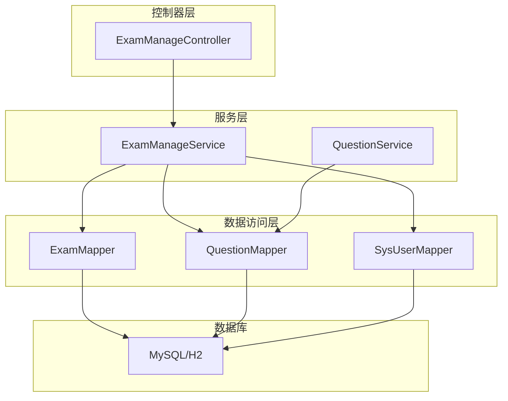
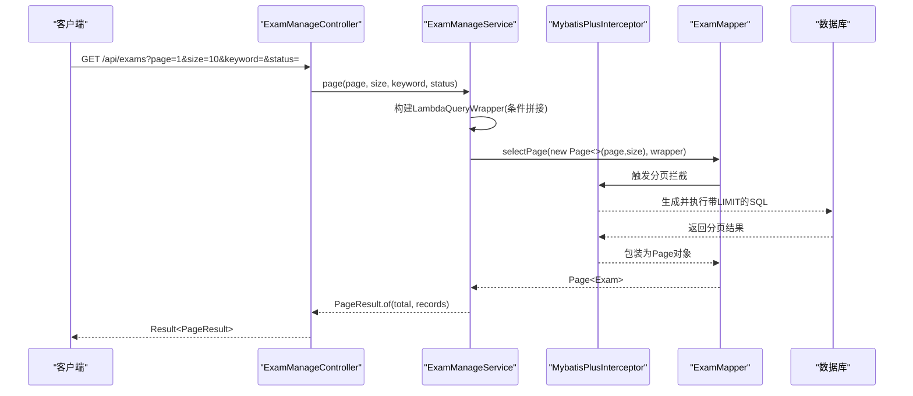
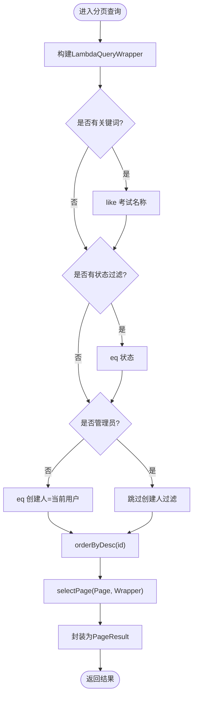
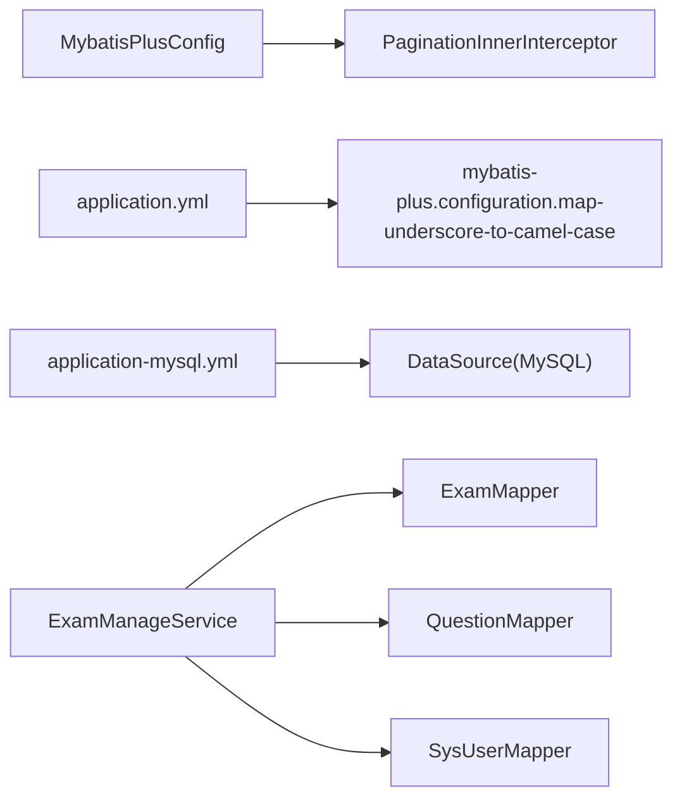

# 数据访问层

<cite>
**本文引用的文件**
- [MybatisPlusConfig.java](file://exam-server/src/main/java/com/exam/config/MybatisPlusConfig.java)
- [application.yml](file://exam-server/src/main/resources/application.yml)
- [application-mysql.yml](file://exam-server/src/main/resources/application-mysql.yml)
- [ExamMapper.java](file://exam-server/src/main/java/com/exam/mapper/ExamMapper.java)
- [QuestionMapper.java](file://exam-server/src/main/java/com/exam/mapper/QuestionMapper.java)
- [SysUserMapper.java](file://exam-server/src/main/java/com/exam/mapper/SysUserMapper.java)
- [Exam.java](file://exam-server/src/main/java/com/exam/entity/Exam.java)
- [Question.java](file://exam-server/src/main/java/com/exam/entity/Question.java)
- [ExamManageService.java](file://exam-server/src/main/java/com/exam/service/ExamManageService.java)
- [QuestionService.java](file://exam-server/src/main/java/com/exam/service/QuestionService.java)
- [ExamManageController.java](file://exam-server/src/main/java/com/exam/controller/ExamManageController.java)
- [PageResult.java](file://exam-server/src/main/java/com/exam/common/PageResult.java)
- [schema.sql](file://exam-server/src/main/resources/db/schema.sql)
</cite>

## 目录
1. [简介](#简介)
2. [项目结构](#项目结构)
3. [核心组件](#核心组件)
4. [架构总览](#架构总览)
5. [详细组件分析](#详细组件分析)
6. [依赖关系分析](#依赖关系分析)
7. [性能考虑](#性能考虑)
8. [故障排查指南](#故障排查指南)
9. [结论](#结论)
10. [附录](#附录)

## 简介
本章节面向数据访问层，聚焦 MyBatis Plus 在本项目中的配置与使用模式。内容涵盖：
- Mapper 接口设计规范与查询方法实现方式
- 复杂查询构建（条件、分页、关联）
- 事务管理与批量操作处理
- 数据访问性能优化策略与最佳实践
- 常见查询场景的实现示例与参考路径

## 项目结构
本项目采用分层架构：Controller → Service → Mapper → Database。数据访问通过 MyBatis Plus 的 BaseMapper 扩展能力完成 CRUD，结合 LambdaQueryWrapper 构建动态条件，使用 Page 进行分页。

图表来源
- [ExamManageController.java:20-66](file://exam-server/src/main/java/com/exam/controller/ExamManageController.java#L20-L66)
- [ExamManageService.java:36-63](file://exam-server/src/main/java/com/exam/service/ExamManageService.java#L36-L63)
- [QuestionService.java:33-69](file://exam-server/src/main/java/com/exam/service/QuestionService.java#L33-L69)
- [ExamMapper.java:7-10](file://exam-server/src/main/java/com/exam/mapper/ExamMapper.java#L7-L10)
- [QuestionMapper.java:7-10](file://exam-server/src/main/java/com/exam/mapper/QuestionMapper.java#L7-L10)
- [SysUserMapper.java:7-10](file://exam-server/src/main/java/com/exam/mapper/SysUserMapper.java#L7-L10)

章节来源
- [ExamManageController.java:20-66](file://exam-server/src/main/java/com/exam/controller/ExamManageController.java#L20-L66)
- [ExamManageService.java:36-63](file://exam-server/src/main/java/com/exam/service/ExamManageService.java#L36-L63)
- [QuestionService.java:33-69](file://exam-server/src/main/java/com/exam/service/QuestionService.java#L33-L69)

## 核心组件
- MyBatis Plus 配置
  - 启用分页拦截器，指定数据库类型为 MySQL。
  - 开启下划线转驼峰映射，便于实体字段与表字段自动映射。
  - 扫描 mapper XML 位置（当前项目以注解为主）。
- Mapper 接口
  - 所有 Mapper 继承 BaseMapper<T>，获得标准 CRUD 能力。
  - 通过 @Mapper 注解注册为 Spring Bean。
- 实体类
  - 使用 @TableName、@TableId 等注解声明表名与主键策略。
  - 字段命名遵循驼峰，配合全局配置自动映射到表列。
- 分页封装
  - 统一返回 PageResult<T>，包含 total 与 records。

章节来源
- [MybatisPlusConfig.java:9-17](file://exam-server/src/main/java/com/exam/config/MybatisPlusConfig.java#L9-L17)
- [application.yml:26-29](file://exam-server/src/main/resources/application.yml#L26-L29)
- [ExamMapper.java:7-10](file://exam-server/src/main/java/com/exam/mapper/ExamMapper.java#L7-L10)
- [QuestionMapper.java:7-10](file://exam-server/src/main/java/com/exam/mapper/QuestionMapper.java#L7-L10)
- [SysUserMapper.java:7-10](file://exam-server/src/main/java/com/exam/mapper/SysUserMapper.java#L7-L10)
- [Exam.java:10-27](file://exam-server/src/main/java/com/exam/entity/Exam.java#L10-L27)
- [Question.java:11-29](file://exam-server/src/main/java/com/exam/entity/Question.java#L11-L29)
- [PageResult.java:7-19](file://exam-server/src/main/java/com/exam/common/PageResult.java#L7-L19)

## 架构总览
下图展示从 Controller 到 Mapper 的分页查询调用链，体现 MyBatis Plus 分页拦截器的参与过程。

图表来源
- [ExamManageController.java:30-36](file://exam-server/src/main/java/com/exam/controller/ExamManageController.java#L30-L36)
- [ExamManageService.java:48-63](file://exam-server/src/main/java/com/exam/service/ExamManageService.java#L48-L63)
- [MybatisPlusConfig.java:12-17](file://exam-server/src/main/java/com/exam/config/MybatisPlusConfig.java#L12-L17)

## 详细组件分析

### MyBatis Plus 配置与数据源
- 分页插件：通过 MybatisPlusInterceptor 添加 PaginationInnerInterceptor，指定 DbType.MYSQL，使 selectPage 自动追加 LIMIT。
- 全局映射：开启 map-underscore-to-camel-case，简化实体与表字段映射。
- 数据源：通过 application-mysql.yml 配置 MySQL 驱动、URL、用户名密码；application.yml 中设置 SQL 初始化脚本位置与编码。

章节来源
- [MybatisPlusConfig.java:12-17](file://exam-server/src/main/java/com/exam/config/MybatisPlusConfig.java#L12-L17)
- [application.yml:26-29](file://exam-server/src/main/resources/application.yml#L26-L29)
- [application-mysql.yml:1-12](file://exam-server/src/main/resources/application-mysql.yml#L1-L12)

### Mapper 接口设计规范
- 继承 BaseMapper<T>：获得 insert、selectById、updateById、deleteById、selectList、selectPage 等通用方法。
- 使用 @Mapper 注解：由 Spring 管理生命周期，注入到 Service。
- 无自定义 SQL 时，无需编写 XML，减少样板代码。

章节来源
- [ExamMapper.java:7-10](file://exam-server/src/main/java/com/exam/mapper/ExamMapper.java#L7-L10)
- [QuestionMapper.java:7-10](file://exam-server/src/main/java/com/exam/mapper/QuestionMapper.java#L7-L10)
- [SysUserMapper.java:7-10](file://exam-server/src/main/java/com/exam/mapper/SysUserMapper.java#L7-L10)

### 实体与表映射
- Exam 实体：使用 @TableName("exam") 与 @TableId(type = IdType.AUTO) 声明表名与自增主键。
- Question 实体：同上，并包含业务字段如题型、难度、默认分值、可见性等。
- 字段命名：Java 驼峰与数据库下划线通过全局配置自动映射。

章节来源
- [Exam.java:10-27](file://exam-server/src/main/java/com/exam/entity/Exam.java#L10-L27)
- [Question.java:11-29](file://exam-server/src/main/java/com/exam/entity/Question.java#L11-L29)
- [application.yml:26-29](file://exam-server/src/main/resources/application.yml#L26-L29)

### 条件查询与分页查询
- 条件构建：使用 LambdaQueryWrapper 按字段引用式拼接 eq、like、in、and/or 等条件。
- 分页查询：selectPage(Page, Wrapper) 返回 Page<T>，再封装为 PageResult<T> 返回给前端。
- 权限控制：非管理员仅能查看自己创建的考试记录。

图表来源
- [ExamManageService.java:48-63](file://exam-server/src/main/java/com/exam/service/ExamManageService.java#L48-L63)

章节来源
- [ExamManageService.java:48-63](file://exam-server/src/main/java/com/exam/service/ExamManageService.java#L48-L63)
- [PageResult.java:7-19](file://exam-server/src/main/java/com/exam/common/PageResult.java#L7-L19)

### 关联查询与多表聚合
- 题目详情：根据 questionId 查询选项与知识点关联，再批量查询知识点名称，组装 VO。
- 考试详情：根据 examId 查询关联学生列表，统计提交数量与试卷信息。
- 仪表盘统计：基于多个表的计数与聚合计算平均分、通过率等指标。

章节来源
- [QuestionService.java:180-205](file://exam-server/src/main/java/com/exam/service/QuestionService.java#L180-L205)
- [ExamManageService.java:65-75](file://exam-server/src/main/java/com/exam/service/ExamManageService.java#L65-L75)
- [ExamManageService.java:192-262](file://exam-server/src/main/java/com/exam/service/ExamManageService.java#L192-L262)

### 事务管理与批量操作
- 事务边界：在 save、publish、stop 等方法上使用 @Transactional，保证多步写操作的原子性。
- 批量写入：在保存题目时循环插入选项与知识点关联；在保存考试时循环插入学生关联。
- 删除策略：逻辑删除（将 status 置为 0），避免物理删除带来的数据丢失风险。

章节来源
- [ExamManageService.java:77-113](file://exam-server/src/main/java/com/exam/service/ExamManageService.java#L77-L113)
- [ExamManageService.java:115-134](file://exam-server/src/main/java/com/exam/service/ExamManageService.java#L115-L134)
- [QuestionService.java:95-151](file://exam-server/src/main/java/com/exam/service/QuestionService.java#L95-L151)
- [QuestionService.java:153-159](file://exam-server/src/main/java/com/exam/service/QuestionService.java#L153-L159)

### 常见查询场景与参考路径
- 条件+分页：考试任务分页查询
  - 参考路径：[ExamManageService.page:48-63](file://exam-server/src/main/java/com/exam/service/ExamManageService.java#L48-L63)
- 按类型/分类/关键词/知识点筛选题目：
  - 参考路径：[QuestionService.page:42-69](file://exam-server/src/main/java/com/exam/service/QuestionService.java#L42-L69)
- 按 ID 顺序获取有效题目（用于导出）：
  - 参考路径：[QuestionService.listByIds:79-93](file://exam-server/src/main/java/com/exam/service/QuestionService.java#L79-L93)
- 关联查询（题目详情含选项与知识点）：
  - 参考路径：[QuestionService.toVO:180-205](file://exam-server/src/main/java/com/exam/service/QuestionService.java#L180-L205)
- 仪表盘统计（多表聚合）：
  - 参考路径：[ExamManageService.dashboard:192-262](file://exam-server/src/main/java/com/exam/service/ExamManageService.java#L192-L262)

## 依赖关系分析
- 配置依赖：MyBatis Plus 分页拦截器依赖数据库类型（MySQL），需与数据源一致。
- 模块耦合：Service 层依赖多个 Mapper，形成一对多的数据访问组合；Controller 仅依赖对应 Service。
- 外部依赖：Spring 容器管理 Bean 生命周期；Jackson 配置日期格式与时区。

图表来源
- [MybatisPlusConfig.java:12-17](file://exam-server/src/main/java/com/exam/config/MybatisPlusConfig.java#L12-L17)
- [application.yml:26-29](file://exam-server/src/main/resources/application.yml#L26-L29)
- [application-mysql.yml:1-12](file://exam-server/src/main/resources/application-mysql.yml#L1-L12)
- [ExamManageService.java:36-47](file://exam-server/src/main/java/com/exam/service/ExamManageService.java#L36-L47)

章节来源
- [MybatisPlusConfig.java:12-17](file://exam-server/src/main/java/com/exam/config/MybatisPlusConfig.java#L12-L17)
- [application.yml:26-29](file://exam-server/src/main/resources/application.yml#L26-L29)
- [application-mysql.yml:1-12](file://exam-server/src/main/resources/application-mysql.yml#L1-L12)
- [ExamManageService.java:36-47](file://exam-server/src/main/java/com/exam/service/ExamManageService.java#L36-L47)

## 性能考虑
- 索引利用
  - 建议在高频查询字段建立索引，例如 exam(start_time, end_time)、question(category_id, question_type)、exam_record(exam_id, total_score) 等。
  - 参考建表脚本中的索引定义。
- 分页优化
  - 使用 selectPage 而非 selectList + 内存分页，避免全表加载。
  - 合理设置 page/size，避免过大导致响应延迟。
- 条件构建
  - 优先使用等值与范围条件，减少 like 前缀模糊匹配；必要时对 content 字段建立全文索引（视数据库支持）。
- 批量操作
  - 小批量循环 insert 可接受；超大数据量建议分批或改用批处理器（如 JDBC batch）。
- N+1 问题
  - 在 toVO 中多次查询关联数据时，尽量使用批量查询（selectBatchIds）减少往返次数。
- 事务粒度
  - 保持事务最小化，避免长事务阻塞连接池。

章节来源
- [schema.sql:111-151](file://exam-server/src/main/resources/db/schema.sql#L111-L151)
- [ExamManageService.java:48-63](file://exam-server/src/main/java/com/exam/service/ExamManageService.java#L48-L63)
- [QuestionService.java:180-205](file://exam-server/src/main/java/com/exam/service/QuestionService.java#L180-L205)

## 故障排查指南
- 分页不生效
  - 检查是否已注册 MybatisPlusInterceptor 并添加 PaginationInnerInterceptor。
  - 确认 selectPage 的使用方式正确。
- 字段映射异常
  - 检查是否开启 map-underscore-to-camel-case，以及实体字段命名是否符合约定。
- 事务未生效
  - 确认方法上标注了 @Transactional，且未被同类内部调用绕过。
- 数据不一致
  - 检查逻辑删除是否正确设置 status，避免误删。
- 性能问题
  - 使用 EXPLAIN 分析慢查询，补充缺失索引；避免大结果集一次性加载。

章节来源
- [MybatisPlusConfig.java:12-17](file://exam-server/src/main/java/com/exam/config/MybatisPlusConfig.java#L12-L17)
- [application.yml:26-29](file://exam-server/src/main/resources/application.yml#L26-L29)
- [ExamManageService.java:77-113](file://exam-server/src/main/java/com/exam/service/ExamManageService.java#L77-L113)
- [QuestionService.java:153-159](file://exam-server/src/main/java/com/exam/service/QuestionService.java#L153-L159)

## 结论
本项目通过 MyBatis Plus 实现了简洁高效的数据访问层：
- 使用 BaseMapper 与 LambdaQueryWrapper 快速完成 CRUD 与复杂条件查询
- 通过分页插件与统一 PageResult 提升用户体验
- 借助事务与逻辑删除保障数据一致性
- 结合索引与批量操作优化性能
建议在生产环境持续监控慢查询、完善索引、控制事务粒度，以获得更稳定的数据访问表现。

## 附录
- 数据库表结构与索引定义参考：
  - [schema.sql](file://exam-server/src/main/resources/db/schema.sql)
- 相关配置参考：
  - [application.yml](file://exam-server/src/main/resources/application.yml)
  - [application-mysql.yml](file://exam-server/src/main/resources/application-mysql.yml)
- 关键服务与控制器参考：
  - [ExamManageService.java](file://exam-server/src/main/java/com/exam/service/ExamManageService.java)
  - [QuestionService.java](file://exam-server/src/main/java/com/exam/service/QuestionService.java)
  - [ExamManageController.java](file://exam-server/src/main/java/com/exam/controller/ExamManageController.java)