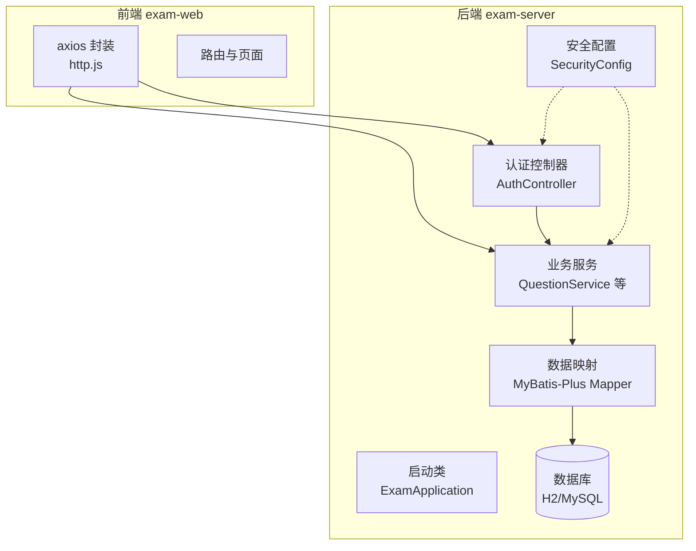
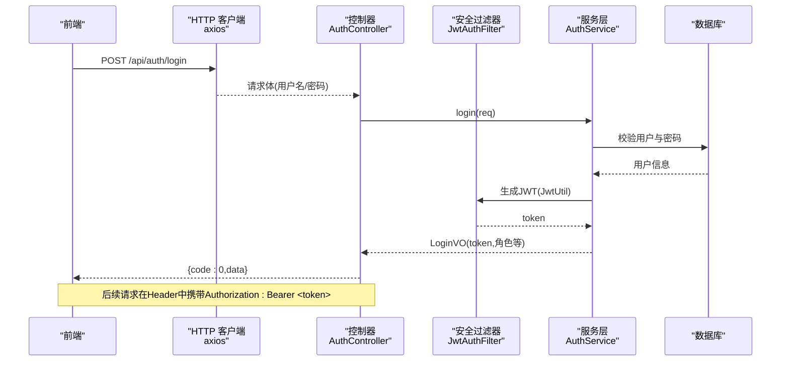
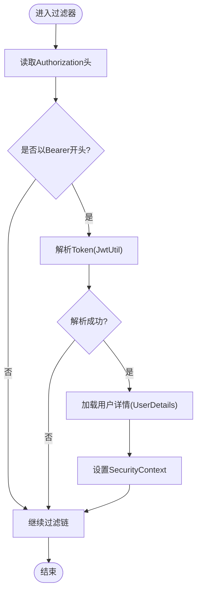
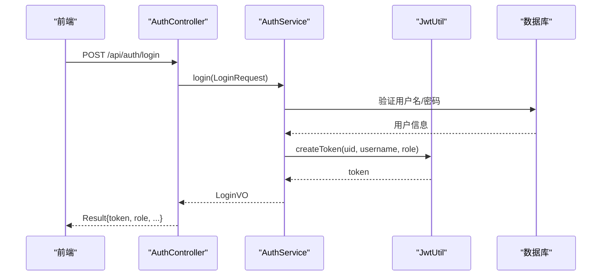
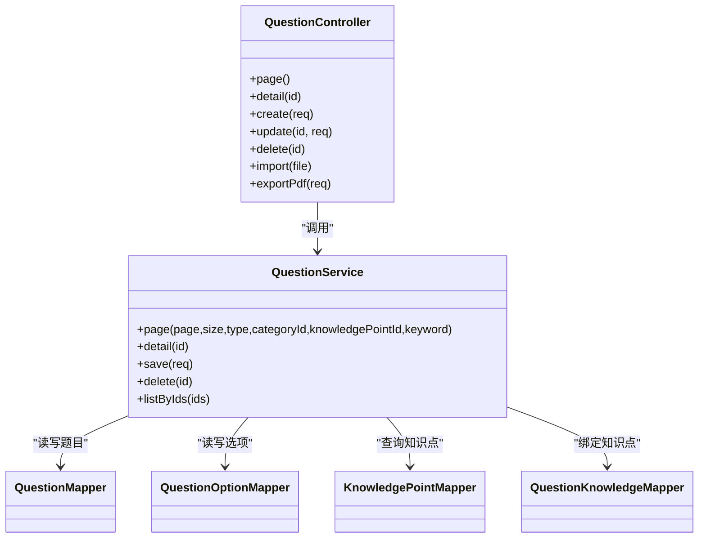
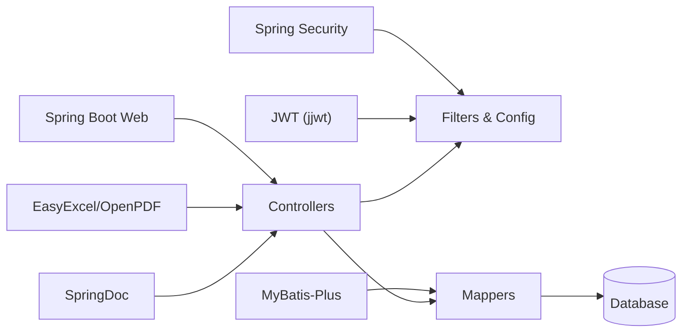

# 系统架构

<cite>
**本文引用的文件**
- [ExamApplication.java](file://exam-server/src/main/java/com/exam/ExamApplication.java)
- [application.yml](file://exam-server/src/main/resources/application.yml)
- [pom.xml](file://exam-server/pom.xml)
- [SecurityConfig.java](file://exam-server/src/main/java/com/exam/config/SecurityConfig.java)
- [JwtAuthFilter.java](file://exam-server/src/main/java/com/exam/security/JwtAuthFilter.java)
- [JwtUtil.java](file://exam-server/src/main/java/com/exam/security/JwtUtil.java)
- [AuthController.java](file://exam-server/src/main/java/com/exam/controller/AuthController.java)
- [AuthService.java](file://exam-server/src/main/java/com/exam/service/AuthService.java)
- [QuestionController.java](file://exam-server/src/main/java/com/exam/controller/QuestionController.java)
- [QuestionService.java](file://exam-server/src/main/java/com/exam/service/QuestionService.java)
- [SysUser.java](file://exam-server/src/main/java/com/exam/entity/SysUser.java)
- [http.js](file://exam-web/src/api/http.js)
- [package.json](file://exam-web/package.json)
- [README.md](file://README.md)
</cite>

## 目录
1. [简介](#简介)
2. [项目结构](#项目结构)
3. [核心组件](#核心组件)
4. [架构总览](#架构总览)
5. [详细组件分析](#详细组件分析)
6. [依赖关系分析](#依赖关系分析)
7. [性能与缓存策略](#性能与缓存策略)
8. [故障排查指南](#故障排查指南)
9. [结论](#结论)
10. [附录](#附录)

## 简介
本教学考试平台采用前后端分离架构：前端基于 Vue 3 + Vite，后端基于 Spring Boot 2.7。系统提供教师出题组卷、学生在线考试、简答题阅卷与按知识点掌握度分析等能力。认证采用无状态 JWT，接口遵循 RESTful 风格，数据层使用 MyBatis-Plus 访问数据库（默认 H2，可切换 MySQL）。

## 项目结构
- 后端 exam-server：Spring Boot 应用，包含配置、安全、控制器、服务、实体、Mapper、工具类等。
- 前端 exam-web：Vue 3 SPA，通过 axios 调用后端 API，统一拦截器处理 Token 与错误。
- 资源与脚本：配置文件、SQL 脚本、部署脚本等。

图表来源
- [ExamApplication.java:1-17](file://exam-server/src/main/java/com/exam/ExamApplication.java#L1-L17)
- [SecurityConfig.java:1-90](file://exam-server/src/main/java/com/exam/config/SecurityConfig.java#L1-L90)
- [AuthController.java:1-65](file://exam-server/src/main/java/com/exam/controller/AuthController.java#L1-L65)
- [QuestionService.java:1-225](file://exam-server/src/main/java/com/exam/service/QuestionService.java#L1-L225)
- [application.yml:1-42](file://exam-server/src/main/resources/application.yml#L1-L42)

章节来源
- [README.md:1-82](file://README.md#L1-L82)
- [application.yml:1-42](file://exam-server/src/main/resources/application.yml#L1-L42)

## 核心组件
- 启动与装配：Spring Boot 启动类扫描 Mapper，加载配置并暴露 Web 端口。
- 安全与认证：Spring Security + JWT 过滤器实现无状态鉴权；密码 BCrypt 加密。
- 控制器层：RESTful 接口，统一返回 Result/PageResult。
- 服务层：业务编排与事务控制，组合多个 Mapper 完成复杂逻辑。
- 数据层：MyBatis-Plus 简化 CRUD 与分页查询。
- 前端通信：axios 拦截器自动携带 Bearer Token，统一处理 401 跳转登录。

章节来源
- [ExamApplication.java:1-17](file://exam-server/src/main/java/com/exam/ExamApplication.java#L1-L17)
- [SecurityConfig.java:1-90](file://exam-server/src/main/java/com/exam/config/SecurityConfig.java#L1-L90)
- [JwtAuthFilter.java:1-52](file://exam-server/src/main/java/com/exam/security/JwtAuthFilter.java#L1-L52)
- [JwtUtil.java:1-44](file://exam-server/src/main/java/com/exam/security/JwtUtil.java#L1-L44)
- [AuthController.java:1-65](file://exam-server/src/main/java/com/exam/controller/AuthController.java#L1-L65)
- [AuthService.java:1-51](file://exam-server/src/main/java/com/exam/service/AuthService.java#L1-L51)
- [QuestionController.java:1-118](file://exam-server/src/main/java/com/exam/controller/QuestionController.java#L1-L118)
- [QuestionService.java:1-225](file://exam-server/src/main/java/com/exam/service/QuestionService.java#L1-L225)
- [http.js:1-47](file://exam-web/src/api/http.js#L1-L47)

## 架构总览
系统采用分层架构（Controller-Service-Mapper），前后端通过 RESTful API 通信，认证采用 JWT 无状态模式。

图表来源
- [AuthController.java:1-65](file://exam-server/src/main/java/com/exam/controller/AuthController.java#L1-L65)
- [AuthService.java:1-51](file://exam-server/src/main/java/com/exam/service/AuthService.java#L1-L51)
- [JwtAuthFilter.java:1-52](file://exam-server/src/main/java/com/exam/security/JwtAuthFilter.java#L1-L52)
- [JwtUtil.java:1-44](file://exam-server/src/main/java/com/exam/security/JwtUtil.java#L1-L44)

## 详细组件分析

### 认证与安全（JWT）
- 安全配置：关闭 Session，启用 CORS，放行登录与文档接口，按角色限制路径（学生、教师、管理员）。
- JWT 过滤器：从 Authorization 头解析 Bearer Token，解析出主体后加载用户详情并写入 SecurityContext。
- JWT 工具：使用 HS256 签名，载荷包含 uid、username、role，支持过期时间配置。
- 密码存储：BCrypt 加密，避免明文存储。

图表来源
- [SecurityConfig.java:1-90](file://exam-server/src/main/java/com/exam/config/SecurityConfig.java#L1-L90)
- [JwtAuthFilter.java:1-52](file://exam-server/src/main/java/com/exam/security/JwtAuthFilter.java#L1-L52)
- [JwtUtil.java:1-44](file://exam-server/src/main/java/com/exam/security/JwtUtil.java#L1-L44)

章节来源
- [SecurityConfig.java:1-90](file://exam-server/src/main/java/com/exam/config/SecurityConfig.java#L1-L90)
- [JwtAuthFilter.java:1-52](file://exam-server/src/main/java/com/exam/security/JwtAuthFilter.java#L1-L52)
- [JwtUtil.java:1-44](file://exam-server/src/main/java/com/exam/security/JwtUtil.java#L1-L44)
- [SysUser.java:1-24](file://exam-server/src/main/java/com/exam/entity/SysUser.java#L1-L24)

### 登录流程（Controller-Service-JWT）
- 登录接口：接收登录请求，调用服务层进行认证，成功后签发 JWT 并返回用户信息与角色。
- 前端拦截器：自动附加 Bearer Token，遇到 401 清除本地状态并跳转登录页。

图表来源
- [AuthController.java:1-65](file://exam-server/src/main/java/com/exam/controller/AuthController.java#L1-L65)
- [AuthService.java:1-51](file://exam-server/src/main/java/com/exam/service/AuthService.java#L1-L51)
- [JwtUtil.java:1-44](file://exam-server/src/main/java/com/exam/security/JwtUtil.java#L1-L44)

章节来源
- [AuthController.java:1-65](file://exam-server/src/main/java/com/exam/controller/AuthController.java#L1-L65)
- [AuthService.java:1-51](file://exam-server/src/main/java/com/exam/service/AuthService.java#L1-L51)
- [http.js:1-47](file://exam-web/src/api/http.js#L1-L47)

### 题库管理（CRUD、导入导出）
- 控制器：提供分页查询、详情、新增、更新、删除、Excel 导入、PDF 导出等接口。
- 服务层：封装题目保存逻辑（含选项、知识点绑定）、可见性控制、软删除、正确答案汇总等。
- 数据层：MyBatis-Plus Mapper 负责 SQL 执行与分页。

图表来源
- [QuestionController.java:1-118](file://exam-server/src/main/java/com/exam/controller/QuestionController.java#L1-L118)
- [QuestionService.java:1-225](file://exam-server/src/main/java/com/exam/service/QuestionService.java#L1-L225)

章节来源
- [QuestionController.java:1-118](file://exam-server/src/main/java/com/exam/controller/QuestionController.java#L1-L118)
- [QuestionService.java:1-225](file://exam-server/src/main/java/com/exam/service/QuestionService.java#L1-L225)

### 考试管理（发布/停止、统计）
- 控制器：提供考试任务的分页、详情、创建、更新、发布、停止以及工作台统计接口。
- 服务层：负责考试生命周期管理与统计聚合。

章节来源
- [ExamManageController.java:1-67](file://exam-server/src/main/java/com/exam/controller/ExamManageController.java#L1-L67)

## 依赖关系分析
- 技术栈依赖：Spring Boot Web、Security、Validation；MyBatis-Plus；JWT；EasyExcel；OpenPDF；SpringDoc OpenAPI。
- 模块耦合：Controller 仅依赖 Service；Service 组合多个 Mapper；安全过滤器位于请求入口，对 Controller 透明。
- 外部依赖：数据库（H2/MySQL）、可选 PDF 字体。

图表来源
- [pom.xml:1-131](file://exam-server/pom.xml#L1-L131)
- [application.yml:1-42](file://exam-server/src/main/resources/application.yml#L1-L42)

章节来源
- [pom.xml:1-131](file://exam-server/pom.xml#L1-L131)
- [application.yml:1-42](file://exam-server/src/main/resources/application.yml#L1-L42)

## 性能与缓存策略
- 分页与查询优化：服务层使用 MyBatis-Plus 分页与条件构造器，减少不必要字段与关联查询。
- 批量导入限制：控制器限制单次导入行数，避免大文件拖垮解析与事务。
- 文件上传限制：配置最大文件大小与请求大小，防止滥用。
- 无状态认证：JWT 避免服务端会话开销，适合水平扩展。
- 缓存建议：热点数据（如知识点树、题目分类）可在服务层引入 Redis 缓存；高频读接口可增加本地缓存或 CDN 静态资源缓存。
- 数据库优化：为常用查询字段建立索引（如题目类型、可见性、状态、更新时间）；合理拆分表与归档历史数据。

[本节为通用性能建议，不直接分析具体文件]

## 故障排查指南
- 401 未登录或过期：检查前端是否在请求头携带 Authorization: Bearer；确认后端 JWT 密钥与过期时间配置一致。
- 403 没有权限：确认当前用户角色与接口路径匹配（学生/教师/管理员）。
- 登录失败：核对用户名与密码；检查数据库中密码是否为 BCrypt 加密。
- 导入失败：检查文件格式与行数限制；查看导入模板与必填字段。
- 导出 PDF 乱码：配置 EXAM_PDF_FONT_PATH 指向有效中文字体文件。

章节来源
- [SecurityConfig.java:1-90](file://exam-server/src/main/java/com/exam/config/SecurityConfig.java#L1-L90)
- [JwtAuthFilter.java:1-52](file://exam-server/src/main/java/com/exam/security/JwtAuthFilter.java#L1-L52)
- [JwtUtil.java:1-44](file://exam-server/src/main/java/com/exam/security/JwtUtil.java#L1-L44)
- [QuestionController.java:1-118](file://exam-server/src/main/java/com/exam/controller/QuestionController.java#L1-L118)
- [application.yml:1-42](file://exam-server/src/main/resources/application.yml#L1-L42)

## 结论
本系统采用清晰的分层架构与无状态 JWT 认证，前后端职责明确、耦合度低。通过 MyBatis-Plus 简化数据访问，结合分页与批量导入限制保障稳定性。建议在关键热点数据引入缓存以提升性能，并通过合理的索引与资源限制确保可扩展性与安全性。

## 附录
- 环境要求与启动方式参见 README。
- 默认使用 H2 内存库，首次启动自动建表与初始化演示数据；可切换至 MySQL。
- Swagger 文档路径：/swagger-ui.html；API 文档：/v3/api-docs。

章节来源
- [README.md:1-82](file://README.md#L1-L82)
- [application.yml:1-42](file://exam-server/src/main/resources/application.yml#L1-L42)
- [package.json:1-25](file://exam-web/package.json#L1-L25)