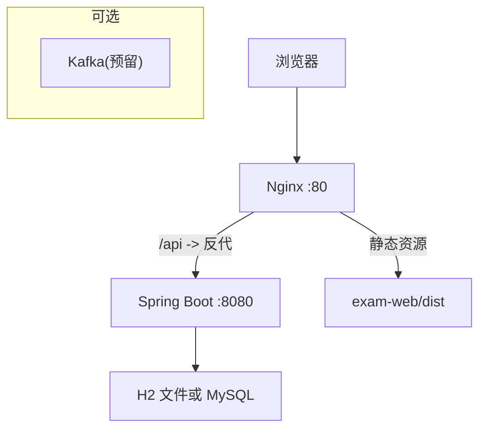
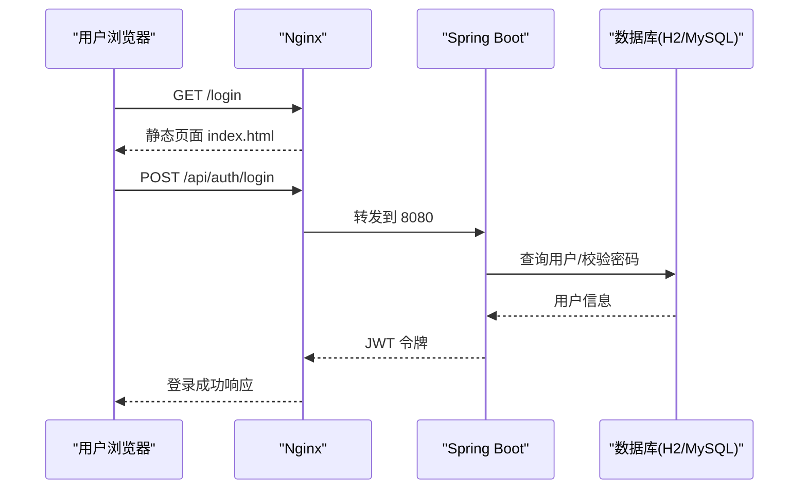
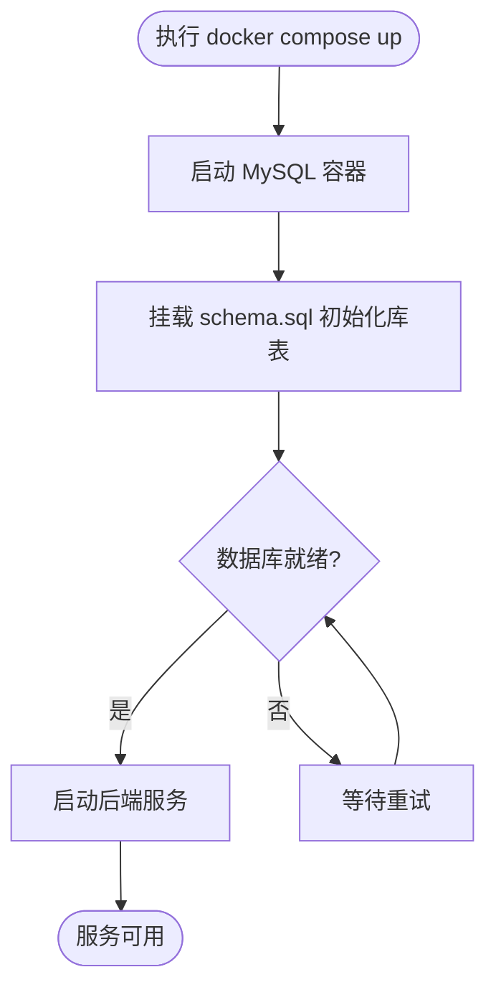
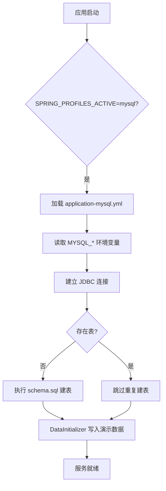
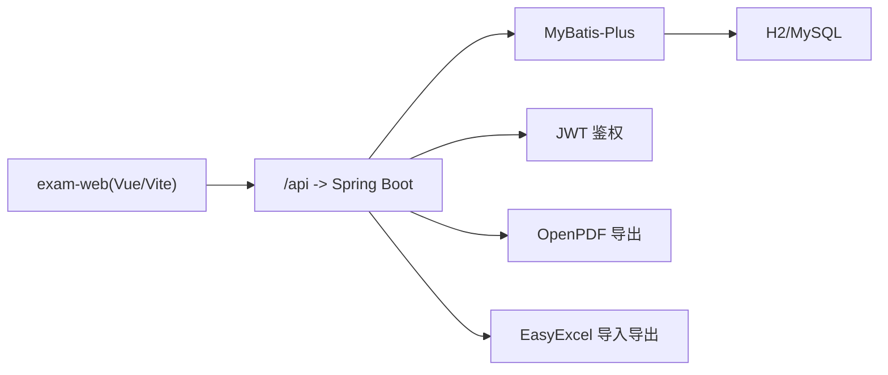

# 部署运维

<cite>
**本文引用的文件**
- [docker-compose.yml](file://docker-compose.yml)
- [application.yml](file://exam-server/src/main/resources/application.yml)
- [application-mysql.yml](file://exam-server/src/main/resources/application-mysql.yml)
- [application-h2.yml](file://exam-server/src/main/resources/application-h2.yml)
- [remote-setup.sh](file://deploy/remote-setup.sh)
- [部署文档.md](file://docs/部署文档.md)
- [schema-mysql.sql](file://sql/schema-mysql.sql)
- [pom.xml](file://exam-server/pom.xml)
- [package.json](file://exam-web/package.json)
- [start-server.bat](file://start-server.bat)
- [start-web.bat](file://start-web.bat)
</cite>

## 目录
1. [简介](#简介)
2. [项目结构](#项目结构)
3. [核心组件](#核心组件)
4. [架构总览](#架构总览)
5. [详细组件分析](#详细组件分析)
6. [依赖关系分析](#依赖关系分析)
7. [性能与容量规划](#性能与容量规划)
8. [故障排查指南](#故障排查指南)
9. [备份与恢复策略](#备份与恢复策略)
10. [版本升级与回滚](#版本升级与回滚)
11. [结论](#结论)

## 简介
本运维文档面向教学考试平台的开发与生产部署，覆盖开发、测试、生产环境的配置差异；提供 Docker 容器化部署、MySQL 数据库配置、文件存储与 PDF 字体配置；说明环境变量、日志收集、监控指标与健康检查；给出性能调优建议、故障排查方法与备份恢复策略；并明确版本升级流程与回滚方案。

## 项目结构
- 后端：Spring Boot 应用（exam-server），默认使用 H2 文件库，可切换 MySQL；支持 OpenAPI/Swagger 文档；内置安全与数据初始化。
- 前端：Vue 3 + Vite（exam-web），构建产物由 Nginx 对外提供静态资源，并通过反向代理将 /api 转发到后端。
- 中间件：可选 MySQL 8（本地或 Docker）、预留 Kafka（二期）。
- 部署脚本：提供远程一键准备脚本（Nginx、systemd 服务、Maven/npm 镜像等）。

**章节来源**
- [部署文档.md:11-56](file://docs/部署文档.md#L11-L56)
- [remote-setup.sh:27-57](file://deploy/remote-setup.sh#L27-L57)

## 核心组件
- 后端服务：监听 0.0.0.0:8080，启用 UTF-8 编码，自动初始化 SQL；JWT 鉴权；OpenAPI 文档路径 /swagger-ui.html 与 /v3/api-docs。
- 前端服务：Vite 开发模式端口 5173；生产构建输出至 dist，由 Nginx 托管。
- 数据库：H2（开发/演示）或 MySQL 8（生产）；字符集 utf8mb4，排序规则 utf8mb4_unicode_ci。
- 文件与字体：上传附件大小限制；PDF 导出依赖中文字体，可通过环境变量指定。
- 部署方式：源码编译运行（systemd 管理）或 Docker Compose（仅 MySQL）。

**章节来源**
- [application.yml:1-42](file://exam-server/src/main/resources/application.yml#L1-L42)
- [application-h2.yml:1-11](file://exam-server/src/main/resources/application-h2.yml#L1-L11)
- [application-mysql.yml:1-12](file://exam-server/src/main/resources/application-mysql.yml#L1-L12)
- [pom.xml:42-112](file://exam-server/pom.xml#L42-L112)
- [package.json:1-25](file://exam-web/package.json#L1-L25)

## 架构总览
系统采用前后端分离架构：Nginx 作为统一入口对外暴露 80 端口，静态资源直接返回，/api 请求反向代理到 Spring Boot 后端；后端通过 MyBatis-Plus 访问数据库，支持 H2 与 MySQL；可选接入 Kafka 用于异步消息（二期）。

**图表来源**
- [remote-setup.sh:27-57](file://deploy/remote-setup.sh#L27-L57)
- [application.yml:1-42](file://exam-server/src/main/resources/application.yml#L1-L42)

**章节来源**
- [部署文档.md:11-56](file://docs/部署文档.md#L11-L56)
- [remote-setup.sh:27-57](file://deploy/remote-setup.sh#L27-L57)

## 详细组件分析

### 环境差异与配置要点
- 开发环境
  - 后端：默认 H2 profile，内嵌控制台；端口 8080；无需外部数据库。
  - 前端：Vite dev server 5173，开发时代理到 8080。
  - 启动方式：Windows 批处理脚本或命令行直接运行。
- 测试环境
  - 建议使用 MySQL profile，连接独立测试库；开启 Swagger；关闭不必要的调试功能。
  - 使用 Docker Compose 快速拉起 MySQL，便于隔离。
- 生产环境
  - 必须使用 MySQL profile，严格凭据管理；Nginx 对外 80，后端 8080 仅内网；关闭 H2 Console；限制上传大小；配置 PDF 字体；完善日志与监控。

关键配置项与环境变量
- 后端
  - SPRING_PROFILES_ACTIVE：h2/mysql/kafka（组合）
  - MYSQL_HOST/MYSQL_PORT/MYSQL_USER/MYSQL_PASSWORD：MySQL 连接参数
  - EXAM_PDF_FONT_PATH：PDF 导出中文字体路径（.ttc 需带索引 ,0）
  - server.address/server.port：绑定地址与端口
  - spring.servlet.multipart.max-file-size/max-request-size：上传限制
- 前端
  - 生产构建后 baseURL 为相对路径，Nginx 将 /api 转发到后端。

**章节来源**
- [application.yml:9-24,31-42:9-24](file://exam-server/src/main/resources/application.yml#L9-L24)
- [application-mysql.yml:1-12](file://exam-server/src/main/resources/application-mysql.yml#L1-L12)
- [application-h2.yml:1-11](file://exam-server/src/main/resources/application-h2.yml#L1-L11)
- [部署文档.md:275-418](file://docs/部署文档.md#L275-L418)

### Docker 容器化部署
- 仓库提供 docker-compose.yml，仅包含 MySQL 服务，便于快速启动数据库。
- 数据持久化通过 volume 挂载；初始化脚本通过 entrypoint 目录注入。
- 生产建议：将 MySQL 端口绑定到 127.0.0.1，避免公网暴露；修改 root 密码；按需增加网络与安全策略。

**图表来源**
- [docker-compose.yml:1-19](file://docker-compose.yml#L1-L19)

**章节来源**
- [docker-compose.yml:1-19](file://docker-compose.yml#L1-L19)
- [部署文档.md:355-383](file://docs/部署文档.md#L355-L383)

### MySQL 数据库配置
- 驱动与 URL：使用 MySQL Connector/J，URL 包含时区、字符集与 SSL 相关参数。
- 账号与权限：建议创建专用账户 exam，最小权限原则；禁止 root 对外。
- 字符集：utf8mb4，排序规则 utf8mb4_unicode_ci。
- 初始化：应用启动时自动执行 classpath:db/schema.sql；也可提前手动导入。
- 连接限制：bind-address 建议 127.0.0.1；max_connections 按负载调整。

**图表来源**
- [application-mysql.yml:1-12](file://exam-server/src/main/resources/application-mysql.yml#L1-L12)
- [schema-mysql.sql:1-207](file://sql/schema-mysql.sql#L1-L207)

**章节来源**
- [application-mysql.yml:1-12](file://exam-server/src/main/resources/application-mysql.yml#L1-L12)
- [schema-mysql.sql:1-207](file://sql/schema-mysql.sql#L1-L207)
- [部署文档.md:275-418](file://docs/部署文档.md#L275-L418)

### 文件存储与 PDF 字体
- 文件存储
  - 上传限制：spring.servlet.multipart 设置最大文件大小与请求大小。
  - 生产建议：结合对象存储或独立文件服务器，当前实现以本地磁盘为主。
- PDF 字体
  - 未配置时自动探测系统字体目录；Linux 推荐安装 Noto CJK；Windows 可使用常见中文字体。
  - 通过 EXAM_PDF_FONT_PATH 指定字体路径，.ttc 集合字体需附加索引 ,0。

**章节来源**
- [application.yml:15-18,31-36:15-18](file://exam-server/src/main/resources/application.yml#L15-L18)
- [部署文档.md:89-99](file://docs/部署文档.md#L89-L99)

### 环境变量与配置清单
- 通用
  - SPRING_PROFILES_ACTIVE：h2/mysql/kafka（可组合）
  - JAVA_TOOL_OPTIONS：-Dfile.encoding=UTF-8
- MySQL
  - MYSQL_HOST/MYSQL_PORT/MYSQL_USER/MYSQL_PASSWORD
- PDF
  - EXAM_PDF_FONT_PATH
- Nginx/systemd
  - 工作目录、JDK 路径、服务重启策略、超时与 body size 限制

**章节来源**
- [application.yml:9-24,31-36:9-24](file://exam-server/src/main/resources/application.yml#L9-L24)
- [application-mysql.yml:1-12](file://exam-server/src/main/resources/application-mysql.yml#L1-L12)
- [remote-setup.sh:75-93](file://deploy/remote-setup.sh#L75-L93)
- [部署文档.md:225-263](file://docs/部署文档.md#L225-L263)

### 日志收集与监控
- 日志
  - 后端：systemd 日志 journalctl -u exam-server -f；应用日志随进程输出。
  - 前端/Nginx：/var/log/nginx/access.log 与 error.log。
- 健康检查
  - 通过 curl 访问后端接口或 Swagger 页验证存活；Nginx 状态页可按需开启。
- 指标
  - 当前未集成 Prometheus 等指标采集；可在后续接入 Actuator 与指标导出。

**章节来源**
- [部署文档.md:264-271](file://docs/部署文档.md#L264-L271)
- [remote-setup.sh:27-57](file://deploy/remote-setup.sh#L27-L57)

### 健康检查与可用性
- 应用层：Swagger UI 与登录接口可作为简易健康探针。
- 系统层：systemd 的 Restart=on-failure 保障异常自恢复。
- 网络层：Nginx 反向代理超时与 body size 限制确保稳定性。

**章节来源**
- [remote-setup.sh:75-93](file://deploy/remote-setup.sh#L75-L93)
- [remote-setup.sh:27-57](file://deploy/remote-setup.sh#L27-L57)

## 依赖关系分析
- 后端依赖
  - Spring Boot Web、Security、Validation、MyBatis-Plus、H2/MySQL、JWT、EasyExcel、OpenPDF、SpringDoc。
- 前端依赖
  - Vue 3、Element Plus、ECharts、Pinia、Axios、Vite。
- 运行时依赖
  - JDK 11、Node.js 18+、Nginx；可选 MySQL 8、Kafka（二期）。

**图表来源**
- [pom.xml:42-112](file://exam-server/pom.xml#L42-L112)
- [package.json:11-23](file://exam-web/package.json#L11-L23)

**章节来源**
- [pom.xml:42-112](file://exam-server/pom.xml#L42-L112)
- [package.json:11-23](file://exam-web/package.json#L11-L23)

## 性能与容量规划
- JVM 与内存
  - 根据服务器内存合理设置堆大小；关注 GC 日志与 Full GC 频率。
- 数据库
  - MySQL：调整 max_connections、innodb_buffer_pool_size、query_cache 等；确保字符集与时区正确。
  - H2：仅适合开发/小规模；生产务必切换到 MySQL。
- 文件与并发
  - 调整 multipart 上限与 Nginx client_max_body_size；对大文件上传考虑分片或对象存储。
- 缓存与索引
  - 为高频查询字段添加索引；必要时引入 Redis 缓存热点数据。
- 前端优化
  - 生产构建压缩资源；CDN 加速静态资源；合理路由与懒加载。

[本节为通用指导，不直接分析具体文件]

## 故障排查指南
- 常见问题
  - Nginx 默认站点冲突：移除或注释 nginx.conf 中的默认 server 块。
  - 前端 History 路由刷新 404：确保 try_files $uri $uri/ /index.html。
  - 后端 502：检查 8080 是否监听与 systemd 服务状态。
  - JSON 解析失败：确认请求体为标准 JSON。
  - Maven/npm 慢或失败：检查镜像源与依赖完整性。
  - 切 MySQL 连不上：核对 MYSQL_* 环境变量、库字符集与端口绑定。
  - 误开 kafka profile：补齐依赖或移除 kafka profile。
  - PDF 缺少中文字体：安装 Noto CJK 或设置 EXAM_PDF_FONT_PATH。
- 诊断命令
  - systemctl status exam-server nginx
  - journalctl -u exam-server -f
  - tail -f /var/log/nginx/access.log
  - ss -lnt | grep -E ':80|:8080'

**章节来源**
- [部署文档.md:582-614](file://docs/部署文档.md#L582-L614)

## 备份与恢复策略
- H2
  - 停服务后拷贝 data 目录；恢复时放回原路径并重启。
- MySQL
  - 使用 mysqldump 定期导出；保留 7～30 天；恢复前校验字符集与权限。
- 文件
  - 定期归档用户上传目录；与数据库备份保持一致时间戳。
- 演练
  - 定期进行恢复演练，验证备份有效性。

**章节来源**
- [部署文档.md:582-598](file://docs/部署文档.md#L582-L598)

## 版本升级与回滚
- 升级流程
  - 后端：mvn package 生成新 JAR；systemctl restart exam-server；观察日志与接口。
  - 前端：npm run build 替换 dist；一般无需重启 Nginx。
  - 数据库：如有变更，先执行迁移脚本并验证；保持 continue-on-error 兼容。
- 灰度与回滚
  - 保留上一版本 JAR 与 dist；升级失败立即回滚到旧版本并重启。
  - 数据库变更需具备回滚脚本；优先在测试环境验证。
- 发布检查
  - 登录、组卷、答题、阅卷、导出 PDF 等核心链路回归；查看错误日志。

**章节来源**
- [部署文档.md:145-158](file://docs/部署文档.md#L145-L158)
- [部署文档.md:225-263](file://docs/部署文档.md#L225-L263)

## 结论
本方案提供了从开发到生产的完整部署路径：默认 H2 快速起步，生产切换 MySQL；通过 Nginx 统一入口与 systemd 管理服务；利用环境变量与 profile 实现多环境差异化配置；提供 Docker Compose 简化数据库部署；配套 PDF 字体、日志与故障排查指引；并给出备份恢复与版本升级回滚策略。建议在生产环境强化安全与监控，逐步引入指标采集与告警机制，提升系统可观测性与稳定性。