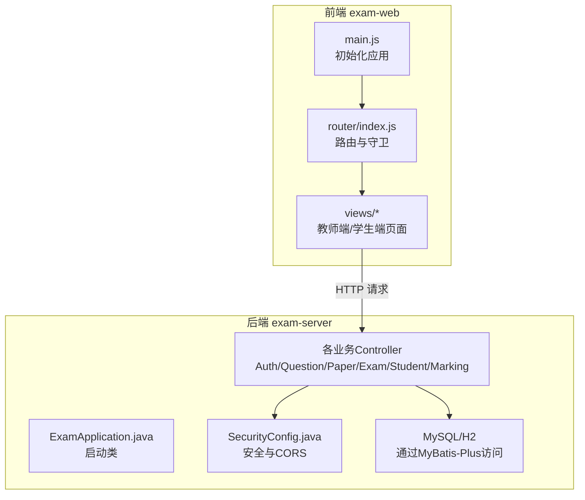
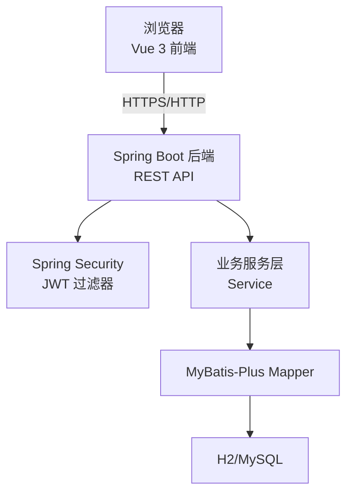
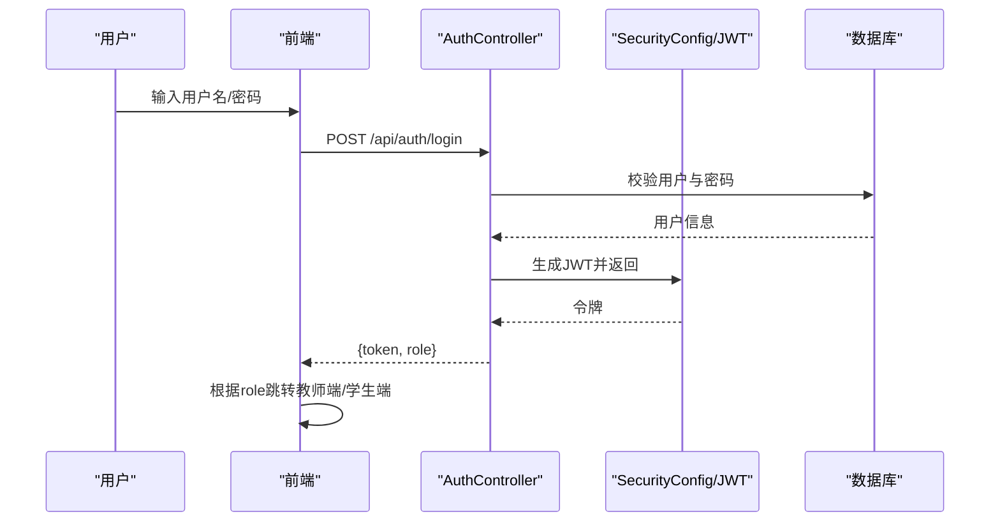
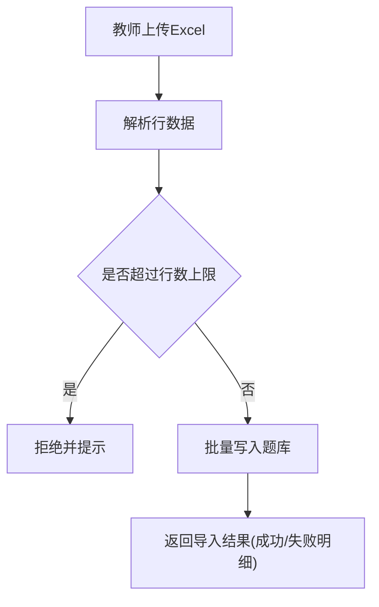
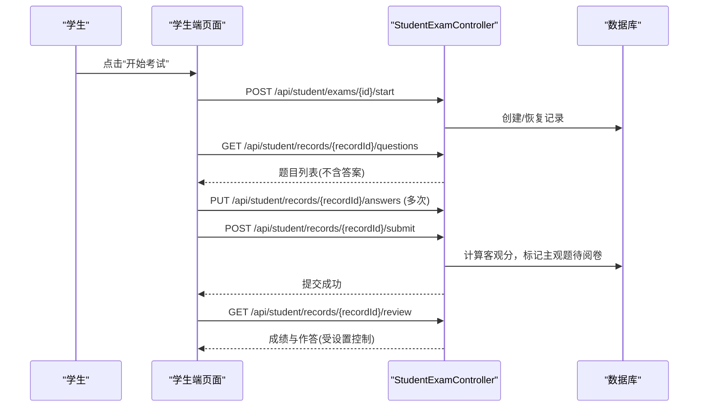
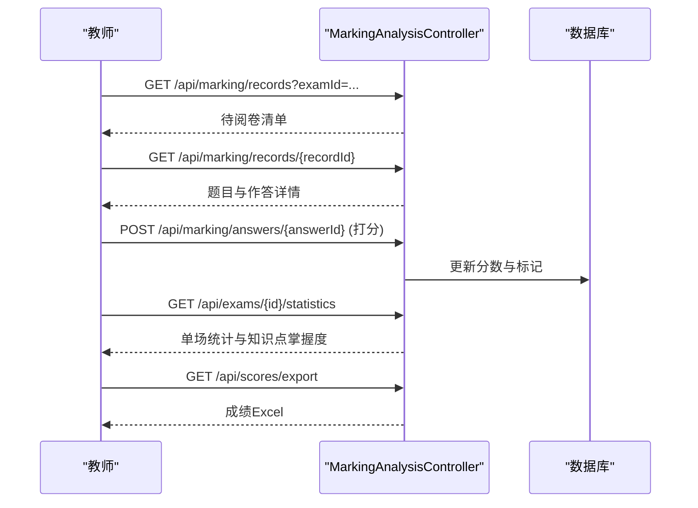
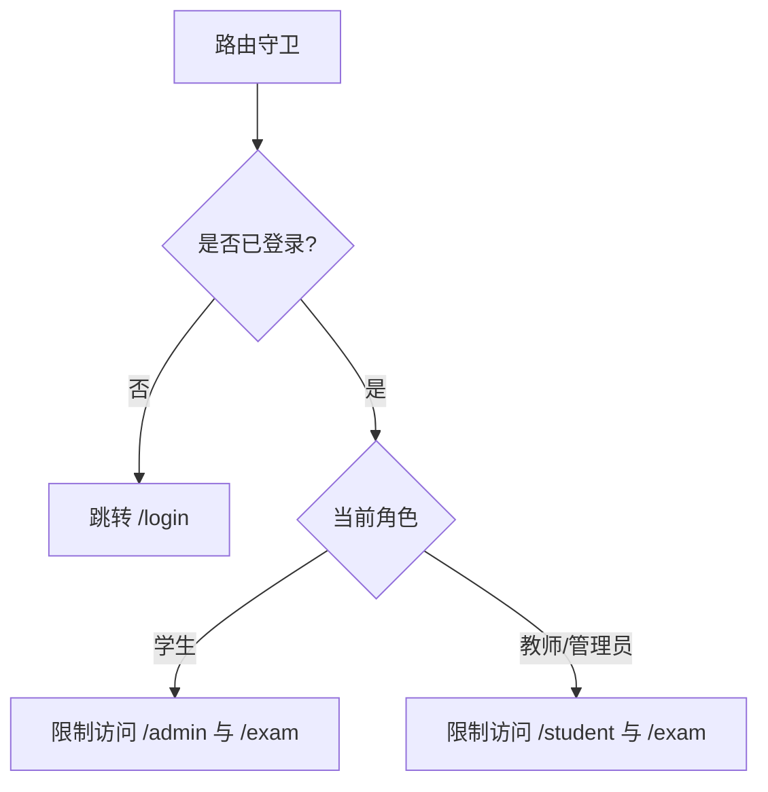
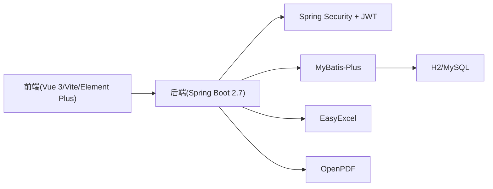

# 项目概述

<cite>
**本文引用的文件**
- [README.md](file://README.md)
- [pom.xml](file://exam-server/pom.xml)
- [package.json](file://exam-web/package.json)
- [ExamApplication.java](file://exam-server/src/main/java/com/exam/ExamApplication.java)
- [SecurityConfig.java](file://exam-server/src/main/java/com/exam/config/SecurityConfig.java)
- [AuthController.java](file://exam-server/src/main/java/com/exam/controller/AuthController.java)
- [SysUser.java](file://exam-server/src/main/java/com/exam/entity/SysUser.java)
- [index.js（前端路由）](file://exam-web/src/router/index.js)
- [main.js（前端入口）](file://exam-web/src/main.js)
- [schema.sql](file://sql/schema.sql)
- [QuestionController.java](file://exam-server/src/main/java/com/exam/controller/QuestionController.java)
- [PaperController.java](file://exam-server/src/main/java/com/exam/controller/PaperController.java)
- [ExamManageController.java](file://exam-server/src/main/java/com/exam/controller/ExamManageController.java)
- [StudentExamController.java](file://exam-server/src/main/java/com/exam/controller/StudentExamController.java)
- [MarkingAnalysisController.java](file://exam-server/src/main/java/com/exam/controller/MarkingAnalysisController.java)
</cite>

## 目录
1. [简介](#简介)
2. [项目结构](#项目结构)
3. [核心组件](#核心组件)
4. [架构总览](#架构总览)
5. [详细组件分析](#详细组件分析)
6. [依赖关系分析](#依赖关系分析)
7. [性能与可扩展性](#性能与可扩展性)
8. [故障排查指南](#故障排查指南)
9. [结论](#结论)
10. [附录](#附录)

## 简介
本项目为教学考试平台，面向教师、学生与管理员提供“出题组卷—在线考试—简答题阅卷—按知识点掌握度分析”的完整闭环。系统采用前后端分离架构：后端基于 Spring Boot 提供 REST API，前端基于 Vue 3 + Vite + Element Plus 构建教师端与学生端界面；默认使用 H2 内存数据库快速演示，也可切换至 MySQL。系统内置三角色权限控制与 JWT 无状态鉴权，支持题库 Excel 批量导入、PDF 练习卷导出、成绩导出等实用能力。

- 三角色：管理员、教师、学生，登录后可按角色分流到不同工作台。
- 主要特性：
  - 教师：知识点管理、题库维护（单选/多选/判断/填空/简答/关键词解释）、手动组卷、发布考试、简答题阅卷、成绩与知识点分析。
  - 学生：查看可考列表、开始答题、自动保存答案、到时交卷、客观题自动评分、查看成绩与个人知识掌握度。
  - 管理员：用户与学生管理、全局统计、操作日志等。

**章节来源**
- [README.md:1-82](file://README.md#L1-L82)

## 项目结构
- 后端 exam-server：Spring Boot 应用，包含控制器、服务、实体、配置与安全模块，默认使用 H2，可选 MySQL。
- 前端 exam-web：Vue 3 单页应用，使用 Pinia 做状态管理、Element Plus 作为 UI 库，Vite 构建。
- SQL：提供建表脚本，兼容 H2 与 MySQL。

**图表来源**
- [ExamApplication.java:1-17](file://exam-server/src/main/java/com/exam/ExamApplication.java#L1-L17)
- [SecurityConfig.java:1-90](file://exam-server/src/main/java/com/exam/config/SecurityConfig.java#L1-L90)
- [index.js（前端路由）:1-67](file://exam-web/src/router/index.js#L1-L67)
- [main.js（前端入口）:1-23](file://exam-web/src/main.js#L1-L23)

**章节来源**
- [pom.xml:1-131](file://exam-server/pom.xml#L1-L131)
- [package.json:1-25](file://exam-web/package.json#L1-L25)
- [schema.sql:1-204](file://sql/schema.sql#L1-L204)

## 核心组件
- 认证与授权：基于 Spring Security + JWT，关闭 Session，接口级权限控制，区分 /api/student/**（仅学生）、/api/users/**（仅管理员）、其余 /api/**（教师或管理员）。
- 题库与组卷：题目多类型支持、Excel 批量导入、PDF 导出；试卷由题目组合与分值构成，可被多场考试复用。
- 考试流程：发布考试（时间窗、指定考生）→ 学生开始答题 → 自动保存 → 交卷（客观题自动评分，主观题进入待阅卷）→ 教师阅卷 → 成绩与知识点统计。
- 分析与导出：单场考试统计、班级/学生知识点掌握度、成绩 Excel 导出。

**章节来源**
- [SecurityConfig.java:25-65](file://exam-server/src/main/java/com/exam/config/SecurityConfig.java#L25-L65)
- [QuestionController.java:31-118](file://exam-server/src/main/java/com/exam/controller/QuestionController.java#L31-L118)
- [PaperController.java:21-63](file://exam-server/src/main/java/com/exam/controller/PaperController.java#L21-L63)
- [ExamManageController.java:19-67](file://exam-server/src/main/java/com/exam/controller/ExamManageController.java#L19-L67)
- [StudentExamController.java:18-73](file://exam-server/src/main/java/com/exam/controller/StudentExamController.java#L18-L73)
- [MarkingAnalysisController.java:29-90](file://exam-server/src/main/java/com/exam/controller/MarkingAnalysisController.java#L29-L90)

## 架构总览
系统采用前后端分离的 RESTful 架构：
- 前端：Vue 3 + Vite + Element Plus + Pinia + Vue Router，负责页面渲染、路由守卫、状态管理与交互。
- 后端：Spring Boot 2.7 + MyBatis-Plus + Spring Security + JWT，提供统一 JSON 响应与跨域支持，数据持久化至 H2/MySQL。
- 安全：无状态鉴权，JWT 校验在过滤器中完成；接口按角色放行。
- 数据模型：以 sys_user、student、question、exam_paper、exam、exam_record、exam_answer、student_knowledge_stat 等为核心实体。

**图表来源**
- [ExamApplication.java:1-17](file://exam-server/src/main/java/com/exam/ExamApplication.java#L1-L17)
- [SecurityConfig.java:25-65](file://exam-server/src/main/java/com/exam/config/SecurityConfig.java#L25-L65)
- [schema.sql:1-204](file://sql/schema.sql#L1-L204)

## 详细组件分析

### 认证与权限体系
- 登录流程：前端调用登录接口，后端验证用户名密码并返回 token 与角色信息；前端根据角色跳转教师端或学生端。
- 权限控制：
  - /api/auth/login 匿名访问
  - /api/student/** 仅学生
  - /api/users/** 仅管理员
  - /api/auth/** 需已认证
  - /api/** 教师或管理员
- 用户模型：sys_user 存储账号、密码（BCrypt）、角色、状态等。

**图表来源**
- [AuthController.java:23-65](file://exam-server/src/main/java/com/exam/controller/AuthController.java#L23-L65)
- [SecurityConfig.java:25-65](file://exam-server/src/main/java/com/exam/config/SecurityConfig.java#L25-L65)
- [SysUser.java:10-24](file://exam-server/src/main/java/com/exam/entity/SysUser.java#L10-L24)

**章节来源**
- [AuthController.java:23-65](file://exam-server/src/main/java/com/exam/controller/AuthController.java#L23-L65)
- [SecurityConfig.java:25-65](file://exam-server/src/main/java/com/exam/config/SecurityConfig.java#L25-L65)
- [SysUser.java:10-24](file://exam-server/src/main/java/com/exam/entity/SysUser.java#L10-L24)

### 题库与组卷
- 题库：支持多种题型，提供分页查询、详情、新增、修改、删除；支持 Excel 批量导入与 PDF 练习卷导出。
- 组卷：试卷由题目集合与每题分值组成，可被多场考试复用；提供分页、选项列表、详情、CRUD。

**图表来源**
- [QuestionController.java:52-75](file://exam-server/src/main/java/com/exam/controller/QuestionController.java#L52-L75)

**章节来源**
- [QuestionController.java:31-118](file://exam-server/src/main/java/com/exam/controller/QuestionController.java#L31-L118)
- [PaperController.java:21-63](file://exam-server/src/main/java/com/exam/controller/PaperController.java#L21-L63)

### 考试流程（学生端）
- 开始考试：记录开始时间，服务端倒计时为准。
- 拉取题目：返回题目但不含正确答案与解析。
- 自动保存：切题或定时保存答案。
- 交卷：客观题立即评分；存在简答题则进入待阅卷；最终总分在主观题阅卷后更新。
- 查看成绩与知识点掌握度：受考试设置控制是否显示标准答案。

**图表来源**
- [StudentExamController.java:29-73](file://exam-server/src/main/java/com/exam/controller/StudentExamController.java#L29-L73)

**章节来源**
- [StudentExamController.java:18-73](file://exam-server/src/main/java/com/exam/controller/StudentExamController.java#L18-L73)

### 阅卷与分析
- 阅卷：教师查看待阅卷列表与详情，对简答题打分并提交，系统汇总总分与及格判定。
- 统计：单场考试整体统计、班级/学生知识点掌握度、成绩导出 Excel。

**图表来源**
- [MarkingAnalysisController.java:38-90](file://exam-server/src/main/java/com/exam/controller/MarkingAnalysisController.java#L38-L90)

**章节来源**
- [MarkingAnalysisController.java:29-134](file://exam-server/src/main/java/com/exam/controller/MarkingAnalysisController.java#L29-L134)

### 前端路由与角色分流
- 路由设计：/admin 教师与管理员；/student 学生；/exam/:id 全屏答题。
- 路由守卫：未登录跳转登录；学生不可访问 /admin；教师不可访问 /student 与答题页；登录后按需加载用户信息与头像。

**图表来源**
- [index.js（前端路由）:47-63](file://exam-web/src/router/index.js#L47-L63)

**章节来源**
- [index.js（前端路由）:1-67](file://exam-web/src/router/index.js#L1-L67)
- [main.js（前端入口）:1-23](file://exam-web/src/main.js#L1-L23)

## 依赖关系分析
- 后端技术栈：Spring Boot 2.7、Spring Security、MyBatis-Plus、H2/MySQL、JWT、EasyExcel、OpenPDF、SpringDoc。
- 前端技术栈：Vue 3、Vite、Element Plus、Pinia、Vue Router、ECharts。
- 数据模型：以 schema.sql 定义的表结构为基础，涵盖用户、学生、知识点、题目、试卷、考试、作答、统计与日志等。

**图表来源**
- [pom.xml:1-131](file://exam-server/pom.xml#L1-L131)
- [package.json:1-25](file://exam-web/package.json#L1-L25)
- [schema.sql:1-204](file://sql/schema.sql#L1-L204)

**章节来源**
- [pom.xml:1-131](file://exam-server/pom.xml#L1-L131)
- [package.json:1-25](file://exam-web/package.json#L1-L25)
- [schema.sql:1-204](file://sql/schema.sql#L1-L204)

## 性能与可扩展性
- 默认使用 H2 文件库，首次启动自动建表并写入演示数据，便于本地快速体验；生产环境建议切换 MySQL 以获得更好的并发与持久化能力。
- 题库导入限制单次最大行数，避免大文件拖垮解析与事务。
- 阅卷与统计接口可按考试维度聚合数据，适合后续引入缓存或异步处理以提升高并发场景下的响应速度。
- 前端采用按需加载与懒加载路由，减少首屏体积。

[本节为通用指导，不直接分析具体文件]

## 故障排查指南
- 登录失败或权限不足：检查 JWT 是否有效、角色是否正确；确认接口路径是否符合权限规则（如 /api/student/** 仅学生）。
- 跨域问题：后端已启用 CORS，若仍报错请检查前端请求域名与端口配置。
- 导入失败：确认文件格式为 .xlsx/.xls，且行数不超过限制；关注返回的失败明细定位错误行。
- 成绩未更新：若存在简答题，需在阅卷中心完成打分后才会更新总分与及格状态。
- 字体缺失导致 PDF 异常：按说明配置中文字体路径或使用环境变量指定字体。

**章节来源**
- [SecurityConfig.java:25-65](file://exam-server/src/main/java/com/exam/config/SecurityConfig.java#L25-L65)
- [QuestionController.java:52-75](file://exam-server/src/main/java/com/exam/controller/QuestionController.java#L52-L75)
- [MarkingAnalysisController.java:38-90](file://exam-server/src/main/java/com/exam/controller/MarkingAnalysisController.java#L38-L90)
- [README.md:59-62](file://README.md#L59-L62)

## 结论
本教学考试平台以清晰的前后端分离架构实现了从出题组卷到在线考试、阅卷与知识掌握度分析的完整闭环。通过三角色权限控制与 JWT 无状态鉴权，保障了系统的安全性与易用性；结合 Excel/PDF 导出与可视化分析，满足教学管理的常见需求。建议在生产环境使用 MySQL 并合理配置字体与缓存策略，以获得更稳定的性能表现。

[本节为总结性内容，不直接分析具体文件]

## 附录
- 环境要求：JDK 11、Node.js 18+；可选 MySQL 8、Docker。
- 演示账号：管理员、教师、学生若干，详见 README。
- 启动方式：后端 jar 运行或 Maven 插件；前端 npm 开发服务器。
- 数据库：默认 H2，可切换 MySQL 并执行建表脚本。

**章节来源**
- [README.md:5-23](file://README.md#L5-L23)
- [README.md:24-58](file://README.md#L24-L58)
- [schema.sql:1-204](file://sql/schema.sql#L1-L204)